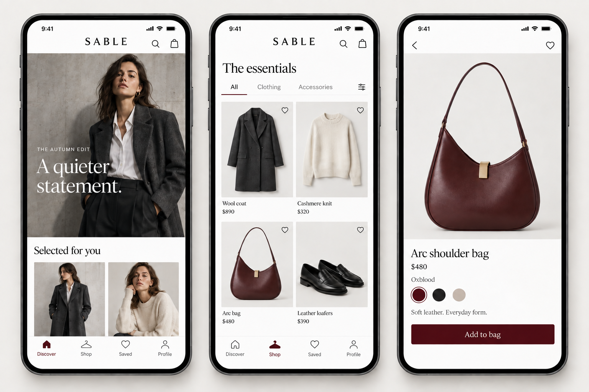
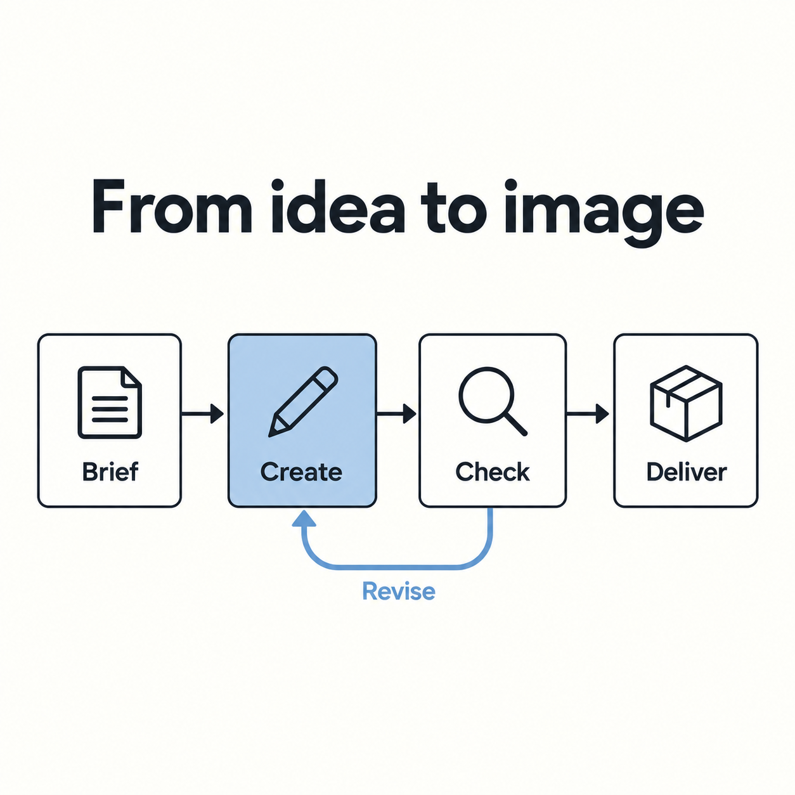
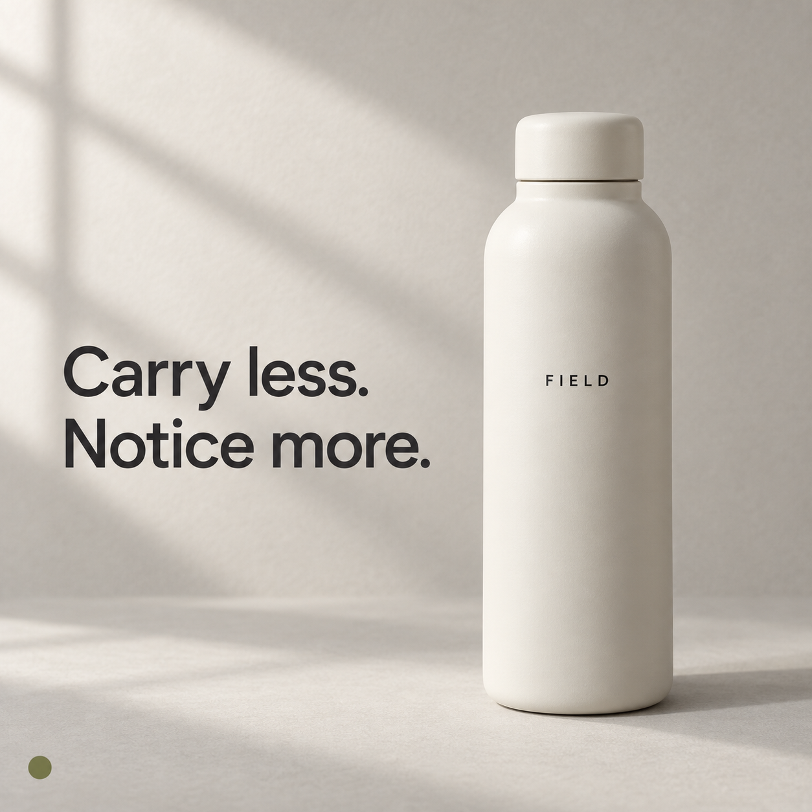
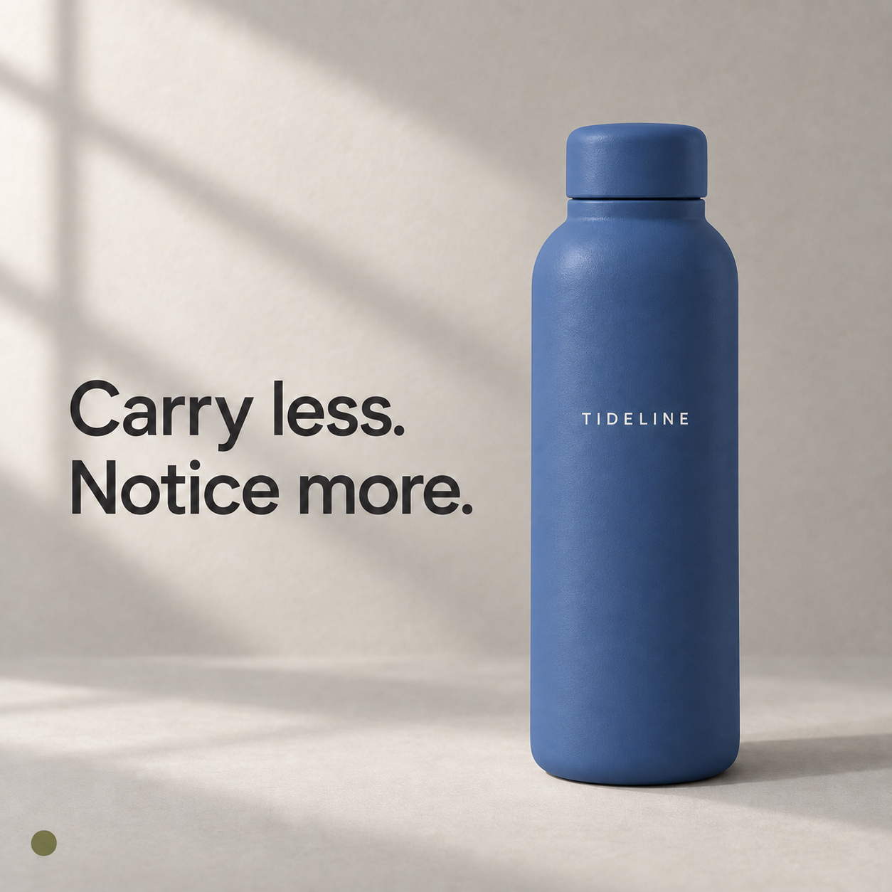

# Image Loop

**Point at an image. Name the change. Check the result. Repair what failed.**

An agent skill package for guided image editing and reference-driven creation with numbered visual maps, independent vision review, and bounded feedback loops. Includes `/image-loop`, `/image-edit-map`, `/reverse-engineer`, `/inspiration`, and `/image-reconstruction` skills, working planners/controllers, original prompts, and real before/after examples.

## The complete Prompt Lab

**[Start with the collection](prompt-lab/README.md)** — the full illustrated article, all prompt libraries and experiment records, the 50-page visual guide, reconstruction JSON and visual maps, premium applications, and 12 blue/light visual aids.



- [Read the illustrated article with prompts and results](prompt-lab/image-prompting-article-with-prompts-and-results.md).
- [Browse the full prompt library](prompt-lab/article-package/prompt-library.md) or [download the 50-page PDF](prompt-lab/article-package/visual-guide.pdf).
- [Use the reconstruction skill](skills/image-reconstruction/SKILL.md) or [download its portable ZIP](prompt-lab/image-reconstruction-premium-skill.zip).
- [Get all 12 visual aids](prompt-lab/table-images/) or [download the PNG archive](prompt-lab/article-table-images.zip).

To use the searchable library and interactive maps, run `python3 -m http.server 8000` from the repository root and open **http://localhost:8000/prompt-lab/**. GitHub renders Markdown and images; the HTML tools run from the downloaded repository.



## Use it

Clone this repository and open it in Claude Code. The committed `.claude/skills/` links expose:

```text
/image-loop Create a product graphic. Check the result and repair failed requirements.
/image-edit-map Number the elements in this image so I can choose what to change.
/reverse-engineer Extract this image's visual design into JSON.
/inspiration Mix these references into four directions --mode batch --judge human
/image-reconstruction Map this reference into named parts and reconstruction JSON.
```

Attach the image for editing or reverse engineering. Example edit:

```text
/image-loop Make the bottle and cap blue, replace FIELD with TIDELINE,
and keep the headline, composition, background, and olive accent unchanged.
```

For use outside the repository, install the five skills:

```bash
git clone https://github.com/codejunkie99/image-loop.git
cd image-loop
python3 scripts/install.py --to ~/.claude/skills
# Or, for Codex:
python3 scripts/install.py --to ~/.codex/skills
```

The installer refuses to overwrite existing skills. Review existing files before explicitly using `--replace`. In Codex, invoke `$image-loop`, `$image-edit-map`, `$reverse-engineer`, `$inspiration`, or `$image-reconstruction`, or select through `/skills` where supported. Custom `/skill-name` invocation is a [Claude Code feature](https://code.claude.com/docs/en/skills); Codex's [command surface](https://learn.chatgpt.com/docs/developer-commands) differs. A bare custom slash command is not promised on every host.

## Mix your inspiration

Drop images, accessible links, or written ideas alongside a brief:

```text
/inspiration Create a launch poster using these references.
Borrow the first image's lighting, the second's typography, and the third's layout.
--mode batch --judge human --count 4

/inspiration Explore these references for a launch poster.
Keep my product and headline fixed; refine the strongest combination.
--mode loop --judge llm --count 3 --rounds 3 --max-images 9
```

The agent inventories named elements, separates typography from text and palette from grading, and shows traceable combinations before generating images. Each recipe records which property came from which reference. Fixed traits and incompatible pairs constrain the combinations.

| Mode or judge | Behavior |
| --- | --- |
| `batch` / `--no-loop` | One generation batch and one judgment; no automatic repairs or further images. |
| `loop` / `--loop` | Select a parent, fix liked traits, vary one or two properties, recheck and compare with the incumbent. |
| `human` | Show candidates and wait for the person's selection and feedback. |
| `llm` | An independent vision model ranks eligible images against the brief. |
| `hybrid` | Model ranking first, then a real human choice before proceeding. |

Default: four images, one batch, human judge. Loop defaults: at most three rounds and twelve generation attempts total, including failures and repairs. Every candidate must pass hard requirements before becoming a parent. The loop retains the best eligible image and stops on budget, uncertainty, provider failure, or two rounds without improvement. Ranking is a preference, not proof of quality or human approval.

Read the [inspiration skill](skills/inspiration/SKILL.md), [board/planner format](skills/inspiration/references/board.md), and [judgment contract](skills/inspiration/references/judging.md). The helpers plan and gate; the host agent uses its image tools to create the actual images.

[See the live inspiration example](examples/inspiration/RESULTS.md): two reference combinations generated, independently checked, and ranked by a vision model. The judge recommended stopping; no extra iteration was forced. Loop continuation and human pauses are tested offline.

## What happens

1. The agent resolves the brief and protected details. For an ambiguous image edit, it asks useful questions and creates a separate numbered map.
2. It turns the brief into explicit acceptance criteria and generates or edits an image with the host's image tool.
3. An independent vision reviewer checks the candidate against the criteria and clean source. File checks verify dimensions, format, and transparency requirements.
4. The controller accepts a full pass, creates a targeted repair prompt for concrete failures, or stops on uncertainty, repeated failure, provider errors, or the retry cap.
5. The agent executes a repair when warranted and rechecks the complete brief. It keeps clean sources and evidence for every round.

Default limit: three repairs after the initial candidate. The reviewer cannot quietly rewrite the brief or pass missing criteria. Generation is **agent-orchestrated**: the Python script reviews and decides; it does not itself call an image-generation API.

## Two live revision tests

| Product source | After one repair |
| --- | --- |
|  |  |

| Test | Initial review against the requested edit | Next review |
| --- | --- | --- |
| Product graphic | Bottle color and brand text failed; three protected criteria passed | All five criteria passed after one repair |
| Workflow diagram | Return arrow and its label failed; three protected criteria passed | All five criteria passed after one repair |

Both resulting PNGs passed decoded 1254×1254 dimension and format checks. The examples deliberately start with an unchanged source and a new revision brief; they do not imply that the original generation failed its original prompt. These two cases are demonstrations, not a reliability benchmark. Preservation was assessed visually, not as pixel identity.

[Read the evidence and limitations](examples/RESULTS.md), including exact briefs, prompts, review JSON, controller decisions, and recorded account usage. The image tool did not expose a selectable generator model identifier in these calls; these are built-in-tool tests, not a verified GPT Image 2.5 model benchmark.

## Prompts and image controls

- [Prompt library](prompts/README.md): tested source/repair prompts plus twelve original, explicitly untested recipes.
- [Image controls](skills/image-edit-map/references/controls.md): text, typography, local color, layers, grading, medium, composition, lighting, and output.
- [Numbered map protocol](skills/image-edit-map/references/mapping-and-prompts.md): stable IDs, sections, separate annotation copies, and clean-source edits.
- [Reverse-engineering contract](skills/image-edit-map/references/reverse-engineer.md): structured JSON with confidence and evidence. Flattened pictures do not reliably reveal exact fonts, original layers, hidden objects, or original grading settings.

## Run the reviewer

Requires Python 3, Pillow, jsonschema, an authenticated Codex CLI, and a reviewer model that accepts images on your configured route.

```bash
uv run --with pillow --with jsonschema python skills/image-loop/scripts/review.py \
  --brief examples/product/brief.json \
  --source examples/product/source.png \
  --candidate examples/product/candidate-1.png \
  --out work/my-review --model gpt-5.6-luna
```

Read `decision.json`. A `repair` outcome includes `repair-prompt.txt`; the host agent uses it with its image tool and reviews the new image. See [reviewer setup](skills/image-loop/references/reviewer.md) for subsequent rounds and provider requirements. The tested route used GPT-5.6 Luna. GPT-5.4 Mini compatibility probes were rejected in this environment; no automatic model fallback is hidden in the script.

The reviewer consumes account usage. A smaller-model reviewer is a cost-control option to evaluate, not proof of savings. Dollar cost was not exposed by these runs. Model mistakes remain possible, particularly in small text and precise spatial relationships.

## Validate locally

```bash
uv run --with pillow --with jsonschema python -m unittest discover -s tests -v
uv run --with jsonschema python skills/image-edit-map/scripts/validate_spec.py \
  skills/image-edit-map/examples/image-spec.example.json
```

Offline tests exercise acceptance, missing/duplicate IDs, uncertainty, protected failures, retry limits, repeated failures, image-file checks, installer overwrite protection, inspiration provenance/constraints, bounded combination search, human/hybrid pauses, batch stopping, loop budgets, and incumbent retention. Live examples exercise real generation and independent review. Neither establishes human approval or guaranteed correctness.

## Sources and scope

General prompt structure follows the [OpenAI image prompting guide](https://developers.openai.com/api/docs/guides/image-prompting). Reviewer caution follows [OpenAI vision limitations](https://developers.openai.com/api/docs/guides/images-vision#limitations). The numbered interface, explicit contracts, controller, original briefs, and recorded examples are this repository's implementation. This package is not affiliated with or endorsed by OpenAI or Anthropic.

MIT licensed. No credentials or private conversation history are included.
