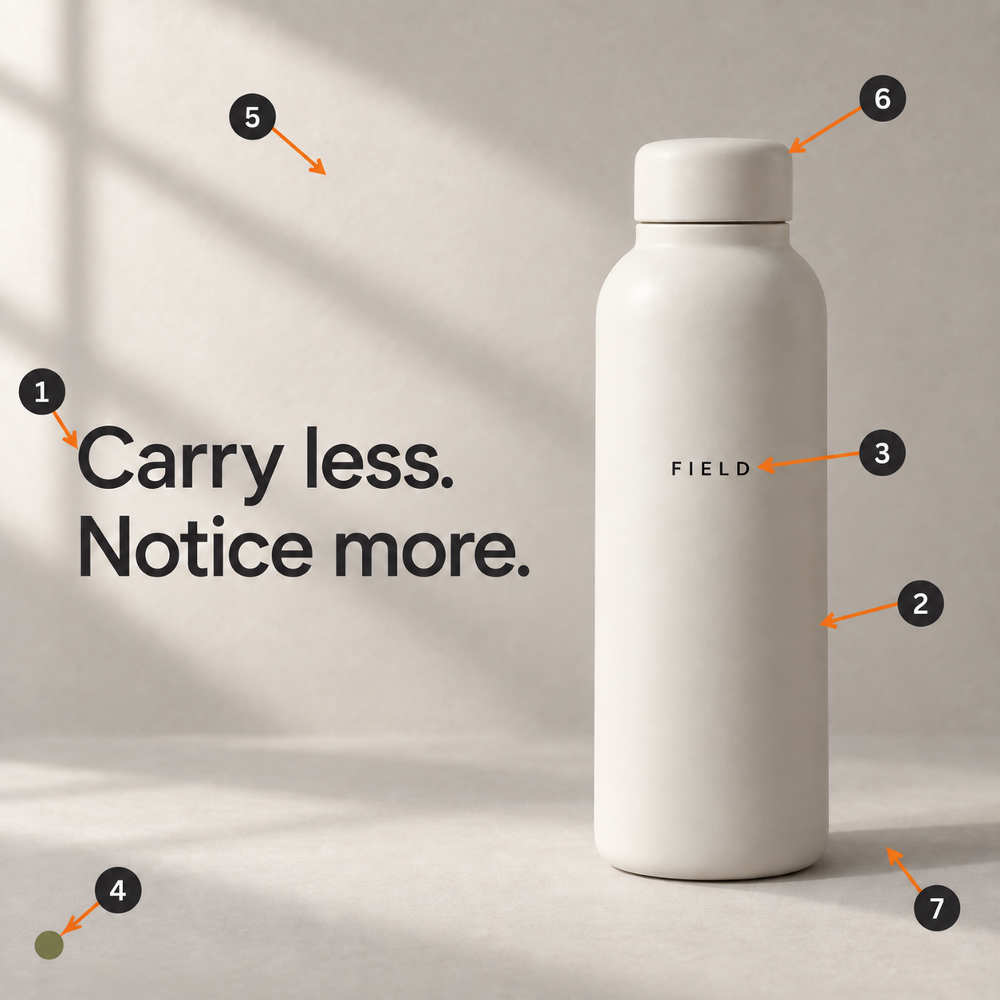

# Live example results

Recorded 2026-09-09. These are two controlled revision demonstrations, an annotation demonstration, and a reverse-engineering check. They are not benchmark measurements.

## Revision loop

| Example | Round | Requested reviewer | Controller decision | Review seconds |
| --- | --- | --- | --- | --- |
| product | 0 | gpt-5.6-luna | repair | 15.04 |
| product | 1 | gpt-5.6-luna | accepted_by_checks | 19.3 |
| diagram | 0 | gpt-5.6-luna | repair | 15.62 |
| diagram | 1 | gpt-5.6-luna | accepted_by_checks | 13.52 |

Round 0 checks the unchanged source against a NEW edit brief. It deliberately exposes the requested changes as missing; it is not a failure of the source-generation prompt. The controller generated a repair prompt from those failures. The host executed that prompt with its built-in image-editing tool. Round 1 checks the repaired candidate against the same original source and complete brief.

Both examples passed all five visual criteria after one repair and passed decoded PNG/1254×1254 file checks. The main agent also inspected both images. Protected regions were judged visually, not compared for exact pixel identity. The user has not separately approved either image.

- Product: [source](product/source.png), [candidate](product/candidate-1.png), [brief](product/brief.json), [initial report](product/round-0/report.json), [repair prompt](product/round-0/repair-prompt.txt), [final report](product/round-1/report.json), [file checks](product/round-1/file-checks.json).
- Diagram: [source](diagram/source.png), [candidate](diagram/candidate-1.png), [brief](diagram/brief.json), [initial report](diagram/round-0/report.json), [repair prompt](diagram/round-0/repair-prompt.txt), [final report](diagram/round-1/report.json), [file checks](diagram/round-1/file-checks.json).

## Numbered map

| Number | Element |
| --- | --- |
| 1 | Two-line headline |
| 2 | Bottle body |
| 3 | FIELD lettering |
| 4 | Olive dot |
| 5 | Warm-gray background |
| 6 | Screw cap |
| 7 | Cast shadow |

[Exact annotation prompt](product/map-prompt.txt). Main-agent visual inspection confirmed seven correctly assigned badges/arrows and a readable original. This was a generative review copy, not a proven pixel-identical overlay. It was not used as the source for the product edit.

## Reverse engineering exposed a real error

The independent model returned [raw JSON](reverse-engineer/raw-extraction.json) that passed schema/geometry/reference validation. But it incorrectly claimed a measured size of 1248×1248; the actual file is 1254×1254. It also suggested locks not supplied by the user and assigned numbers independently from the annotation map.

The package now requires separate file-metadata verification when a local source is available. The validator's `--image` check rejects those incorrect dimensions. The protocol also requires existing ID manifests to be carried into extraction and separates preservation suggestions from user-imposed locks.

The [corrected specification](reverse-engineer/image-spec.json) uses decoded dimensions, aligns IDs with the map, and removes unsolicited locks. [Correction record](reverse-engineer/corrections.json). This was explicit postprocessing after inspection, not a second successful model extraction. Other visual properties remain observations or estimates; no original font file, editable layers, or grading recipe was recovered.

## Model access and cost

GPT-5.6 Luna succeeded through the configured Codex CLI. Two GPT-5.4 Mini compatibility probes (one direct configuration-free text probe and one configured image-review probe) were rejected. The adapter stops on that error; it does not silently substitute a model. These failures are account/route observations, not universal availability claims.

The generator was the host's built-in image-generation/editing tool. Its underlying model identifier was not exposed for selection or verification in these calls. Do not describe these as a verified GPT Image 2.5 benchmark.

[Usage records](usage.json) preserve the four successful loop reviews' exposed account token counts and timings. Those records exclude generation, reverse engineering, and compatibility probes. Context from installed CLI skills increased reviewer input tokens, so “small model” does not imply a minimal-context call. No API dollar cost, cost reduction, or broad success rate was established.

## Offline verification

The controller/installer suite checks full-pass acceptance, incomplete or duplicate IDs, uncertainty, protected failures, repair limits, repeated failures, improving failure sets, output-file checks, decoded transparency, and overwrite refusal. Schema validation checks the bundled synthetic example and the corrected live extraction. Raw extraction fails the separate dimension check as expected.
