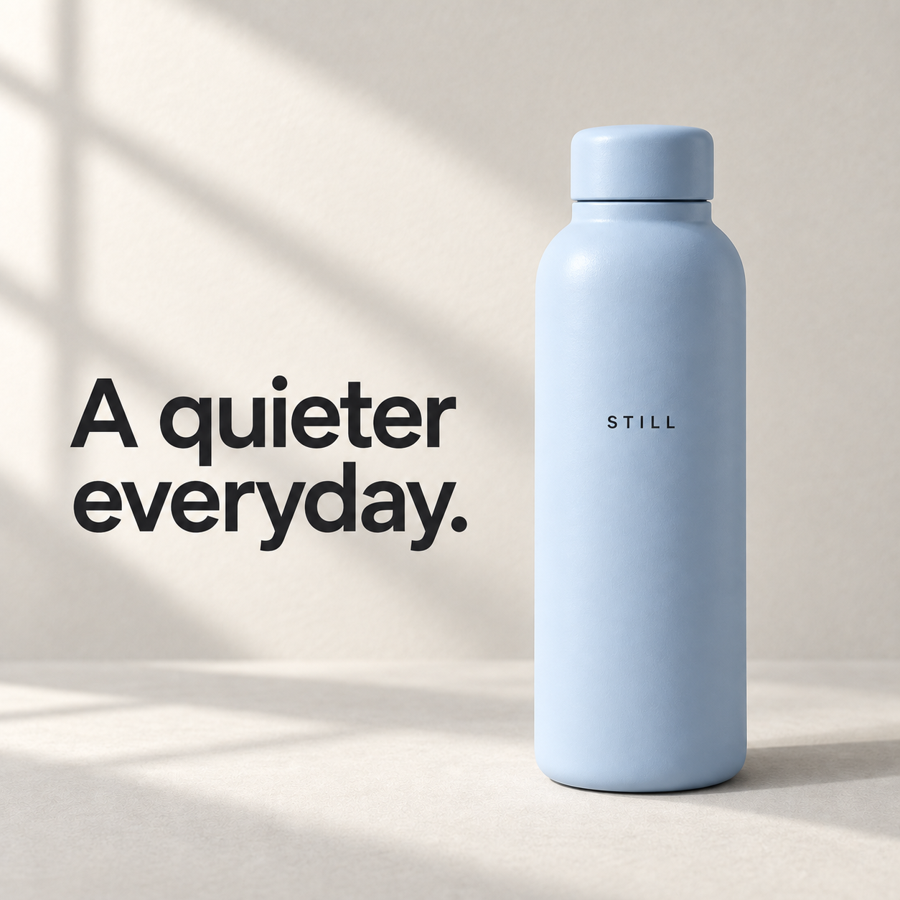
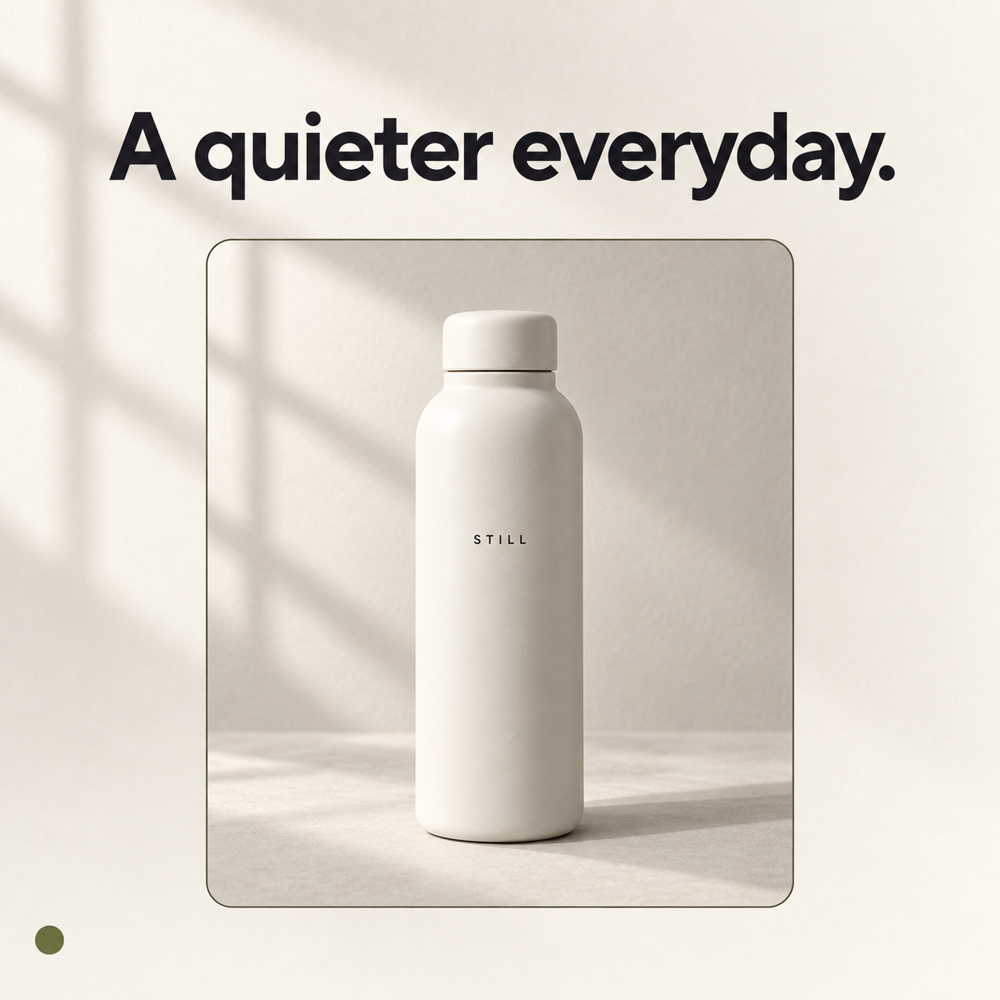

# Inspiration: two references, two combinations, one judgment

This live demonstration used the repository's product photograph (R1) and workflow diagram (R2). The main agent inspected both, wrote the [inventory](inventory.md), and promoted selected visual traits into a [board](board.json). New content was a STILL reusable-bottle poster with the headline “A quieter everyday.”

The planner selected two distinct combinations from a four-combination space:

| Combination | Composition | Palette | Shared traits |
| --- | --- | --- | --- |
| C001 | R1: left headline, bottle on right | R2: powder blue and charcoal on off-white | R1 soft window light, photographic medium, bold sans-serif type |
| C002 | R2: heading above a single rounded frame, adapted from its cards | R1: ivory, charcoal, olive | Same light, medium, and type |

| C001 | C002 — preferred by the model |
| --- | --- |
|  |  |

## What ran

1. `combine.py` ran with count 2 and seed 7. [Plan and recipes](plan.json).
2. The built-in image tool generated both images with both clean references attached and their roles declared. The exact prompts are [C001](C001/prompt.txt) and [C002](C002/prompt.txt). The [call ledger](calls.jsonl) records two successful generation attempts. Its image model identifier was not exposed.
3. GPT-5.6 Luna inspected each candidate independently through the configured Codex CLI. All seven visual requirements passed for each; decoded files were 1254×1254 PNGs. [C001 report](C001/review/report.json), [C002 report](C002/review/report.json). There were zero repair calls.
4. A separate GPT-5.6 Luna call saw both images in the recorded order C002, C001. It preferred C002 for its warm palette, framing, spacing, and calm editorial feel. It recommended stopping. [Judgment](judgment-r1/report.json), [prompt](judgment-r1/prompt.txt), [usage and image hashes](judgment-r1/run.json).
5. The saved judgment was passed through both mode gates. Both returned `stop_judge`, without another generation: [batch state](state-batch.json), [batch decision](decision-batch.json), [loop state](state-loop.json), [loop decision](decision-loop.json). The second mode evaluation reused the same artifacts; it was not a second model run.

## Limits of the evidence

This is one live batch and a stop decision, not a live multi-round optimization benchmark. Loop continuation, parent selection, incumbent retention, fixed traits, conflicting combinations, human/hybrid pauses, and budgets are covered by automated tests. No human selection was solicited or fabricated for this demonstration. A live human interaction test remains unperformed.

The source inspection and ingredient extraction were performed by the main agent, not independently benchmarked. The board is a selected-trait representation, not an exhaustive pixel segmentation. Source layout was intentionally adapted and explicitly labeled. Typography and grading descriptions are estimates, not recovered design files.

The three successful reviewer/judge calls record account usage. Their monetary cost and any savings versus a larger judge are unknown. The preference is one model's aesthetic judgment; no order-bias or inter-rater reliability study was conducted. Generated image artifacts and subtle visual errors remain possible despite passing checks.

## Reproduce the offline portion

From the repository root, choose new output paths:

```bash
python skills/inspiration/scripts/combine.py examples/inspiration/board.json \
  --count 2 --seed 7 --out my-plan.json
python skills/inspiration/scripts/advance.py examples/inspiration/state-loop.json \
  --out my-decision.json
uv run --with pillow --with jsonschema python -m unittest discover -s tests -v
```

For new image and model calls, invoke the installed skill with these two references and select the desired mode/judge. The generation prompts, review briefs, model prompts, output schema, hashes, and usage remain alongside the examples. Private CLI diagnostics are excluded from Git.
