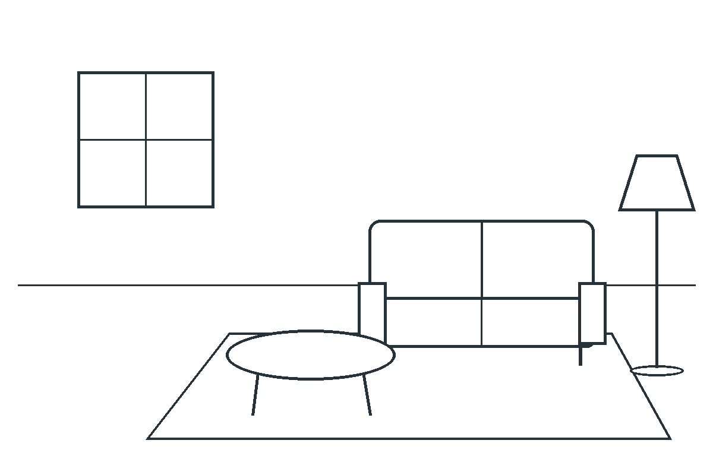

# How to prompt an image you can actually picture

*A practical guide to creating images, reconstructing references and using OpenAI Sketch. Researched and tested on 10 September 2026.*

You have an image in your head. You describe it. The model makes something attractive, but it is not quite the image you meant. You add “cinematic,” “beautiful lighting” and a camera lens. The next result changes, but you still cannot explain why.

The difficult part is deciding which visual information the model is missing. Once you can name that information, you can choose how to supply it and tell whether the next attempt helped.

This guide gives you a repeatable way to do that. It covers three starting points: an idea, an existing image and a sketch. It also includes an instruction you can give to an agent, plus the actual images and failures from a small test.

The ambition is a method you can apply to any subject. No prompt can guarantee every possible image: exact geometry, identity, typography and factual accuracy sometimes require additional tools. Knowing when to use those tools is part of the method.

## Start with the information you are trying to communicate

Consider the request “a quiet room.” That could mean an empty study, a bedroom at night or a spacious library. Even “a quiet room with a blue sofa” leaves the camera position, sofa shape, windows, light, room proportions and arrangement undecided.

Those omissions are not necessarily mistakes. If you want the model to explore, they are useful freedom. If you want a particular room, they are decisions you still need to communicate.

A useful conceptual model is:

**Possible output images depend on your words, visual inputs, generation settings and the model.**

This describes the interaction, not an assertion about OpenAI's internal architecture. A prompt narrows the possibilities. A reference narrows them differently. A sketch makes some spatial decisions visible. None of them automatically makes every requirement exact.

This also explains why copying someone else's prompt can be disappointing. You may be missing their reference image, prior edits, model version, settings or the many candidates they rejected. The useful thing to copy is a decision you understand, such as a low viewpoint or a limited palette.

The DALL-E 3 research found benefits from descriptive training captions and explored expanding prompts. That is evidence for communicating useful detail in that setting; it does not establish that longer prompts always perform better. [Better Captions](https://cdn.openai.com/papers/dall-e-3.pdf)

Try this test on every sentence in your prompt: **what visible difference should this sentence make?**

“Make it premium” leaves a large decision to the model. “Use a single object, broad margins, restrained colors and a soft edge highlight” supplies a particular interpretation. Another interpretation of premium might use rich ornament. Pick the one you actually want.

## Build a visual brief before writing the rendering prompt

You do not need to fill every field. Use the fields that decide whether this image succeeds.

| Decision | What to specify | What to inspect |
|---|---|---|
| Purpose | Product page, book illustration, explanatory diagram, album cover | Does it work at its intended viewing size? |
| Canvas | Shape, crop, important margins and space for later content | Are objects cut off? Is the reserved area usable? |
| Subjects | Individual objects, counts, defining attributes, actions | Is each object present and recognizable? |
| Relationships | Contact, overlap, spacing, relative size and direction | Is the right object in the right relationship? |
| View | Close or distant, high or low, frontal or angled | Does the viewpoint reveal what matters? |
| Appearance | Medium, light, palette, surfaces, texture and edges | Does the result have the intended visual character? |
| Text or facts | Exact wording, labels, data, real-world details | Are they correct, legible and complete? |
| Freedom | Required details, optional preferences, permissible variation | Did the model change something you needed fixed? |

The relationships deserve particular attention. “A red ball and a blue box” names objects and colors. “One red ball rests on the floor immediately to image-left of one blue box; the objects do not overlap” also describes their arrangement.

For a person, “left” needs a point of view. Their left hand and the hand on the left side of the image may be different. For depth, explain the overlap: “the chair is behind the table, and the table hides the lower part of the chair.”

This is a small scene graph in ordinary language: objects, properties and links between objects. Research benchmarks separate these capabilities because a model can succeed at one and fail at another. The sentence format here is a practical application, not a proven cure for compositional errors. [T2I-CompBench](https://arxiv.org/abs/2307.06350v1)

Separate **hard requirements** from **preferences**. A label must say “OPEN 9–5.” A shadow might preferably be soft. Beautiful shadows cannot compensate for the wrong opening hours.

Also say what can vary. If the exact sofa design does not matter, leave it open. A useful brief controls the decisions you care about and gives the model room elsewhere.

### Translate a visual feeling into visible choices

You can use ordinary style words, but decide which interpretation matters to you. These are examples of visual decisions, not universal definitions:

| Starting word | One concrete interpretation |
|---|---|
| Minimal | One dominant subject, few supporting elements, large unoccupied areas. |
| Dramatic | Strong light-dark separation, a low viewpoint, a clear directional light. |
| Gentle | Soft shadow edges, modest contrast, broad transitions and restrained saturation. |
| Handmade | Slightly irregular outlines, visible paper texture, uneven pigment coverage. |
| Nostalgic | A chosen period's materials and objects, with a specific color or print treatment. |
| Crisp | Clearly separated forms and legible edges at the final viewing size. |

Light itself has several independent properties. Its **direction** affects where shadows fall. Its **softness** affects shadow edges. Its **color** affects the scene's warm or cool appearance. Its **contrast** determines how far bright and dark areas separate. “Beautiful lighting” leaves all four undecided.

Color also has a job. Choose a dominant field, a main subject color and an accent. In our product scene, ivory is the field, teal identifies the mug, and coral/yellow create supporting contrast. For a monochrome drawing, line density and light-dark balance may do that work instead.

## Recreate an existing image by reading it in layers

Begin by deciding what “recreate” means. You might want the same subject, the same arrangement, a similar visual treatment, the same person's identity or unchanged original pixels. These goals require different inputs and different checks.

If your goal is to modify the original while keeping most of it, start an edit with the original image. Describing it from memory introduces avoidable uncertainty. If you want a new scene with a similar visual treatment, separate the visual treatment from the source's subject.

Read the reference three times.

**First, look at the large shapes.** View it small. Locate the focal point, the main masses, the empty areas and the lightest and darkest regions. Describe what dominates before describing tiny details.

**Second, map the geometry.** Identify the frame shape, viewpoint, relative object sizes, contact points and overlaps. Note which objects touch the frame. Estimate where important objects begin and end.

**Third, describe the surfaces and treatment.** Look for hard or soft shadows, reflective or matte surfaces, smooth or grainy texture, crisp or loose edges, muted or saturated colors, and the handling of text.

For a difficult layout, use normalized coordinates. The top-left corner is `(0, 0)` and the bottom-right is `(1, 1)`. An object occupying `x=.2–.4, y=.5–.8` sits in the left half and lower portion of the image. Approximate boxes help you and your agent discuss layout; they are not a universal positioning API.

Keep three evidence categories:

| Observed | Inferred | Unknown |
|---|---|---|
| The mug has a thick handle on image-right. | Its surface appears to be matte ceramic. | The manufacturer's material specification. |
| The left side is brighter; the right shadow is soft. | A broad light source is probably above-left. | The actual lamp, exposure or camera settings. |
| The upper 45% contains no objects. | That space might be intended for copy. | The original designer's purpose. |

The distinction protects you from writing an impressive but fictional reconstruction. A model should not confidently identify a lens, bird species or location from insufficient evidence. Supply the visible consequence you need, or verify the fact.

The same caution applies to the “original prompt.” Many prompts can produce similar images; the image alone does not uniquely reveal which one was used. Ask for a useful reconstruction brief, not a claim to recover hidden history.

### A concrete reference analysis

In the product example below, the most important information is the arrangement and empty space. The reference can be summarized as:


*Reference used for the reconstruction test. This image was created and repaired during this research.*

> A landscape image with a warm ivory background. A teal mug sits on a low coral block in the lower-left-middle. Two yellow lemons rest to its right. A silver spoon sits in front. Almost the upper half is empty. The objects are lit softly from upper-left.

That gives the broad idea. A closer reconstruction adds the mug's cylindrical shape and rounded base, the thick right-facing handle, the plinth's proportions, the lemons' staggered depth, the spoon's direction and approximate object boxes.

Do not describe every pixel. Prioritize the features that make this image recognizable. In a portrait that could be facial proportions and expression. In a poster it might be the silhouette, title placement and color blocks. In an architectural image it could be viewpoint and building geometry.

When a reference is available, attach it and assign its job:

```text
Image 1 controls the composition and object proportions.
Recreate the visible arrangement, framing and empty space.
Use a softer watercolor treatment in place of the photographed surfaces.
Keep the number, relative scale and positions of the objects.
```

For multiple references, divide responsibility explicitly:

```text
Image 1: subject identity and product geometry.
Image 2: layout and camera viewpoint.
Image 3: palette and surface treatment only.
Use the subject from image 1 in the arrangement of image 2.
Do not import the objects or lettering from image 3.
```

This still requires inspection. Two references may conflict: a wide scene and a very tight crop cannot both govern framing. Choose which input controls the disputed feature.

## Create a new image by turning an idea into a scene

Starting from scratch adds one step before the brief: decide what the idea will look like.

Suppose your idea is “a second brain that helps me think.” That describes a function. It has not chosen an image. You might depict organized notes, a person making connections or a physical object that stores memories. All are plausible choices.

Write one sentence about what the viewer should understand or feel. Then choose one visible scene that can carry it. If you are still exploring, make two or three distinctly different scene concepts before spending time on surface detail.

Once you choose the scene, build outward in this order:

1. **Main subject and action.** What is the viewer looking at, and what is happening?
2. **Arrangement.** Where is everything, how large is it, and what needs empty space?
3. **View.** What does the camera or drawing viewpoint reveal?
4. **Appearance.** Which medium, lighting and surfaces make the scene feel right?
5. **Checks.** Which visible failures would make the image unusable?

This order is a planning heuristic. It does not describe the order in which an image model internally renders pixels.

### Build one prompt, decision by decision

Start with: “A product image of a teal mug.”

Give it a purpose: a website hero that will have a headline above the product. That makes the empty area a functional requirement.

Choose an arrangement: mug on a low coral block, two lemons to the right and a spoon in front. Now the count, support surfaces and relationships are defined.

Choose the view: a slightly elevated front view, revealing the mug opening and the top of the block. Choose the treatment: ivory surroundings, soft upper-left light and a matte ceramic surface.

The resulting prompt can be ordinary prose:

```text
Create a photorealistic studio product image for a website hero,
on a 3:2 landscape canvas.

One matte teal ceramic mug sits on a low coral rectangular plinth
in the left half. Its handle points image-right. Exactly two whole
yellow lemons rest on the ivory floor to the right of the plinth.
One horizontal silver teaspoon lies in front, bowl to image-left.

Keep all objects fully visible in the lower 55% of the frame.
Leave the upper 35% as empty ivory background for a headline
that will be added later. Do not render the headline.

Use a slightly elevated front view and broad soft light from
upper-left, with gentle contact shadows toward lower-right.
Show fine ceramic texture, dimpled lemon rind and brushed silver.
No other objects, writing, logos or borders.
```

The full prompt used in the test is saved in the experiment record. The important part is that every instruction has a reason and a visible check. The first generation still missed the required composition. A clear prompt makes that failure diagnosable; it does not prevent all failure.

For a different kind of image, change the relevant decisions. An ink illustration needs decisions about line weight, hatching and paper. A pixel-art asset needs a visual grid and edge treatment. A photographed object needs coherent reflections and contact shadows. “High quality” does not choose these for you.

## Use Sketch to put spatial decisions on the canvas

OpenAI introduced **Sketch** with ChatGPT Images 2.5. Type `@Sketch` in ChatGPT, or open the [Sketch entry page](https://chatgpt.com/sketch). Draw your idea and add a description of the desired image. The feature uses the drawing as a visual guide. These entry instructions are documented by OpenAI; this research browser was signed out, so I did not verify the authenticated drawing toolbar. [OpenAI's announcement](https://openai.com/index/introducing-chatgpt-images-2-5/)

A useful sketch need not be a good drawing. It needs to communicate the relationships that were hard to explain.

For a room, draw the window as a rectangle, the sofa as a wider rectangle, the table as an ellipse and the lamp as a line with a shade. Put them where you want them. For a person, draw the torso direction, limb positions and contact with important objects. For a poster, draw the title area and the main silhouette.



*This original schematic was drawn from simple shapes. It was supplied to the image model as a PNG.*

Use the intended final aspect ratio if the drawing surface allows it. Otherwise, explain how the drawing should fit the final canvas and whether empty margins should be added. Cropping a wide sketch into a portrait image can change the composition even if the model recognizes every object.

Decide what the marks mean:

| Sketch feature | What it should communicate |
|---|---|
| Large outline | Object silhouette and position |
| Overlap | Which object is in front |
| Horizon or floor line | Viewpoint and depth cue |
| Simple pose | Body direction, gesture and contact |
| Empty region | Space that must remain available |
| Labels or colors | Optional identifiers whose meaning you explain |

If you use labels, say whether they are annotations or text to appear in the final image. A red outline may identify the sofa without requesting a red sofa. An arrow may indicate movement without belonging in the finished scene. Make that distinction explicit.

Then tell the model which freedoms remain:

```text
Use the supplied sketch as a layout and proportion guide.
The drawing controls object placement, relative size and viewpoint.
The line style is not part of the finished image.

Render a quiet, realistic sitting room: a square window on the left,
a cobalt-blue two-seat sofa on the right, a round walnut coffee
table in front, an off-white rug and a black floor lamp at far right.
Use warm plaster walls and soft daylight from the window.

Keep the five sketched elements and their relationships.
Do not add plants, pictures, people, lettering or extra furniture.
```

The sketch supplies arrangement. The words identify ambiguous shapes and supply material, color, lighting and medium. If you ask for an angled camera while supplying a flat frontal sketch, you have introduced a conflict. Resolve the viewpoint before requesting more texture.

After generation, compare the large shapes first. Did the window stay left? Did the sofa stay right? Is the table round? Did the empty area fill with decorations? If these fail, adjust the drawing or the layout instruction before polishing the fabric.


*The rendered room after one correction to the window view. The main arrangement survived; dimensions and proportions remain approximate.*

If Sketch is unavailable in your interface, draw in another app or on paper and upload the image. The experiment in this guide uses that route. It tests the principle of a sketch input, not the native Sketch toolbar.

ControlNet research demonstrates the usefulness of trained visual conditioning in another family of systems. It is a useful reason to take spatial inputs seriously. It does not establish that ChatGPT Sketch uses ControlNet, or that uploading a sketch provides the same controls. [ControlNet](https://arxiv.org/abs/2302.05543)

## Correct images with a repeatable loop

The loop is:

**Brief → choose inputs → generate → inspect → diagnose → change one thing → inspect again.**

Before generating, list the hard requirements. Afterwards, assign each one **pass**, **fail** or **uncertain**, with a short observation. An uncertain reading of a label is not a pass.

Check the objects before their attributes. If the dog is missing, “does the dog have a red collar?” cannot be independently accepted. Dependency-aware questions come from research on improving image evaluation. Our checklist borrows that idea without claiming to implement the published evaluator. [Davidsonian Scene Graph](https://arxiv.org/abs/2310.18235)

Also inspect the least prominent requirement. Models studied in Attend-and-Excite could omit a secondary subject while producing a convincing main subject. That is a useful failure category to check, not a claim that every modern model has the same failure rate. [Attend-and-Excite](https://arxiv.org/abs/2301.13826)

Classify the mismatch before changing the prompt:

| What failed | A useful next intervention |
|---|---|
| The concept is wrong | Choose a clearer scene or regenerate from a revised brief. |
| Objects or attributes are missing | Identify the missing item and bind its properties explicitly. |
| Layout is wrong | Supply a sketch, clearer relationship or approximate placement. |
| Most of the image is right | Edit that image with one localized request. |
| An edit changes unrelated areas | Re-anchor to the best source; constrain the region or use supported masking. |
| Exact original pixels must survive | Composite the changed region into the original with an editing tool. |
| Text, chart values or vector geometry must be exact | Use a typesetter, plotting tool or vector/3D editor for those parts. |
| A real-world detail is uncertain | Find an authoritative reference before judging or generating it. |

A useful edit request has three parts:

```text
Change: replace only the cobalt sofa upholstery with burnt orange.
Preserve: sofa shape and position, window, lamp, table, rug,
room geometry, camera, crop and lighting direction.
Allow: the upholstery shading and small nearby color reflections
to change naturally with the new fabric color.
```

The last line matters. Moving a chair may require moving its shadow. Changing an object from glass to metal must change reflections. Preserving everything literally can conflict with the requested edit.

Research on Prompt-to-Prompt manipulated internal attention to preserve structure. For a normal hosted-image workflow, the practical lesson is to keep working from the correct source image and check what changed. The research algorithm is not activated by putting its name in your prompt. [Prompt-to-Prompt](https://arxiv.org/abs/2208.01626)

Keep the best version, not automatically the newest. After two unsuccessful targeted repairs, change the control method or state the unresolved limitation. “Two” is a practical default to limit unproductive retries, not a scientific optimum. A deadline, budget or unusually demanding image can justify a different limit.

Avoid endless adjective accumulation. If the composition is wrong, “more beautiful, more detailed” does not identify the correction. If a repair makes the face less recognizable, a softer background does not cancel that regression.

## Know which parts depend on the model

Natural-language meaning travels more readily than product-specific syntax. A weighted token, negative-prompt field, seed, mask or guidance setting only works when the selected interface supports it. Learned prompt adaptation has shown model-specific benefits; that is a reason to test transferred prompts, not assume their suffixes are universal. [Promptist](https://arxiv.org/abs/2212.09611)

For GPT Image 2.5, OpenAI documents Flare and Sunburst, quality levels from `low` through `max` plus `auto`, and separate size/background controls. For API work, configure these as parameters. Writing “4K” in prose does not set the output dimensions. Verify the actual file. [GPT Image 2.5 settings](https://developers.openai.com/api/docs/guides/image-prompting#model-parameters)

Similarly, a camera label is an appearance cue. If the desired effect is a compressed-looking background, shallow focus or a wide view, state that effect. A generated “50 mm photograph” is not proof of a physically simulated camera.

OpenAI still documents limitations in text, consistency and placement. When exactness matters, decide which part should be generated and which part should be constructed. A raster image of a chart does not become a verified chart because its labels look plausible. [Image generation limitations](https://developers.openai.com/api/docs/guides/image-generation#limitations)

For images of specific places, organisms, historical events or technical systems, add a factual-reference step. Establish the defining features from suitable sources, attach useful views, and check those features afterwards. A plausible-looking reconstruction is evidence of appearance, not evidence that the depicted scene existed.

## Judge the result at the level of your requirements

An overall similarity score can hide a wrong object count or misplaced subject. GenEval's object-level approach illustrates why checking separate properties is useful. You do not need to run that benchmark to count two lemons yourself. [GenEval](https://arxiv.org/abs/2310.11513)

Automated judges also need checking. GenEval 2 found that evaluation methods could become less aligned with people as generators changed. A model's confident self-rating is therefore insufficient evidence for a critical requirement. [GenEval 2](https://arxiv.org/abs/2512.16853)

Use a check suited to the requirement: inspect the crop, count the objects, compare identity references, read each word, inspect alpha transparency, measure actual file dimensions or compare a region against the source. If you use an automatic judge, give it concrete questions and retain direct review for important or ambiguous details.

One successful image shows that a workflow succeeded once. To establish reliability, repeat it across representative subjects and settings, save failures and measure how often the original requirements pass. Do not select the best output and call it the average result.

## Give the method to an agent

The [complete master instruction](master-image-prompt.md) makes the agent choose a path, build the visual brief, assign reference roles, compile the prompt, inspect the actual output and repair failures. It also tells the agent to report settings it cannot observe and to distinguish a prepared prompt from a tested image.

A shorter version for everyday use is:

```text
Turn my request into a visual brief. Identify subjects, relationships,
composition, viewpoint, appearance, exact text and hard constraints.
Separate what is observed in my references from what you infer.
Assign each input image a role. Ask only about critical missing choices.

Choose text, references, sketch or editing according to what needs control.
Write a concise rendering prompt and keep tool settings separate.
Generate, then inspect the actual result against a checklist written first.

Fix the largest mismatch with one targeted change while preserving
the parts that already work. Inspect for unintended changes as well.
If repeated attempts fail, change the control method or explain the limit.
Return the best image, final prompt, necessary inputs and result checks.
```

The reusable part is the procedure. The image-specific prompt should change with the image's requirements.

## Apply the same method to other subjects

These are planning examples, not additional generation tests:

| Request | The decisions that become important | A useful check or escalation |
|---|---|---|
| A person fixing a bicycle | Pose, visible hands, hand-tool contact, gaze, framing | Inspect the interaction; add a pose reference if it repeatedly fails. |
| A specific rare bird | Verified markings, proportions, pose and habitat | Use authoritative images; do not accept a generic bird with the right label. |
| A historical street | Place, date, architecture, clothing and exclusions | Research defining details; label the result an illustrative reconstruction. |
| A fantasy landscape | Scale, focal point, depth layers, atmosphere and invented rules | Check that the scene communicates scale and the intended unusual relationship. |
| A recurring comic character | Stable reference, defining features and one action per panel | Compare identity across panels; render panels separately if continuity breaks. |
| An instructional diagram | Verified components, labels and a correct connection list | Validate relationships; construct exact arrows and labels with diagram tools if necessary. |
| A poster or packaging image | Exact copy, hierarchy, safe margins and intended print size | Read every character; typeset final copy when precision matters. |
| A transparent product asset | Correct silhouette and true alpha | Inspect the alpha channel; a visible checkerboard is not proof of transparency. |

Different subjects change what you must know and what you must check. They do not require a new ritual for writing prompts.


## What happened in the live tests

I wrote the checks before generating, then ran three small workflows. The images came from the built-in image generation tool. It did not expose a backend model name, seed or explicit quality setting, so these are not a controlled GPT Image 2.5 benchmark. The prompts and supplied files are preserved in the [experiment record](experiment-log.md).

### Test 1: create, inspect and repair a composition

The first product image contained the correct objects. The mug nevertheless began about 33% down the frame, violating the required empty area and the instruction to keep objects in the lower 55%.


*A1: visually attractive, but it fails the layout requirement.*

The repair asked for a smaller arrangement located between 46% and 90% of the frame height, while preserving its contents and appearance. The next image placed the mug's top at about 49% of the frame height. The original object and layout requirements passed. The approximate scaling request itself was not executed as an exact numeric transformation.


*A2: the requested empty region is now available. A simple teal-pixel measurement supported the visual assessment: the mug's highest detected pixels moved from row 337 to row 503 in 1024-pixel-high images.*

This changed the master instruction: it now explicitly checks reserved regions instead of allowing correct object counts to stand in for correct composition.

### Test 2: reconstruct with words, then with a reference

I analyzed A2 and generated a fresh image from a written brief with approximate object boxes. It recovered the recognizable scene but changed the mug handle, spoon and proportions. The same brief with A2 attached retained those details more closely in this example. Surface and small geometric differences remained.

<!-- INTERACTIVE-COMPARISON -->


*B1: written description without an attached reference.*


*B2: the same written description with A2 attached.*

This was not blind: I had seen the original brief. One sample per method and no fixed seed cannot establish a general success rate. The comparison shows why “same scene” and “same particular object” need different acceptance criteria.

### Test 3: sketch, correct an addition, then edit one property

The room sketch produced the five intended elements in the expected arrangement. The first render also introduced foliage beyond the window despite the exclusion of plants, and approximated rather than traced the sketch's geometry.


*C1: the layout is recognizable, but the greenery is an unwanted addition.*

A focused window edit removed the greenery. The blue-sofa image in the Sketch section is that corrected version, C2. This made the sketch workflow useful while preserving the limitation: it did not become an exact geometric reconstruction.

Next, I requested a color-only change from blue to burnt orange. The color changed, but the upholstery acquired a much more conspicuous looped pattern. The overall room arrangement stayed close; the fabric treatment did not.


*C3: the requested color succeeds, but the preservation requirement fails. I cannot tell from appearance alone whether the motif was newly invented or a subtle existing texture was amplified.*

One final repair used C3 as the edit target and C2 as a fabric-only reference. The conspicuous pattern remained.


*C4: the texture repair did not succeed. A more explicit reference role did not guarantee compliance.*

I stopped the orange branch and kept C2 as the accepted blue-room source. A selective color adjustment on that source would be a sensible next production method if orange upholstery were essential. That alternative was not performed in this test.

Across eight generation/edit calls, the loop corrected some requirements and exposed one it could not reliably fix. This is why the master instruction has a stopping rule, requires preservation checks and keeps earlier accepted versions. A workflow that only shows successful images would conceal the part readers most need to learn.

## Use it on your next image

Write down the few things that would make your image recognizably right. Give each one a concrete visual form. Supply a reference or sketch where words leave too much open. Inspect the result against those decisions, then repair the largest remaining mismatch.

The [master agent instruction](master-image-prompt.md) turns that process into a reusable workflow. The [research notes](research-notes.md) separate published findings from the practical deductions in this article. The [experiment record](experiment-log.md) contains every submitted prompt, input image and result check.

You do not need to sound like a prompt engineer. You need to decide what the image must show, give the model enough information to attempt it, and recognize when the result needs another kind of control.
