# exact prompts, inputs, and results

44 selected studies, plus the original experiment records. Prompts below are the saved submitted text. A repaired selection includes both the initial prompt and the repair prompt.

44 selected studies. Exact built-in generation model, variant, seed and quality were not exposed. Exploratory workflow evidence, not a verified GPT Image 2.5 benchmark.

## navigate

[Read the article](article.md) · [50-page guide](visual-guide.pdf) · [Interactive visual map](evidence/visual-map.html) · [Reconstruction skill](evidence/image-reconstruction-skill/SKILL.md)

## selected studies

<a id="G01"></a>
### G01 · The net maker

**Control style and lighting · visual guide page 7**


**Method:** Give each depth layer a job: net and ochre rope in front, working hands and dog as the subjects, blue wheelhouse behind them, harbor in the distance. Specify where hands touch the net and where warm sunlight meets cool fill.

**Observed result:** The wide scene has coherent hand-to-net contact, a fully framed dog, distinct rope, skin, wood and fur textures, and readable depth. No planned visible constraint failed. The wider framing gives the face less prominence.

**Reusable lesson:** A complex scene becomes manageable when every layer has a subject, a location and a visual priority.

**Limits / next move:** Keep this result for an environmental story. For a portrait, make the face larger before adding further background detail.

**Comparison:** Intent changed: we chose a wider environmental composition. Greater scene breadth does not establish a better prompt or a better model.

**Generation inputs:**

- The saved input record lists no reference image for the initial generation. Research sources below are separate from attached inputs.

**Exact initial prompt:** [plain text](prompts/G01.txt)

```text
Create a landscape 3:2 editorial photograph for a feature about skilled maritime work.
Scene: an elderly sailor repairs a fishing net on the deck of a small, weathered wooden boat in a sheltered harbor. This is a candid working moment, not a fashion pose.
Visual map: foreground lower-left has loose ochre rope coils and wet dark deck planks; the sailor occupies the left-center, seated with both hands visibly tying one section of net. The net stretches diagonally from his lap toward a wooden float at lower-right. One black-and-white dog sits to his right, fully visible from ears to paws, watching his hands. Behind them are a worn blue wheelhouse, winch, neatly stowed buoys and several fishing boats farther across the water. Distant buildings stay subordinate.
Appearance: silver stubble, creased face, salt-stained canvas jacket, ribbed wool sweater, rough hands. Net fibers, chipped paint, water droplets and rope wear should be distinguishable without oversharpening.
Light: a low warm shaft of sunrise from upper-left catches the sailor's profile, hands and translucent net fibers. Cool blue harbor shade fills the unlit surfaces. Light and shadows must agree across the man, dog and deck. Fine film grain and natural tonal range; color restrained except for the blue wheelhouse and ochre rope.
Composition: eye level from the bow, enough depth of field to understand the work and setting. Distinct foreground, working figures, boat structure and harbor layers. No text, no logos, no artificial fog, no beauty retouching. Keep hands, net and dog unobstructed.
```

**Published OpenAI reference:** Published GPT Image 2.5 Sunburst example. Separate from our result.

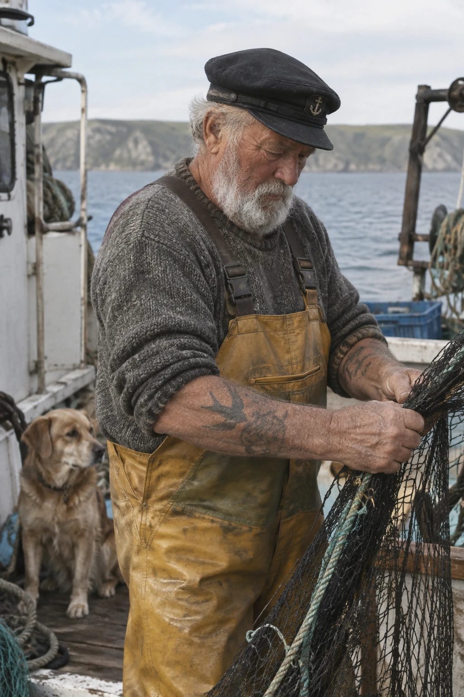

Source: [OpenAI: Control style and lighting](https://developers.openai.com/api/docs/guides/image-prompting?model=gpt-image-2.5#control-style-and-lighting). Published example and recipe; our adaptation changes the intent.

**Recorded settings:** model not exposed by built-in tool; seed not exposed; quality not exposed.

[Underlying case record](evidence/expanded-experiments/guide-cases.json) · [Download result](evidence/expanded-experiments/generation-coverage/g01-maritime-editorial.png)

<a id="G02"></a>
### G02 · The Rain Engine

**Explain a process visually · visual guide page 8**

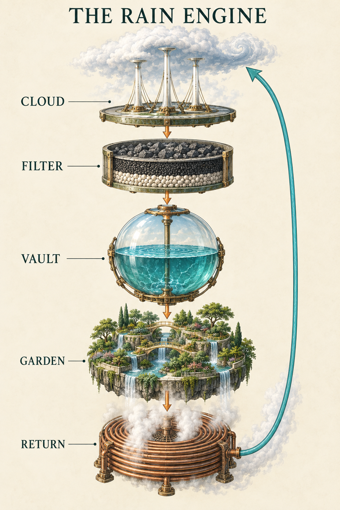

**Method:** Define five named tiers before writing style instructions. Give every tier its own material and contents, then list exactly four downward links and one return link. Put exact labels in a separate text inventory. This fictional mechanism is concept art.

**Observed result:** Language trial S2 renders the five tiers, three masts, three filter materials, half-full tank, stepped garden, copper coil and five arrows coherently. All six strings are correct. The title is close to the edge, so generous margins remain uncertain.

**Reusable lesson:** A diagram needs a graph of objects and connections before it needs an aesthetic.

**Limits / next move:** For an actual explanatory graphic, verify the mechanism independently. If spacing needs repair, replace generous margins with a stated safe area.

**Comparison:** Intent changed to an invented ecosystem with less explanatory copy. The official example is already information-rich; this adaptation tests a different visual brief.

**Generation inputs:**

- The saved input record lists no reference image for the initial generation. Research sources below are separate from attached inputs.

**Exact initial prompt:** [plain text](prompts/G02.txt)

```text
Purpose and composition:
Create a portrait 2:3 illustrated atlas poster called THE RAIN ENGINE. It shows a fictional floating ecosystem as five separated tiers, stacked vertically on one central axis. Leave visible air gaps between tiers. This is imaginative concept art, not a validated engineering schematic.

Tier contents, top to bottom:
The top tier is a circular platform with exactly three slender white cloud-harvesting masts under one curling cloud. The second tier is an exposed filter, with three clearly different layers: rough basalt, black carbon, and pale ceramic. The middle tier is one clear glass spherical reservoir, half filled with turquoise water. The fourth tier is a lush garden on stepped terraces, with tiny gold bridges between terraces. The bottom tier is one large copper coil releasing a plume of white vapor.

Relationships:
Show exactly four thin copper downward arrows in the gaps: top to second, second to middle, middle to fourth, and fourth to bottom. Show one turquoise return arrow outside the stack on the right, curving from the bottom coil up to the top cloud. Keep all five arrows distinct and readable.

Text and hierarchy:
Print THE RAIN ENGINE exactly once, as the large title centered above the stack. Place these five smaller labels on the left, aligned with their respective tiers from top to bottom: CLOUD, FILTER, VAULT, GARDEN, RETURN. Use simple thin leader lines to the tiers. These six strings are the only text. Keep the labels large enough to read and clear of the illustration.

Appearance and constraints:
Use an elegant museum atlas style: precise fine ink contours, softly shaded three-dimensional cutaways, a warm ivory background, deep teal and moss green forms, copper machinery, and restrained gold accents. Use one consistent elevated three-quarter view, with light from the upper left. Give the surfaces intricate mineral, glass, leaf, and machined-metal detail. Keep the full stack and all labels inside generous margins. Do not include people, logos, watermarks, or decorative borders.
```

**Published OpenAI reference:** Published GPT Image 2.5 Sunburst example. Separate from our result.


Source: [OpenAI: Explain a process visually](https://developers.openai.com/api/docs/guides/image-prompting?model=gpt-image-2.5#explain-a-process-visually). Published example and recipe; our adaptation changes the intent.

**Recorded settings:** model not exposed by built-in tool; seed not exposed; quality not exposed.

[Underlying case record](evidence/expanded-experiments/guide-cases.json) · [Download result](evidence/expanded-experiments/language/trial-S2.png)

<a id="G03"></a>
### G03 · Afterlight

**Render exact text · visual guide page 9**


**Method:** Separate an exact headline and two footer lines from the sculpture zone. Build drama with a giant orange disc, folded cobalt metal, amber glass and exactly three small visitors. Count and place people instead of asking vaguely for scale.

**Observed result:** The three text lines and visitor count are correct. Metal and glass contrast clearly, but the sculpture apex enters the headline baseline zone, violating the requested clean separation.

**Reusable lesson:** Correct spelling and good typography are separate checks from unobstructed text placement.

**Limits / next move:** Lower only the arch apex while retaining the headline, footer, disc and three visitors. No correction was run for this case.

**Comparison:** Intent changed to a festival art poster with new copy and architecture. A more dramatic genre is not evidence of prompting superiority.

**Generation inputs:**

- The saved input record lists no reference image for the initial generation. Research sources below are separate from attached inputs.

**Exact initial prompt:** [plain text](prompts/G03.txt)

```text
Design a striking portrait 2:3 art-festival poster, a complete finished graphic, not a photograph of a poster.
Headline zone, top 22%: the word "AFTERLIGHT" exactly once, enormous condensed ivory sans-serif capitals, perfectly legible, straight baseline, generous clear margin.
Central image, middle 60%: an immense sculptural arch made of folded cobalt-blue metal and translucent amber glass rises above shallow ivory steps. A luminous orange sun-disc is visible through the opening. Thin copper wires suspend several long cobalt ribbons that twist through the air without covering the headline. Three tiny visitors stand on separate steps at the arch's base to establish scale, each a clean human silhouette. The blue structure has crisp folded edges; amber glass refracts the warm light; copper catches small highlights. Deep near-black background, dramatic but physically coherent warm backlight and cool side light. Meticulous architectural miniature photography combined with premium editorial art direction.
Footer zone, bottom 15%: two centered lines, exactly "ART AFTER DARK" then "19–21 OCT". Clean ivory typography, readable with generous spacing.
Hierarchy: headline first, luminous arch second, visitors third, footer fourth. Give every element room; make the impossible scale wondrous while keeping materials believable.
Only the three specified text lines. Do not add a venue, sponsor, logo, barcode, decorative tiny writing or watermark. Keep all typography separate from the sculpture and visitors.
```

**Published OpenAI reference:** Published GPT Image 2.5 Sunburst example. Separate from our result.

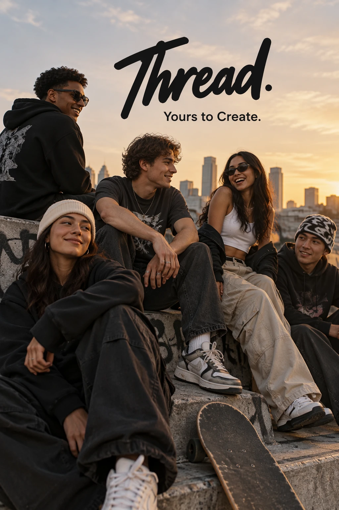

Source: [OpenAI: Render exact text](https://developers.openai.com/api/docs/guides/image-prompting?model=gpt-image-2.5#render-exact-text). Published example and recipe; our adaptation changes the intent.

**Recorded settings:** model not exposed by built-in tool; seed not exposed; quality not exposed.

[Underlying case record](evidence/expanded-experiments/guide-cases.json) · [Download result](evidence/expanded-experiments/generation-coverage/g03-afterlight-poster.png)

<a id="G04"></a>
### G04 · Tideline identity

**Design a reusable logo · visual guide page 10**


**Method:** Constrain the logo to one navy symbol and one wordmark. Describe the shared bird-and-wave silhouette, the negative space and a measurable width hierarchy. Ask for actual transparency as an output property, then inspect the file.

**Observed result:** The bird/wave concept and TIDELINE spelling work, and the PNG has real alpha. The wordmark is 727 pixels wide against a 670-pixel symbol at alpha greater than 128: about 8.5% wider, despite the request for a narrower wordmark.

**Reusable lesson:** A useful identity mark may need less detail. Check proportions and file properties instead of adding decorative adjectives.

**Limits / next move:** Scale only the wordmark to 80–85% of the symbol width and recenter it. Rebuild the approved identity as editable vectors for production.

**Comparison:** Intent changed to a new coastal brand and simpler shape language. This is an identity exploration, not a matched logo-quality comparison.

**Generation inputs:**

- The saved input record lists no reference image for the initial generation. Research sources below are separate from attached inputs.

**Exact initial prompt:** [plain text](prompts/G04.txt)

```text
Create one original logo for a fictional coastal conservation studio named TIDELINE. Square 1:1 canvas with a genuinely transparent background; preserve real alpha transparency.
Symbol: a compact near-circular dark navy silhouette. Inside it, one broad flowing negative-space channel curves upward like a breaking wave and resolves into the simple profile of a shorebird's head looking right. Use only two or three broad connected shapes. The bird and wave should share one elegant silhouette rather than look like separate clip-art objects. No feathers, eyes, scenic illustration, thin decorative lines or gradients.
Place the symbol centered in the upper-middle. Below it, set "TIDELINE" exactly once in dark navy uppercase geometric sans-serif, widely but evenly spaced. Align the wordmark with the symbol; keep the wordmark narrower than the symbol's outer width. Plenty of empty transparent margin on all sides.
This is a flat vector-like raster logo exploration. Crisp solid edges, balanced negative space, strong recognition at small sizes. One ink color only: deep navy. No shadows, mockup, paper texture, backdrop, drawn checkerboard, border, additional text or watermark.
```

**Published OpenAI reference:** Published GPT Image 2.5 Sunburst example. Separate from our result.


Source: [OpenAI: Design a reusable logo](https://developers.openai.com/api/docs/guides/image-prompting?model=gpt-image-2.5#design-a-reusable-logo). Published example and recipe; our adaptation changes the intent.

**Recorded settings:** model not exposed by built-in tool; seed not exposed; quality not exposed.

[Underlying case record](evidence/expanded-experiments/guide-cases.json) · [Download result](evidence/expanded-experiments/generation-coverage/g04-tideline-mark.png)

<a id="G05"></a>
### G05 · A field becomes a city

**Use historical and real-world context · visual guide page 11**


**Method:** Separate sourced anchors from imagined staging. Use the verified sloping field and stage-at-bottom relationship, then plan five foreground attendees, a muddy route and a crowd that diminishes into the distance.

**Observed result:** The planned scene and five foreground figures are present. The topography is consistent with the museum source, but the exact viewpoint, people, clothing combinations and moment are invented; this is an AI recreation.

**Reusable lesson:** Research bounds invention. Label which details are observed, sourced, inferred or deliberately added.

**Limits / next move:** For documentary reconstruction, select an archival photograph and map its actual structures and viewpoint. Do not treat visual plausibility as historical verification.

**Comparison:** Intent changed to an elevated wide view with an explicit foreground group. More spatial scale is a compositional choice, not proof of greater historical accuracy.

**Generation inputs:**

- The saved input record lists no reference image for the initial generation. Research sources below are separate from attached inputs.

**Exact initial prompt:** [plain text](prompts/G05.txt)

```text
Create a wide 3:2 photorealistic historical reconstruction of a crowd at the Woodstock Music and Art Fair, on Max Yasgur's farm in Bethel, New York, in August 1969. It should resemble a carefully staged period editorial scene, not a present-day festival.
Verified setting to depict: a very large crowd spreads across a grassy, sloping farm field; the concert stage sits at the foot of the audience slope, with wooded edges and rural land beyond. Rain and mud were part of the festival. Do not portray an exact documented instant or recognizable performer.
Composition: view from among the audience near the upper slope, looking down toward the distant stage. Foreground, five distinguishable young adult attendees sit or stand on blankets: worn denim, simple cotton shirts, a patterned long skirt, long hair and a canvas shoulder bag. Their poses are relaxed and varied, facing generally toward the stage. A muddy footpath leads diagonally through the middle-ground crowd. Scattered simple canvas tents sit toward the far wooded edge. Thousands of more distant attendees become increasingly small, with natural nonrepeating clusters.
Appearance: muted late-1960s color-film character, soft overcast daylight, real skin and fabric, grass worn into patches of earth. Period-appropriate simple stage scaffolding and speaker stacks remain small in the distance. No LED screens, smartphones, modern stage lasers, contemporary branded clothing, modern security barriers or giant printed sponsor signs.
No caption or readable writing inside the image. Preserve convincing human anatomy in the foreground and a coherent hillside perspective.
```

**Published OpenAI reference:** Published GPT Image 2.5 Sunburst example. Separate from our result.

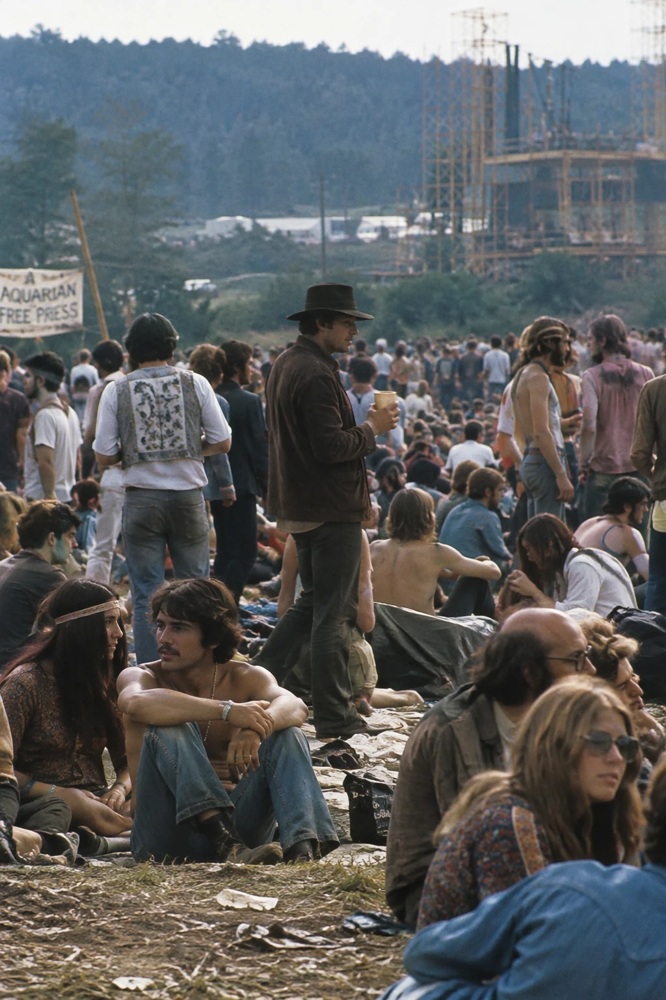

Source: [OpenAI: Use historical and real-world context](https://developers.openai.com/api/docs/guides/image-prompting?model=gpt-image-2.5#use-historical-and-real-world-context). Published example and recipe; our adaptation changes the intent.

**Recorded settings:** model not exposed by built-in tool; seed not exposed; quality not exposed.

[Underlying case record](evidence/expanded-experiments/guide-cases.json) · [Download result](evidence/expanded-experiments/generation-coverage/g05-woodstock-recreation.png)

<a id="G06"></a>
### G06 · The record collector

**Turn a story into a comic strip · visual guide page 12**

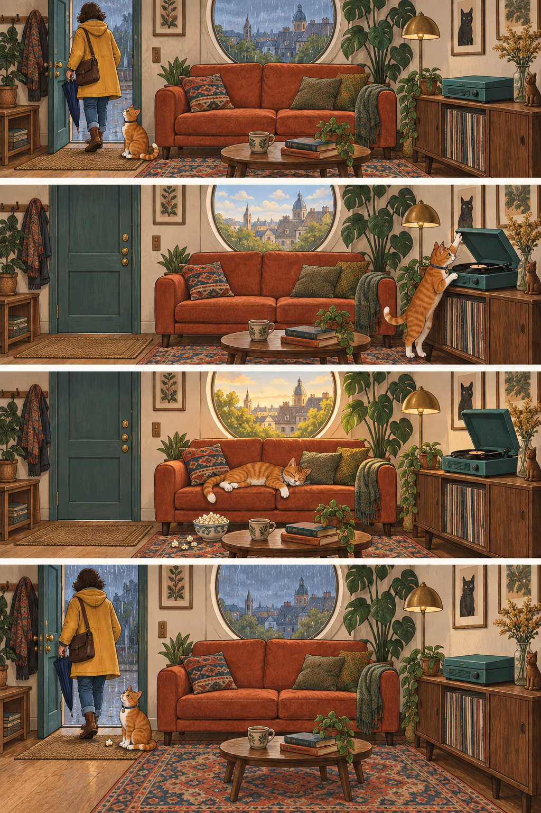

**Method:** Write a state table for each panel: where the cat is, whether the player is open, whether the person is present and what clue remains. Keep room landmarks fixed. Review the visible pose that communicates each action.

**Observed result:** The first output keeps the room, cat and player-state sequence but the last panel reads as another departure. One repair makes the person enter and look at the cat. The repair also changes upholstery texture in otherwise unchanged panels.

**Reusable lesson:** Describe an action through visible evidence: front of coat, inward step, gaze toward the cat. Evaluate the requested change and preservation separately.

**Limits / next move:** Use the repaired page for the readable story, with its preservation limitation disclosed. If exact texture matters, constrain the edit region and compare untouched areas.

**Comparison:** Intent changed in story, props and visual treatment. The repair demonstrates a specific fix with collateral texture drift, not universal superiority of sequential edits.

**Generation inputs:**

- The saved input record lists no reference image for the initial generation. Research sources below are separate from attached inputs.

**Exact initial prompt:** [plain text](prompts/G06.txt)

```text
Draw one portrait 2:3 comic page with exactly four horizontal panels stacked top to bottom, equal-width panels and clean ivory gutters. No text, dialogue, lettering, panel numbers or sound effects.
Visual style: sophisticated hand-inked European picture-book illustration, precise warm outlines, richly painted gouache, terracotta, petrol blue, mustard and sage. Detailed but readable interiors, not flat clip art.
Recurring identity: one small orange tabby cat with a white muzzle, white front paws, three dark forehead stripes and a cobalt-blue collar. Keep these features in every panel.
Recurring room: a terracotta sofa is left-center, a low walnut record cabinet with a teal record player is on the right, a large round window is behind the sofa, and the entrance is at far left. Keep furniture placement and colors consistent.
Panel 1: a person in a mustard raincoat exits through the far-left doorway, carrying a folded navy umbrella. The cat sits near the threshold watching. The teal record player on the right is closed and inactive.
Panel 2: the same room after departure. The cat stands with its front white paws on the record cabinet and lifts the teal record player's lid with one paw. One black vinyl record is visible on the turntable. No human is present.
Panel 3: the same cat sprawls happily across the terracotta sofa, eyes closed, while the open record player at right plays the black record. A small bowl of popcorn sits on the floor with a few spilled kernels. Warm afternoon light comes through the round window.
Panel 4: the raincoat-wearing person returns at the far-left doorway holding the folded navy umbrella. The cat sits innocently by the threshold as in panel 1. The record player's lid is closed again, but one small popcorn kernel remains beside the cat as the visual punchline.
Make the story immediately readable. One cat per panel; preserve room geography, color palette and recognizable objects.
```

**Published OpenAI reference:** Published GPT Image 2.5 Sunburst example. Separate from our result.


Source: [OpenAI: Turn a story into a comic strip](https://developers.openai.com/api/docs/guides/image-prompting?model=gpt-image-2.5#turn-a-story-into-a-comic-strip). Published example and recipe; our adaptation changes the intent.

**Recorded settings:** model not exposed by built-in tool; seed not exposed; quality not exposed.

[Underlying case record](evidence/expanded-experiments/guide-cases.json) · [Download result](evidence/expanded-experiments/generation-coverage/g06-cat-four-panel.png)

<a id="G07"></a>
### G07 · Fieldwork market

**Create an interface preview · visual guide page 13**


**Method:** Map screen regions and give every visible interface string explicitly. Distinguish the title, category chips, vendor cards, featured product and navigation. Treat photographs as text-bearing regions too.

**Observed result:** The requested interface labels, vendor names and price are readable and correct. The model adds unrequested slogans on signs inside the vendor photographs. The file is a polished visual preview; no interface behavior is implemented.

**Reusable lesson:** An exact text inventory must include incidental signs, packaging and photographed labels, not only the main layout.

**Limits / next move:** Remove or blank the in-photo signs while retaining the interface copy. Build actual controls and test interactions separately.

**Comparison:** Broad app category retained, with new information architecture, content and imagery. The different brief does not support a causal claim of better UI prompting.

**Generation inputs:**

- The saved input record lists no reference image for the initial generation. Research sources below are separate from attached inputs.

**Exact initial prompt:** [plain text](prompts/G07.txt)

```text
Create one portrait 2:3 product-design presentation containing a single straight-on modern smartphone, centered on a pale warm-gray background. The phone fills most of the frame and displays a crisp, finished farmers-market app named Fieldwork. This is a realistic shipped-app visual preview, not a concept sketch.
Screen layout top to bottom:
1. A compact status bar and a header reading "Fieldwork", with a small search icon and bag icon.
2. A large editorial hero photo of a market stall with tomatoes, flowers and leafy vegetables. Overlay a cream card at its lower edge: "Saturday market" on the first line and "8 AM – 1 PM · Riverside Park" below.
3. Three small filter chips in one row: "All", "Produce", "Bakery". All is selected in dark forest green.
4. Section heading "Meet the makers". Two equal vendor cards side by side with different photographs: baskets of tomatoes on the first, flour-dusted sourdough on the second. Labels exactly "Green Row" / "Vegetables" and "Early Bird" / "Sourdough".
5. A smaller full-width cream-tinted promotional row with a close photo of mixed tomatoes and text "Today's pick" and "Heirloom tomatoes", plus "$4 / lb" aligned at right.
6. A bottom navigation bar with three clean icons and text "Explore", "Saved", "Bag"; Explore selected.
Use warm white, deep forest green and restrained tomato-red accents. Fine charcoal typography, strong spacing, carefully aligned cards, natural photographs, crisp rounded rectangles, practical contrast. Keep the entire screen visible with no overlapping controls or cropped labels. No lorem ipsum, fake paragraphs, extra feature sections, device logos or decorative floating objects.
```

**Published OpenAI reference:** Published GPT Image 2.5 Sunburst example. Separate from our result.


Source: [OpenAI: Create an interface preview](https://developers.openai.com/api/docs/guides/image-prompting?model=gpt-image-2.5#create-an-interface-preview). Published example and recipe; our adaptation changes the intent.

**Recorded settings:** model not exposed by built-in tool; seed not exposed; quality not exposed.

[Underlying case record](evidence/expanded-experiments/guide-cases.json) · [Download result](evidence/expanded-experiments/generation-coverage/g07-fieldwork-market-ui.png)

<a id="G08"></a>
### G08 · Inside a leaf

**Create scientific and educational visuals · visual guide page 14**

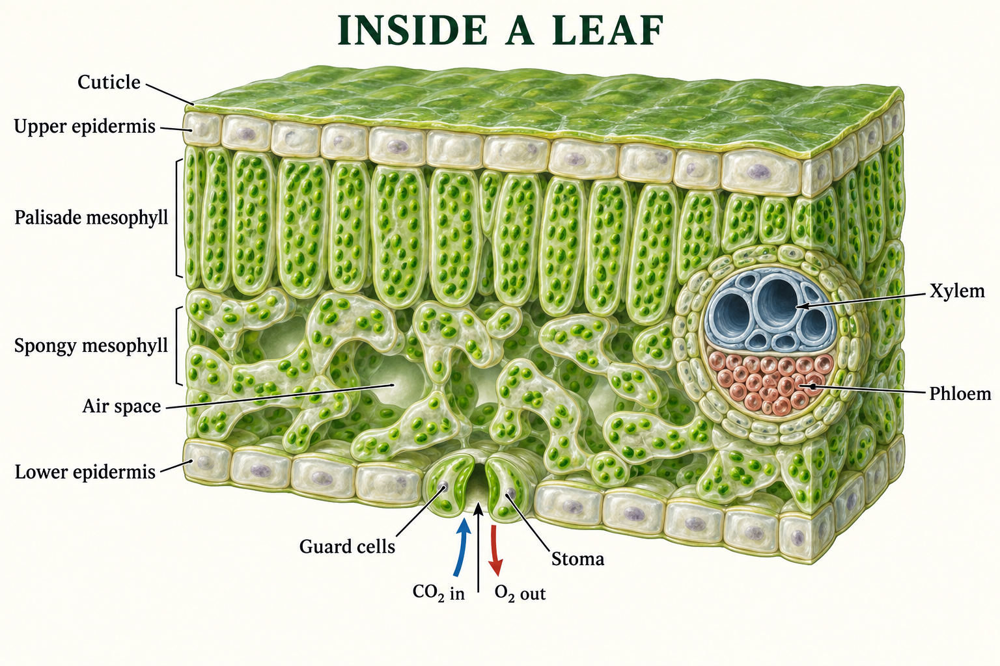

**Method:** Start with verified anatomy, organize the layer order, and map every label to a particular structure. Reserve space for leader lines and specify gas directions. Review the endpoints after the image looks finished.

**Observed result:** The cutaway is visually clear and most layer relationships are correct. The Stoma leader ends on a guard cell rather than the pore. Gas arrows point in the intended directions but do not clearly pass through the pore; another unlabeled arrow is ambiguous.

**Reusable lesson:** A plausible diagram can contain a consequential local error. Check each label-to-structure relationship, not just spelling and polish.

**Limits / next move:** Correct the Stoma endpoint and gas-arrow route before teaching from this image. Have a subject expert inspect the finished annotation layer.

**Comparison:** Intent changed to leaf anatomy. The new subject and representation prevent a fair improvement claim against the published example.

**Generation inputs:**

- The saved input record lists no reference image for the initial generation. Research sources below are separate from attached inputs.

**Exact initial prompt:** [plain text](prompts/G08.txt)

```text
Create a landscape 3:2 educational plate titled "INSIDE A LEAF" for a high-school biology lesson. Show a beautiful, scientifically readable three-dimensional cutaway block through a typical eudicot leaf, floating on an ivory background. Illustration is a precise textbook model with subtle painted texture, not a microscope photograph. The tissue layers are enlarged schematically; do not add a numerical scale.
Anatomical map, top to bottom:
- a very thin waxy cuticle on top;
- one layer of upper epidermal cells;
- closely packed elongated upright palisade cells, full of small green chloroplasts;
- a lower layer of loosely arranged irregular spongy cells with obvious connected air spaces and some chloroplasts;
- one layer of lower epidermal cells, interrupted at front-center by a clear stomatal opening flanked by two guard cells.
Embed one rounded vascular bundle within the mesophyll at the right side of the cutaway. Its larger xylem vessels are above its smaller phloem cells. Keep the surrounding tissues visible.
Labels with thin noncrossing leader lines and sufficient margin, each exactly once: "Cuticle", "Upper epidermis", "Palisade mesophyll", "Spongy mesophyll", "Air space", "Lower epidermis", "Guard cells", "Stoma", "Xylem", "Phloem". Each leader must touch the correct structure; never use a label as decoration.
Below the stomatal pore show one small inward arrow labeled "CO2 in" going from outside through the pore into the internal air space, and one small outward arrow labeled "O2 out" going from that air space through the pore to outside. Separate arrows so their directions are unambiguous. The pore must actually open into the air space, not a solid cell.
Use botanical greens, cream cell walls, muted blue xylem and muted coral phloem. Preserve cell topology and a clear layer hierarchy. No animal organs, invented organelles, extra captions or decorative foliage.
```

**Published OpenAI reference:** Published GPT Image 2.5 Sunburst example. Separate from our result.

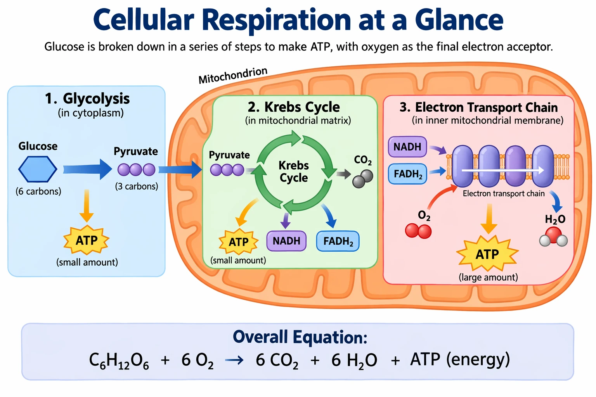

Source: [OpenAI: Create scientific and educational visuals](https://developers.openai.com/api/docs/guides/image-prompting?model=gpt-image-2.5#create-scientific-and-educational-visuals). Published example and recipe; our adaptation changes the intent.

**Recorded settings:** model not exposed by built-in tool; seed not exposed; quality not exposed.

[Underlying case record](evidence/expanded-experiments/guide-cases.json) · [Download result](evidence/expanded-experiments/generation-coverage/g08-leaf-cutaway.png)

<a id="G09"></a>
### G09 · Civic Move — quarter in view

**Build slides, diagrams, and charts · visual guide page 15**


**Method:** Supply one small fixed dataset, assign each variable a chart type, define axes and units, and list all printed values. Mark the data as illustrative. Verify text separately from bar lengths and export dimensions.

**Observed result:** All values and labels are coherent: trips 120/180/240, on-time 80/85/90%, and mix 50/30/20. Exact geometry is approximate: bar lengths have small ratio deviations and the 1672×941 canvas differs from exact 16:9 by about 0.053%.

**Reusable lesson:** Correct numbers printed beside a chart do not prove the marks encode those numbers precisely.

**Limits / next move:** Use the approved layout as direction and render final charts from the same data in a deterministic plotting or slide tool when numerical geometry matters.

**Comparison:** Intent changed to a three-chart operational slide with synthetic data. This is a design demonstration, not a benchmark against a different dataset.

**Generation inputs:**

- The saved input record lists no reference image for the initial generation. Research sources below are separate from attached inputs.

**Exact initial prompt:** [plain text](prompts/G09.txt)

```text
Create one polished landscape 16:9 presentation slide, a flat full-slide graphic, titled "CIVIC MOVE" with the subtitle "Quarter in view". Use a warm ivory background, dark navy typography, thin neutral rules, refined editorial spacing and restrained teal, blue and orange chart colors. No photographs, gradients, 3D effects or drop shadows.
Layout: header at the top, then exactly three equal-width chart panels in a single row with generous margins.
Left panel title "Trips". Vertical bar chart with three months: "Jan", "Feb", "Mar". Values are exactly 120, 180, 240. Bars share a zero baseline, heights in ratio 1:1.5:2. Place each value clearly above its bar. Y-axis labeled "Trips" with ticks 0, 120, 240. Bars teal.
Middle panel title "On-time rate". A simple blue line chart with three points Jan 80%, Feb 85%, Mar 90%. Label each point exactly "80%", "85%", "90%". Vertical scale has ticks 70%, 80%, 90%, 100%, evenly spaced. Points increase by equal vertical steps. Months aligned in order under points.
Right panel title "March mix". Horizontal bars for "Bike", "Bus", "Walk" with values 50%, 30%, 20%. Same zero baseline and common scale; lengths in ratio 5:3:2. Bike teal, Bus muted blue, Walk burnt orange. Each value at its bar end. No pie chart.
Footer at bottom-left exactly "Illustrative data · Not a real business". No source citation or other data.
Prioritize mathematical consistency and legible text over decoration. All three panels must fit comfortably. Every requested label appears in its intended place, with no extra metrics, legends, logos or generated gibberish.
```

**Published OpenAI reference:** Published GPT Image 2.5 Sunburst example. Separate from our result.

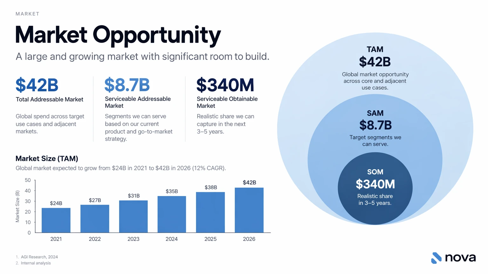

Source: [OpenAI: Build slides, diagrams, and charts](https://developers.openai.com/api/docs/guides/image-prompting?model=gpt-image-2.5#build-slides-diagrams-and-charts). Published example and recipe; our adaptation changes the intent.

**Recorded settings:** model not exposed by built-in tool; seed not exposed; quality not exposed.

[Underlying case record](evidence/expanded-experiments/guide-cases.json) · [Download result](evidence/expanded-experiments/generation-coverage/g09-civic-move-slide.png)

<a id="G10"></a>
### G10 · The Rain Engine in Spanish

**Translate while preserving layout · visual guide page 16**

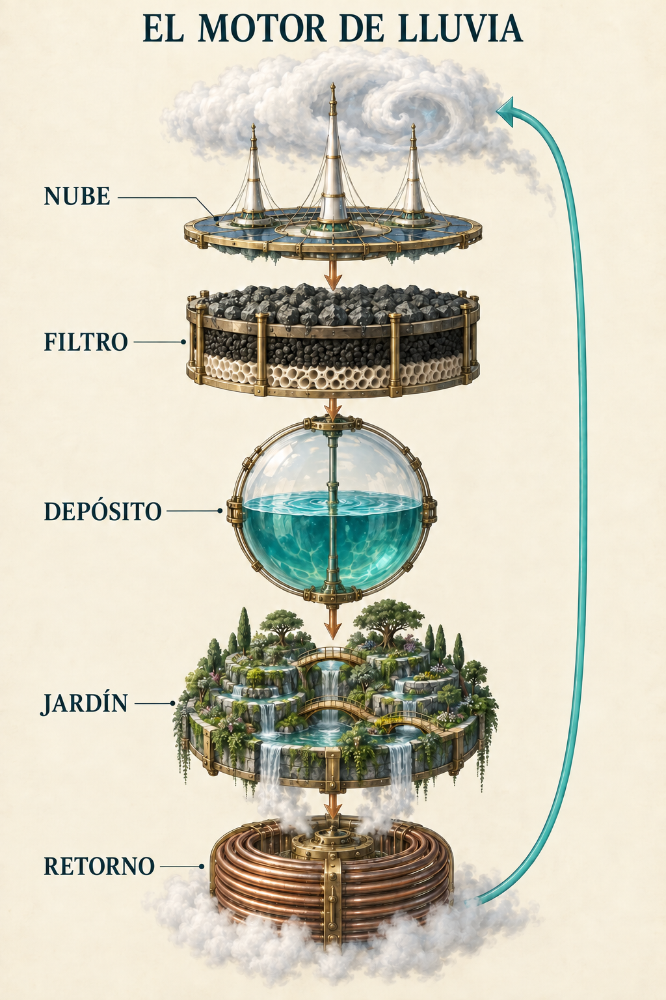

**Method:** Use the existing poster as the layout target. Provide a complete six-entry glossary with accents, retain the original text zones, and permit only the type-size and leader-line adjustments required by longer replacements.

**Observed result:** All six Spanish replacements, including DEPÓSITO and JARDÍN, are correct. The stack and arrow topology stay consistent. Reservoir caustics and some foliage are redrawn, so exact illustration preservation fails.

**Reusable lesson:** Text localization and pixel preservation are separate acceptance criteria.

**Limits / next move:** For an unchanged print master, replace text in an editable layout layer. If another generation is acceptable, select text regions and inspect untouched illustration afterward.

**Comparison:** Intent changed to our fantasy atlas. It has fewer labels and a different layout; the successful translation does not prove a superior localization method.

**Generation inputs:**

- [input](evidence/expanded-experiments/language/trial-N4.png): edit target: illustration, geometry, material and typography layout

**Exact initial prompt:** [plain text](prompts/G10.txt)

```text
Edit image 1, the complete Rain Engine poster. It is the exact layout and illustration target; do not redesign it.

Change only its six text strings using this complete Spanish glossary:
THE RAIN ENGINE → EL MOTOR DE LLUVIA
CLOUD → NUBE
FILTER → FILTRO
VAULT → DEPÓSITO
GARDEN → JARDÍN
RETURN → RETORNO

Print every replacement exactly once, with the accents shown. Preserve the existing title position, each label's left alignment and baseline, serif character, dark teal ink and hierarchy. Reduce type size or tracking only as necessary to fit each replacement into its current text zone; shorten a leader line only if the longer label requires room.

Lock everything else: the portrait 2:3 canvas, five floating tiers, exactly three white masts, three filter layers, glass reservoir and water level, intricate garden and bridges, copper coil, cloud shapes, four downward arrows, long turquoise return arrow, all material colors, lighting and illustration geometry. No English text, extra labels, new objects, borders or watermarks. Return the translated poster.
```

**Published OpenAI reference:** Published GPT Image 2.5 Sunburst example. Separate from our result.

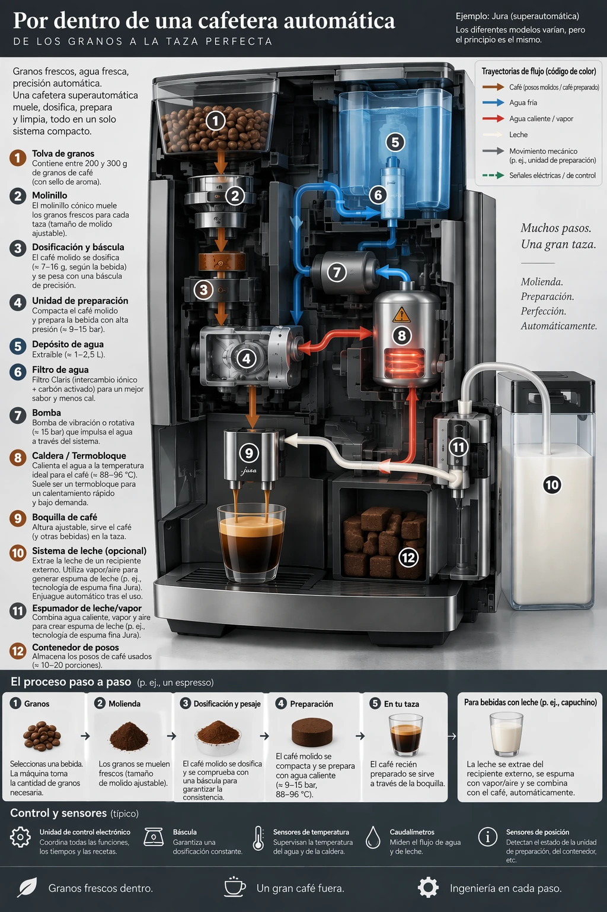

Source: [OpenAI: Translate while preserving layout](https://developers.openai.com/api/docs/guides/image-prompting?model=gpt-image-2.5#translate-while-preserving-layout). Published example and recipe; our adaptation changes the intent.

**Recorded settings:** model not exposed by built-in tool; seed not exposed; quality not exposed.

[Underlying case record](evidence/expanded-experiments/guide-cases.json) · [Download result](evidence/expanded-experiments/edit-coverage/g10.png)

<a id="G11"></a>
### G11 · Night Courier

**Transfer a visual style · visual guide page 17**

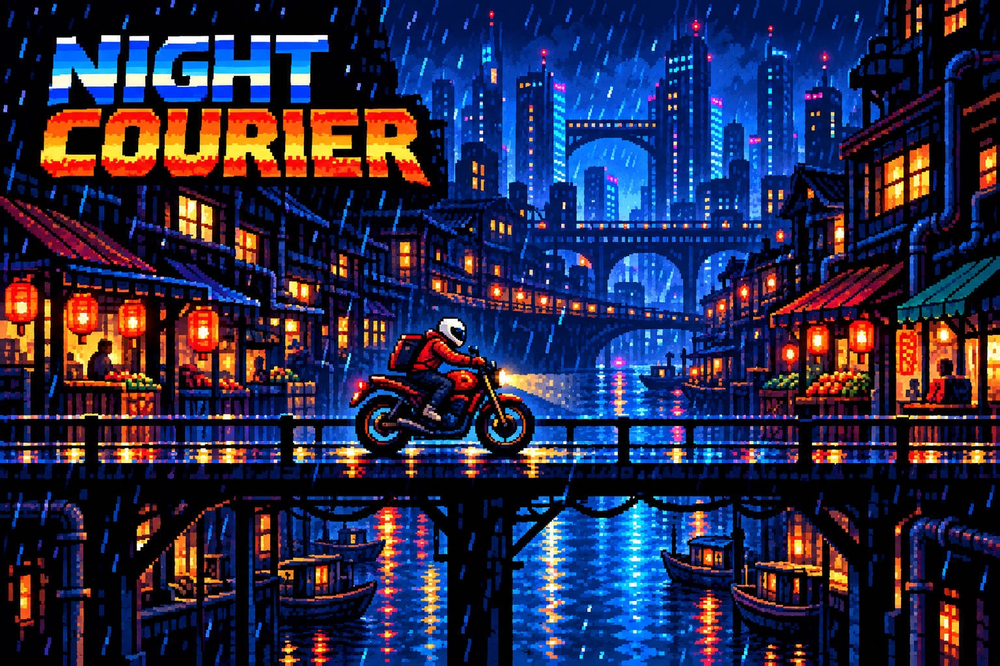

**Method:** Assign the reference to style only: palette, square clusters and stepped edges. Exclude its objects and interface. Map a foreground rider, middle canal market and distant towers, with an explicit bridge count and title zone.

**Observed result:** The result has crisp pixel treatment, strong three-layer depth, one rider and two motorcycle wheels. NIGHT COURIER is correct. It has three distant arched bridges rather than the requested two; some far-side hand and boot contacts are occluded.

**Reusable lesson:** A style reference can guide appearance without supplying content, but count every repeated background element.

**Limits / next move:** Give the bridges stable IDs on a visual map, select the surplus bridge and remove it. In a new brief, name the two desired bridge locations.

**Comparison:** Intent expanded to a complete city poster. The rich environment is added content, not proof that the method renders the same brief better.

**Generation inputs:**

- [input](evidence/expanded-experiments/edit-coverage/inputs/pixels.webp): style only: palette, pixel clusters and edge treatment

**Exact initial prompt:** [plain text](prompts/G11.txt)

```text
Use image 1 only as a visual-style reference. Extract its crisp square pixel clusters, stepped diagonals, small restricted color ramps, near-black negative space, bright cobalt/cyan, warm orange-yellow highlights and restrained magenta stars. Do not copy its words, spacecraft, planets, layout, scores, menus or logos.

Create a new landscape 3:2 illustrated game-poster scene called NIGHT COURIER. Foreground: exactly one motorcycle with two clearly visible wheels, ridden by one courier in a red jacket and ivory full-face helmet, crossing a narrow elevated bridge from left to right. Both gloved hands meet the handlebars and the boots meet the foot pegs. Show the whole motorcycle and rider, occupying the lower middle of the frame.

Middle ground: a dense rain-soaked market city built over a deep canal, with stacked shop awnings, hanging lanterns, service pipes and a few small moored boats. Background: tall cobalt towers and two arched skybridges disappearing into wet night haze. Use three clear depth layers so the foreground silhouette reads immediately. Render rain, warm window lights and cyan reflections as deliberate pixel clusters, not smooth photographic effects.

Place NIGHT COURIER exactly once in bold readable pixel lettering inside the upper-left sky area. No other letters, HUD, numbers, watermark or border. Keep all important content within a 5% margin. The result must be coherent detailed pixel art, without antialiased vector edges, painted blur, or a photograph underneath.
```

**Published OpenAI reference:** Published GPT Image 2.5 Sunburst example. Separate from our result.

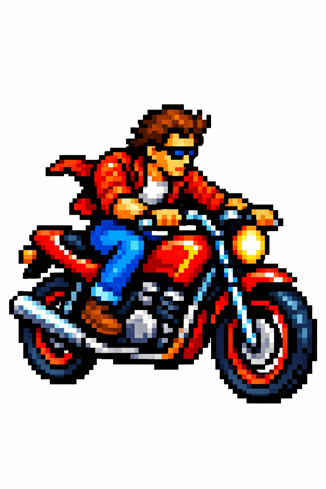

Source: [OpenAI: Transfer a visual style](https://developers.openai.com/api/docs/guides/image-prompting?model=gpt-image-2.5#transfer-a-visual-style). Published example and recipe; our adaptation changes the intent.

**Recorded settings:** model not exposed by built-in tool; seed not exposed; quality not exposed.

[Underlying case record](evidence/expanded-experiments/guide-cases.json) · [Download result](evidence/expanded-experiments/edit-coverage/g11.png)

<a id="G12"></a>
### G12 · A wardrobe assembled from four references

**Preserve identity and change clothing · visual guide page 18**

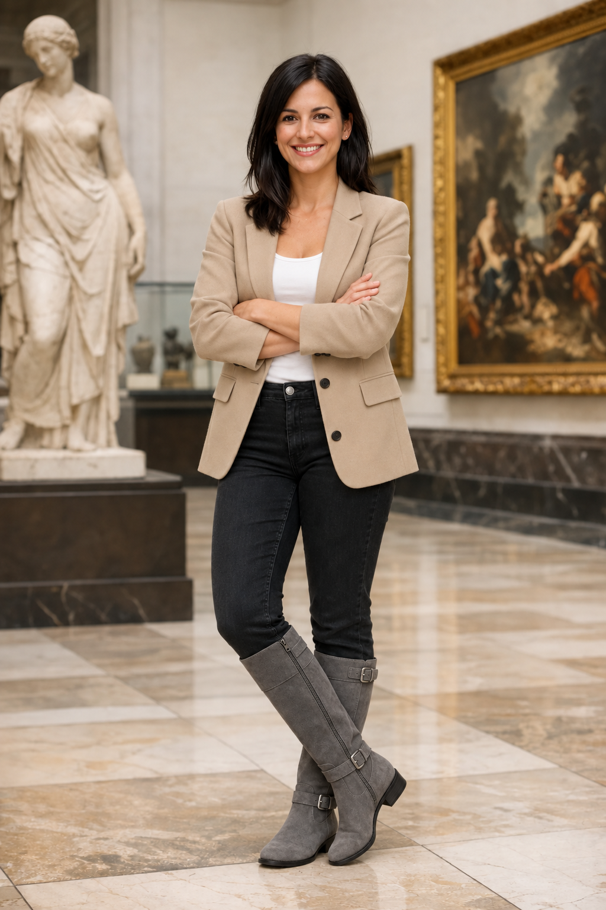

**Method:** Give each input one role: person and museum, blazer, tank, boots. Enumerate garment details and preserved pose anchors. Allow natural folds and occlusion while keeping face, body, black jeans and room stable.

**Observed result:** The beige blazer, white tank and gray boots appear on the referenced person with the folded arms and crossed ankles retained. Visible likeness and museum arrangement remain close. One boot buckle is hidden, so exact hardware preservation is uncertain.

**Reusable lesson:** Reference roles reduce ambiguity. Verify visible evidence and record occluded details as unknown.

**Limits / next move:** If hardware is essential, request a useful detail view or adjust the named buckle. Do not pass a hidden component as verified.

**Comparison:** The broad task and source garments are retained, with a new detailed constraint set. This was not a controlled same-prompt rerun or a likeness benchmark.

**Generation inputs:**

- [input](evidence/expanded-experiments/edit-coverage/inputs/woman-in-museum.webp): edit target, identity, pose, environment
- [input](evidence/expanded-experiments/edit-coverage/inputs/jacket.webp): blazer garment only
- [input](evidence/expanded-experiments/edit-coverage/inputs/tank-top.webp): tank garment only
- [input](evidence/expanded-experiments/edit-coverage/inputs/boots.webp): boots garment only

**Exact initial prompt:** [plain text](prompts/G12.txt)

```text
Image 1 is the edit target and sole person/environment reference: the smiling dark-haired woman standing with folded arms and crossed ankles in the museum. Images 2, 3 and 4 are garment references only: the beige blazer, white scoop-neck tank top, and gray knee-high suede boots.

Replace her knitted sweater and white sneakers with an outfit assembled from those garments. Put the beige blazer from image 2 over the white tank from image 3, leaving the blazer open enough to see the tank. Match the blazer's beige fabric, notched lapels, two dark front buttons and flap pockets; adapt its drape to her existing folded-arm pose. Put the gray boots from image 4 on both feet, over her existing black jeans, retaining the suede texture, low heels, knee-high shafts and two buckle straps on each boot.

Preserve image 1's facial features, apparent age, smile, skin texture, black shoulder-length hair and earrings. Keep the folded arms, crossed ankles, body proportions, camera viewpoint, full-body framing and museum lighting. Preserve her black jeans wherever not naturally covered by blazer or boots. Keep the marble statue on the left, both gold-framed paintings on the right, floor tiles and background geometry in place. Clothing may create natural new folds, occlusions and contact shadows; do not change her anatomy to simplify the fit. No extra people, accessories, labels, logos or beauty retouching. Portrait 2:3.
```

**Published OpenAI reference:** Published GPT Image 2.5 Sunburst example. Separate from our result.

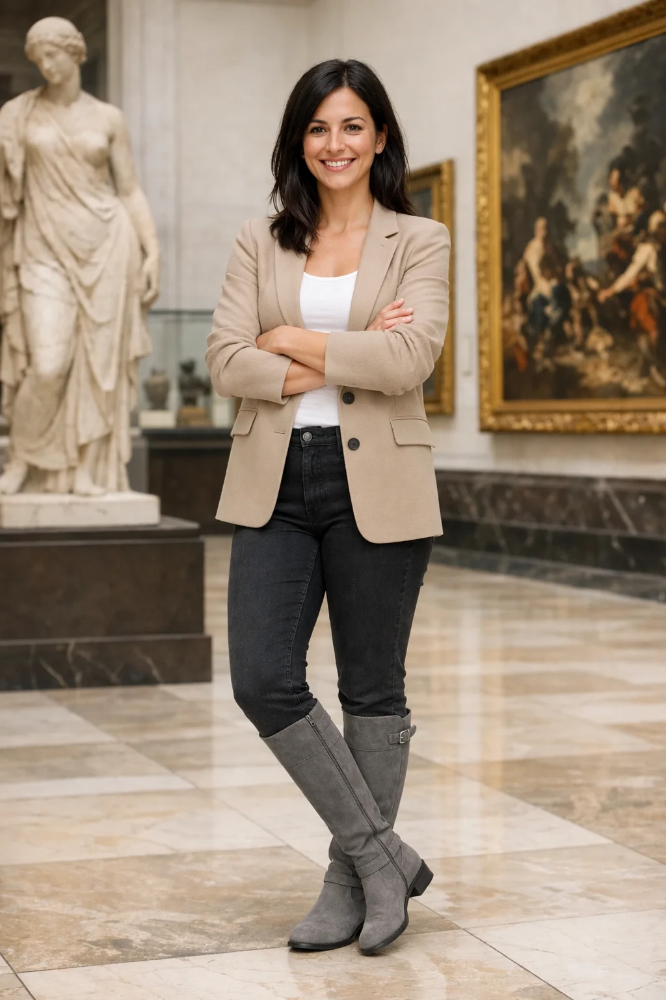

Source: [OpenAI: Preserve identity and change clothing](https://developers.openai.com/api/docs/guides/image-prompting?model=gpt-image-2.5#preserve-identity-and-change-clothing). Published example and recipe; our adaptation changes the intent.

**Recorded settings:** model not exposed by built-in tool; seed not exposed; quality not exposed.

[Underlying case record](evidence/expanded-experiments/guide-cases.json) · [Download result](evidence/expanded-experiments/edit-coverage/g12.png)

<a id="G13"></a>
### G13 · Botanical railway editorial

**Combine references · visual guide page 19**


**Method:** Assign the first reference to the woman and outfit, the second to the dog only, and create a new environment. Specify walking positions, leash-to-hand contact, full-body framing, depth, light and grounded reflections.

**Observed result:** The woman, dog, leash and elaborate concourse integrate coherently. Two small background people violate the exactly-one-person rule. The clock has numeral-like marks despite the no-readable-numerals instruction.

**Reusable lesson:** Explicit donor roles help composition; an exclusion still needs a whole-image inspection at several scales.

**Limits / next move:** Map and remove the distant people, and replace the clock markings with plain ticks, while preserving the foreground pair and leash.

**Comparison:** Intent changed to a new railway environment and walking arrangement. The added spectacle cannot establish method superiority.

**Generation inputs:**

- [input](evidence/expanded-experiments/edit-coverage/inputs/test-woman.webp): woman identity and outfit only
- [input](evidence/expanded-experiments/edit-coverage/inputs/test-woman-2.webp): dog donor only; exclude donor woman/background

**Exact initial prompt:** [plain text](prompts/G13.txt)

```text
Reference roles are strict. Image 1 supplies only the woman: her face, long brown hair, dark navy cap, blue-white plaid overshirt, black cropped tank, ripped blue jeans, black belt and white sneakers. Image 2 supplies only the chocolate-brown Labrador dog: broad face, amber-brown eyes, floppy ears, dark brown short fur and stocky proportions. Do not use the second woman's identity, clothes or pose. Neither image supplies the new background.

Create a photorealistic landscape 3:2 travel editorial inside a spectacular glass-roofed botanical railway concourse at late golden hour. The woman from image 1 walks toward the camera slightly left of center, full body visible. The Labrador from image 2 walks beside her on the viewer's right, full body visible, on a slack burgundy leash held in her left hand (the hand on the viewer's right). Keep her reference outfit intact. Adapt the dog's posture to walking while preserving its recognizable appearance.

Behind them, show a soaring iron-and-glass barrel vault, layered tropical palms in bronze planters, an ornate station clock without readable numerals, and the front of a deep moss-green vintage train on the right. Warm sun shafts cut through the glass and reflect on a wet black-and-ivory tiled floor. Keep architectural lines in a coherent perspective, with the woman and dog sharper than the distant roof and train. Ground all feet and paws with matching contact shadows and reflections.

Exactly one woman and one dog; no crowd or second donor person. No floating leash, merged limbs, duplicate paws, extra animals, readable signage, logos or watermarks. Preserve natural face and fur texture; this should feel like a detailed travel photograph, not a cut-and-paste collage.
```

**Published OpenAI reference:** Published GPT Image 2.5 Sunburst example. Separate from our result.


Source: [OpenAI: Combine references](https://developers.openai.com/api/docs/guides/image-prompting?model=gpt-image-2.5#combine-references). Published example and recipe; our adaptation changes the intent.

**Recorded settings:** model not exposed by built-in tool; seed not exposed; quality not exposed.

[Underlying case record](evidence/expanded-experiments/guide-cases.json) · [Download result](evidence/expanded-experiments/edit-coverage/g13.png)

<a id="G14"></a>
### G14 · A cutout that only looks transparent

**Create a transparent product cutout · visual guide page 20**


**Method:** Name the bottle as the extraction target, preserve its silhouette and printed label, and define transparency as alpha values rather than a pictured background. Inspect the saved file instead of trusting a checkerboard preview.

**Observed result:** The first output is an RGB PNG with a painted checkerboard and no real alpha. A second attempt from the clean source, with stronger RGBA wording, fails in the same way. Both keep the bottle recognizable; neither is a usable transparent cutout.

**Reusable lesson:** Prompts describe intent; tool controls and metadata establish file properties. A failed cutout is still a useful experiment when retained honestly.

**Limits / next move:** Use a path with actual alpha or background-removal controls, then inspect its file pixels. Stop treating repeated wording as proof of a format fix.

**Comparison:** The extraction goal remains similar, but settings and backend are unexposed. These failures do not show that named GPT Image 2.5 models lack transparency support.

**Generation inputs:**

- [input](evidence/expanded-experiments/edit-coverage/inputs/shampoo.webp): exact product identity and typography

**Exact initial prompt:** [plain text](prompts/G14.txt)

```text
Image 1 is the exact product to extract. Return a square PNG cutout with genuine transparent alpha outside the bottle. Remove the wooden tabletop, tan wall, and cast shadow completely; do not replace them with white, gray, black, a checkerboard pattern, or a painted transparency effect.

Preserve the single peach-orange shampoo bottle, its rounded shoulder, cylindrical body, flip-top cap, front-facing orientation and warm product shading. Preserve its printed black label faithfully: WOMEN; SHAMPOO; FOR; NORMAL HAIR; 12 FL OZ (355 mL). Keep the existing typography and line positions rather than redesigning packaging. Retain the whole cap and bottom silhouette, centered with a small transparent margin. Keep opaque bottle interiors opaque and fine edge antialiasing natural. No extra objects, text, drop shadows or reflections outside the bottle.
```

**Published OpenAI reference:** Published GPT Image 2.5 Sunburst example. Separate from our result.


Source: [OpenAI: Create a transparent product cutout](https://developers.openai.com/api/docs/guides/image-prompting?model=gpt-image-2.5#create-a-transparent-product-cutout). Published example and recipe; our adaptation changes the intent.

**Recorded settings:** model not exposed by built-in tool; seed not exposed; quality not exposed.

[Underlying case record](evidence/expanded-experiments/guide-cases.json) · [Download result](evidence/expanded-experiments/edit-coverage/g14.png)

<a id="G15"></a>
### G15 · An alpine botanical station from a sketch

**Turn a drawing into a realistic image · visual guide page 21**


**Method:** Treat drawn lines as geometry, not texture. List the mountain slopes, river path and tree anchor. Separately mark three glasshouses, one bridge and one path as intentional additions instead of recovered information.

**Observed result:** The main valley, river and tree relationships transfer into a detailed landscape. The three glasshouses, bridge and path are present. Exact drawn contours and relative geometry remain approximate.

**Reusable lesson:** A sketch carries layout evidence. Separate what it specifies from what the prompt invents.

**Limits / next move:** If layout accuracy matters, approve a clearer region map for the tree and river before pursuing more realism.

**Comparison:** Intent expanded with a new research station and landscape format. This tests an uploaded drawing, not the native ChatGPT Sketch interface.

**Generation inputs:**

- [input](evidence/expanded-experiments/edit-coverage/inputs/drawings.webp): layout and perspective only; no bridge exists in source

**Exact initial prompt:** [plain text](prompts/G15.txt)

```text
Image 1 is a composition sketch only. Its black lines are layout marks, not objects or the final visual style. Build a photorealistic landscape 3:2 alpine botanical research station from this map.

Preserve these spatial anchors: two mountain slopes descend from the upper left and upper right into the central distant valley; a winding river begins near the middle horizon and broadens in S-curves toward the lower foreground; one large leafy tree stands on the right foreground bank; scattered smooth rocks trace the river edges. Keep the river banks and large tree close to their sketched positions and relative scale. Convert the central drawn sun into natural sunrise glow in the same valley opening, rather than a giant solid disc. Four loose cloud groups occupy the upper sky where the sketch indicates them.

Intentional additions, not features recovered from the sketch: put exactly three low glass greenhouses on planted stone terraces on the left riverbank, in the middle distance. Add one slender wooden footbridge across the river in the middle distance, below the valley opening and behind the foreground tree. Connect the greenhouses to the bridge with one gravel footpath. Keep the river open and visible around and beneath the bridge.

Render lush alpine specimen gardens, dew on meadow grasses, weathered stone retaining walls, detailed greenhouse metal frames and glazing, distant snow traces on rocky mountain ridges, clear turquoise river water over visible stones, and soft low sunlight with cool valley haze. Retain a spacious sky and deep layered distance. No labels, drawn outlines, cartoon sun rays, extra bridges, large buildings or people. The final scene must follow the sketch's main layout while looking like a plausible high-resolution landscape photograph.
```

**Published OpenAI reference:** Published GPT Image 2.5 Sunburst example. Separate from our result.


Source: [OpenAI: Turn a drawing into a realistic image](https://developers.openai.com/api/docs/guides/image-prompting?model=gpt-image-2.5#turn-a-drawing-into-a-realistic-image). Published example and recipe; our adaptation changes the intent.

**Recorded settings:** model not exposed by built-in tool; seed not exposed; quality not exposed.

[Underlying case record](evidence/expanded-experiments/guide-cases.json) · [Download result](evidence/expanded-experiments/edit-coverage/g15.png)

<a id="G16"></a>
### G16 · Remove the cap, keep the flower

**Remove an object · visual guide page 22**


**Method:** Identify one deletion target including its crown and brim. List the flower, fingers, face, shirt graphic and wall as protected elements. Mark the newly exposed scalp as unknown and request a plausible completion only there.

**Observed result:** The cap is removed while the flower, pose, portrait and main background remain visually consistent. Newly visible hair is plausible but cannot be verified against content hidden in the source.

**Reusable lesson:** Object removal often invents an occluded surface. Preserve the visible evidence without pretending the hidden original is known.

**Limits / next move:** No additional edit is needed for this brief. Keep the uncertainty note if presenting this as reconstruction.

**Comparison:** The deletion target changed. This is a separate local-edit demonstration rather than a quality comparison for the same removal.

**Generation inputs:**

- [input](evidence/expanded-experiments/edit-coverage/inputs/man-with-blue-hat.webp): edit target; cap removal only

**Exact initial prompt:** [plain text](prompts/G16.txt)

```text
Edit image 1 by removing only the blue baseball cap. The cap is the sole deletion target, including its crown and brim. Reconstruct only the newly exposed scalp with plausible short dark hair that connects naturally to the hair already visible at the temples. The hidden original hairstyle is unknown; do not change the visible face to invent a new person.

Preserve the man's facial features, smile, teeth, stubble, ears, gaze, head tilt and skin texture. Preserve the white daisy with yellow center, its green stem, the fingers holding it, the hand pose and arm. Preserve the white T-shirt, green pine-tree graphic, fabric folds, colorful graffiti brick wall, background texture, original crop, camera view, light and color. Do not remove the flower, beautify the face, alter the shirt graphic, clean the wall, add text or change any other object. Keep the original portrait 2:3 composition.
```

**Published OpenAI reference:** Published GPT Image 2.5 Sunburst example. Separate from our result.

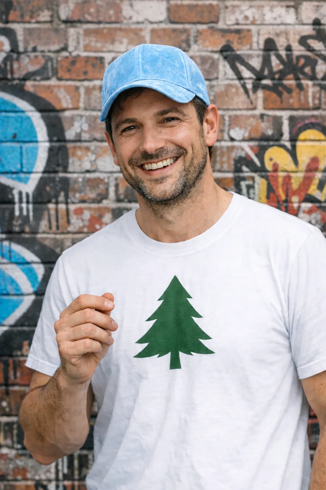

Source: [OpenAI: Remove an object](https://developers.openai.com/api/docs/guides/image-prompting?model=gpt-image-2.5#remove-an-object). Published example and recipe; our adaptation changes the intent.

**Recorded settings:** model not exposed by built-in tool; seed not exposed; quality not exposed.

[Underlying case record](evidence/expanded-experiments/guide-cases.json) · [Download result](evidence/expanded-experiments/edit-coverage/g16.png)

<a id="G17"></a>
### G17 · Carry the wardrobe into an action scene

**Insert a person into a scene · visual guide page 23**

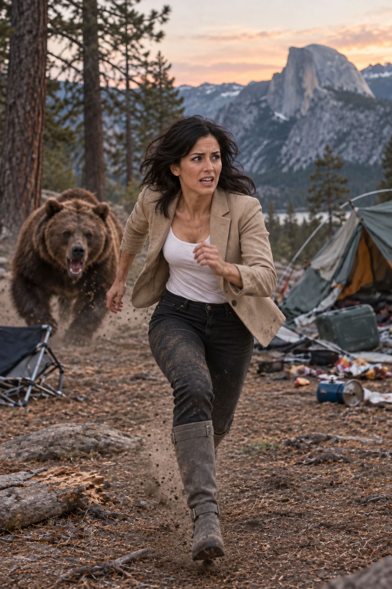

**Method:** Use the wardrobe output only for person and clothing, and the action image for scene, pose, scale and light. State that the existing runner is replaced, so the required person count remains one. Lock distinct campsite anchors.

**Observed result:** The woman and outfit integrate into the running action while bear, tent, case, chair, trees and mountain stay in the expected arrangement. Dust is heavier than requested, and fine textures redraw, but the main substitution succeeds.

**Reusable lesson:** A person reference and a scene reference should have distinct responsibilities; specify replacement versus addition explicitly.

**Limits / next move:** If garment cleanliness matters, reduce dust only in the named clothing regions. Do not regenerate a successful scene merely to make it different.

**Comparison:** The published scene is an input to our replacement edit. It cannot also function as an independent matched baseline.

**Generation inputs:**

- [input](evidence/expanded-experiments/edit-coverage/g12.png): person identity and clothing only; generated G12 result
- [input](evidence/expanded-experiments/official-references/scene-gpt-image-2-5-sunburst.webp): scene, existing runner pose, scale, camera, lighting

**Exact initial prompt:** [plain text](prompts/G17.txt)

```text
Image 1 supplies the person and clothing only: the dark-haired woman in beige blazer, white tank top, black jeans and gray knee-high boots. Image 2 is the exact scene, camera and action-pose reference: a runner escaping a bear through a mountain campsite. Replace image 2's existing runner with the woman from image 1 so there is still exactly one person. Do not add a second person and do not copy the museum background.

Preserve the referenced woman's facial structure, apparent age, dark hair and recognizable identity while giving her a natural alarmed expression. Preserve her beige blazer, white tank, black jeans and gray boots from image 1; add only plausible motion folds and a light amount of trail dust. Adapt her body to image 2's running pose, direction and scale, with one knee raised and arms moving naturally. Her face must remain visible and her footwear must meet the terrain plausibly.

Lock the rest of image 2: the pursuing brown bear on the left, damaged gray tent and green storage case on the right, overturned dark camp chair on the left, scattered gear, pine trunks, rocky leaf-strewn ground, distant granite mountain profile and warm evening sky. Match the existing scene's depth of field, perspective, muted natural colors, lighting and grounded contact shadows. Maintain the original portrait 2:3 framing. Keep the image photographically credible; no dramatic new explosions, extra wildlife, wounds, blood, text, logos or watermark.
```

**Published OpenAI reference:** Published GPT Image 2.5 Sunburst example. Separate from our result.

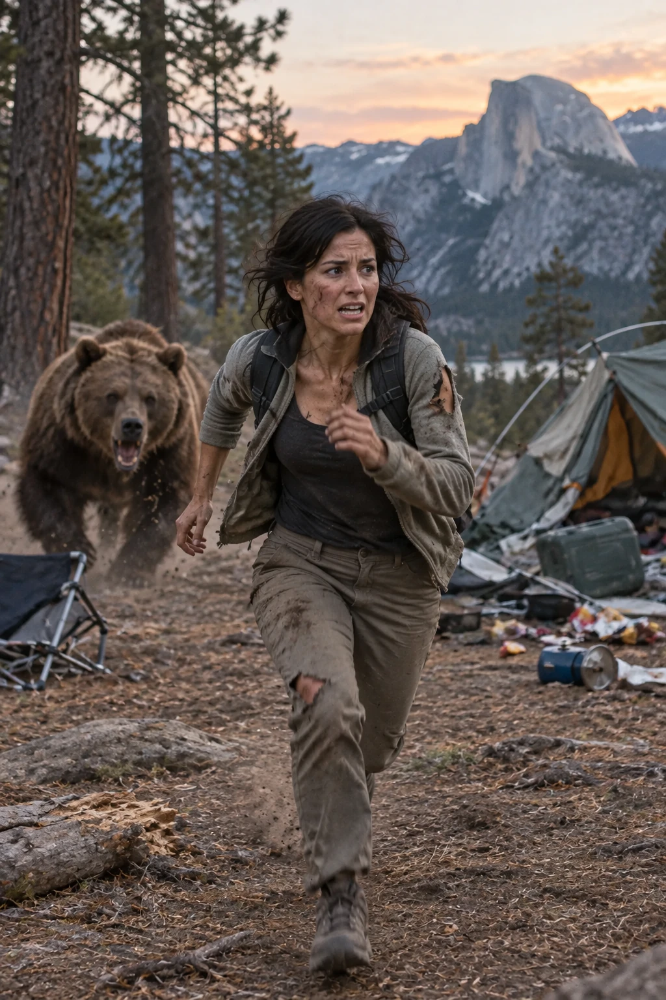

Source: [OpenAI: Insert a person into a scene](https://developers.openai.com/api/docs/guides/image-prompting?model=gpt-image-2.5#insert-a-person-into-a-scene). Published example and recipe; our adaptation changes the intent.

**Recorded settings:** model not exposed by built-in tool; seed not exposed; quality not exposed.

[Underlying case record](evidence/expanded-experiments/guide-cases.json) · [Download result](evidence/expanded-experiments/edit-coverage/g17.png)

<a id="G18"></a>
### G18 · A conservatory product campaign

**Create the starting image · visual guide page 24**


**Method:** Use the product reference for bottle shape, color and label spelling. Build the setting around a wet basalt pedestal, left ferns, right orchid and background glass arches. Keep the label clear and reserve a copy-free top quarter.

**Observed result:** The bottle, plants, reflections and warm atmospheric light form a coherent campaign. Label words survive, but typeface and fine bottle geometry are redrawn. The exact three-arch count is uncertain because glass ribs overlap and blur.

**Reusable lesson:** A product reference can anchor identity while the setting changes; readable label spelling is weaker than exact packaging preservation.

**Limits / next move:** If three arches are essential, give each arch a distinct mapped location. For brand production, compare actual letterforms and packaging geometry with the source.

**Comparison:** Intent changed to a miniature conservatory campaign. The comparison demonstrates a different setting and framing, not greater effectiveness for the same advertisement.

**Generation inputs:**

- [input](evidence/expanded-experiments/official-references/shampoo.webp): bottle identity and label

**Exact initial prompt:** [plain text](prompts/G18.txt)

```text
Create a polished landscape 3:2 photographic campaign image. Image 1 supplies the exact peach shampoo bottle: preserve its cylindrical proportions, cap, peach color and the visible label spelling. Place one bottle in the lower-middle on a wet dark basalt pedestal. Build an intricate miniature botanical conservatory around it: three tall glass arches in the background, broad fern fronds at image-left, a single pale orchid stem at image-right, and fine suspended water droplets. Late afternoon sunlight from upper-left passes through humid air; glass, droplets and polished basalt have coherent reflections. The bottle is the clear focal point and its front label faces the viewer. Keep every prop behind or beside the bottle rather than covering it. Reserve the top quarter as softly lit atmosphere without lettering. This is a fictional art-directed campaign, not a claim about ingredients. No added words, people, logos or second bottle. Preserve readable source label rather than inventing new brand copy.
```

**Published OpenAI reference:** Published GPT Image 2.5 Sunburst example. Separate from our result.

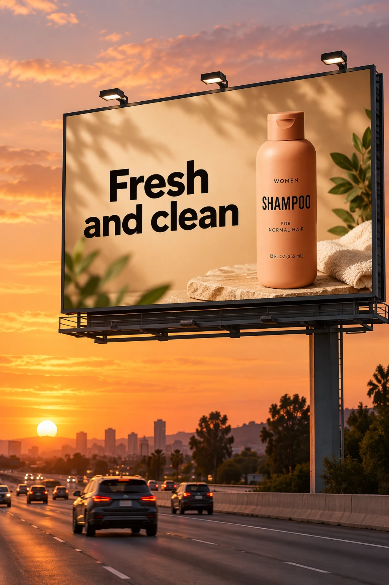

Source: [OpenAI: Create the starting image](https://developers.openai.com/api/docs/guides/image-prompting?model=gpt-image-2.5#create-the-starting-image). Published example and recipe; our adaptation changes the intent.

**Recorded settings:** model not exposed by built-in tool; seed not exposed; quality not exposed.

[Underlying case record](evidence/expanded-experiments/guide-cases.json) · [Download result](evidence/expanded-experiments/continuity/g18.png)

<a id="G19"></a>
### G19 · The same campaign in a rainstorm

**Change one condition · visual guide page 25**

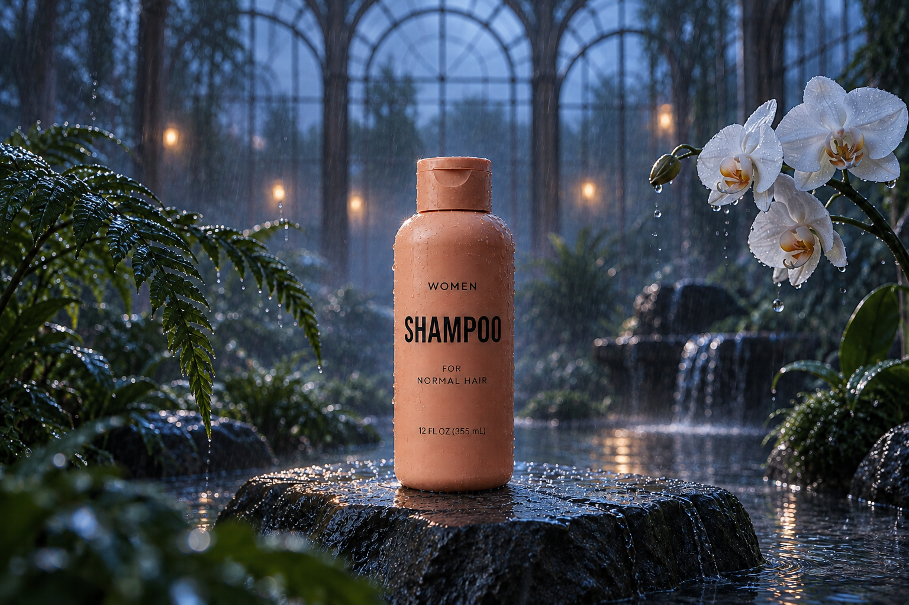

**Method:** Edit the accepted campaign with one environmental change. Keep bottle, label, crop, pedestal and plants fixed, while explicitly allowing the light, reflections and atmosphere to respond physically to rain and blue hour.

**Observed result:** The rainstorm and cool light read clearly, with bottle and major composition retained. New warm light points appear behind the bottle despite the no-extra-props intent. The inherited arch-count uncertainty remains.

**Reusable lesson:** A condition change propagates to lighting and materials. Specify permitted consequences and inspect for newly invented objects.

**Limits / next move:** Decide whether those lights are acceptable; otherwise map and remove only the added light sources, preserving the storm and bottle.

**Comparison:** This uses our campaign and a different weather target. Within our pair, the requested condition changes successfully with a collateral addition.

**Generation inputs:**

- [input](evidence/expanded-experiments/continuity/g18.png): accepted campaign edit target

**Exact initial prompt:** [plain text](prompts/G19.txt)

```text
Edit the supplied accepted campaign image. Change only the time and weather from late-afternoon sunlight to a blue-hour rainstorm: cool ambient sky, rain streaks and damp atmospheric haze. Preserve the bottle identity, exact label, cap, position and proportions; pedestal, three glass arches, ferns, orchid, camera, crop and overall composition. Allow physically necessary changes to light, reflections, wet highlights and atmosphere. Keep the label readable without adding a spotlight object. No extra plants, lettering, people or bottles. Return the same 3:2 framing.
```

**Published OpenAI reference:** Published GPT Image 2.5 Sunburst example. Separate from our result.


Source: [OpenAI: Change one condition](https://developers.openai.com/api/docs/guides/image-prompting?model=gpt-image-2.5#change-one-condition). Published example and recipe; our adaptation changes the intent.

**Recorded settings:** model not exposed by built-in tool; seed not exposed; quality not exposed.

[Underlying case record](evidence/expanded-experiments/guide-cases.json) · [Download result](evidence/expanded-experiments/continuity/g19.png)

<a id="G20"></a>
### G20 · Meet the Atlas Keeper

**Establish the character · visual guide page 26**


**Method:** Make character identity inspectable: round ivory head, two eye colors tied to image sides, one gold crescent, teal scarf and red satchel. Place that small character in a much larger floating library to create scale.

**Observed result:** All listed signature traits are visible, with one robot, coherent compass contact and a deep floating-library environment. No planned visible criterion fails. This is the starting identity image for later scenes and merchandise.

**Reusable lesson:** A recurring character needs a small set of visible anchors that can survive changes of scene and pose.

**Limits / next move:** Use this accepted output as the identity reference and list which traits must persist in each new view.

**Comparison:** Intent changed to an original ceramic robot and new world. The richer environment is a creative choice, not a controlled model comparison.

**Generation inputs:**

- The saved input record lists no reference image for the initial generation. Research sources below are separate from attached inputs.

**Exact initial prompt:** [plain text](prompts/G20.txt)

```text
Create a visually rich 3:2 landscape storybook diorama of an Atlas Keeper discovering a floating library at dawn. The Keeper is a small ivory ceramic robot, full body visible in the left foreground, with a round head, two circular eyes (amber on image-left, cyan on image-right), one tiny gold crescent on its forehead, short jointed arms and legs, a teal neckerchief and one red rectangular satchel at its right hip. One hand rests on an open brass compass. In the middle distance a vast circular library is built into a floating stone island: curved shelves, delicate brass bridges, hanging gardens, warm reading-room windows, and a tall central glass dome. A broad stone stair curves from the Keeper toward the library; an immense sea of clouds gives clear depth and scale. Use tactile stop-motion ceramic and paper materials with meticulous miniature details, warm ivory, copper, deep teal and small red accents. Warm sunlight enters from upper-left. Keep the Keeper's eyes, crescent and satchel easy to inspect. One robot only. No people, extra eyes, titles or written labels.
```

**Published OpenAI reference:** Published GPT Image 2.5 Sunburst example. Separate from our result.

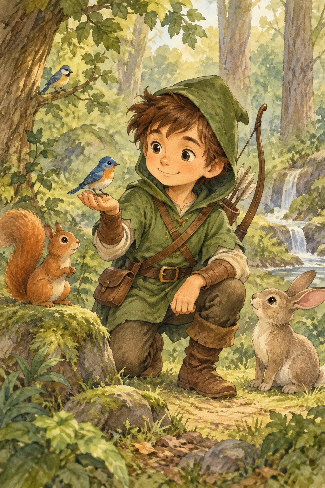

Source: [OpenAI: Establish the character](https://developers.openai.com/api/docs/guides/image-prompting?model=gpt-image-2.5#establish-the-character). Published example and recipe; our adaptation changes the intent.

**Recorded settings:** model not exposed by built-in tool; seed not exposed; quality not exposed.

[Underlying case record](evidence/expanded-experiments/guide-cases.json) · [Download result](evidence/expanded-experiments/continuity/g20.png)

<a id="G21"></a>
### G21 · The Keeper enters the observatory

**Continue the story · visual guide page 27**


**Method:** Carry only the Keeper identity into a new room. Retain colored eyes, crescent, scarf and satchel, then change pose, location and lighting. Specify both hand contact with the compass and the armillary sphere at image-left.

**Observed result:** The character anchors and new observatory work. The armillary sits on a pedestal even though the prompt requested suspension. The initial checklist omitted that relationship, so its passing checks did not cover the full brief.

**Reusable lesson:** Review the original brief alongside the checklist. An omitted requirement can make a score look better than the actual result.

**Limits / next move:** Add suspended versus supported to the checklist, then repair only the sphere support if suspension matters to the scene.

**Comparison:** Intent changed in character, setting and action. Our own continuity pair shows retained signature traits, not universal identity reliability.

**Generation inputs:**

- [input](evidence/expanded-experiments/continuity/g20.png): Keeper identity only

**Exact initial prompt:** [plain text](prompts/G21.txt)

```text
Use image 1 solely as the Atlas Keeper character reference. Continue the story in a new 3:2 landscape scene: the same small ivory ceramic robot now stands on the right side of a vast midnight observatory, holding its open brass compass in both hands while looking toward an enormous suspended brass armillary sphere at image-left. Preserve the same round head, exactly two round eyes (amber on image-left and cyan on image-right in the visible near-frontal face), one tiny gold forehead crescent, teal neckerchief, short jointed limbs and red rectangular satchel. Surround the observatory with intricate arched shelves, spiral stairs, blue glass star windows and fine brass measuring instruments. Moonlight enters from upper-left; warm lamps give restrained amber accents. Keep tactile ceramic and paper miniature craft, with great depth and readable silhouettes. The original library exterior and cloud sea should not be copied into this new room. Exactly one Keeper and one huge armillary sphere. No added words, people or extra eyes.
```

**Published OpenAI reference:** Published GPT Image 2.5 Sunburst example. Separate from our result.

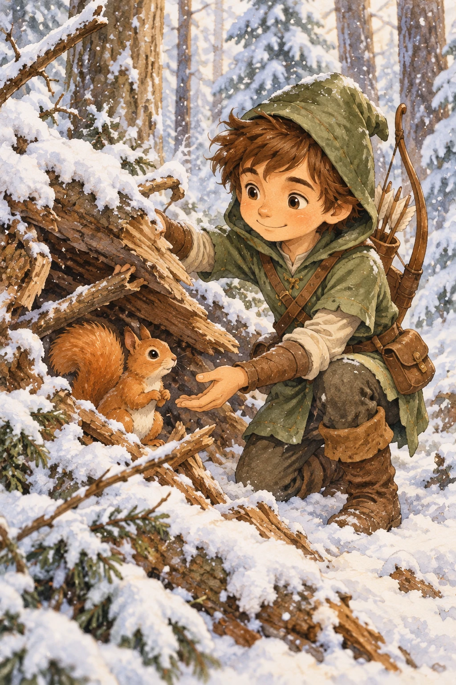

Source: [OpenAI: Continue the story](https://developers.openai.com/api/docs/guides/image-prompting?model=gpt-image-2.5#continue-the-story). Published example and recipe; our adaptation changes the intent.

**Recorded settings:** model not exposed by built-in tool; seed not exposed; quality not exposed.

[Underlying case record](evidence/expanded-experiments/guide-cases.json) · [Download result](evidence/expanded-experiments/continuity/g21.png)

<a id="G22"></a>
### G22 · Green upholstery and a copper pendant

**Change furniture in a room · visual guide page 28**


**Method:** Assign two independent edits to named objects: four chair seats become green while black legs stay black; pendant cage and chain become copper while geometry stays fixed. Compare one combined request with the same changes in two stages.

**Observed result:** The combined result and the final sequential result both achieve the materials and preserve the broad room. Both regenerate fine detail. The combined route uses one call; the sequential route uses two and redraws surfaces again.

**Reusable lesson:** One element at a time is a diagnostic strategy, not a universal rendering advantage. This single pair does not establish general reliability.

**Limits / next move:** Use a combined request when changes are independent and easy to verify. Split changes when dependencies or diagnosis make intermediate review valuable.

**Comparison:** The requested room changes differ from the published example. A separate local comparison tests bundled versus sequential execution on our own two-change goal.

**Generation inputs:**

- [input](evidence/expanded-experiments/official-references/kitchen.webp): kitchen edit target

**Exact initial prompt:** [plain text](prompts/G22.txt)

```text
Edit the supplied kitchen photo with two precisely scoped changes. First, recolor the upholstery of all four existing white dining chairs to deep forest green, retaining their exact shapes, stitched channels, positions and black legs. Second, change the black metal cage and chain of the hanging pendant lamp to brushed copper, retaining the lamp's exact geometry and hanging position. Preserve all other source content: four-chair count, circular glass table, striped vase and dried flowers, window frames and outdoor view, refrigerator, cabinetry, globe, countertop, plants, ceiling vent, floor, camera, crop and daylight. Allow local reflections and small color spill needed by the new materials. No other changes; same 4:3 image framing.
```

**Published OpenAI reference:** Published GPT Image 2.5 Sunburst example. Separate from our result.

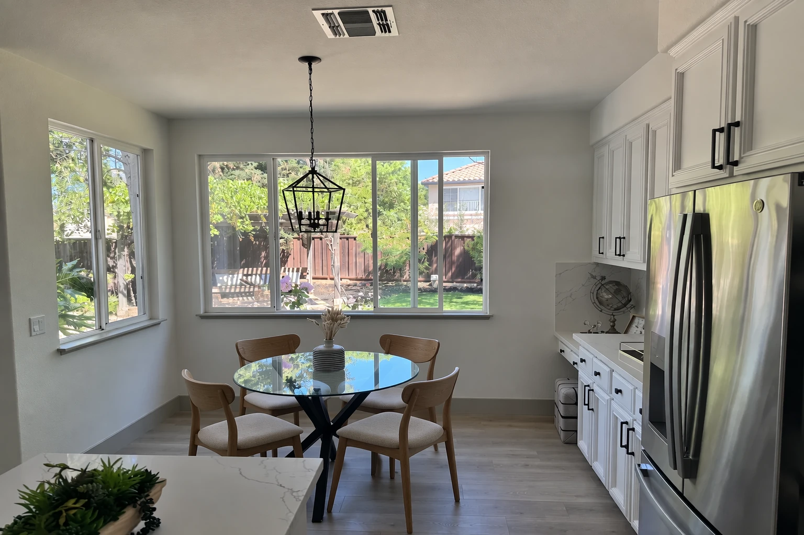

Source: [OpenAI: Change furniture in a room](https://developers.openai.com/api/docs/guides/image-prompting?model=gpt-image-2.5#change-furniture-in-a-room). Published example and recipe; our adaptation changes the intent.

**Recorded settings:** model not exposed by built-in tool; seed not exposed; quality not exposed.

[Underlying case record](evidence/expanded-experiments/guide-cases.json) · [Download result](evidence/expanded-experiments/continuity/g22.png)

<a id="G23"></a>
### G23 · Winter Atlas

**Design a holiday card · visual guide page 29**

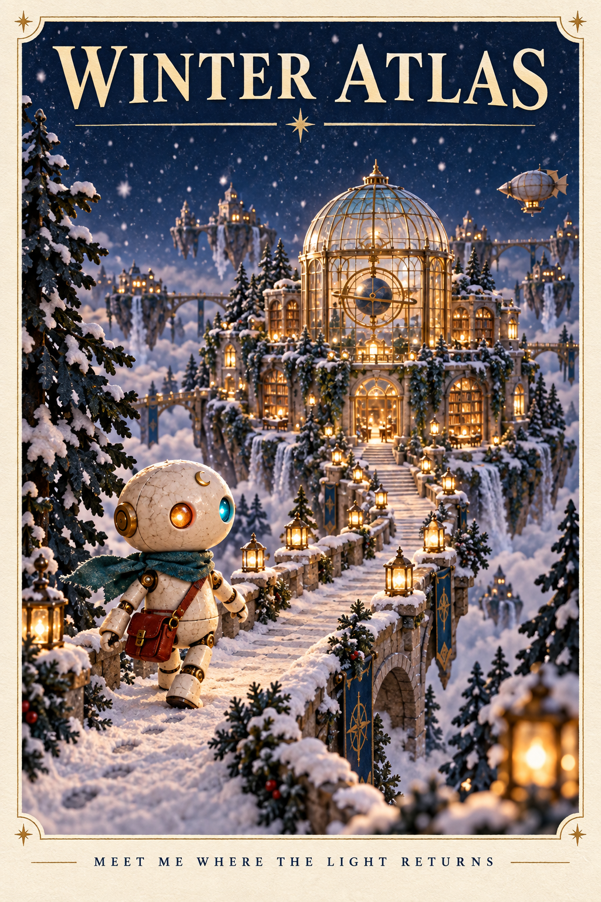

**Method:** Reuse the Keeper identity but create a new snow scene. Reserve a measured title region, provide exact heading and footer, and define snowy bridge, observatory, evergreens and cream outer margins as separate layers.

**Observed result:** WINTER ATLAS and the full footer are correct; signature character traits and layered scenery persist. The robot faces the viewer instead of clearly walking toward the observatory, so the intended action does not read.

**Reusable lesson:** Copy can succeed while narrative direction fails. Check where a body is headed, not simply whether the character is present.

**Limits / next move:** Specify a visible stride and body orientation toward the observatory, with the face turned enough to retain identifying eye details.

**Comparison:** Intent changed to a recurring original character and new greeting. This tests reuse with typography, not a matched greeting-card improvement.

**Generation inputs:**

- [input](evidence/expanded-experiments/continuity/g20.png): Keeper identity only

**Exact initial prompt:** [plain text](prompts/G23.txt)

```text
Create a finished portrait 2:3 winter greeting card using image 1 as the Atlas Keeper character identity reference only. Show the same ivory ceramic robot, two colored round eyes, forehead gold crescent, teal scarf and red satchel walking on a snowy stone bridge toward an illuminated glass observatory. Layer intricate dark evergreen silhouettes, drifting snow and a navy twilight sky; warm gold light glows from tiny windows. Use beautifully detailed cut-paper and ceramic miniature illustration with an elegant cream outer paper margin. Reserve the upper 18 percent for the exact heading "WINTER ATLAS" in large refined serif lettering. Below the illustrated scene, typeset exactly "MEET ME WHERE THE LIGHT RETURNS" in small widely spaced uppercase. Those are the only two text strings. One robot, no human figures, no religious symbols. Keep all letters readable, the robot inside the frame, and the source face/outfit recognizable.
```

**Published OpenAI reference:** Published GPT Image 2.5 Sunburst example. Separate from our result.


Source: [OpenAI: Design a holiday card](https://developers.openai.com/api/docs/guides/image-prompting?model=gpt-image-2.5#design-a-holiday-card). Published example and recipe; our adaptation changes the intent.

**Recorded settings:** model not exposed by built-in tool; seed not exposed; quality not exposed.

[Underlying case record](evidence/expanded-experiments/guide-cases.json) · [Download result](evidence/expanded-experiments/continuity/g23.png)

<a id="G24"></a>
### G24 · Atlas Keeper — Field Edition

**Design collectible merchandise · visual guide page 30**

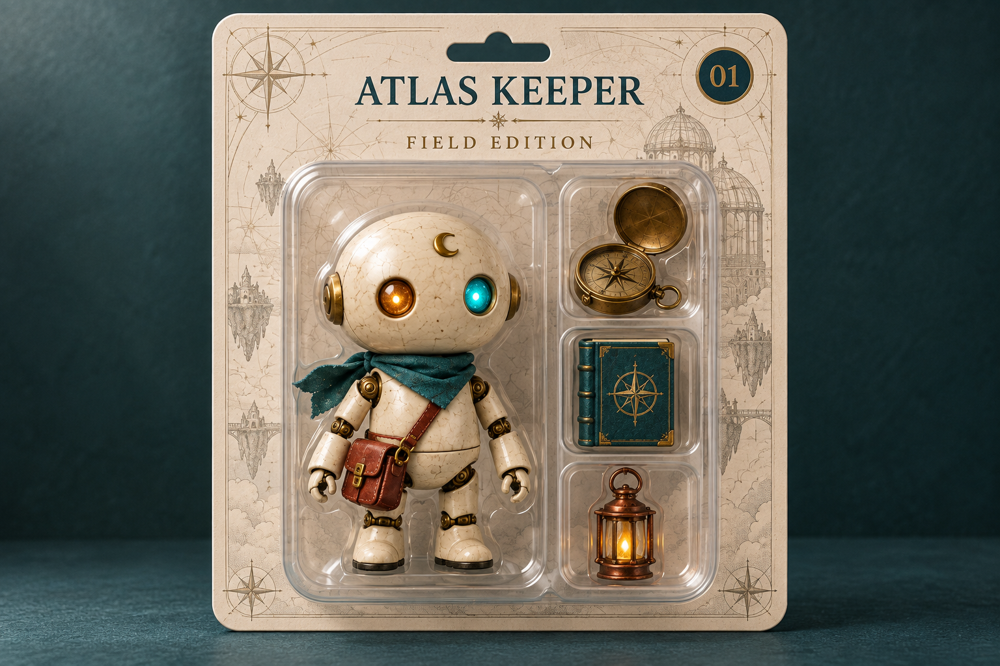

**Method:** Use the identity image for the toy alone. Map the figure to the left compartment and exactly three accessories to separate right compartments. List the three allowed text strings and define plastic, paper and studio light.

**Observed result:** The character traits, three accessory compartments, compass, book, lantern and main copy are all present. Tiny compass markings may contain extra letters, so the strict no-other-text requirement remains uncertain.

**Reusable lesson:** A reference can become a different material and product format while recognizable traits persist; microtext remains part of the text audit.

**Limits / next move:** For exact packaging copy, inspect tiny instrument faces as well as the card. Replace ambiguous compass lettering with unlettered ticks if needed.

**Comparison:** Intent changed to our character, accessory inventory and package design. It demonstrates format transfer, not superiority over a different collectible.

**Generation inputs:**

- [input](evidence/expanded-experiments/continuity/g20.png): Keeper identity only

**Exact initial prompt:** [plain text](prompts/G24.txt)

```text
Create a high-end 3:2 landscape studio photograph of a collectible Atlas Keeper toy in a clear molded blister on an off-white illustrated backing card. Image 1 controls the toy character only: ivory ceramic round head, amber image-left eye and cyan image-right eye, one gold forehead crescent, teal neckerchief, short jointed limbs and red rectangular satchel. The figure stands in the left compartment. Three separate accessory compartments stacked at right contain exactly one brass compass, one closed teal book and one tiny copper lantern. Printed heading on the card: "ATLAS KEEPER". Small subtitle: "FIELD EDITION". A single circular badge says "01". No other text. Include a finely drawn faint observatory pattern on the backing without extra letters. Use precise product photography, subtle clear-plastic reflections, paper texture and soft upper-left studio light on a dark teal tabletop. Entire package fully visible, no hands or extra toys. Preserve the character's signature details; do not reproduce the reference environment.
```

**Published OpenAI reference:** Published GPT Image 2.5 Sunburst example. Separate from our result.

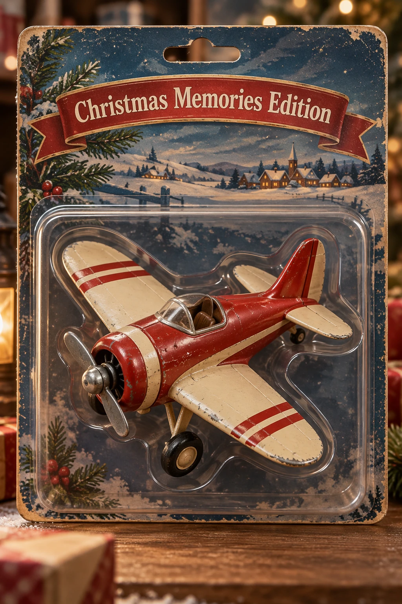

Source: [OpenAI: Design collectible merchandise](https://developers.openai.com/api/docs/guides/image-prompting?model=gpt-image-2.5#design-collectible-merchandise). Published example and recipe; our adaptation changes the intent.

**Recorded settings:** model not exposed by built-in tool; seed not exposed; quality not exposed.

[Underlying case record](evidence/expanded-experiments/guide-cases.json) · [Download result](evidence/expanded-experiments/continuity/g24.png)

<a id="P01"></a>
### P01 · SABLE · editorial commerce

**Fashion app · visual guide page 31**


**Method:** Generated + targeted repair

**Observed result:** Three aligned screens, readable inventory and prices, consistent bag design and deliberate photo hierarchy. Repair correctly selects All and activates Shop on the collection screen; Discover stays active on the home screen.

**Reusable lesson:** Define screen roles and exact copy, then inspect selected states as well as visual polish.

**Limits / next move:** Raster interface concept. No interaction or contrast/accessibility audit. Fine pixels may be redrawn in the repair.

**Initial candidate before repair:** [open full image](evidence/premium-examples/images/01-fashion-app-v1.png). The selected image above is the repaired result.


**Generation inputs:**

- The saved input record lists no reference image for the initial generation. Research sources below are separate from attached inputs.

**Exact initial prompt:** [plain text](prompts/P01.txt)

```text
Create a pristine high-resolution editorial presentation of a fictional luxury fashion shopping app named SABLE. The result is one landscape 3:2 image showing exactly three complete, straight-on mobile app screens side by side on a very pale warm-gray background. All screens have identical portrait proportions, matched baselines, narrow charcoal device frames and subtle believable contact shadows. No tilted devices, perspective distortion, external captions, watermarks or design-tool chrome.

Visual direction: art-directed fashion commerce, crisp Swiss typography mixed with one refined editorial serif headline, near-white surfaces, ink-black text, restrained oxblood accents. Large high-quality fashion photography, disciplined grid, generous internal breathing room, fine dividers, consistent outline icons. It should look like a carefully finished real shopping interface.

LEFT SCREEN, discovery: a small status bar, SABLE wordmark with search and bag icons. A large full-bleed editorial photograph of an adult woman wearing a beautifully tailored charcoal wool coat, white shirt and dark trousers, standing against a pale concrete studio wall. Realistic fabric weight, natural skin, calm confident pose. Overlay the small eyebrow "THE AUTUMN EDIT" and large elegant headline "A quieter statement." in an uncluttered part of the photograph. Beneath, a white section titled "Selected for you" with two tidy product thumbnails. Bottom navigation has four consistent icons with small labels "Discover", "Shop", "Saved", "Profile".

MIDDLE SCREEN, collection: same status and brand header, title "The essentials", two tabs "Clothing" and "Accessories", filter icon. A spacious two-column grid of four separate catalog photos: a charcoal wool coat, an ivory cashmere knit, an oxblood curved leather shoulder bag, black leather loafers. Neutral backgrounds, realistic seams and materials. Short labels and prices: "Wool coat" "$890"; "Cashmere knit" "$320"; "Arc bag" "$480"; "Leather loafers" "$390". Consistent small heart icons, same bottom navigation.

RIGHT SCREEN, product: back and heart icons, large meticulous product photograph of the exact same oxblood curved shoulder bag, with one physically continuous strap, precise dark edge paint, subtle leather grain and small brushed-metal clasp. Below: "Arc shoulder bag", "$480", "Oxblood", three small color swatches with oxblood selected, one quiet line "Soft leather. Everyday form." and a full-width deep-oxblood button "Add to bag". White bottom safe area.

Render all specified words cleanly and legibly. Interfaces must have coherent information hierarchy, equal padding, touch-sized controls and consistent spacing. Make the bag design match between middle and right screens. No gibberish microcopy or extra badges. The premium quality comes from typography, photography, material fidelity and restraint.
```

**Exact repair prompt:** [plain text](prompts/P01-repair.txt)

```text
Edit this SABLE app presentation with only two functional UI corrections on the MIDDLE screen. Preserve the three-device composition, all photography, product designs, prices, type style, screen sizes, colors, and every other element.
1. In the category row under "The essentials", show three labels "All", "Clothing", "Accessories" with "All" selected by the thin oxblood underline. Keep the filter icon at the right. This grid includes both clothes and accessories, so All must be the active category.
2. In that middle screen's bottom navigation, make "Shop" the active oxblood icon and label. Make "Discover" the same unselected charcoal outline treatment as the other inactive icons. The LEFT screen must continue to have Discover active.
Do not change anything on the left or right screen. No new text, no other design changes.
```

Repair input: [accepted source candidate](evidence/premium-examples/images/01-fashion-app-v1.png).

Source: [Wavespace fashion commerce presentation](https://www.behance.net/gallery/229351021/ECommerce-Website-Mobile-App-OffWhite-Fashion?locale=en_US). Observed editorial photo hierarchy and modular commerce; no source pixels attached.

**Recorded settings:** model not exposed; seed not exposed; quality not exposed.

[Underlying case record](evidence/premium-examples/collection.json) · [Download result](evidence/premium-examples/images/01-fashion-app.png)

<a id="P02"></a>
### P02 · offday — Boutique travel booking

**App mockup · visual guide page 32**


**Method:** Original generation

**Observed result:** Selected first pass; no repair needed. At 1536×1024, all three upright screens are aligned and readable. Lume House, 19–22 Sep and two guests remain consistent. €285 × 3 nights = €855; with €45 taxes the displayed total is €900. The courtyard, suite doorway and review thumbnail share plausible property identity. Primary actions are distinct and unclipped. No obvious invented text or hand/geometry artifact was visible.

**Reusable lesson:** Write each screen’s purpose and carry property identity, dates and arithmetic through the sequence.

**Limits / next move:** Raster concept only; controls, navigation, responsive behavior and accessibility are not implemented or tested. Three selected screens omit the room-selection step; this is not a complete interaction specification. Dates omit the year. The hotel, room, photography, amenities and prices are fictional. Photographs were generated, not sourced from the reference. One chosen prompt and one generation are evidence of this result, not evidence that this prompting method outperforms a baseline. Built-in tool did not expose a model identifier or seed.

**Generation inputs:**

- The saved input record lists no reference image for the initial generation. Research sources below are separate from attached inputs.

**Exact initial prompt:** [plain text](prompts/P02.txt)

```text
Use case: ui-mockup.
Create one exceptional, production-plausible mobile travel booking app presentation for a fictional boutique-stay brand named offday. This is an original high-fidelity raster design concept, not a website to implement. The audience cares about thoughtful architecture, clear booking decisions, and a calm experience.

COMPOSITION
A wide 3:2 image. Show exactly three equally sized, upright, front-facing mobile screen canvases side by side, fully visible, perfectly aligned top and bottom with generous equal gutters. Each screen approximately 390 by 844 logical pixels. Thin warm-gray edge and barely perceptible shadow, no phone hardware, no notch, no perspective. Quiet stone-gray presentation background. The app interiors are warm ivory with almost-black green text and dark forest-green primary buttons. Disciplined 24-pixel internal margins and spacing rhythm; refined high-contrast serif headings, highly readable clean sans-serif controls, understated consistent line icons. No decorative background words, labels, screen numbers or explanatory arrows outside the screens. Make the typography legible and the photographic content unusually beautiful.

SCREEN 1 — DISCOVERY
Small elegant lowercase wordmark “offday” at top left; a simple saved-heart icon at top right. Large two-line editorial heading “A slower way
to get away.” Beneath it, one outlined search field with a small search icon and exact text “Portugal · 19–22 Sep · 2 guests”. A compact tab row “All stays”, “Coast”, “Countryside”, with only All stays selected by a thin underline. One dominant property card: a large, expertly composed editorial photograph of a secluded Portuguese courtyard hotel. Chalky off-white walls, an old olive tree, pale limestone, a long clear turquoise pool, two linen-covered loungers, blue sky, subtle late-afternoon shadows. Authentic tactile materials and straight architectural geometry; no people. The photograph has square corners or a restrained 4-pixel radius. Below: title “Lume House”, small location “Alentejo, Portugal”, and “€285 / night”. At the very bottom a simple three-item navigation bar with icons and labels “Explore”, “Saved”, “Trips”; Explore active. No star ratings, promotional badges, discount claims or repetitive extra cards.

SCREEN 2 — PROPERTY
Top toolbar: back chevron, centered “Lume House”, save-heart outline. A generous photograph of a beautiful ground-floor suite in the SAME fictional property: limestone floor, pale plaster walls, oak joinery, linen bed, large doorway opening onto the same olive courtyard and pool. Daylight, realistic photographic detail, relaxed but immaculate. Below the photo, small uppercase “ALENTEJO, PORTUGAL”, then large serif “Lume House”. A short real description: “Slow mornings. Space to unwind.” One restrained row of useful amenities in sans-serif: “Pool   Breakfast   Free parking”. A bordered two-column stay selector: “19–22 Sep” and “2 guests”. At the foot, a fixed ivory booking bar: left “From €285” with “per night” beneath; right a strong forest-green button “Choose room”. No bottom navigation on this detail screen. All controls fit without clipped text.

SCREEN 3 — REVIEW
Back chevron and small centered “Your booking” at top. Large serif heading “Review your stay”. A small rectangular photo of the same courtyard paired with “Lume House” and “Garden Suite”. A clear ruled information section: label “Dates”, value “19–22 Sep”; label “Guests”, value “2 adults”. A roomy aligned price table: “€285 × 3 nights” opposite “€855”; “Taxes and fees” opposite “€45”; then a fine divider and bold “Total” opposite “€900”. Accurate arithmetic matters. At the bottom, a full-width forest-green button “Continue to payment” followed by the understated line “You won’t be charged yet.” This is a review step, not a payment form or booking confirmation. Preserve whitespace instead of inventing more copy.

QUALITY PRIORITIES
Photographic art direction, a coherent three-step flow, useful controls, consistent dates/property/prices, readable exact copy, immaculate alignment and strong type hierarchy. Show authentic UI surfaces, not a moodboard. Use only the specified copy plus simple icons. Avoid tiny filler text, illegible invented words, excessive rounded cards, floating bubble decorations, generic gradients, ornamental badges, visual noise, fisheye, angled devices, and impossible architecture. Three polished screens, with photography and typography doing the work.
```

Source: [Welcome Beyond — design-led boutique hotels and holiday homes](https://www.welcomebeyond.com/). 

Source: [Norm Architects — 262 Fifth Avenue](https://normcph.com/project/262-fifth-avenue-2/). 

**Recorded settings:** model not exposed; seed not exposed; quality not exposed.

[Underlying case record](evidence/premium-examples/collection.json) · [Download result](evidence/premium-examples/digital/travel-app-v1.png)

<a id="P03"></a>
### P03 · FORMAE — Architecture and hospitality studio

**Website mockup · visual guide page 33**

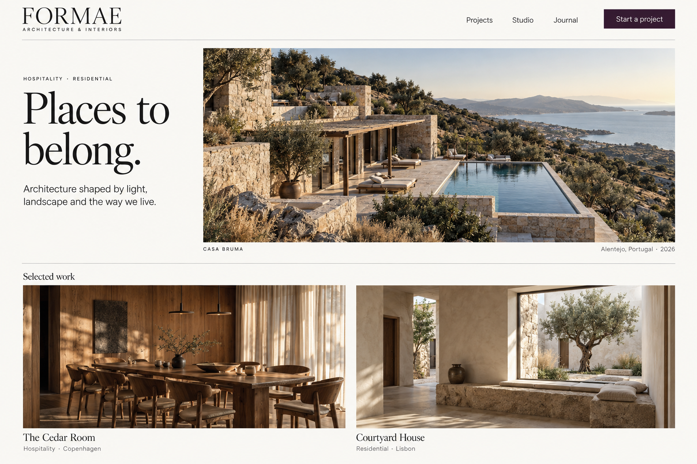

**Method:** Original generation

**Observed result:** Selected first pass; no repair needed. At 1536×1024, the wordmark, navigation, headline, captions and Start a project action are readable. One dark CTA provides the main action. The large hillside/pool photograph dominates, followed by two distinct smaller interior projects. Whitespace, rules and edges create a coherent editorial grid. No clipped copy or obvious impossible architectural structure was visible. The lower two teasers rendered almost equal in width, whereas the prompt asked for a slightly unequal split; this minor deviation does not weaken the design enough to justify regeneration.

**Reusable lesson:** Define a reading order: navigation, headline, hero image, then supporting projects.

**Limits / next move:** Raster concept only; links, interactions, semantic structure, responsive layouts and accessibility are not implemented or tested. Architecture, studio and projects are fictional; visual plausibility does not establish construction feasibility or geographic accuracy. The generated image approximates the requested layout; it is not a deterministic 12-column design file. One chosen prompt and one generation do not establish a prompting-method advantage. Built-in tool did not expose a model identifier or seed.

**Generation inputs:**

- The saved input record lists no reference image for the initial generation. Research sources below are separate from attached inputs.

**Exact initial prompt:** [plain text](prompts/P03.txt)

```text
Use case: ui-mockup.
Create an exceptional original editorial architecture-studio desktop homepage as one high-fidelity raster website mockup. Fictional studio name “FORMAE”. It designs distinctive small hotels and residences. The desired result should look like the quiet, precise work of an experienced digital art director, with outstanding architectural photography and real, useful interface copy.

CANVAS AND GRID
A crisp front-facing desktop web page at roughly 1440 pixels wide, wide landscape 3:2 composition. The website fills the entire image; no device, browser chrome, perspective, board background, wireframe or surrounding decoration. Warm near-white background, near-black ink, restrained dark aubergine accent only for the primary action. A disciplined 12-column editorial grid with 64-pixel outer margins, generous whitespace, consistent baselines and hairline dividers. Large expressive but readable serif typography paired with compact sober sans-serif navigation and captions. Slightly asymmetrical layout, never messy. Rectangular photography, no floating card system or gradients.

HEADER
At upper left a custom, beautifully typeset serif wordmark “FORMAE” with small uppercase descriptor “ARCHITECTURE & INTERIORS” beneath it. Upper-right navigation, with ample separation: “Projects”, “Studio”, “Journal”. At far right one solid dark aubergine button, the single visually dominant call to action, exact text “Start a project”. Header is about 110 pixels tall with a fine rule beneath. Keep every text character readable.

HERO
Below the header, a small uppercase eyebrow “HOSPITALITY · RESIDENTIAL”. A huge, finely typeset serif headline at the left spanning two lines: “Places to
belong.” It takes about four grid columns. Below it a short two-line sans-serif statement: “Architecture shaped by light,
landscape and the way we live.” Do not add more paragraphs.
To the right, occupying eight columns and most of the hero height, a truly extraordinary original architectural photograph: a terraced boutique hotel on a rugged Mediterranean hillside, photographed from a human-scale elevated vantage in warm late-afternoon light. Broad sculptural limestone volumes, deep recessed glazed openings, a slender weathered timber pergola, a long still pool aligned with the stone terraces, sparse silver-green olive trees, dry grasses, distant pale blue coast. Rich tactile stone and delicate shadows. Restrained contemporary architecture, physically coherent stairs and rails, architecturally credible proportions, absolutely no fantasy structures or CGI sheen. The sunlit stone and blue water create a memorable image without oversaturation. The photograph has clean verticals and is printed sharply like a world-class architecture editorial.
Under the hero photo a fine understated caption row: left “CASA BRUMA”, right “Alentejo, Portugal · 2026”. The fictional project name and location must remain readable. Do not overlay words on the architecture.

LOWER PAGE
A full-width horizontal hairline, then a small “Selected work” section label at the left. Below it exactly two project teasers on the same grid, one slightly larger than the other. The left photograph: an intimate timber-lined dining room with sculptural oak chairs, linen curtains and warm side light, caption “The Cedar Room” with secondary “Hospitality · Copenhagen”. The right photograph: a serene chalky-plaster residence with a deep window, pale stone bench and a single olive tree visible outside, caption “Courtyard House” with secondary “Residential · Lisbon”. These smaller images should have distinct architectural subjects, not repeat the hero. The bottom edge can end naturally after their captions. Secondary project titles are quiet text links, not competing filled buttons. Let the image hierarchy remain unmistakable: hero first, then selected work.

FINISH
This is a credible functioning-site design concept, not an architecture poster. All navigation, captions, margins and type must look deliberate. No invented awards, star ratings, testimonials, numbers, logos, dashboards, contact forms, excessive text, decorative squiggles or unrelated UI. Preserve enough whitespace for luxury and enough photographic specificity for character. Achieve the wow factor through exquisite composition, coherent architecture, warm material detail and confident typography.
```

Source: [Norm Architects — 262 Fifth Avenue](https://normcph.com/project/262-fifth-avenue-2/). 

**Recorded settings:** model not exposed; seed not exposed; quality not exposed.

[Underlying case record](evidence/premium-examples/collection.json) · [Download result](evidence/premium-examples/digital/studio-website-v1.png)

<a id="P04"></a>
### P04 · VELLUM · No. 04

**Luxury product photo · visual guide page 34**

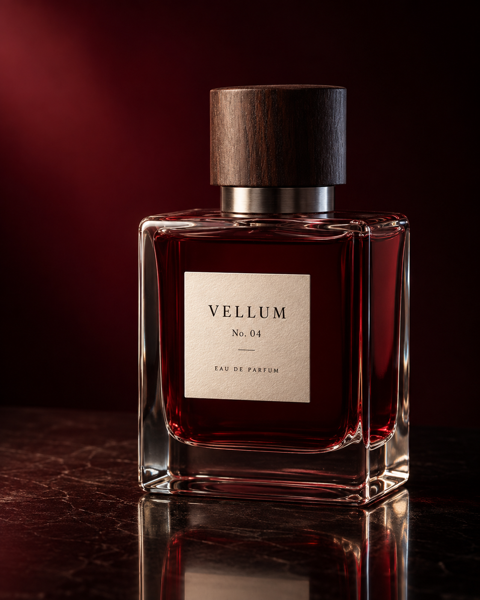

**Method:** Original generation

**Observed result:** Exact three-line label, one coherent bottle, readable paper texture, wood grain, brushed collar and thick glass. Reflection and exposure are convincing.

**Reusable lesson:** Specify the behavior of each material under light, and give the product a clear silhouette.

**Limits / next move:** Cap is taller and surface more veined than the initial direction. This is a product concept, not a measured reproduction.

**Generation inputs:**

- The saved input record lists no reference image for the initial generation. Research sources below are separate from attached inputs.

**Exact initial prompt:** [plain text](prompts/P04.txt)

```text
Create one pristine luxury fragrance campaign photograph, portrait 4:5, highest visual fidelity. This is a fictional product concept with the only label text "VELLUM", "No. 04", and "EAU DE PARFUM". Typography must be small but perfectly crisp, elegantly spaced and integrated into the physical bottle.

Scene: a single heavy clear-glass rectangular perfume bottle filled with deep garnet liquid, resting on one low polished black stone plane. The bottle has softly radiused corners, a thick transparent base, one precise brushed-palladium collar, and a low cylindrical dark-walnut cap with fine real wood grain. Its silhouette is architectural and refined. Put a small warm-white cotton-paper label on the front with the specified three text lines in charcoal; leave generous space around the lettering. No invented tiny text.

Composition: close three-quarter product view at bottle shoulder height, the entire bottle and cap visible, bottle occupying about two thirds of the image height, placed slightly right of center. Generous deep burgundy negative space around it. A subtle reflected bottle base on the stone, physically consistent with the view; no second bottle.

Lighting: large clean rectangular key light on image-left, a narrow cool edge highlight on the right, rich controlled shadows with visible detail. Show true glass thickness, refraction through the red liquid, a fine soft caustic on the surface, crisp paper fibers at close view, brushed metal rather than chrome glare, polished edges without halos. The background graduates quietly from wine red into nearly black. Restrained, sensual, beautifully exposed commercial still life, with immaculate retouching that preserves real material texture.

No flowers, smoke, splashes, floating objects, decorative gold props, generic sparkle, water droplets, or external headline. No copying a real perfume brand. Product geometry, label hierarchy and quality of light carry the entire image. Render a finished photographic image, not a mood board.
```

Source: [Byredo Absolu campaign](https://www.byredo.com/ca_en/absolu-de-parfum-campaign). Observed reflected light and contrast among glass, liquid and textured caps; original fictional product.

**Recorded settings:** model not exposed; seed not exposed; quality not exposed.

[Underlying case record](evidence/premium-examples/collection.json) · [Download result](evidence/premium-examples/images/02-luxury-product.png)

<a id="P05"></a>
### P05 · MORA · a morning routine

**UGC · visual guide page 35**

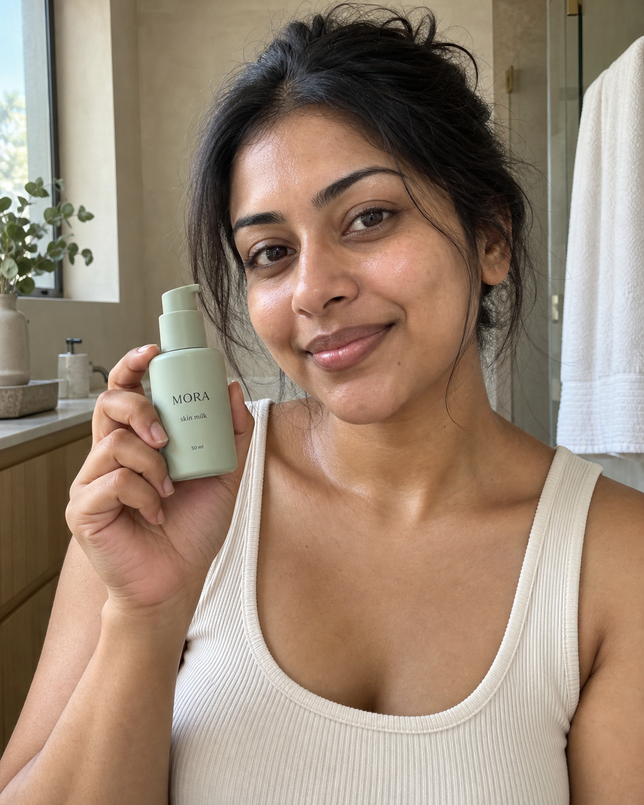

**Method:** Original generation

**Observed result:** Natural-looking skin, flyaways, relaxed expression, plausible hand contact and clear product lettering. Keeps a phone-camera feel.

**Reusable lesson:** Use everyday framing and material texture; preserve imperfections that make UGC credible.

**Limits / next move:** A plant and a soap dispenser were added in the background. Synthetic demonstration, not a real customer testimonial.

**Generation inputs:**

- The saved input record lists no reference image for the initial generation. Research sources below are separate from attached inputs.

**Exact initial prompt:** [plain text](prompts/P05.txt)

```text
Create one exceptionally convincing UGC skincare still for a fictional premium brand, portrait 4:5. It must feel like a well-shot frame from a creator's morning routine on a modern phone: immediate, intimate, naturally lit and authentic, with clear product visibility. No ad headline, testimonial, statistics, before-and-after claim, social-media interface or watermark.

An adult South Asian woman in her late twenties, medium warm-brown skin, dark brown eyes and loosely tied black hair with a few natural flyaways, wears a simple ivory ribbed sleeveless top. Upper chest through full head in frame. She stands in a tasteful lived-in bathroom with warm plaster, light oak and a softly blurred folded white towel. She looks into the camera with a small relaxed smile. The camera is at eye level, as if a phone is resting on a shelf; no phone visible, no mirror reflection.

She holds one small pale-sage pump bottle comfortably beside her cheek, slightly lower than her chin so her face remains visible. The hand wraps naturally around the bottle with anatomically plausible fingers and nails, preserving a clear front-facing label. Her other arm rests naturally out of the bottom crop. The bottle has a matte pale-sage body, one simple matching pump, and exact charcoal printed text in three lines: "MORA", "skin milk", "50 ml". No other product or lettering.

Soft morning window light from image-left, a gentle highlight across her cheek, visible pores, fine peach fuzz, slight natural asymmetry and believable skin tones. Skin looks cared for with a subtle moisture sheen, never plastic or excessively glossy. Maintain credible phone photography: moderate depth of field, enough background detail to feel real, natural contrast, no cinema grading, no artificial bloom, no perfect studio spotlight. Focus sharp on eyes and product. The scene is tidy and premium through light, color and good taste, while retaining human warmth and everyday authenticity.
```

Source: [Rhode glazing milk photography](https://www.rhodeskin.com/products/glazing-milk). Observed close skin texture and intimate camera language; original synthetic person and product.

**Recorded settings:** model not exposed; seed not exposed; quality not exposed.

[Underlying case record](evidence/premium-examples/collection.json) · [Download result](evidence/premium-examples/images/03-ugc-skincare.png)

<a id="P06"></a>
### P06 · MORA · from everyday to studio

**Headshot · visual guide page 36**


**Method:** Reference transformation

**Observed result:** The generated UGC subject remains recognizable after changing clothing, background and lighting. Natural skin detail, clear eyes, navy tailoring and a quiet blue-gray background give the portrait a coherent professional finish.

**Reusable lesson:** Attach the source portrait. Separate the identity to preserve from the wardrobe, setting and lighting to change.

**Limits / next move:** This is the same fictional character by visual judgment, not a measured identity-preservation result. Fine facial and hair details can change during generation.

**Generation inputs:**

- [input](evidence/premium-examples/images/03-ugc-skincare.png): See exact prompt for assigned role.

**Exact initial prompt:** [plain text](prompts/P06.txt)

```text
Use the attached synthetic UGC portrait as the identity reference for one premium professional headshot of the SAME adult woman. Preserve her recognisable face, warm-brown skin tone, dark eyes, nose, lips, cheek shape and natural asymmetry. Do not replace her with a generic model, change her age or lighten her skin.

Create a finished editorial founder portrait, portrait 4:5. Frame from upper chest to above the full head, with relaxed square shoulders turned very slightly and the face looking directly into the lens. A composed, approachable closed-mouth smile. Her hair is neatly tied back with a few natural strands. Replace the casual top with a beautifully fitted midnight-navy wool blazer over a plain ivory crew-neck shirt. No jewelry beyond tiny simple studs. Hands and skincare bottle are outside this headshot and not present.

Studio backdrop is a seamless muted blue-gray with a very subtle tonal falloff. Broad soft daylight-style key from image-left, gentle fill, natural eye catchlights, a restrained separation light on the hair. Photorealistic skin with visible pores, realistic hair strands, fine wool texture, clean eyes and no beauty-filter plastic skin. Deep but open shadows, accurate warm skin tone against cool background, exact focus on the eyes. An excellent professional photographer's carefully retouched portrait, no added text, logos, interface, props or watermark. Preserve identity while changing wardrobe, framing, background and lighting.
```

**Recorded settings:** model not exposed; seed not exposed; quality not exposed.

[Underlying case record](evidence/premium-examples/collection.json) · [Download result](evidence/premium-examples/images/04-headshot.png)

<a id="P07"></a>
### P07 · Coast House · a living room

**Interior design · visual guide page 37**

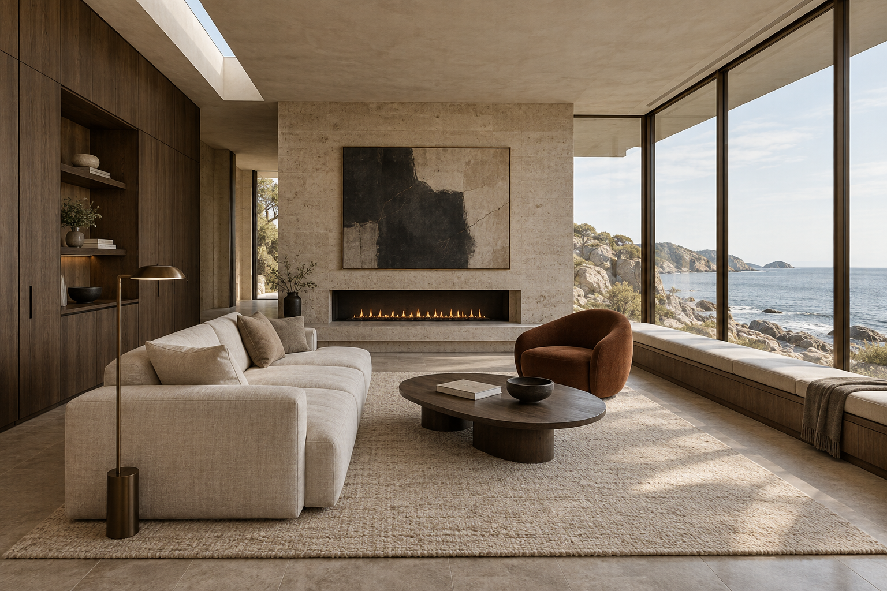

**Method:** Original generation

**Observed result:** The joinery, fireplace, window seat and glazing create a legible room. Wool, oak, limestone and upholstery have distinct texture; the coast and the room share a coherent light direction.

**Reusable lesson:** Describe the room as connected planes, openings and furniture relationships before specifying materials.

**Limits / next move:** The sofa faces the central seating group more than the fireplace specified in the brief. Small plants, a vase and a throw were added. This is a spatial concept, not a construction design.

**Generation inputs:**

- The saved input record lists no reference image for the initial generation. Research sources below are separate from attached inputs.

**Exact initial prompt:** [plain text](prompts/P07.txt)

```text
Create a pristine editorial interior photograph of an original, fictional coastal residence, landscape 3:2, high resolution. It should feel like a beautifully art-directed architecture-magazine photograph with believable construction and tactile expensive materials.

The room is one generous rectangular living pavilion. Camera at seated eye height near the front-left corner, looking diagonally toward the back-right glazing. Straight verticals, natural wide architectural view without fisheye stretching. The right wall is floor-to-ceiling glass in slender dark-bronze frames, overlooking a calm blue-gray sea and rocky shore. A long low window seat follows the glass. Soft daylight comes from these windows.

The back wall is pale warm limestone with a precise long horizontal fireplace recess and a single large abstract charcoal artwork above it. On the left, full-height smoked-oak joinery contains a small, carefully arranged open shelf area. The ceiling is softly textured plaster with one clean narrow skylight parallel to the left wall; no spotlights or floating beams.

The central seating group has one low ivory-linen modular sofa facing the fireplace, one sculptural rust-brown wool lounge chair at the right end, and one low oval dark-wood coffee table. Show believable contact and scale. A large undyed wool rug anchors all three. On the table, one closed art book and one low dark ceramic bowl, no decorative clutter. A slim bronze floor lamp stands beside the sofa on image-left. Clear circulation remains between the seating and the window seat.

Materials are the point: visible linen weave, soft wool pile, exact timber joins and grain, subtle stone pores, real glazing reflections, a thin daylight reflection on bronze. Warm but neutral white balance, gently luminous sea view with detail rather than a blown-out white rectangle. Natural shadow gradients, no amber CGI wash, no exaggerated sunbeams, no over-sharpened HDR, no trendy arch repeated everywhere, no people, no text or watermark. Richness comes from proportion, light, depth and material quality.
```

Source: [Norm Architects — 262 Fifth Avenue](https://normcph.com/project/262-fifth-avenue-2/). Observed the relationship among timber, stone, soft upholstery and window light. The coastal room is an original fictional design.

**Recorded settings:** model not exposed; seed not exposed; quality not exposed.

[Underlying case record](evidence/premium-examples/collection.json) · [Download result](evidence/premium-examples/images/05-interior.png)

<a id="P08"></a>
### P08 · Coast House · drawn study

**Sketch · visual guide page 38**

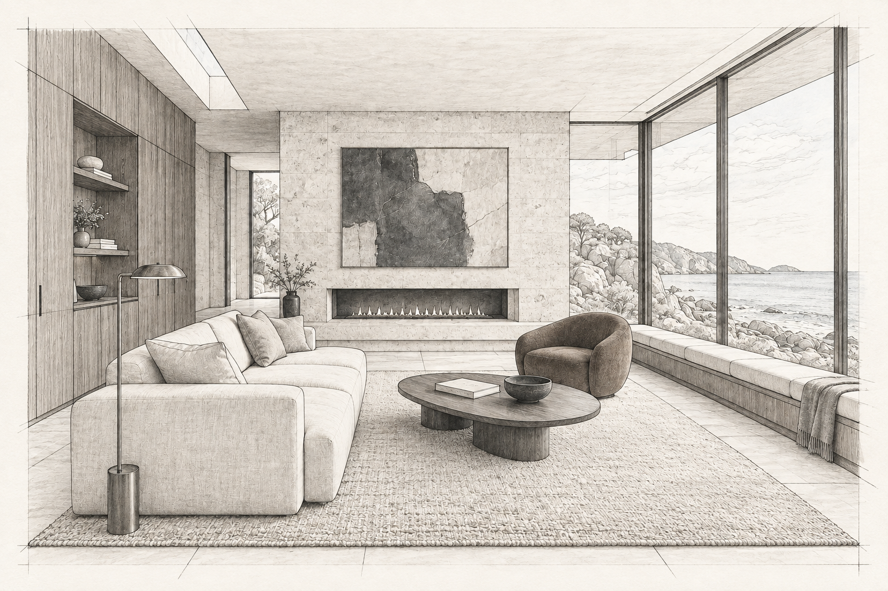

**Method:** Reference transformation

**Observed result:** The viewpoint, fireplace, artwork, sofa, chair, table and window seat carry through from the generated interior. Fine contours, visible construction lines and material hatching produce a coherent architectural presentation.

**Reusable lesson:** Lock viewpoint, object count and major positions; change the representation rather than rewriting the scene.

**Limits / next move:** The result is more densely shaded and detailed than the requested selective wash. It demonstrates image-to-sketch restyling; it is not a test of ChatGPT’s manual sketch-input interface.

**Generation inputs:**

- [input](evidence/premium-examples/images/05-interior.png): See exact prompt for assigned role.

**Exact initial prompt:** [plain text](prompts/P08.txt)

```text
Transform the attached original coastal-residence interior into a meticulous architect's presentation sketch of the SAME ROOM from the SAME VIEWPOINT. Create one landscape 3:2 drawing on clean warm-white paper, filling the canvas with generous outer margins.

Preserve the room's large geometry and perspective: smoked-oak joinery on the left, one narrow left ceiling skylight, central back fireplace and rectangular artwork, full-height glazing on the right with the rocky coast beyond, low window seat, ivory sofa in the left foreground, rust lounge chair at the right, central oval table, rug and left floor lamp. Keep the exact object count and major positions. Do not invent another room, doors, additional furniture or people.

Render with very fine graphite and architectural ink contours, confident varied line weights, sparing cool-gray watercolor wash, subtle hatching for wood and wool, soft pencil indications of stone grain, and delicate coastal outlines through the glass. Strongest lines describe foreground cut edges and contact; distant coast and glazing are light. Let meaningful construction lines remain faintly visible, but keep the sheet beautifully disciplined and legible. Use no photographic color, no distressed paper texture, no random scribbles, no decorative title, no dimension strings, no labels, no pencil lying on the drawing and no watermark. This is a premium professional concept drawing with accurate perspective and selective material detail.
```

Source: [Norm Architects — 262 Fifth Avenue](https://normcph.com/project/262-fifth-avenue-2/). Observed the relationship among timber, stone, soft upholstery and window light. The coastal room is an original fictional design.

**Recorded settings:** model not exposed; seed not exposed; quality not exposed.

[Underlying case record](evidence/premium-examples/collection.json) · [Download result](evidence/premium-examples/images/06-sketch.png)

<a id="P09"></a>
### P09 · Coast House · inside the pavilion

**Cross-section · visual guide page 39**

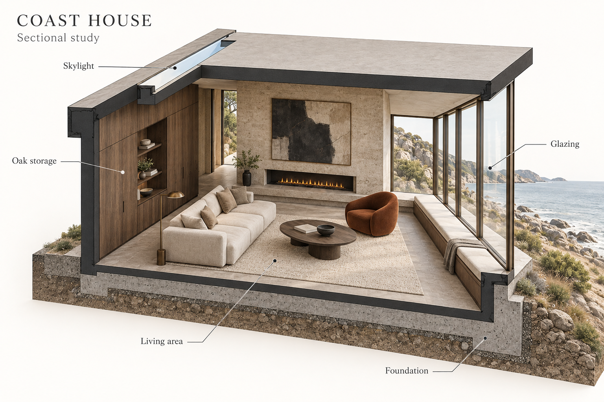

**Method:** Reference transformation

**Observed result:** The cutaway makes the room legible while retaining its main furniture and materials. All five labels are readable; their leaders connect to the skylight, oak storage, living area, glazing and foundation.

**Reusable lesson:** Use the reference for visible design. Explicitly label newly invented hidden geometry and define where each annotation must land.

**Limits / next move:** The photograph cannot reveal hidden construction. Roof, wall thicknesses and foundations were invented for this conceptual section; the image does not establish structural feasibility.

**Generation inputs:**

- [input](evidence/premium-examples/images/05-interior.png): See exact prompt for assigned role.

**Exact initial prompt:** [plain text](prompts/P09.txt)

```text
Use the attached fictional coastal living room as a VISUAL DESIGN REFERENCE to create a premium architectural cross-section illustration of that pavilion, landscape 3:2. This is an original conceptual spatial study: hidden construction is newly designed, not claimed to be recovered from the photograph.

Render a clean sectional axonometric architectural model on pure warm-white, seen from an elevated front-right position. One rectangular, single-storey pavilion, no extra floors. Remove the front wall and the front half of the roof with a clean vertical cutting plane so the interior is revealed. Give all cut wall, floor and remaining roof faces a crisp dark-charcoal poche edge. Keep the roof physically attached to the remaining back and left walls; do not explode or float parts. Show the narrow skylight in the remaining roof strip on the left. The right-side glazing and low window seat remain transparent and visible.

Translate the photograph's design faithfully: left smoked-oak storage wall, back limestone fireplace and dark rectangular artwork, sofa along the left facing the central oval table, one rust-brown chair on the right, pale rug, tall glazing to the right. Place the slim lamp beside the sofa. Materials have elegant soft 3D shading with fine model-making precision: warm stone, natural timber, translucent glass, ivory upholstery and one rust accent. A slim earth-and-foundation slice under the floor grounds the building. A small suggestion of coastal terrain outside the right glazing, kept faint and secondary.

Put a discreet heading "COAST HOUSE" at upper left and "Sectional study" below. Exactly five thin leader lines outside the model connect cleanly to these five correct parts: "Skylight" to the roof opening, "Oak storage" to the left joinery, "Living area" to the central furniture group, "Glazing" to the right glass wall, "Foundation" to the lower base. Keep every label readable and outside the structure. No dimension claims, engineering certification, extra labels, tiny pseudo-text, people, scattered fragments, ornamental arrows or watermark. The result should look like a polished architectural monograph plate: visually sophisticated, spatially readable, precise hierarchy.
```

Source: [Norm Architects — 262 Fifth Avenue](https://normcph.com/project/262-fifth-avenue-2/). Observed the relationship among timber, stone, soft upholstery and window light. The coastal room is an original fictional design.

**Recorded settings:** model not exposed; seed not exposed; quality not exposed.

[Underlying case record](evidence/premium-examples/collection.json) · [Download result](evidence/premium-examples/images/07-cross-section.png)

<a id="P10"></a>
### P10 · OFFDAY · sparkling tea

**Packaging · visual guide page 40**

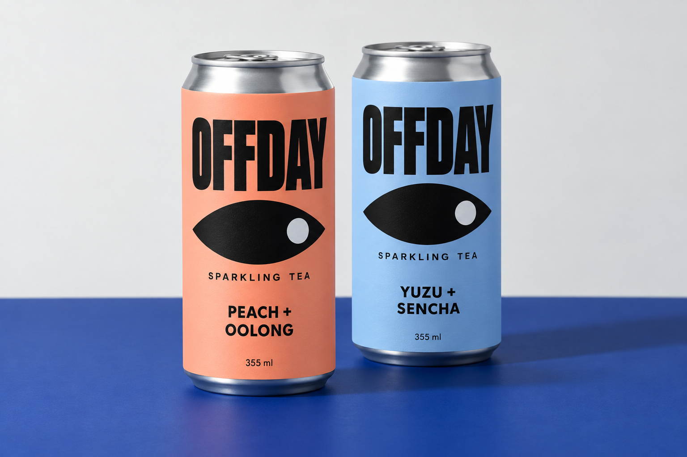

**Method:** Original generation

**Observed result:** Two coordinated cans have distinct coral and powder-blue flavor labels. Wordmarks, flavor names and 355 ml marks are readable. Aluminum rims, paper labels and shadows have distinct material behavior.

**Reusable lesson:** Define the shared identity once, then specify exactly what changes between product variants.

**Limits / next move:** A visual packaging concept. It does not include a dieline, ingredient panel or a print-ready label file.

**Generation inputs:**

- The saved input record lists no reference image for the initial generation. Research sources below are separate from attached inputs.

**Input-record discrepancy:** The saved initial-input list is empty, although the prompt mentions an attached design reference. Reference conditioning for this call is not verified. Attach your intended reference or remove that sentence when reusing the prompt.

**Exact initial prompt:** [plain text](prompts/P10.txt)

```text
Create one premium commercial packaging photograph for OFFDAY, an entirely fictional sparkling tea brand. Landscape 3:2 composition. Use the attached designer reference only to understand bold typographic hierarchy, one graphic per label, and convincing printed labels on real metal. Invent the brand, artwork, colors and composition described below; do not copy the reference's name, lettering shapes, illustration, or product.

Show exactly two immaculate 355 ml aluminum beverage cans, identical straight cylindrical proportions, both fully visible, standing on the same deep ultramarine tabletop against a clean very light gray seamless studio wall. The left can is slightly forward and the right can is set back by a quarter of its diameter; a small clear gap separates them so both front labels are fully readable. Eye-level product camera, slight top visibility, long-lens commercial still life, generous whitespace. One large upper-left daylight source gives crisp but naturally softened shadows toward the right. Real brushed silver rims, correct elliptical tops and tiny pull tabs, fine matte printed ink; dry cans without water droplets or dents.

The left can has a solid pale persimmon/coral wrap. The right can has a solid powder-blue wrap. Both have exactly the same label grid: OFFDAY in exceptionally confident heavy condensed black uppercase sans-serif across the upper front, generous margins; beneath it one large original black horizontal almond-shaped emblem with one round white cutout near its right tip; below the emblem a neat small black line SPARKLING TEA. Then each flavor in two short centered lines, and a tiny 355 ml at the bottom. Left flavor text: PEACH + on the first line, OOLONG on the second. Right flavor text: YUZU + on the first line, SENCHA on the second. Keep all printed text optically aligned and exactly spelled. Print no other copy.

The image should feel like a sharply art-directed independent beverage campaign: bold color, impeccable geometry, carefully balanced asymmetry, tactile print, accurate specular edge highlights and no visual clutter. No fruit props, floating objects, gradients on the labels, splash effects, pedestal blocks, decorative pseudo-text, barcodes, badges, logos from existing brands, watermarks, or page borders. Deliver the finished photograph only.
```

Source: [Pentagram — EBBS](https://www.pentagram.com/work/ebbs/story). Observed large type, restrained color and a consistent identity across cylindrical packaging. Our OFFDAY concept uses different names, colors and artwork.

**Recorded settings:** model not exposed; seed not exposed; quality not exposed.

[Underlying case record](evidence/premium-examples/collection.json) · [Download result](evidence/premium-examples/brand/packaging.png)

<a id="P11"></a>
### P11 · OFFDAY · good tea, zero plans

**Advertisement · visual guide page 41**

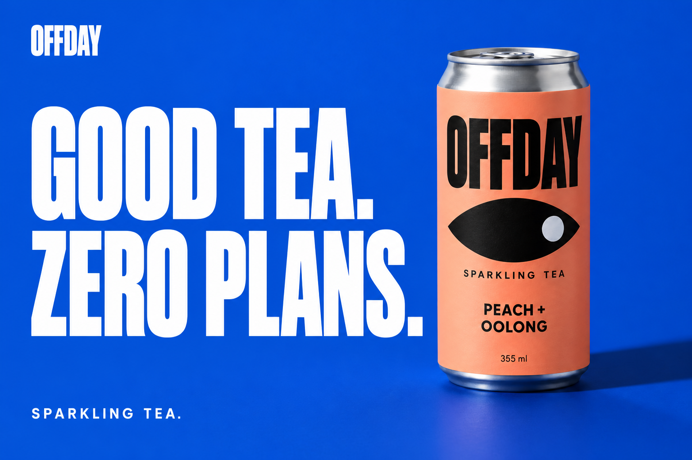

**Method:** Reference transformation

**Observed result:** The coral can retains its wordmark, emblem, flavor and volume. The large two-line headline is exact and does not overlap the product. Blue, white and coral create a coherent campaign image.

**Reusable lesson:** Attach the product reference, reserve a separate copy zone and list the label details to preserve.

**Limits / next move:** The can was redrawn from the reference rather than composited pixel for pixel. Tiny label geometry and finish can change. No advertising performance was tested.

**Generation inputs:**

- [input](evidence/premium-examples/brand/packaging.png): See exact prompt for assigned role.

**Exact initial prompt:** [plain text](prompts/P11.txt)

```text
Design a premium finished advertising image for OFFDAY, a fictional sparkling tea brand. Landscape 3:2. The attached OFFDAY packaging photograph is the exact product identity reference: use only its coral PEACH + OOLONG can, preserving its cylindrical shape, silver rims, condensed black OFFDAY wordmark, almond-and-circle emblem, label layout and all product copy. Do not include the blue can. The advertisement should have the clarity and confidence of a contemporary independent design studio campaign.

A seamless saturated ultramarine blue field fills the entire canvas. Left 55 percent: large pure-white condensed sans-serif headline, flush left on two lines, exactly GOOD TEA. on line one and ZERO PLANS. on line two. Give the headline exceptional optical spacing, strong line rhythm, and ample blue margin around it. A smaller white OFFDAY wordmark sits at the upper left. At the lower left place a single understated white line reading SPARKLING TEA. No other advertising copy.

Right 45 percent: one coral OFFDAY can, vertical and fully visible, large enough to dominate this half, standing on the blue surface with a believable contact shadow. The front label faces camera, the can is tack-sharp, and the silver top has a controlled clean highlight. Retain exact label text OFFDAY, SPARKLING TEA, PEACH +, OOLONG and 355 ml. Real matte printed packaging, no water droplets. A firm upper-left studio light creates one elegant long shadow to the lower right, while blue fill subtly reflects in the silver rim. The headline and can do not overlap. Every edge is intentional; color contrast is bold, typography is immaculate, whitespace generous, and the composition remains balanced at thumbnail size.

No fruit, leaves, splash, smoke, fake glow, lens flare, podium, extra cans, random seals, starbursts, claims about health, endorsements, invented awards, barcodes, tiny filler copy, watermark or frame. Deliver a finished flat advertising composition combining real product photography and crisp typesetting, not a photograph of a billboard or a mockup board.
```

Source: [Pentagram — EBBS](https://www.pentagram.com/work/ebbs/story). Observed large type, restrained color and a consistent identity across cylindrical packaging. Our OFFDAY concept uses different names, colors and artwork.

**Recorded settings:** model not exposed; seed not exposed; quality not exposed.

[Underlying case record](evidence/premium-examples/collection.json) · [Download result](evidence/premium-examples/brand/advertisement.png)

<a id="P12"></a>
### P12 · OFFDAY · wear the identity

**Merch · visual guide page 42**

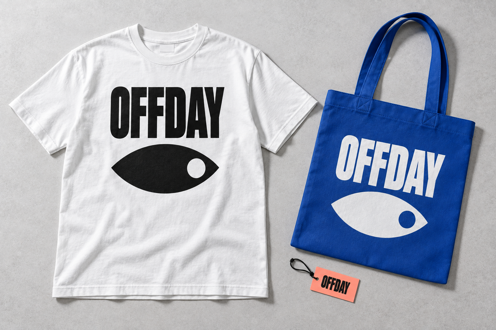

**Method:** Reference transformation

**Observed result:** The white tee, blue tote and coral tag form one clear flat lay. The wordmark and eye-shaped emblem carry across with appropriate black or white ink. Knit, canvas, seams and print have convincing texture.

**Reusable lesson:** Transfer the identity while specifying the physical surfaces, ink colors and exact item count.

**Limits / next move:** The logo proportions are approximate across curved and folded material. These are mockups; no garment pattern or production artwork is included.

**Generation inputs:**

- [input](evidence/premium-examples/brand/packaging.png): See exact prompt for assigned role.

**Exact initial prompt:** [plain text](prompts/P12.txt)

```text
Create a premium studio campaign photograph of two pieces of merchandise for the fictional sparkling tea brand OFFDAY. Landscape 3:2. Use the attached OFFDAY can image as the exact visual identity source only: preserve its condensed black OFFDAY wordmark and its black almond-shaped emblem with one white circular cutout near the right tip. Transfer those two graphic assets to fabric; do not include cans or beverage packaging.

Show exactly one heavyweight clean white cotton T-shirt and one cobalt-blue cotton-canvas tote in a carefully composed overhead flat lay. The T-shirt lies fully open on the left, torso flat, sleeves naturally relaxed, neck ribbing and double-needle hems visible. Its chest carries the black OFFDAY wordmark with the same almond emblem beneath, printed as a simple, large, balanced graphic. No other print on the T-shirt. The cobalt tote lies on the right at a subtle clockwise angle, with both long handles arranged into neat arcs above it; it carries the same wordmark and emblem in white screen print, with the emblem's small circular hole showing the cobalt fabric. Exactly two tote handles, attached correctly. Keep the garments separate, with a deliberate strip of tabletop between them. Both objects completely inside the frame.

The tabletop is flat pale cool gray, quietly textured. The only extra object is a small coral rectangular uncoated hangtag lying below the tote; it has a punched hole with a short black cotton string and exact black text OFFDAY. No scissors, branches, hands, pins, hangers or styling clutter. One wide daylight source from upper left, soft directional shadows that reveal weight and weave. Visible close cotton knit, slightly heavier canvas weave, crisp ink sunk into fabric, restrained natural folds only at sleeves, handles and bag edges. The shirt and tote graphics must remain clean and undistorted, not plastic decals. A confident independent fashion-art-direction feel, precise proportions, strong white/black/cobalt/coral palette, impeccable spacing. No mockup-board labels, duplicate garments, faux texture overlays, gradients, decorative typography or watermarks. Deliver only the finished photographic image.
```

Source: [Pentagram — EBBS](https://www.pentagram.com/work/ebbs/story). Observed large type, restrained color and a consistent identity across cylindrical packaging. Our OFFDAY concept uses different names, colors and artwork.

**Recorded settings:** model not exposed; seed not exposed; quality not exposed.

[Underlying case record](evidence/premium-examples/collection.json) · [Download result](evidence/premium-examples/brand/merch.png)

<a id="P13"></a>
### P13 · OFFDAY · the core mark

**Logo · visual guide page 43**

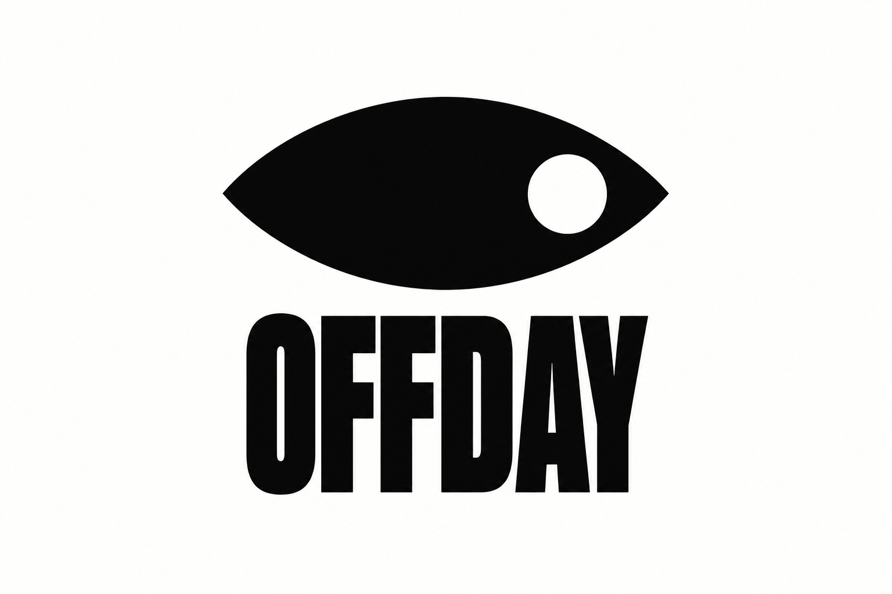

**Method:** Reference transformation

**Observed result:** The mark is isolated into a clear vertical lockup: one black almond shape with a circular negative-space opening above the condensed wordmark. The composition is legible without supporting imagery.

**Reusable lesson:** Ask to extract the identity from the reference and remove the product context.

**Limits / next move:** A raster identity concept, not a vector master or a trademark-clearance result. Fine contours, kerning and the background retain small raster variations.

**Generation inputs:**

- [input](evidence/premium-examples/brand/packaging.png): See exact prompt for assigned role.

**Exact initial prompt:** [plain text](prompts/P13.txt)

```text
Using the attached OFFDAY packaging photograph as the identity source, create one pristine flat logo artwork for this fictional sparkling tea brand. This is a raster concept of a brand mark, not a photo or mockup. Landscape 3:2, a perfectly uniform warm-white background, no texture or shadow.

Extract and carefully redraw the identity as one centered vertical lockup. The upper symbol is the same simple black horizontal almond shape from the cans, with one circular negative-space hole near its right end. Smooth symmetrical upper and lower outer contours, sharp balanced tips, the white circular hole fully enclosed by black, strong optical balance. Below it, set the exact word "OFFDAY" in bold, tall, tightly spaced condensed sans-serif capitals, matching the can's recognisable wordmark. The wordmark is slightly narrower than the symbol; give it a measured generous gap below the symbol. The whole lockup occupies roughly half the canvas width with broad equal surrounding margins.

Use exactly solid black and the background color. No faux ink grain, gradients, bevel, highlights, soft edges, extra outlines, lettering variations, small tagline, trademark symbol, registration mark, label border, can, stationery or other object. Render sharp clean contours and carefully spaced letterforms. Keep the complete symbol and all six letters inside the image.
```

Source: [Pentagram — EBBS](https://www.pentagram.com/work/ebbs/story). Observed large type, restrained color and a consistent identity across cylindrical packaging. Our OFFDAY concept uses different names, colors and artwork.

**Recorded settings:** model not exposed; seed not exposed; quality not exposed.

[Underlying case record](evidence/premium-examples/collection.json) · [Download result](evidence/premium-examples/brand/logo.png)

<a id="P14"></a>
### P14 · Listening room · six pictograms

**Icons · visual guide page 44**

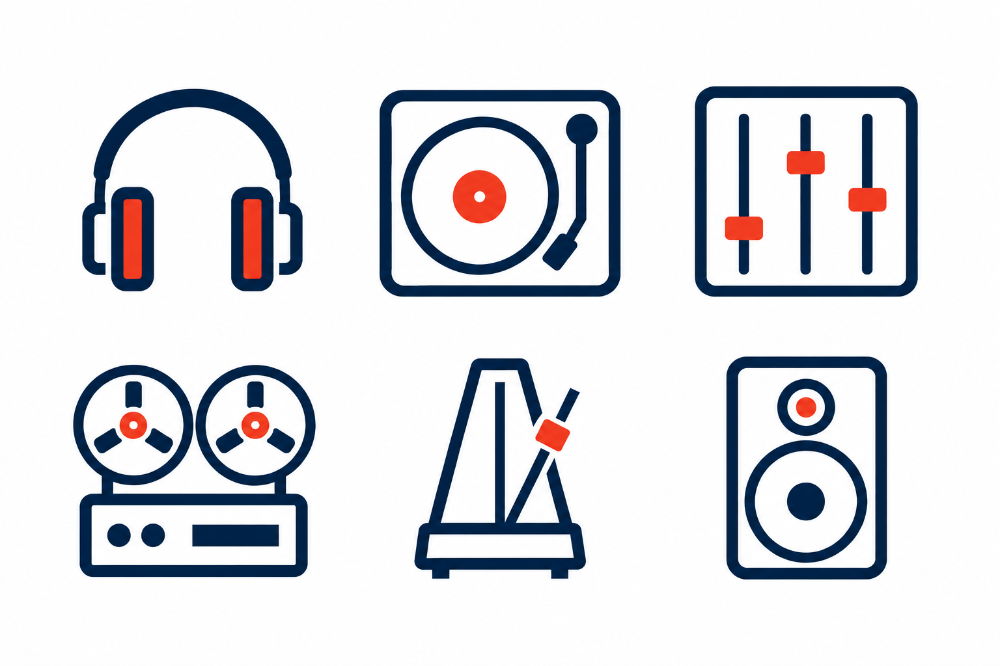

**Method:** Generated + targeted repair

**Observed result:** All six requested symbols are recognizable in a three-by-two arrangement: headphones, turntable, mixer, reel deck, metronome and speaker. The targeted cleanup reduced surface noise while retaining the composition and red accents.

**Reusable lesson:** Name every symbol, set a shared geometric language and inspect the whole family rather than one icon alone.

**Limits / next move:** Cleanup was only partial: faint mottling remains in the navy and red. Stroke weight and optical size are not perfectly uniform. Treat this as a family direction; rebuild approved symbols as vectors for a production icon library.

**Initial candidate before repair:** [open full image](evidence/premium-examples/brand/icons-original.png). The selected image above is the repaired result.


**Generation inputs:**

- The saved input record lists no reference image for the initial generation. Research sources below are separate from attached inputs.

**Input-record discrepancy:** The saved initial-input list is empty, although the prompt mentions an attached design reference. Reference conditioning for this call is not verified. Attach your intended reference or remove that sentence when reusing the prompt.

**Exact initial prompt:** [plain text](prompts/P14.txt)

```text
Create an original premium pictogram family for a fictional independent sound-design studio. A pristine 3:2 landscape design sheet, pure white background, exactly six icons in a precisely spaced 3-column by 2-row grid. No text, labels, frames or visible construction grid. Use the attached reference only for the discipline of consistent line weight, clean exterior corners and simple geometry. Do not reuse its house symbol.

The six original icons, in reading order, are:
1. Over-ear headphones, symmetric curved headband, two substantial ear cushions, one short connector on each side.
2. A turntable viewed from directly above: rounded rectangular plinth, one large circular record, one small center spindle, one straight tonearm with a bent cartridge.
3. A compact mixer viewed straight on: exactly three vertical tracks, each with one sliding fader at a different height.
4. A reel-to-reel tape machine viewed straight on: two equal circular reels above one rectangular body, each reel has exactly three simple spoke cutouts.
5. A mechanical metronome viewed straight on: symmetric tapered outline, one diagonal pendulum and one small square sliding weight.
6. A bookshelf speaker viewed straight on: vertical rounded rectangle, one small tweeter over one large woofer.

Every icon must have the same apparent visual weight and fit the same optical square. Draw with a consistent strong deep-navy monoline stroke, square line ends, subtly rounded exterior corners and crisply squared interior joins. Use a single restrained vermilion detail in each icon: headphone inner cushions, record center label, fader handles, reel centers, metronome weight, speaker tweeter. Vermilion is the only accent color. Maintain spacious negative areas inside the symbols. No shading, 3D depth, shadows, gradients, reflections, texture or decorative sparkles. High-fidelity flat vector-like raster artwork with mathematically clean smooth edges and impeccable optical alignment. The empty margins and gutters should feel deliberate, like a carefully drawn identity-system specimen.
```

**Exact repair prompt:** [plain text](prompts/P14-repair.txt)

```text
Refine this six-icon design sheet into pristine flat artwork. Preserve exactly these six icon subjects, their reading order, layout, scale, empty margins, navy-and-vermilion palette, and every meaningful component. This is a finish-only correction: replace the mottled ink, soft tonal shading and faint material-like surface with absolutely uniform solid color fills. Every navy area is one consistent deep navy, every vermilion area one consistent vermilion, and the background is perfectly uniform white. There must be no paper grain, highlights, shadows, gradients, bevels, blur, stray pixels or photographic material texture. Redraw the edges as clean continuous vector-like curves and straight lines, with consistent optical stroke weight and identical corner discipline across the family. Retain the 3-column by 2-row layout and all six subjects, including exactly three mixer faders and two three-spoked tape reels. No new objects, labels, text or border. Return the full original 3:2 canvas as a sharp raster concept sheet.
```

Repair input: [accepted source candidate](evidence/premium-examples/brand/icons-original.png).

Source: [IBM Design Language — pictogram design](https://www.ibm.com/design/language/iconography/pictograms/design/). Reference for consistent geometry, stroke logic and a readable pictogram family; no source pictograms attached.

**Recorded settings:** model not exposed; seed not exposed; quality not exposed.

[Underlying case record](evidence/premium-examples/collection.json) · [Download result](evidence/premium-examples/brand/icons.png)

<a id="P15"></a>
### P15 · The afternoon rehearsal

**Illustration · visual guide page 45**

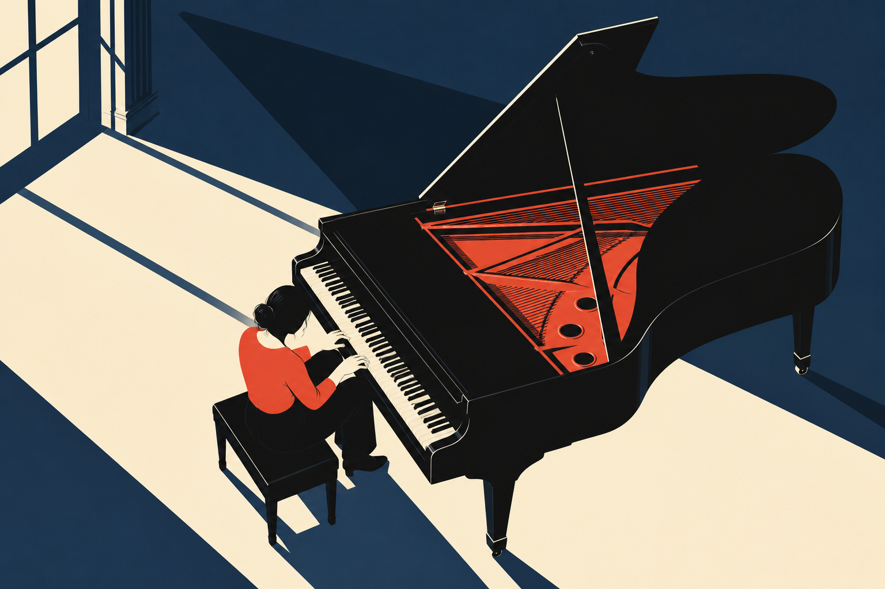

**Method:** Original generation

**Observed result:** A single pianist, large piano silhouette and diagonal window light create a strong editorial composition. The restrained ivory, navy, black and red palette gives the scene a coherent mood.

**Reusable lesson:** Describe the silhouette, viewpoint and negative space first; use a limited palette to organize the scene.

**Limits / next move:** The output adds subtle shading and detailed piano strings beyond the requested flat shapes. Piano geometry and mechanics are stylized, not technically verified.

**Generation inputs:**

- The saved input record lists no reference image for the initial generation. Research sources below are separate from attached inputs.

**Exact initial prompt:** [plain text](prompts/P15.txt)

```text
Create an exceptional original editorial illustration for a contemporary music magazine, landscape 3:2. A sophisticated flat screen-print aesthetic with rigorously controlled shapes, dramatic negative space, four solid colors only: warm ivory, deep midnight blue, vivid vermilion and near black. No text, title, logo, signature, paper mockup or border.

An elevated overhead three-quarter view shows one adult pianist seated at one grand piano in a quiet architectural room. The grand piano occupies the right two thirds of the composition, its near-black curved body forming the largest shape. Its raised triangular lid casts one long angular midnight-blue shadow toward the upper left. Keep the piano physically readable, with one keyboard along the near-left edge, a clear ivory-and-black key rhythm and simple slender legs.

The pianist sits on one small rectangular bench beside the keyboard at lower left. She wears a vermilion long-sleeved shirt and dark trousers; her body is a confident simple silhouette, her two hands rest naturally on the keyboard. Show only enough anatomy to read the action. Her face is mostly concealed by the overhead view. A broad warm-ivory shaft of light crosses the room diagonally, creating a second bold geometric region behind her without obscuring the instrument.

The image should reward a second look through the relationship between the open piano lid, its shadow, the diagonal light and the small human figure. Smooth decisive curves, perfectly clean color boundaries, selective tiny highlights, exceptionally balanced empty space. No gradients, paint texture, 3D rendering, glossy effects, repeated figures, extra instruments, plants, random decor or meaningless abstract squiggles. Keep the scene legible at thumbnail size and beautiful at full size.
```

Source: [Malika Favre — The Travel Editions](https://www.malikafavre.com/collections/the-travel-editions). Observed limited palettes, negative space and clear silhouettes. The pianist composition is an original brief; no source artwork attached.

**Recorded settings:** model not exposed; seed not exposed; quality not exposed.

[Underlying case record](evidence/premium-examples/collection.json) · [Download result](evidence/premium-examples/brand/illustration.png)

<a id="P16"></a>
### P16 · A Small Distance

**Book cover · visual guide page 46**

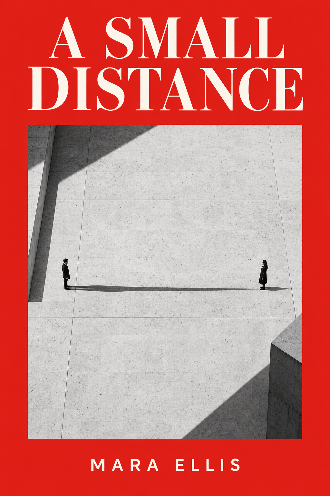

**Method:** Original generation

**Observed result:** The two-line title and author are exact and legible. A strong vermilion border frames two figures and a long connecting shadow; the image has a clear conceptual relationship to the title.

**Reusable lesson:** Use one conceptual image and three separate zones: title, picture, author.

**Limits / next move:** The shadow reads as a graphic connection between the figures rather than clearly separating them as requested. The red field has slight tonal variation. This is cover artwork, without a spine, bleed or print production setup.

**Generation inputs:**

- The saved input record lists no reference image for the initial generation. Research sources below are separate from attached inputs.

**Exact initial prompt:** [plain text](prompts/P16.txt)

```text
Create the finished flat front cover of an original literary novel, portrait 2:3. It should feel like a carefully art-directed contemporary literary hardback, with exceptional typographic finish and a single memorable visual idea. Do not show a physical book, spine, mockup, hands or tabletop.
Use a vivid vermilion-red field, black-and-white photographic imagery, and warm-white typography. Top 30 percent: the exact title "A SMALL DISTANCE" in two lines, A SMALL above DISTANCE, very large elegant high-contrast serif letters with balanced kerning and generous space from all edges. Keep every letter unobstructed. No subtitle.
In the middle and lower portion, create one sharply composed monochrome overhead photograph: two very small human figures stand on opposite sides of a broad, empty white concrete terrace, separated by one long, perfectly straight dark shadow. The terrace has crisp architectural geometry and subtle real stone texture. The two figures face each other across the empty space. Their distance is the emotional point; no crowd, furniture or scenery. The photographic rectangle occupies roughly the central 80 percent of the cover width, extending from below the title to near the bottom; a substantial red border stays visible.
Place "MARA ELLIS" in restrained warm-white uppercase sans-serif type at the bottom, centered with generous breathing room. The title and author are the only text. Precise print-design alignment, smooth solid red ink, clean photographic tonal range, no distressed lettering, no effects around the type, no badges, no fake publisher logo, no decorative frame inside the photograph.
```

Source: [Pentagram — How to See](https://www.pentagram.com/work/how-to-see/story). 

**Recorded settings:** model not exposed; seed not exposed; quality not exposed.

[Underlying case record](evidence/premium-examples/collection.json) · [Download result](evidence/premium-examples/graphics/images/01-a-small-distance.png)

<a id="P17"></a>
### P17 · Soft Structure

**Poster · visual guide page 47**

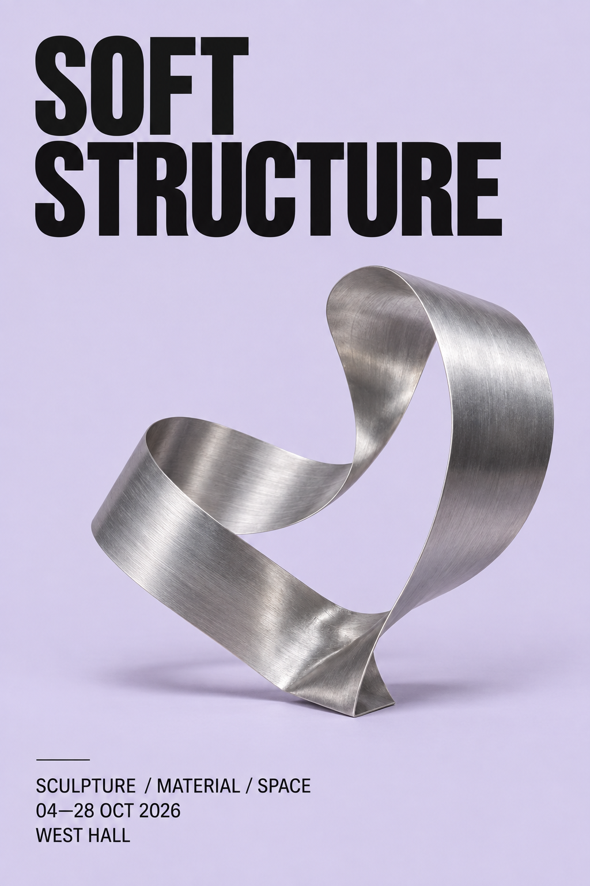

**Method:** Original generation

**Observed result:** The title and all three footer lines are correct. The aluminum ribbon reads as one continuous folded sheet, with a clear gap below the headline, tactile brushing and a grounded shadow.

**Reusable lesson:** Give the headline, central object and practical information different jobs and fixed zones.

**Limits / next move:** Material continuity is visually plausible, not physically simulated. The lavender background has subtle lighting variation rather than perfectly uniform flat ink.

**Generation inputs:**

- The saved input record lists no reference image for the initial generation. Research sources below are separate from attached inputs.

**Exact initial prompt:** [plain text](prompts/P17.txt)

```text
Design a finished portrait 2:3 poster for a fictional contemporary sculpture exhibition. The art direction is precise, visually daring and restrained: pale lavender paper, near-black typography, and a single extraordinary silver sculpture. Return the flat poster itself, no wall or room mockup.
Across the upper quarter, set the exact title "SOFT STRUCTURE" on two lines in very large, confident, condensed sans-serif capitals. Left aligned to a consistent 7 percent page margin. The two lines have tight controlled leading, normal crisp letters and excellent kerning. All letters are fully visible.
Below the title, one large studio photograph shows a single thin sheet of brushed aluminum bent into an elegant open looping ribbon, balancing on one folded end. Make the object physically coherent: one continuous sheet, polished cut edges, fine linear brushing, subtle dents from bending, crisp silver highlights and soft gray reflections. It occupies the middle half of the poster, slightly right of center, and casts one soft grounded shadow on the same pale lavender field. This is a tactile real object, not liquid chrome, a glowing CGI knot or tangled metal. Leave a clear gap between the sculpture and headline.
At the bottom, align a compact information block on the same left margin with exactly these three lines:
"SCULPTURE / MATERIAL / SPACE"
"04—28 OCT 2026"
"WEST HALL"
Use small but clearly legible near-black sans-serif text, generous line spacing, and a fine short horizontal rule above this block. No other text, logos, gradients, decorative symbols, 3D lettering or ornamental borders. The hierarchy must read instantly: exhibition name, sculpture, practical details.
```

Source: [Studio Dumbar — Ruhrtriennale](https://studiodumbar.com/work/ruhrtriennale). 

**Recorded settings:** model not exposed; seed not exposed; quality not exposed.

[Underlying case record](evidence/premium-examples/collection.json) · [Download result](evidence/premium-examples/graphics/images/02-soft-structure.png)

<a id="P18"></a>
### P18 · Night Shift

**Flyer · visual guide page 48**

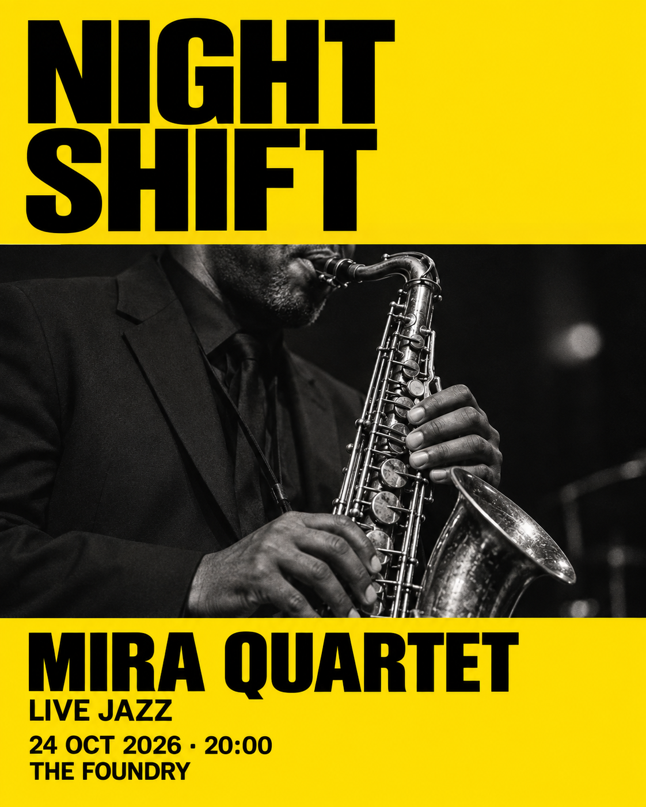

**Method:** Original generation

**Observed result:** The title, performer, date, time and venue are legible. Yellow and black create a strong hierarchy, and the close saxophone photograph has convincing metal and fabric detail.

**Reusable lesson:** Specify the reading order and the exact event copy, then reserve a single photographic area.

**Limits / next move:** The left margin is tighter than the requested 8 percent and the lower hand is partly cut by the photo boundary. The musician and event are fictional. A roomier crop is the next refinement.

**Generation inputs:**

- The saved input record lists no reference image for the initial generation. Research sources below are separate from attached inputs.

**Exact initial prompt:** [plain text](prompts/P18.txt)

```text
Create a finished portrait 4:5 event flyer for a fictional live-jazz night. Make it feel like a highly considered independent music venue campaign: bold cadmium-yellow ink, black typography, one arresting black-and-white photographic crop, and disciplined spacing. Flat artwork, not a paper mockup.
The upper third carries the exact words "NIGHT SHIFT" on two lines in massive tightly set black condensed sans-serif capitals, left aligned, with an 8 percent safe margin. The title should be the first thing read. Use clean lettering, no outlines, shadows, glow or grunge.
The middle of the flyer is a full-width monochrome photograph cropped close to the lower face, hands and tenor saxophone of one adult jazz musician in a dark suit. Show the instrument sweeping diagonally down toward the lower right; hands plausibly meet the keys. The dark photographic area feels intimate and tactile, with deep blacks, crisp metal reflections and a subtle natural grain. Crop deliberately; no awkward cut across fingertips. This photograph has a simple rectangular boundary, not a cutout halo.
Place the following exact information in a clean yellow band beneath the photograph, all aligned to the title's left margin:
"MIRA QUARTET"
"LIVE JAZZ"
"24 OCT 2026 · 20:00"
"THE FOUNDRY"
Let MIRA QUARTET be the largest line in this band; group the date and venue as practical information with enough white space. These strings and the title are the only text. No tickets, website, prices, badges, sponsors, borders or extra musicians. Preserve a clear visual rhythm between giant title, tightly cropped photograph and readable event details.
```

Source: [Studio Dumbar — Ruhrtriennale](https://studiodumbar.com/work/ruhrtriennale). 

Source: [Pentagram — How to See](https://www.pentagram.com/work/how-to-see/story). 

**Recorded settings:** model not exposed; seed not exposed; quality not exposed.

[Underlying case record](evidence/premium-examples/collection.json) · [Download result](evidence/premium-examples/graphics/images/03-night-shift.png)

<a id="P19"></a>
### P19 · A Week, by Design

**Infographic · visual guide page 49**

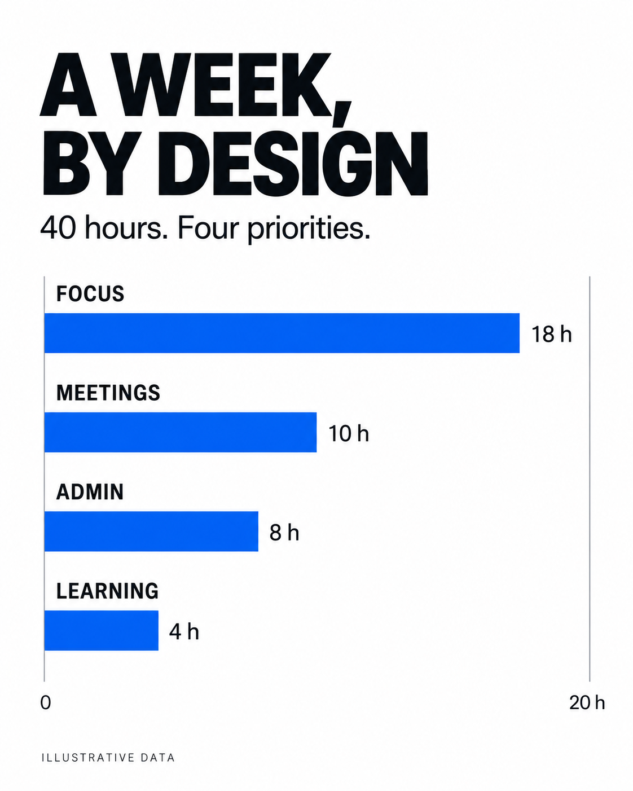

**Method:** Original generation

**Observed result:** All four labels and values are correct and sum to 40. Bars share a baseline, remain legible and follow the correct ordering. Pixel checks measured approximately 87.1%, 49.8%, 39.2% and 20.9% of the plotting width.

**Reusable lesson:** State the data, the common scale, bar relationships and label placement separately.

**Limits / next move:** Requested lengths were 90%, 50%, 40% and 20%. The first bar is visibly short of its target. This is an illustrative layout concept; use a deterministic chart renderer for exact published data geometry.

**Generation inputs:**

- The saved input record lists no reference image for the initial generation. Research sources below are separate from attached inputs.

**Exact initial prompt:** [plain text](prompts/P19.txt)

```text
Create a finished editorial infographic, portrait 4:5, for a fictional design studio's sample 40-hour week. The result should look like a beautifully typeset magazine page: white paper, near-black type, one strong cobalt-blue ink, precise alignment and plenty of space. This is illustrative data, not research.
Top left, within an 8 percent safe margin, set the exact headline "A WEEK, BY DESIGN" in large bold sans-serif, on two lines if necessary. Below it place exactly "40 hours. Four priorities." in smaller regular sans-serif.
The main graphic is four horizontal bars, with four generously spaced rows. Every bar starts on the same vertical baseline and uses the same linear scale: the full available plotting width represents 20 hours. Keep bars flat, rectangular and equal in thickness; no perspective, rounded capsules, icons or decorative illustrations. Use cobalt blue for every bar.
Row 1 label "FOCUS", bar 18 hours, endpoint value "18 h".
Row 2 label "MEETINGS", bar 10 hours, endpoint value "10 h".
Row 3 label "ADMIN", bar 8 hours, endpoint value "8 h".
Row 4 label "LEARNING", bar 4 hours, endpoint value "4 h".
Bar lengths must therefore be 90%, 50%, 40% and 20% of the same plotting width. Place labels above their bars at the shared left baseline, and numeric values just to the right of each bar, with clear spacing. Add only two subtle gray vertical guide lines across the plotting region: the common start and the full 20-hour endpoint. Label these once below the plot as "0" and "20 h".
At the bottom left, put the exact small footer "ILLUSTRATIVE DATA". No other text. The four values sum to 40. Use consistent numeral style, clean kerning, generous row spacing and a balanced layout. No gradients, shadows, fake dashboard controls, legend, extra axes, 3D bars or ornaments.
```

Source: [Nicholas Felton — Feltron 2014 annual report, SFMOMA](https://www.sfmoma.org/artwork/2015.782/). 

**Recorded settings:** model not exposed; seed not exposed; quality not exposed.

[Underlying case record](evidence/premium-examples/collection.json) · [Download result](evidence/premium-examples/graphics/images/04-a-week-by-design.png)

<a id="P20"></a>
### P20 · Small Room, Big Idea

**Thumbnail · visual guide page 50**

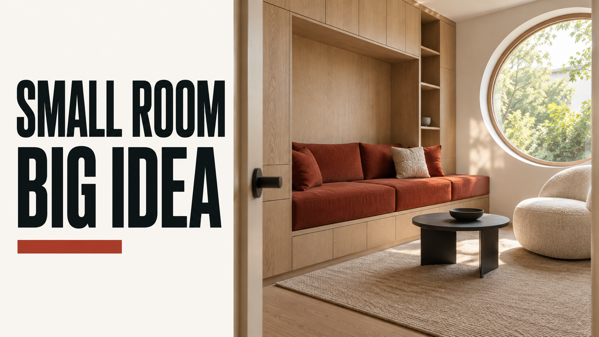

**Method:** Original generation

**Observed result:** The two text lines are exact and readable at reduced size. The rust sofa, circular window, ivory chair and oak storage create a focused architectural image. The right-hand crop leaves room near the lower-right corner.

**Reusable lesson:** Assign separate image and text zones, constrain the wording and keep one visual anchor.

**Limits / next move:** The left margin is tighter than the specified 6 percent. Thumbnail legibility was assessed visually; no click-through performance has been measured.

**Generation inputs:**

- The saved input record lists no reference image for the initial generation. Research sources below are separate from attached inputs.

**Exact initial prompt:** [plain text](prompts/P20.txt)

```text
Create a polished YouTube thumbnail for a fictional interior-design video, landscape 16:9. It must read clearly at a small thumbnail size, with one bold text statement and one strong architectural photograph. The aesthetic is a confident contemporary design magazine, not clickbait clutter.
The right 62 percent shows a beautifully photographed compact living room: a deep rust-red modular sofa built into a precise pale-oak storage wall, a large circular window, an ivory boucle lounge chair and a small black steel coffee table. Use a purposeful built-in layout that makes a small room feel generous. The circular window admits soft daylight from upper right; upholstery, oak grain, woven fabric and architectural edges have convincing tactile detail. Photograph from the open doorway at a natural eye level, with coherent perspective and clean verticals. No people, plants, books with lettering, screens, decorative piles or visible logos.
The left 38 percent is a smooth solid off-white text field. Set exactly "SMALL ROOM" above "BIG IDEA" in enormous near-black condensed sans-serif capitals, with two words per line and strong vertical spacing. Keep both lines inside the left field, fully legible and at least 6 percent of the full canvas width from the left edge. Add a short rust-red horizontal bar under BIG IDEA as the only graphic accent. No additional copy.
The join between text and photograph is a crisp vertical edge. Light, color and framing should make the red sofa the visual anchor opposite the headline. No arrows, circles, stickers, shocked faces, icons, border, 3D text or glowing effects. Keep the bottom-right 12 percent free of essential furniture detail for the platform duration badge. Return only the finished thumbnail.
```

Source: [Pentagram — How to See](https://www.pentagram.com/work/how-to-see/story). 

Source: [Studio Dumbar — Ruhrtriennale](https://studiodumbar.com/work/ruhrtriennale). 

**Recorded settings:** model not exposed; seed not exposed; quality not exposed.

[Underlying case record](evidence/premium-examples/collection.json) · [Download result](evidence/premium-examples/graphics/images/05-small-room-big-idea.png)

## experiment ledger

These records also include the diagnostic small scenes, language variations, reference combinations, sequential edits, reconstruction trials, and repairs. Some repeat a selected study above. IDs are namespaced by record file because separate experiments reuse short codes.

A request rejected before image generation has no result image. Historical absolute paths are retained inside raw records; the links below point to portable copies.

<a id="experiment-records--A1"></a>
### experiment-records / A1

**Condition:** generate · **Status:** saved result

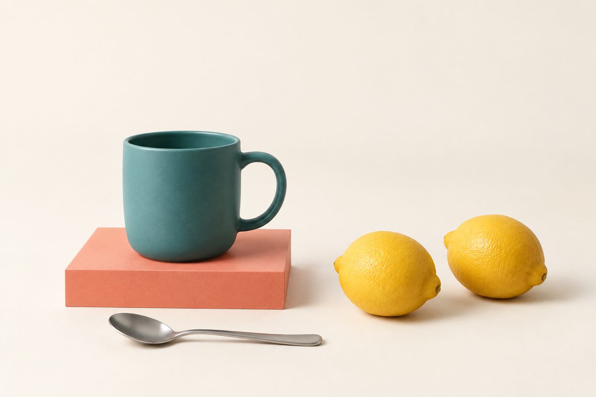

See the source record and experiment log for the full review.

**Inputs:**

- No attached input listed in this record; see the prompt and source record for context.

**Exact submitted prompt:** [plain text](prompts/trials/experiment-records--A1.txt)

```text
Create a photorealistic studio product image for a website hero, landscape canvas 3:2. On a seamless warm ivory floor and background, place one matte teal ceramic mug on one low coral rectangular plinth, in the left half. The mug handle points to image-right. Place exactly two whole yellow lemons on the ivory floor to the right of the plinth; they are separate, touching neither mug nor plinth. Place one plain silver teaspoon horizontally on the floor in front of the plinth, bowl to image-left. Keep every object fully visible in the lower 55% of the frame. Leave the upper 35% as uninterrupted empty ivory background for a headline to be added later; do not generate the headline. Slightly elevated front view, enough to see the mug opening and the top of the plinth. Broad soft light from upper left; gentle contact shadows extend toward lower right. Real ceramic, subtly textured lemon rind and brushed silver; quiet, uncluttered composition. Only the mug, plinth, two lemons, and spoon. No writing, logos, decorative props or borders.
```

[Source record and checks](evidence/experiment-records.json)

<a id="experiment-records--A2"></a>
### experiment-records / A2

**Condition:** edit · **Status:** saved result


See the source record and experiment log for the full review.

**Inputs:**

- [input](evidence/images/a1-original-draft.png): See exact prompt for assigned role.

**Exact submitted prompt:** [plain text](prompts/trials/experiment-records--A2.txt)

```text
Edit the input product photograph. Change only the composition scale and placement: make the entire existing still-life arrangement about 80% of its current size in the frame, then position it so every object lies between 46% and 90% of the image height measured from the top. The upper 45% must be completely empty ivory background. Keep the 3:2 landscape canvas. Preserve the exact mug design and teal color, right-facing handle, low coral rectangular plinth, exactly two whole yellow lemons to the plinth's right, and one horizontal silver teaspoon in front with bowl at left. Keep the same relative positions and proportions within the arrangement, materials, perspective, soft upper-left illumination and ivory backdrop. Maintain natural contact shadows. No new objects or text.
```

[Source record and checks](evidence/experiment-records.json)

<a id="experiment-records--B1"></a>
### experiment-records / B1

**Condition:** generate · **Status:** saved result

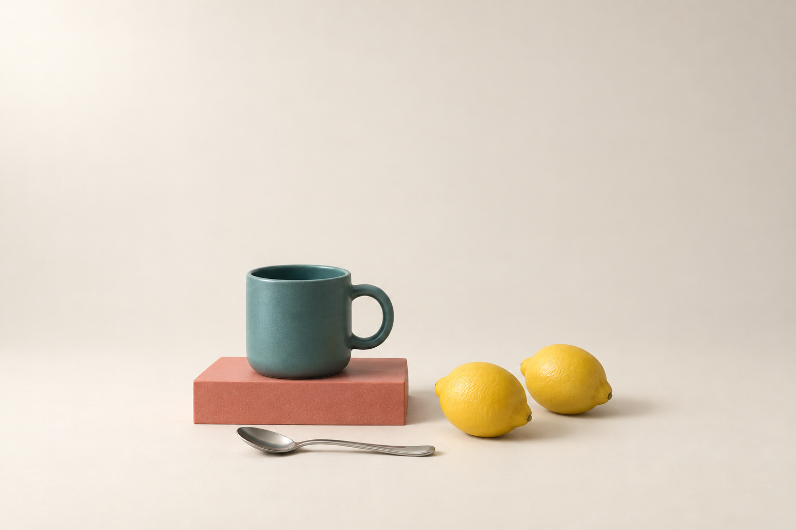

See the source record and experiment log for the full review.

**Inputs:**

- No attached input listed in this record; see the prompt and source record for context.

**Exact submitted prompt:** [plain text](prompts/trials/experiment-records--B1.txt)

```text
Create a photorealistic studio still life on a 3:2 landscape canvas. If an image is supplied, use it as the authority for composition, silhouettes, proportions, colors and lighting. Reconstruct the following visible scene: a warm ivory seamless floor and background, gently brighter at upper left. The upper 49% of the canvas is empty. One teal cylindrical ceramic mug with slightly rounded base and thick circular loop handle pointing image-right sits on a low salmon-coral rectangular block in the lower-left-middle. See inside its dark teal opening from a slightly elevated front view. Approximate object bounding boxes, expressed as percentages from the top-left of the canvas: mug including handle x30–49, y49–72; block x23–50, y66–79. The block has a broad front face and a visible flat top. Two whole saturated yellow lemons rest on the floor to the block's right, with a gap from the block: the nearer left lemon at x55–67,y66–81 and the farther right lemon at x67–79,y63–77. Their long axes lean gently down toward image-right; preserve small pointed tips and detailed dimpled rind. One horizontal silver teaspoon lies below and in front of the block at x29–54,y80–86, with oval bowl at image-left and a slightly curved slender handle toward image-right. Soft upper-left illumination makes the left side of the mug lighter; soft contact shadows fall to lower right. Matte finely textured ceramic and block, subtly reflective silver, natural lemon texture. No visible horizon, text, logos, borders or other objects. Every object is fully visible; preserve the broad empty space and modest size of the arrangement.
```

[Source record and checks](evidence/experiment-records.json)

<a id="experiment-records--B2"></a>
### experiment-records / B2

**Condition:** reference-conditioned · **Status:** saved result


See the source record and experiment log for the full review.

**Inputs:**

- [input](evidence/images/a2-layout-repaired.png): See exact prompt for assigned role.

**Exact submitted prompt:** [plain text](prompts/trials/experiment-records--B2.txt)

```text
Create a photorealistic studio still life on a 3:2 landscape canvas. If an image is supplied, use it as the authority for composition, silhouettes, proportions, colors and lighting. Reconstruct the following visible scene: a warm ivory seamless floor and background, gently brighter at upper left. The upper 49% of the canvas is empty. One teal cylindrical ceramic mug with slightly rounded base and thick circular loop handle pointing image-right sits on a low salmon-coral rectangular block in the lower-left-middle. See inside its dark teal opening from a slightly elevated front view. Approximate object bounding boxes, expressed as percentages from the top-left of the canvas: mug including handle x30–49, y49–72; block x23–50, y66–79. The block has a broad front face and a visible flat top. Two whole saturated yellow lemons rest on the floor to the block's right, with a gap from the block: the nearer left lemon at x55–67,y66–81 and the farther right lemon at x67–79,y63–77. Their long axes lean gently down toward image-right; preserve small pointed tips and detailed dimpled rind. One horizontal silver teaspoon lies below and in front of the block at x29–54,y80–86, with oval bowl at image-left and a slightly curved slender handle toward image-right. Soft upper-left illumination makes the left side of the mug lighter; soft contact shadows fall to lower right. Matte finely textured ceramic and block, subtly reflective silver, natural lemon texture. No visible horizon, text, logos, borders or other objects. Every object is fully visible; preserve the broad empty space and modest size of the arrangement.
```

[Source record and checks](evidence/experiment-records.json)

<a id="experiment-records--C1"></a>
### experiment-records / C1

**Condition:** sketch-to-render · **Status:** saved result

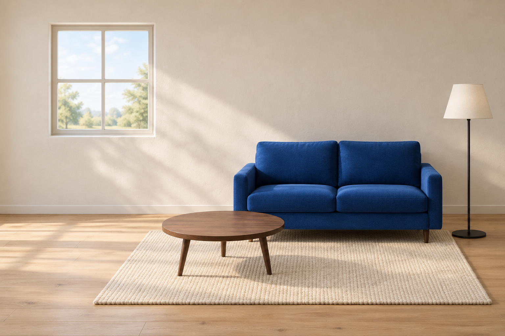

See the source record and experiment log for the full review.

**Inputs:**

- [input](evidence/images/c0-room-sketch.png): See exact prompt for assigned role.

**Exact submitted prompt:** [plain text](prompts/trials/experiment-records--C1.txt)

```text
Use the input sketch as a layout and proportion guide for a photorealistic interior image on a 3:2 landscape canvas. The sketch's outlines control the location, relative scale, silhouettes and slightly elevated frontal viewpoint; its line drawing style should not appear in the result. Render a quiet sitting room with warm off-white plaster walls and a pale oak floor. The straight background line is where the wall meets the floor. There is one square four-pane window on the upper-left wall, one cobalt-blue upholstered two-seat sofa in the right half, one round walnut coffee table in front of the sofa and slightly left of it, one broad off-white woven rug beneath the table and sofa, and one black floor lamp with an off-white tapered shade at far right. Preserve the sofa's two back cushions and two seat cushions, simple arms and legs. The elliptical shape in the sketch is a circular tabletop seen in perspective, not an oval table. Keep the same left/right arrangement and approximate sizes shown by the sketch. Soft daylight enters through the left window, creating natural shadows to the right. The window may reveal a soft bright sky. No people, plants, artwork, books, extra furniture, text, diagrams or construction lines. Every named element should stay fully in frame.
```

[Source record and checks](evidence/experiment-records.json)

<a id="experiment-records--C2"></a>
### experiment-records / C2

**Condition:** edit · **Status:** saved result

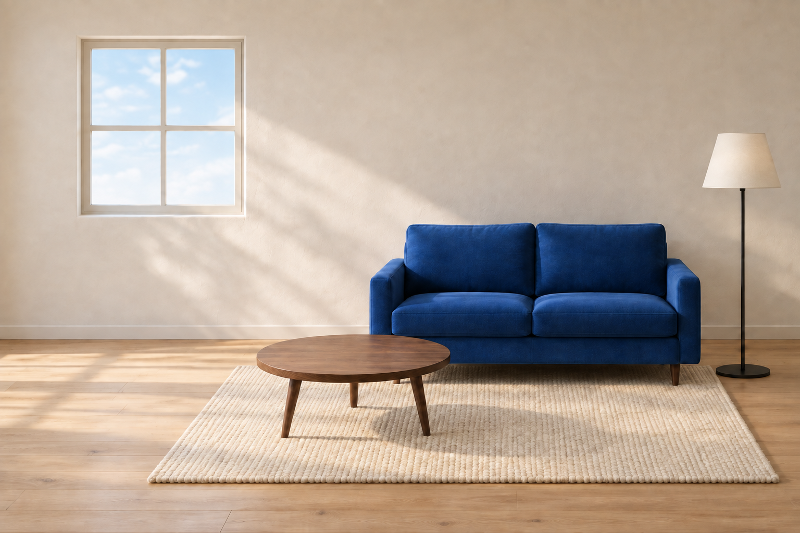

See the source record and experiment log for the full review.

**Inputs:**

- [input](evidence/images/c1-sketch-render.png): See exact prompt for assigned role.

**Exact submitted prompt:** [plain text](prompts/trials/experiment-records--C2.txt)

```text
Edit this room image. Change only the outdoor scene visible through the upper-left window: remove all trees, greenery and foliage, replacing them with unobstructed soft pale-blue sky and a few diffuse white clouds. Keep the existing four-pane window frame, its shape, position and size unchanged. Preserve the cobalt-blue two-seat sofa, every cushion and leg, round walnut coffee table, off-white woven rug, black floor lamp and off-white shade, wall and floor materials, camera, framing, 3:2 landscape canvas, indoor lighting and interior shadows. Do not change any indoor object, add any new object, or add text.
```

[Source record and checks](evidence/experiment-records.json)

<a id="experiment-records--C3"></a>
### experiment-records / C3

**Condition:** edit · **Status:** saved result

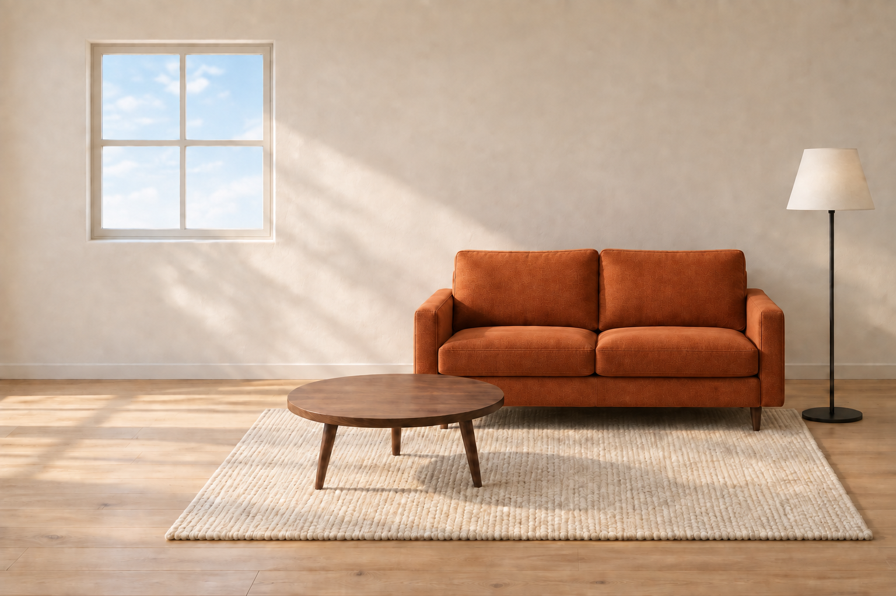

See the source record and experiment log for the full review.

**Inputs:**

- [input](evidence/images/c2-window-repaired.png): See exact prompt for assigned role.

**Exact submitted prompt:** [plain text](prompts/trials/experiment-records--C3.txt)

```text
Edit the supplied room photograph. Change only the sofa upholstery color from cobalt blue to a warm burnt orange, with the same tactile fabric quality. Preserve the sofa's silhouette, dimensions, two back cushions, two seat cushions, arms, seams, legs and exact position. Keep the four-pane window and pale sky, warm plaster wall, pale oak floor, round walnut coffee table, off-white woven rug, black floor lamp and off-white shade unchanged. Preserve the existing camera, perspective, framing, 3:2 landscape canvas, light direction and object placement. Allow the sofa's shading and very subtle immediately adjacent color reflections to respond naturally to the new fabric color. No new objects, greenery or text.
```

[Source record and checks](evidence/experiment-records.json)

<a id="experiment-records--C4"></a>
### experiment-records / C4

**Condition:** texture-repair · **Status:** saved result

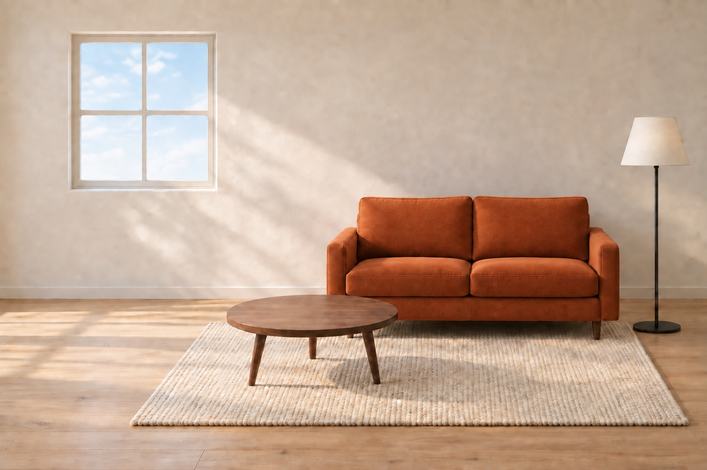

See the source record and experiment log for the full review.

**Inputs:**

- [input](evidence/images/c3-orange-edit.png): See exact prompt for assigned role.
- [input](evidence/images/c2-window-repaired.png): See exact prompt for assigned role.

**Exact submitted prompt:** [plain text](prompts/trials/experiment-records--C4.txt)

```text
Image 1 is the edit target: the room with the burnt-orange sofa. Image 2 is a reference ONLY for the sofa upholstery's original plain, finely brushed fabric texture; do not copy its blue color. In image 1, change only the sofa surface texture: remove the conspicuous looping, embossed or damask-like pattern and restore the plain, fine, softly brushed fabric appearance seen on the blue sofa in image 2. Keep the burnt-orange color from image 1, with natural tonal shading. Preserve all sofa geometry, seams, two back cushions, two seat cushions, arms, legs, position and silhouette. Keep the rest of image 1 unchanged: window and sky, wall, floor, lamp, coffee table, rug, lighting direction, composition and 3:2 landscape canvas. Do not add objects or text. The desired change is surface pattern only, not color or geometry.
```

[Source record and checks](evidence/experiment-records.json)

<a id="alpha-repair-record--G14-R1"></a>
### alpha-repair-record / G14-R1

**Condition:** RGB · **Status:** generated_and_reviewed

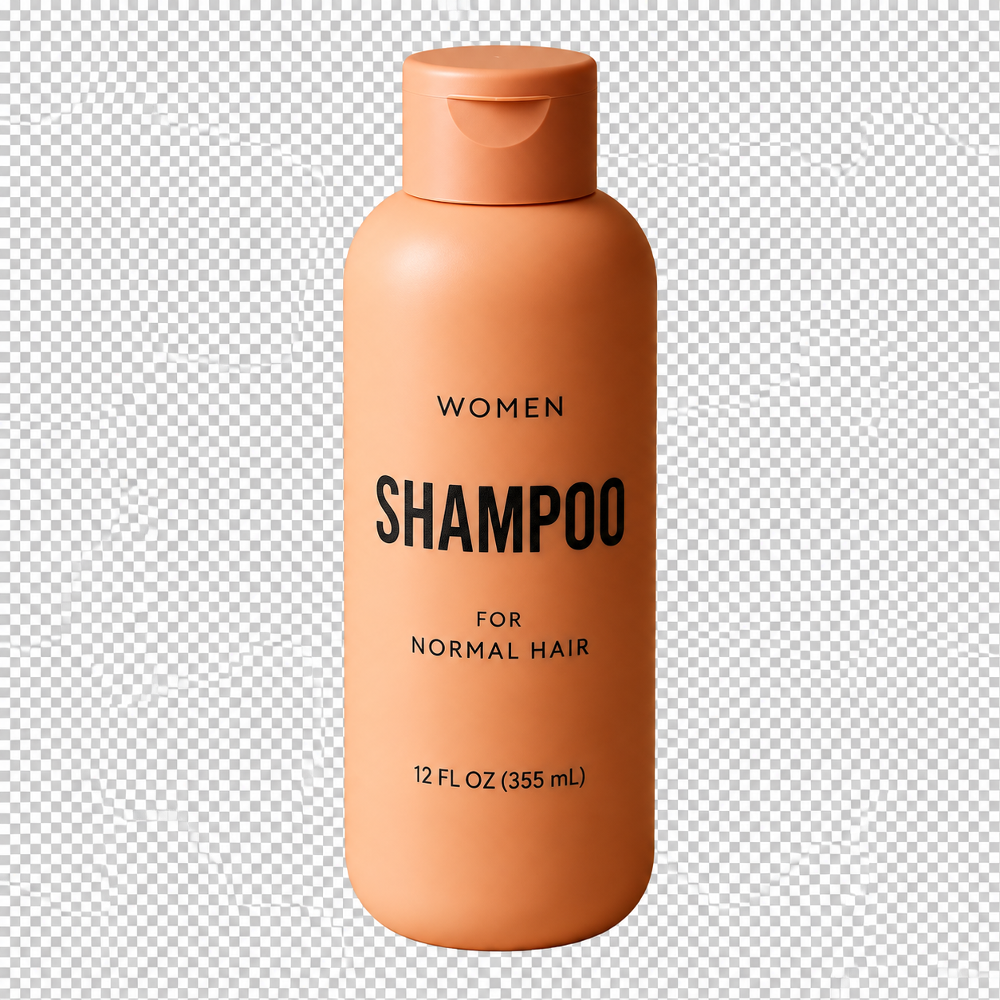

The single repair attempt still failed: stronger RGBA/alpha-value wording produced a second opaque painted checkerboard. No actual cutout was achieved.

**Inputs:**

- [input](evidence/expanded-experiments/edit-coverage/inputs/shampoo.webp): clean original product; no checkerboard

**Exact submitted prompt:** [plain text](prompts/trials/alpha-repair-record--G14-R1.txt)

```text
Extract only the peach-orange shampoo bottle from the attached original product photo. The deliverable is a real transparent PNG file in RGBA mode: every background pixel outside the bottle must have alpha 0, the opaque bottle interior must have alpha 255, and only boundary antialiasing may use intermediate alpha. Do not depict transparency as an image. Do not paint any checkerboard, grid, gray tiles, white backdrop, black backdrop, wall, table, cast shadow or reflection outside the object.

Keep the original bottle silhouette, flip-top cap, orange color, warm shading, orientation and label layout. Preserve the printed words WOMEN, SHAMPOO, FOR, NORMAL HAIR, and 12 FL OZ (355 mL). Center the whole bottle on a square canvas with a small genuinely transparent margin. This is an extraction, not a packaging redesign. Return the actual transparent RGBA PNG, not a preview of an object on a transparency pattern.
```

[Source record and checks](evidence/expanded-experiments/records/alpha-repair-record.json)

<a id="edit-coverage-records--G10"></a>
### edit-coverage-records / G10

**Condition:** RGB · **Status:** generated_and_reviewed


All six Spanish replacements and the major layout succeed; fine illustration preservation does not fully succeed.

**Inputs:**

- [input](evidence/expanded-experiments/language/trial-N4.png): edit target: illustration, geometry, material and typography layout

**Exact submitted prompt:** [plain text](prompts/trials/edit-coverage-records--G10.txt)

```text
Edit image 1, the complete Rain Engine poster. It is the exact layout and illustration target; do not redesign it.

Change only its six text strings using this complete Spanish glossary:
THE RAIN ENGINE → EL MOTOR DE LLUVIA
CLOUD → NUBE
FILTER → FILTRO
VAULT → DEPÓSITO
GARDEN → JARDÍN
RETURN → RETORNO

Print every replacement exactly once, with the accents shown. Preserve the existing title position, each label's left alignment and baseline, serif character, dark teal ink and hierarchy. Reduce type size or tracking only as necessary to fit each replacement into its current text zone; shorten a leader line only if the longer label requires room.

Lock everything else: the portrait 2:3 canvas, five floating tiers, exactly three white masts, three filter layers, glass reservoir and water level, intricate garden and bridges, copper coil, cloud shapes, four downward arrows, long turquoise return arrow, all material colors, lighting and illustration geometry. No English text, extra labels, new objects, borders or watermarks. Return the translated poster.
```

[Source record and checks](evidence/expanded-experiments/records/edit-coverage-records.json)

<a id="edit-coverage-records--G11"></a>
### edit-coverage-records / G11

**Condition:** RGB · **Status:** generated_and_reviewed


A compelling style transfer with excellent scene hierarchy, but a countable structural error: three background bridges instead of two.

**Inputs:**

- [input](evidence/expanded-experiments/edit-coverage/inputs/pixels.webp): style only: palette, pixel clusters and edge treatment

**Exact submitted prompt:** [plain text](prompts/trials/edit-coverage-records--G11.txt)

```text
Use image 1 only as a visual-style reference. Extract its crisp square pixel clusters, stepped diagonals, small restricted color ramps, near-black negative space, bright cobalt/cyan, warm orange-yellow highlights and restrained magenta stars. Do not copy its words, spacecraft, planets, layout, scores, menus or logos.

Create a new landscape 3:2 illustrated game-poster scene called NIGHT COURIER. Foreground: exactly one motorcycle with two clearly visible wheels, ridden by one courier in a red jacket and ivory full-face helmet, crossing a narrow elevated bridge from left to right. Both gloved hands meet the handlebars and the boots meet the foot pegs. Show the whole motorcycle and rider, occupying the lower middle of the frame.

Middle ground: a dense rain-soaked market city built over a deep canal, with stacked shop awnings, hanging lanterns, service pipes and a few small moored boats. Background: tall cobalt towers and two arched skybridges disappearing into wet night haze. Use three clear depth layers so the foreground silhouette reads immediately. Render rain, warm window lights and cyan reflections as deliberate pixel clusters, not smooth photographic effects.

Place NIGHT COURIER exactly once in bold readable pixel lettering inside the upper-left sky area. No other letters, HUD, numbers, watermark or border. Keep all important content within a 5% margin. The result must be coherent detailed pixel art, without antialiased vector edges, painted blur, or a photograph underneath.
```

[Source record and checks](evidence/expanded-experiments/records/edit-coverage-records.json)

<a id="edit-coverage-records--G12"></a>
### edit-coverage-records / G12

**Condition:** RGB · **Status:** generated_and_reviewed


The four-reference wardrobe assembly succeeds at visible identity, pose, clothing and environment retention; some occluded boot hardware cannot be verified.

**Inputs:**

- [input](evidence/expanded-experiments/edit-coverage/inputs/woman-in-museum.webp): edit target, identity, pose, environment
- [input](evidence/expanded-experiments/edit-coverage/inputs/jacket.webp): blazer garment only
- [input](evidence/expanded-experiments/edit-coverage/inputs/tank-top.webp): tank garment only
- [input](evidence/expanded-experiments/edit-coverage/inputs/boots.webp): boots garment only

**Exact submitted prompt:** [plain text](prompts/trials/edit-coverage-records--G12.txt)

```text
Image 1 is the edit target and sole person/environment reference: the smiling dark-haired woman standing with folded arms and crossed ankles in the museum. Images 2, 3 and 4 are garment references only: the beige blazer, white scoop-neck tank top, and gray knee-high suede boots.

Replace her knitted sweater and white sneakers with an outfit assembled from those garments. Put the beige blazer from image 2 over the white tank from image 3, leaving the blazer open enough to see the tank. Match the blazer's beige fabric, notched lapels, two dark front buttons and flap pockets; adapt its drape to her existing folded-arm pose. Put the gray boots from image 4 on both feet, over her existing black jeans, retaining the suede texture, low heels, knee-high shafts and two buckle straps on each boot.

Preserve image 1's facial features, apparent age, smile, skin texture, black shoulder-length hair and earrings. Keep the folded arms, crossed ankles, body proportions, camera viewpoint, full-body framing and museum lighting. Preserve her black jeans wherever not naturally covered by blazer or boots. Keep the marble statue on the left, both gold-framed paintings on the right, floor tiles and background geometry in place. Clothing may create natural new folds, occlusions and contact shadows; do not change her anatomy to simplify the fit. No extra people, accessories, labels, logos or beauty retouching. Portrait 2:3.
```

[Source record and checks](evidence/expanded-experiments/records/edit-coverage-records.json)

<a id="edit-coverage-records--G13"></a>
### edit-coverage-records / G13

**Condition:** RGB · **Status:** generated_and_reviewed


The person/dog reference roles and ambitious new environment integrate well. The model adds forbidden distant people and potentially readable clock markings.

**Inputs:**

- [input](evidence/expanded-experiments/edit-coverage/inputs/test-woman.webp): woman identity and outfit only
- [input](evidence/expanded-experiments/edit-coverage/inputs/test-woman-2.webp): dog donor only; exclude donor woman/background

**Exact submitted prompt:** [plain text](prompts/trials/edit-coverage-records--G13.txt)

```text
Reference roles are strict. Image 1 supplies only the woman: her face, long brown hair, dark navy cap, blue-white plaid overshirt, black cropped tank, ripped blue jeans, black belt and white sneakers. Image 2 supplies only the chocolate-brown Labrador dog: broad face, amber-brown eyes, floppy ears, dark brown short fur and stocky proportions. Do not use the second woman's identity, clothes or pose. Neither image supplies the new background.

Create a photorealistic landscape 3:2 travel editorial inside a spectacular glass-roofed botanical railway concourse at late golden hour. The woman from image 1 walks toward the camera slightly left of center, full body visible. The Labrador from image 2 walks beside her on the viewer's right, full body visible, on a slack burgundy leash held in her left hand (the hand on the viewer's right). Keep her reference outfit intact. Adapt the dog's posture to walking while preserving its recognizable appearance.

Behind them, show a soaring iron-and-glass barrel vault, layered tropical palms in bronze planters, an ornate station clock without readable numerals, and the front of a deep moss-green vintage train on the right. Warm sun shafts cut through the glass and reflect on a wet black-and-ivory tiled floor. Keep architectural lines in a coherent perspective, with the woman and dog sharper than the distant roof and train. Ground all feet and paws with matching contact shadows and reflections.

Exactly one woman and one dog; no crowd or second donor person. No floating leash, merged limbs, duplicate paws, extra animals, readable signage, logos or watermarks. Preserve natural face and fur texture; this should feel like a detailed travel photograph, not a cut-and-paste collage.
```

[Source record and checks](evidence/expanded-experiments/records/edit-coverage-records.json)

<a id="edit-coverage-records--G14"></a>
### edit-coverage-records / G14

**Condition:** RGB · **Status:** generated_and_reviewed


Failed production cutout: plausible bottle extraction appearance, but no real transparency at all.

**Inputs:**

- [input](evidence/expanded-experiments/edit-coverage/inputs/shampoo.webp): exact product identity and typography

**Exact submitted prompt:** [plain text](prompts/trials/edit-coverage-records--G14.txt)

```text
Image 1 is the exact product to extract. Return a square PNG cutout with genuine transparent alpha outside the bottle. Remove the wooden tabletop, tan wall, and cast shadow completely; do not replace them with white, gray, black, a checkerboard pattern, or a painted transparency effect.

Preserve the single peach-orange shampoo bottle, its rounded shoulder, cylindrical body, flip-top cap, front-facing orientation and warm product shading. Preserve its printed black label faithfully: WOMEN; SHAMPOO; FOR; NORMAL HAIR; 12 FL OZ (355 mL). Keep the existing typography and line positions rather than redesigning packaging. Retain the whole cap and bottom silhouette, centered with a small transparent margin. Keep opaque bottle interiors opaque and fine edge antialiasing natural. No extra objects, text, drop shadows or reflections outside the bottle.
```

[Source record and checks](evidence/expanded-experiments/records/edit-coverage-records.json)

<a id="edit-coverage-records--G15"></a>
### edit-coverage-records / G15

**Condition:** RGB · **Status:** generated_and_reviewed


The simple drawing becomes a detailed alpine station with all intended additions. Main relationships transfer; geometry remains approximate.

**Inputs:**

- [input](evidence/expanded-experiments/edit-coverage/inputs/drawings.webp): layout and perspective only; no bridge exists in source

**Exact submitted prompt:** [plain text](prompts/trials/edit-coverage-records--G15.txt)

```text
Image 1 is a composition sketch only. Its black lines are layout marks, not objects or the final visual style. Build a photorealistic landscape 3:2 alpine botanical research station from this map.

Preserve these spatial anchors: two mountain slopes descend from the upper left and upper right into the central distant valley; a winding river begins near the middle horizon and broadens in S-curves toward the lower foreground; one large leafy tree stands on the right foreground bank; scattered smooth rocks trace the river edges. Keep the river banks and large tree close to their sketched positions and relative scale. Convert the central drawn sun into natural sunrise glow in the same valley opening, rather than a giant solid disc. Four loose cloud groups occupy the upper sky where the sketch indicates them.

Intentional additions, not features recovered from the sketch: put exactly three low glass greenhouses on planted stone terraces on the left riverbank, in the middle distance. Add one slender wooden footbridge across the river in the middle distance, below the valley opening and behind the foreground tree. Connect the greenhouses to the bridge with one gravel footpath. Keep the river open and visible around and beneath the bridge.

Render lush alpine specimen gardens, dew on meadow grasses, weathered stone retaining walls, detailed greenhouse metal frames and glazing, distant snow traces on rocky mountain ridges, clear turquoise river water over visible stones, and soft low sunlight with cool valley haze. Retain a spacious sky and deep layered distance. No labels, drawn outlines, cartoon sun rays, extra bridges, large buildings or people. The final scene must follow the sketch's main layout while looking like a plausible high-resolution landscape photograph.
```

[Source record and checks](evidence/expanded-experiments/records/edit-coverage-records.json)

<a id="edit-coverage-records--G16"></a>
### edit-coverage-records / G16

**Condition:** RGB · **Status:** generated_and_reviewed


The requested local deletion works while the flower, portrait and scene remain visually consistent.

**Inputs:**

- [input](evidence/expanded-experiments/edit-coverage/inputs/man-with-blue-hat.webp): edit target; cap removal only

**Exact submitted prompt:** [plain text](prompts/trials/edit-coverage-records--G16.txt)

```text
Edit image 1 by removing only the blue baseball cap. The cap is the sole deletion target, including its crown and brim. Reconstruct only the newly exposed scalp with plausible short dark hair that connects naturally to the hair already visible at the temples. The hidden original hairstyle is unknown; do not change the visible face to invent a new person.

Preserve the man's facial features, smile, teeth, stubble, ears, gaze, head tilt and skin texture. Preserve the white daisy with yellow center, its green stem, the fingers holding it, the hand pose and arm. Preserve the white T-shirt, green pine-tree graphic, fabric folds, colorful graffiti brick wall, background texture, original crop, camera view, light and color. Do not remove the flower, beautify the face, alter the shirt graphic, clean the wall, add text or change any other object. Keep the original portrait 2:3 composition.
```

[Source record and checks](evidence/expanded-experiments/records/edit-coverage-records.json)

<a id="edit-coverage-records--G17"></a>
### edit-coverage-records / G17

**Condition:** RGB · **Status:** generated_and_reviewed


The referenced outfit and person integrate into the complex action scene while major background anchors hold.

**Inputs:**

- [input](evidence/expanded-experiments/edit-coverage/g12.png): person identity and clothing only; generated G12 result
- [input](evidence/expanded-experiments/official-references/scene-gpt-image-2-5-sunburst.webp): scene, existing runner pose, scale, camera, lighting

**Exact submitted prompt:** [plain text](prompts/trials/edit-coverage-records--G17.txt)

```text
Image 1 supplies the person and clothing only: the dark-haired woman in beige blazer, white tank top, black jeans and gray knee-high boots. Image 2 is the exact scene, camera and action-pose reference: a runner escaping a bear through a mountain campsite. Replace image 2's existing runner with the woman from image 1 so there is still exactly one person. Do not add a second person and do not copy the museum background.

Preserve the referenced woman's facial structure, apparent age, dark hair and recognizable identity while giving her a natural alarmed expression. Preserve her beige blazer, white tank, black jeans and gray boots from image 1; add only plausible motion folds and a light amount of trail dust. Adapt her body to image 2's running pose, direction and scale, with one knee raised and arms moving naturally. Her face must remain visible and her footwear must meet the terrain plausibly.

Lock the rest of image 2: the pursuing brown bear on the left, damaged gray tent and green storage case on the right, overturned dark camp chair on the left, scattered gear, pine trunks, rocky leaf-strewn ground, distant granite mountain profile and warm evening sky. Match the existing scene's depth of field, perspective, muted natural colors, lighting and grounded contact shadows. Maintain the original portrait 2:3 framing. Keep the image photographically credible; no dramatic new explosions, extra wildlife, wounds, blood, text, logos or watermark.
```

[Source record and checks](evidence/expanded-experiments/records/edit-coverage-records.json)

<a id="g06-repair-record--G06-R1"></a>
### g06-repair-record / G06-R1

**Condition:** see source record · **Status:** generated_and_file_verified


See the source record and experiment log for the full review.

**Inputs:**

- No attached input listed in this record; see the prompt and source record for context.

**Exact submitted prompt:** [plain text](prompts/trials/g06-repair-record--G06-R1.txt)

```text
Edit the supplied four-panel comic. Change only the person's action and orientation in the fourth, bottom panel. They must unmistakably be RETURNING INTO the room: show their face and the front of their mustard coat, torso and knees directed inward toward the viewer, one foot stepping across the doorway onto the interior mat, and their gaze angled down toward the waiting orange cat. The back of their body should face the rainy outdoors, not the viewer. Keep the same short wavy brown hair, mustard coat, blue jeans, brown boots, brown shoulder bag and folded navy umbrella. One person only in that panel.
Preserve panels 1, 2 and 3 exactly as shown. In panel 4 preserve the orange cat's position and appearance, the popcorn clue, closed teal record player, sofa, furniture, window, plants, doorway, palette, lighting, ink-and-gouache style, framing and panel boundaries. Change only the person and the immediately occluded doorway pixels necessary for that pose. Do not add text or other objects. Return the complete four-panel page at the same dimensions.
```

[Source record and checks](evidence/expanded-experiments/records/g06-repair-record.json)

<a id="generation-coverage-records--G01"></a>
### generation-coverage-records / G01

**Condition:** generate · **Status:** reviewed


See the source record and experiment log for the full review.

**Inputs:**

- No attached input listed in this record; see the prompt and source record for context.

**Exact submitted prompt:** [plain text](prompts/trials/generation-coverage-records--G01.txt)

```text
Create a landscape 3:2 editorial photograph for a feature about skilled maritime work.
Scene: an elderly sailor repairs a fishing net on the deck of a small, weathered wooden boat in a sheltered harbor. This is a candid working moment, not a fashion pose.
Visual map: foreground lower-left has loose ochre rope coils and wet dark deck planks; the sailor occupies the left-center, seated with both hands visibly tying one section of net. The net stretches diagonally from his lap toward a wooden float at lower-right. One black-and-white dog sits to his right, fully visible from ears to paws, watching his hands. Behind them are a worn blue wheelhouse, winch, neatly stowed buoys and several fishing boats farther across the water. Distant buildings stay subordinate.
Appearance: silver stubble, creased face, salt-stained canvas jacket, ribbed wool sweater, rough hands. Net fibers, chipped paint, water droplets and rope wear should be distinguishable without oversharpening.
Light: a low warm shaft of sunrise from upper-left catches the sailor's profile, hands and translucent net fibers. Cool blue harbor shade fills the unlit surfaces. Light and shadows must agree across the man, dog and deck. Fine film grain and natural tonal range; color restrained except for the blue wheelhouse and ochre rope.
Composition: eye level from the bow, enough depth of field to understand the work and setting. Distinct foreground, working figures, boat structure and harbor layers. No text, no logos, no artificial fog, no beauty retouching. Keep hands, net and dog unobstructed.
```

[Source record and checks](evidence/expanded-experiments/records/generation-coverage-records.json)

<a id="generation-coverage-records--G03"></a>
### generation-coverage-records / G03

**Condition:** generate · **Status:** reviewed


See the source record and experiment log for the full review.

**Inputs:**

- No attached input listed in this record; see the prompt and source record for context.

**Exact submitted prompt:** [plain text](prompts/trials/generation-coverage-records--G03.txt)

```text
Design a striking portrait 2:3 art-festival poster, a complete finished graphic, not a photograph of a poster.
Headline zone, top 22%: the word "AFTERLIGHT" exactly once, enormous condensed ivory sans-serif capitals, perfectly legible, straight baseline, generous clear margin.
Central image, middle 60%: an immense sculptural arch made of folded cobalt-blue metal and translucent amber glass rises above shallow ivory steps. A luminous orange sun-disc is visible through the opening. Thin copper wires suspend several long cobalt ribbons that twist through the air without covering the headline. Three tiny visitors stand on separate steps at the arch's base to establish scale, each a clean human silhouette. The blue structure has crisp folded edges; amber glass refracts the warm light; copper catches small highlights. Deep near-black background, dramatic but physically coherent warm backlight and cool side light. Meticulous architectural miniature photography combined with premium editorial art direction.
Footer zone, bottom 15%: two centered lines, exactly "ART AFTER DARK" then "19–21 OCT". Clean ivory typography, readable with generous spacing.
Hierarchy: headline first, luminous arch second, visitors third, footer fourth. Give every element room; make the impossible scale wondrous while keeping materials believable.
Only the three specified text lines. Do not add a venue, sponsor, logo, barcode, decorative tiny writing or watermark. Keep all typography separate from the sculpture and visitors.
```

[Source record and checks](evidence/expanded-experiments/records/generation-coverage-records.json)

<a id="generation-coverage-records--G04"></a>
### generation-coverage-records / G04

**Condition:** generate · **Status:** reviewed


See the source record and experiment log for the full review.

**Inputs:**

- No attached input listed in this record; see the prompt and source record for context.

**Exact submitted prompt:** [plain text](prompts/trials/generation-coverage-records--G04.txt)

```text
Create one original logo for a fictional coastal conservation studio named TIDELINE. Square 1:1 canvas with a genuinely transparent background; preserve real alpha transparency.
Symbol: a compact near-circular dark navy silhouette. Inside it, one broad flowing negative-space channel curves upward like a breaking wave and resolves into the simple profile of a shorebird's head looking right. Use only two or three broad connected shapes. The bird and wave should share one elegant silhouette rather than look like separate clip-art objects. No feathers, eyes, scenic illustration, thin decorative lines or gradients.
Place the symbol centered in the upper-middle. Below it, set "TIDELINE" exactly once in dark navy uppercase geometric sans-serif, widely but evenly spaced. Align the wordmark with the symbol; keep the wordmark narrower than the symbol's outer width. Plenty of empty transparent margin on all sides.
This is a flat vector-like raster logo exploration. Crisp solid edges, balanced negative space, strong recognition at small sizes. One ink color only: deep navy. No shadows, mockup, paper texture, backdrop, drawn checkerboard, border, additional text or watermark.
```

[Source record and checks](evidence/expanded-experiments/records/generation-coverage-records.json)

<a id="generation-coverage-records--G05"></a>
### generation-coverage-records / G05

**Condition:** generate · **Status:** reviewed


See the source record and experiment log for the full review.

**Inputs:**

- No attached input listed in this record; see the prompt and source record for context.

**Exact submitted prompt:** [plain text](prompts/trials/generation-coverage-records--G05.txt)

```text
Create a wide 3:2 photorealistic historical reconstruction of a crowd at the Woodstock Music and Art Fair, on Max Yasgur's farm in Bethel, New York, in August 1969. It should resemble a carefully staged period editorial scene, not a present-day festival.
Verified setting to depict: a very large crowd spreads across a grassy, sloping farm field; the concert stage sits at the foot of the audience slope, with wooded edges and rural land beyond. Rain and mud were part of the festival. Do not portray an exact documented instant or recognizable performer.
Composition: view from among the audience near the upper slope, looking down toward the distant stage. Foreground, five distinguishable young adult attendees sit or stand on blankets: worn denim, simple cotton shirts, a patterned long skirt, long hair and a canvas shoulder bag. Their poses are relaxed and varied, facing generally toward the stage. A muddy footpath leads diagonally through the middle-ground crowd. Scattered simple canvas tents sit toward the far wooded edge. Thousands of more distant attendees become increasingly small, with natural nonrepeating clusters.
Appearance: muted late-1960s color-film character, soft overcast daylight, real skin and fabric, grass worn into patches of earth. Period-appropriate simple stage scaffolding and speaker stacks remain small in the distance. No LED screens, smartphones, modern stage lasers, contemporary branded clothing, modern security barriers or giant printed sponsor signs.
No caption or readable writing inside the image. Preserve convincing human anatomy in the foreground and a coherent hillside perspective.
```

[Source record and checks](evidence/expanded-experiments/records/generation-coverage-records.json)

<a id="generation-coverage-records--G06"></a>
### generation-coverage-records / G06

**Condition:** generate · **Status:** reviewed


See the source record and experiment log for the full review.

**Inputs:**

- No attached input listed in this record; see the prompt and source record for context.

**Exact submitted prompt:** [plain text](prompts/trials/generation-coverage-records--G06.txt)

```text
Draw one portrait 2:3 comic page with exactly four horizontal panels stacked top to bottom, equal-width panels and clean ivory gutters. No text, dialogue, lettering, panel numbers or sound effects.
Visual style: sophisticated hand-inked European picture-book illustration, precise warm outlines, richly painted gouache, terracotta, petrol blue, mustard and sage. Detailed but readable interiors, not flat clip art.
Recurring identity: one small orange tabby cat with a white muzzle, white front paws, three dark forehead stripes and a cobalt-blue collar. Keep these features in every panel.
Recurring room: a terracotta sofa is left-center, a low walnut record cabinet with a teal record player is on the right, a large round window is behind the sofa, and the entrance is at far left. Keep furniture placement and colors consistent.
Panel 1: a person in a mustard raincoat exits through the far-left doorway, carrying a folded navy umbrella. The cat sits near the threshold watching. The teal record player on the right is closed and inactive.
Panel 2: the same room after departure. The cat stands with its front white paws on the record cabinet and lifts the teal record player's lid with one paw. One black vinyl record is visible on the turntable. No human is present.
Panel 3: the same cat sprawls happily across the terracotta sofa, eyes closed, while the open record player at right plays the black record. A small bowl of popcorn sits on the floor with a few spilled kernels. Warm afternoon light comes through the round window.
Panel 4: the raincoat-wearing person returns at the far-left doorway holding the folded navy umbrella. The cat sits innocently by the threshold as in panel 1. The record player's lid is closed again, but one small popcorn kernel remains beside the cat as the visual punchline.
Make the story immediately readable. One cat per panel; preserve room geography, color palette and recognizable objects.
```

[Source record and checks](evidence/expanded-experiments/records/generation-coverage-records.json)

<a id="generation-coverage-records--G07"></a>
### generation-coverage-records / G07

**Condition:** generate · **Status:** reviewed


See the source record and experiment log for the full review.

**Inputs:**

- No attached input listed in this record; see the prompt and source record for context.

**Exact submitted prompt:** [plain text](prompts/trials/generation-coverage-records--G07.txt)

```text
Create one portrait 2:3 product-design presentation containing a single straight-on modern smartphone, centered on a pale warm-gray background. The phone fills most of the frame and displays a crisp, finished farmers-market app named Fieldwork. This is a realistic shipped-app visual preview, not a concept sketch.
Screen layout top to bottom:
1. A compact status bar and a header reading "Fieldwork", with a small search icon and bag icon.
2. A large editorial hero photo of a market stall with tomatoes, flowers and leafy vegetables. Overlay a cream card at its lower edge: "Saturday market" on the first line and "8 AM – 1 PM · Riverside Park" below.
3. Three small filter chips in one row: "All", "Produce", "Bakery". All is selected in dark forest green.
4. Section heading "Meet the makers". Two equal vendor cards side by side with different photographs: baskets of tomatoes on the first, flour-dusted sourdough on the second. Labels exactly "Green Row" / "Vegetables" and "Early Bird" / "Sourdough".
5. A smaller full-width cream-tinted promotional row with a close photo of mixed tomatoes and text "Today's pick" and "Heirloom tomatoes", plus "$4 / lb" aligned at right.
6. A bottom navigation bar with three clean icons and text "Explore", "Saved", "Bag"; Explore selected.
Use warm white, deep forest green and restrained tomato-red accents. Fine charcoal typography, strong spacing, carefully aligned cards, natural photographs, crisp rounded rectangles, practical contrast. Keep the entire screen visible with no overlapping controls or cropped labels. No lorem ipsum, fake paragraphs, extra feature sections, device logos or decorative floating objects.
```

[Source record and checks](evidence/expanded-experiments/records/generation-coverage-records.json)

<a id="generation-coverage-records--G08"></a>
### generation-coverage-records / G08

**Condition:** generate · **Status:** reviewed


See the source record and experiment log for the full review.

**Inputs:**

- No attached input listed in this record; see the prompt and source record for context.

**Exact submitted prompt:** [plain text](prompts/trials/generation-coverage-records--G08.txt)

```text
Create a landscape 3:2 educational plate titled "INSIDE A LEAF" for a high-school biology lesson. Show a beautiful, scientifically readable three-dimensional cutaway block through a typical eudicot leaf, floating on an ivory background. Illustration is a precise textbook model with subtle painted texture, not a microscope photograph. The tissue layers are enlarged schematically; do not add a numerical scale.
Anatomical map, top to bottom:
- a very thin waxy cuticle on top;
- one layer of upper epidermal cells;
- closely packed elongated upright palisade cells, full of small green chloroplasts;
- a lower layer of loosely arranged irregular spongy cells with obvious connected air spaces and some chloroplasts;
- one layer of lower epidermal cells, interrupted at front-center by a clear stomatal opening flanked by two guard cells.
Embed one rounded vascular bundle within the mesophyll at the right side of the cutaway. Its larger xylem vessels are above its smaller phloem cells. Keep the surrounding tissues visible.
Labels with thin noncrossing leader lines and sufficient margin, each exactly once: "Cuticle", "Upper epidermis", "Palisade mesophyll", "Spongy mesophyll", "Air space", "Lower epidermis", "Guard cells", "Stoma", "Xylem", "Phloem". Each leader must touch the correct structure; never use a label as decoration.
Below the stomatal pore show one small inward arrow labeled "CO2 in" going from outside through the pore into the internal air space, and one small outward arrow labeled "O2 out" going from that air space through the pore to outside. Separate arrows so their directions are unambiguous. The pore must actually open into the air space, not a solid cell.
Use botanical greens, cream cell walls, muted blue xylem and muted coral phloem. Preserve cell topology and a clear layer hierarchy. No animal organs, invented organelles, extra captions or decorative foliage.
```

[Source record and checks](evidence/expanded-experiments/records/generation-coverage-records.json)

<a id="generation-coverage-records--G09"></a>
### generation-coverage-records / G09

**Condition:** generate · **Status:** reviewed


See the source record and experiment log for the full review.

**Inputs:**

- No attached input listed in this record; see the prompt and source record for context.

**Exact submitted prompt:** [plain text](prompts/trials/generation-coverage-records--G09.txt)

```text
Create one polished landscape 16:9 presentation slide, a flat full-slide graphic, titled "CIVIC MOVE" with the subtitle "Quarter in view". Use a warm ivory background, dark navy typography, thin neutral rules, refined editorial spacing and restrained teal, blue and orange chart colors. No photographs, gradients, 3D effects or drop shadows.
Layout: header at the top, then exactly three equal-width chart panels in a single row with generous margins.
Left panel title "Trips". Vertical bar chart with three months: "Jan", "Feb", "Mar". Values are exactly 120, 180, 240. Bars share a zero baseline, heights in ratio 1:1.5:2. Place each value clearly above its bar. Y-axis labeled "Trips" with ticks 0, 120, 240. Bars teal.
Middle panel title "On-time rate". A simple blue line chart with three points Jan 80%, Feb 85%, Mar 90%. Label each point exactly "80%", "85%", "90%". Vertical scale has ticks 70%, 80%, 90%, 100%, evenly spaced. Points increase by equal vertical steps. Months aligned in order under points.
Right panel title "March mix". Horizontal bars for "Bike", "Bus", "Walk" with values 50%, 30%, 20%. Same zero baseline and common scale; lengths in ratio 5:3:2. Bike teal, Bus muted blue, Walk burnt orange. Each value at its bar end. No pie chart.
Footer at bottom-left exactly "Illustrative data · Not a real business". No source citation or other data.
Prioritize mathematical consistency and legible text over decoration. All three panels must fit comfortably. Every requested label appears in its intended place, with no extra metrics, legends, logos or generated gibberish.
```

[Source record and checks](evidence/expanded-experiments/records/generation-coverage-records.json)

<a id="language-records--N4"></a>
### language-records / N4

**Condition:** plain_prose · **Status:** generated_and_file_verified


See the source record and experiment log for the full review.

**Inputs:**

- No attached input listed in this record; see the prompt and source record for context.

**Exact submitted prompt:** [plain text](prompts/trials/language-records--N4.txt)

```text
Create a portrait 2:3 illustrated atlas poster called THE RAIN ENGINE. It shows a fictional floating ecosystem as five separated tiers, stacked vertically on one central axis. Leave visible air gaps between tiers. This is imaginative concept art, not a validated engineering schematic. The top tier is a circular platform with exactly three slender white cloud-harvesting masts under one curling cloud. The second tier is an exposed filter, with three clearly different layers: rough basalt, black carbon, and pale ceramic. The middle tier is one clear glass spherical reservoir, half filled with turquoise water. The fourth tier is a lush garden on stepped terraces, with tiny gold bridges between terraces. The bottom tier is one large copper coil releasing a plume of white vapor. Show exactly four thin copper downward arrows in the gaps: top to second, second to middle, middle to fourth, and fourth to bottom. Show one turquoise return arrow outside the stack on the right, curving from the bottom coil up to the top cloud. Keep all five arrows distinct and readable. Print THE RAIN ENGINE exactly once, as the large title centered above the stack. Place these five smaller labels on the left, aligned with their respective tiers from top to bottom: CLOUD, FILTER, VAULT, GARDEN, RETURN. Use simple thin leader lines to the tiers. These six strings are the only text. Keep the labels large enough to read and clear of the illustration. Use an elegant museum atlas style: precise fine ink contours, softly shaded three-dimensional cutaways, a warm ivory background, deep teal and moss green forms, copper machinery, and restrained gold accents. Use one consistent elevated three-quarter view, with light from the upper left. Give the surfaces intricate mineral, glass, leaf, and machined-metal detail. Keep the full stack and all labels inside generous margins. Do not include people, logos, watermarks, or decorative borders.
```

[Source record and checks](evidence/expanded-experiments/records/language-records.json)

<a id="language-records--V6"></a>
### language-records / V6

**Condition:** labeled_sections · **Status:** generated_and_file_verified

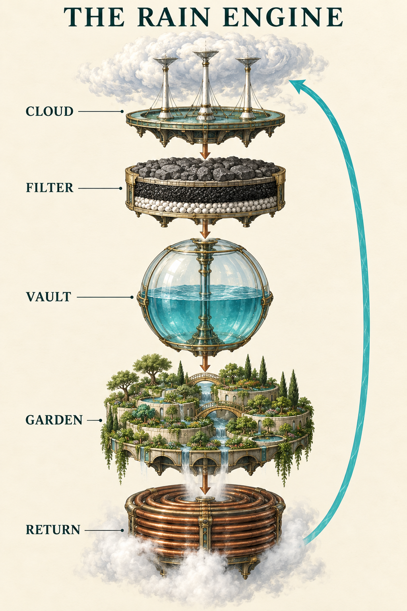

See the source record and experiment log for the full review.

**Inputs:**

- No attached input listed in this record; see the prompt and source record for context.

**Exact submitted prompt:** [plain text](prompts/trials/language-records--V6.txt)

```text
Purpose and composition:
Create a portrait 2:3 illustrated atlas poster called THE RAIN ENGINE. It shows a fictional floating ecosystem as five separated tiers, stacked vertically on one central axis. Leave visible air gaps between tiers. This is imaginative concept art, not a validated engineering schematic.

Tier contents, top to bottom:
The top tier is a circular platform with exactly three slender white cloud-harvesting masts under one curling cloud. The second tier is an exposed filter, with three clearly different layers: rough basalt, black carbon, and pale ceramic. The middle tier is one clear glass spherical reservoir, half filled with turquoise water. The fourth tier is a lush garden on stepped terraces, with tiny gold bridges between terraces. The bottom tier is one large copper coil releasing a plume of white vapor.

Relationships:
Show exactly four thin copper downward arrows in the gaps: top to second, second to middle, middle to fourth, and fourth to bottom. Show one turquoise return arrow outside the stack on the right, curving from the bottom coil up to the top cloud. Keep all five arrows distinct and readable.

Text and hierarchy:
Print THE RAIN ENGINE exactly once, as the large title centered above the stack. Place these five smaller labels on the left, aligned with their respective tiers from top to bottom: CLOUD, FILTER, VAULT, GARDEN, RETURN. Use simple thin leader lines to the tiers. These six strings are the only text. Keep the labels large enough to read and clear of the illustration.

Appearance and constraints:
Use an elegant museum atlas style: precise fine ink contours, softly shaded three-dimensional cutaways, a warm ivory background, deep teal and moss green forms, copper machinery, and restrained gold accents. Use one consistent elevated three-quarter view, with light from the upper left. Give the surfaces intricate mineral, glass, leaf, and machined-metal detail. Keep the full stack and all labels inside generous margins. Do not include people, logos, watermarks, or decorative borders.
```

[Source record and checks](evidence/expanded-experiments/records/language-records.json)

<a id="language-records--A8"></a>
### language-records / A8

**Condition:** plain_prose · **Status:** generated_and_file_verified


See the source record and experiment log for the full review.

**Inputs:**

- No attached input listed in this record; see the prompt and source record for context.

**Exact submitted prompt:** [plain text](prompts/trials/language-records--A8.txt)

```text
Create a portrait 2:3 illustrated atlas poster called THE RAIN ENGINE. It shows a fictional floating ecosystem as five separated tiers, stacked vertically on one central axis. Leave visible air gaps between tiers. This is imaginative concept art, not a validated engineering schematic. The top tier is a circular platform with exactly three slender white cloud-harvesting masts under one curling cloud. The second tier is an exposed filter, with three clearly different layers: rough basalt, black carbon, and pale ceramic. The middle tier is one clear glass spherical reservoir, half filled with turquoise water. The fourth tier is a lush garden on stepped terraces, with tiny gold bridges between terraces. The bottom tier is one large copper coil releasing a plume of white vapor. Show exactly four thin copper downward arrows in the gaps: top to second, second to middle, middle to fourth, and fourth to bottom. Show one turquoise return arrow outside the stack on the right, curving from the bottom coil up to the top cloud. Keep all five arrows distinct and readable. Print THE RAIN ENGINE exactly once, as the large title centered above the stack. Place these five smaller labels on the left, aligned with their respective tiers from top to bottom: CLOUD, FILTER, VAULT, GARDEN, RETURN. Use simple thin leader lines to the tiers. These six strings are the only text. Keep the labels large enough to read and clear of the illustration. Use an elegant museum atlas style: precise fine ink contours, softly shaded three-dimensional cutaways, a warm ivory background, deep teal and moss green forms, copper machinery, and restrained gold accents. Use one consistent elevated three-quarter view, with light from the upper left. Give the surfaces intricate mineral, glass, leaf, and machined-metal detail. Keep the full stack and all labels inside generous margins. Do not include people, logos, watermarks, or decorative borders.
```

[Source record and checks](evidence/expanded-experiments/records/language-records.json)

<a id="language-records--S2"></a>
### language-records / S2

**Condition:** labeled_sections · **Status:** generated_and_file_verified


See the source record and experiment log for the full review.

**Inputs:**

- No attached input listed in this record; see the prompt and source record for context.

**Exact submitted prompt:** [plain text](prompts/trials/language-records--S2.txt)

```text
Purpose and composition:
Create a portrait 2:3 illustrated atlas poster called THE RAIN ENGINE. It shows a fictional floating ecosystem as five separated tiers, stacked vertically on one central axis. Leave visible air gaps between tiers. This is imaginative concept art, not a validated engineering schematic.

Tier contents, top to bottom:
The top tier is a circular platform with exactly three slender white cloud-harvesting masts under one curling cloud. The second tier is an exposed filter, with three clearly different layers: rough basalt, black carbon, and pale ceramic. The middle tier is one clear glass spherical reservoir, half filled with turquoise water. The fourth tier is a lush garden on stepped terraces, with tiny gold bridges between terraces. The bottom tier is one large copper coil releasing a plume of white vapor.

Relationships:
Show exactly four thin copper downward arrows in the gaps: top to second, second to middle, middle to fourth, and fourth to bottom. Show one turquoise return arrow outside the stack on the right, curving from the bottom coil up to the top cloud. Keep all five arrows distinct and readable.

Text and hierarchy:
Print THE RAIN ENGINE exactly once, as the large title centered above the stack. Place these five smaller labels on the left, aligned with their respective tiers from top to bottom: CLOUD, FILTER, VAULT, GARDEN, RETURN. Use simple thin leader lines to the tiers. These six strings are the only text. Keep the labels large enough to read and clear of the illustration.

Appearance and constraints:
Use an elegant museum atlas style: precise fine ink contours, softly shaded three-dimensional cutaways, a warm ivory background, deep teal and moss green forms, copper machinery, and restrained gold accents. Use one consistent elevated three-quarter view, with light from the upper left. Give the surfaces intricate mineral, glass, leaf, and machined-metal detail. Keep the full stack and all labels inside generous margins. Do not include people, logos, watermarks, or decorative borders.
```

[Source record and checks](evidence/expanded-experiments/records/language-records.json)

<a id="mapping-annotation-record--MAP24"></a>
### mapping-annotation-record / MAP24

**Condition:** see source record · **Status:** completed

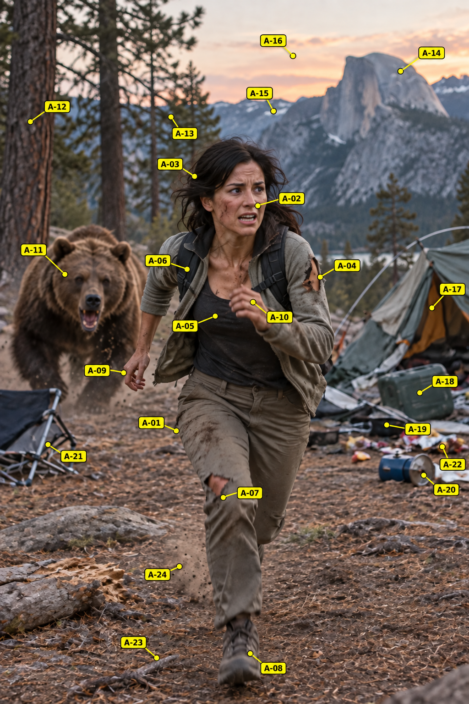

All24 IDs appear. A24 dust pointer is poorly placed; scene texture was redrawn. This image is a generated annotation, not a deterministic overlay. Native Safari request is separate and unverified.

**Inputs:**

- [input](evidence/expanded-experiments/official-references/scene-gpt-image-2-5-sunburst.webp): See exact prompt for assigned role.

**Exact submitted prompt:** [plain text](prompts/trials/mapping-annotation-record--MAP24.txt)

```text
Create an annotated review copy of the attached image. This is a visual map for selecting future edits, not a redesign. Keep its portrait aspect ratio, original picture, people, animals, objects, lighting and geometry. Use small high-contrast badges and thin leader lines with exactly these stable IDs, placing the tips on the named visible elements. Do not add any legend prose inside the picture. Keep the faces and original details readable; use an outer review margin if necessary. The clean original remains the source for later edits.

A-01 running woman, whole figure; A-02 face and expression; A-03 dark windblown hair; A-04 olive torn jacket; A-05 black undershirt; A-06 backpack straps; A-07 tan torn trousers; A-08 front boot; A-09 trailing bare hand at image-left; A-10 raised bare hand near chest; A-11 pursuing brown bear; A-12 large foreground tree trunk at far left; A-13 background pine trees; A-14 distinctive large granite peak upper-right; A-15 distant mountain ridgeline; A-16 sunset sky; A-17 damaged tent at right; A-18 green hard cooler below tent; A-19 dark cooking gear in front of cooler; A-20 blue overturned cooking pot lower-right; A-21 collapsed folding chair lower-left; A-22 scattered food and packaging at right; A-23 foreground dirt path and rocks; A-24 dust behind the runner.

Use every ID exactly once, no duplicates. Label existing visible content only. Do not invent hidden objects or repair the campsite. This is an annotation test: prioritize faithful arrow-to-element correspondence over decorative annotation style.

```

[Source record and checks](evidence/expanded-experiments/records/mapping-annotation-record.json)

<a id="mapping-edit-record--M1"></a>
### mapping-edit-record / M1

**Condition:** see source record · **Status:** completed

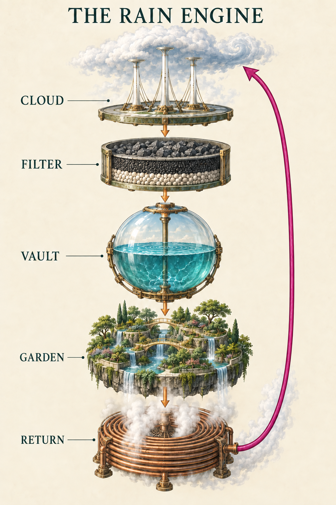

Return arrow becomes deep magenta. All six strings, five tiers, turquoise water and four copper downward arrows remain. Fine water and garden textures are redrawn; no pixel identity claimed.

**Inputs:**

- [input](evidence/image-reconstruction-skill/assets/rain-engine.png): See exact prompt for assigned role.

**Exact submitted prompt:** [plain text](prompts/trials/mapping-edit-record--M1.txt)

```text
Edit the attached clean source image. Apply only the changes below. The source pixels identify the target; inventory IDs and bounding boxes are review aids and must not appear in the artwork.
Preserve the original canvas, crop, unselected objects, readable text, relationships, geometry, lighting and materials except for explicitly permitted consequences.

INPUT ROLES
- A: content, layout, style, palette, material, lighting, typography. Use the clean Rain Engine image for its visible scene, arrangement and appearance. Never copy mapping overlays or interface badges.

REQUESTED CHANGES
- RESTYLE large teal return arrow (A-48) (approximate normalized box [0.698, 0.128, 0.181, 0.768]). Change only this return arrow from turquoise to deep magenta.
  Change only these properties: appearance.color.
  Preserve: Arrow shape, route, width, position, highlight and attachment to the coil; All six text strings; Five tiers, water color, four copper arrows, materials, lighting and crop.

After editing, inspect each requested difference and every protected detail. Do not claim that “unchanged” is guaranteed by a generative edit.
```

[Source record and checks](evidence/expanded-experiments/records/mapping-edit-record.json)

<a id="parent-records--G18"></a>
### parent-records / G18

**Condition:** RGB · **Status:** completed


See the source record and experiment log for the full review.

**Inputs:**

- [input](evidence/expanded-experiments/official-references/shampoo.webp): See exact prompt for assigned role.

**Exact submitted prompt:** [plain text](prompts/trials/parent-records--G18.txt)

```text
Create a polished landscape 3:2 photographic campaign image. Image 1 supplies the exact peach shampoo bottle: preserve its cylindrical proportions, cap, peach color and the visible label spelling. Place one bottle in the lower-middle on a wet dark basalt pedestal. Build an intricate miniature botanical conservatory around it: three tall glass arches in the background, broad fern fronds at image-left, a single pale orchid stem at image-right, and fine suspended water droplets. Late afternoon sunlight from upper-left passes through humid air; glass, droplets and polished basalt have coherent reflections. The bottle is the clear focal point and its front label faces the viewer. Keep every prop behind or beside the bottle rather than covering it. Reserve the top quarter as softly lit atmosphere without lettering. This is a fictional art-directed campaign, not a claim about ingredients. No added words, people, logos or second bottle. Preserve readable source label rather than inventing new brand copy.
```

[Source record and checks](evidence/expanded-experiments/records/parent-records.json)

<a id="parent-records--G19"></a>
### parent-records / G19

**Condition:** RGB · **Status:** completed


See the source record and experiment log for the full review.

**Inputs:**

- [input](evidence/expanded-experiments/continuity/g18.png): See exact prompt for assigned role.

**Exact submitted prompt:** [plain text](prompts/trials/parent-records--G19.txt)

```text
Edit the supplied accepted campaign image. Change only the time and weather from late-afternoon sunlight to a blue-hour rainstorm: cool ambient sky, rain streaks and damp atmospheric haze. Preserve the bottle identity, exact label, cap, position and proportions; pedestal, three glass arches, ferns, orchid, camera, crop and overall composition. Allow physically necessary changes to light, reflections, wet highlights and atmosphere. Keep the label readable without adding a spotlight object. No extra plants, lettering, people or bottles. Return the same 3:2 framing.
```

[Source record and checks](evidence/expanded-experiments/records/parent-records.json)

<a id="parent-records--G20"></a>
### parent-records / G20

**Condition:** RGB · **Status:** completed


See the source record and experiment log for the full review.

**Inputs:**

- No attached input listed in this record; see the prompt and source record for context.

**Exact submitted prompt:** [plain text](prompts/trials/parent-records--G20.txt)

```text
Create a visually rich 3:2 landscape storybook diorama of an Atlas Keeper discovering a floating library at dawn. The Keeper is a small ivory ceramic robot, full body visible in the left foreground, with a round head, two circular eyes (amber on image-left, cyan on image-right), one tiny gold crescent on its forehead, short jointed arms and legs, a teal neckerchief and one red rectangular satchel at its right hip. One hand rests on an open brass compass. In the middle distance a vast circular library is built into a floating stone island: curved shelves, delicate brass bridges, hanging gardens, warm reading-room windows, and a tall central glass dome. A broad stone stair curves from the Keeper toward the library; an immense sea of clouds gives clear depth and scale. Use tactile stop-motion ceramic and paper materials with meticulous miniature details, warm ivory, copper, deep teal and small red accents. Warm sunlight enters from upper-left. Keep the Keeper's eyes, crescent and satchel easy to inspect. One robot only. No people, extra eyes, titles or written labels.
```

[Source record and checks](evidence/expanded-experiments/records/parent-records.json)

<a id="parent-records--G21"></a>
### parent-records / G21

**Condition:** RGB · **Status:** completed


See the source record and experiment log for the full review.

**Inputs:**

- [input](evidence/expanded-experiments/continuity/g20.png): See exact prompt for assigned role.

**Exact submitted prompt:** [plain text](prompts/trials/parent-records--G21.txt)

```text
Use image 1 solely as the Atlas Keeper character reference. Continue the story in a new 3:2 landscape scene: the same small ivory ceramic robot now stands on the right side of a vast midnight observatory, holding its open brass compass in both hands while looking toward an enormous suspended brass armillary sphere at image-left. Preserve the same round head, exactly two round eyes (amber on image-left and cyan on image-right in the visible near-frontal face), one tiny gold forehead crescent, teal neckerchief, short jointed limbs and red rectangular satchel. Surround the observatory with intricate arched shelves, spiral stairs, blue glass star windows and fine brass measuring instruments. Moonlight enters from upper-left; warm lamps give restrained amber accents. Keep tactile ceramic and paper miniature craft, with great depth and readable silhouettes. The original library exterior and cloud sea should not be copied into this new room. Exactly one Keeper and one huge armillary sphere. No added words, people or extra eyes.
```

[Source record and checks](evidence/expanded-experiments/records/parent-records.json)

<a id="parent-records--G22"></a>
### parent-records / G22

**Condition:** RGB · **Status:** completed


See the source record and experiment log for the full review.

**Inputs:**

- [input](evidence/expanded-experiments/official-references/kitchen.webp): See exact prompt for assigned role.

**Exact submitted prompt:** [plain text](prompts/trials/parent-records--G22.txt)

```text
Edit the supplied kitchen photo with two precisely scoped changes. First, recolor the upholstery of all four existing white dining chairs to deep forest green, retaining their exact shapes, stitched channels, positions and black legs. Second, change the black metal cage and chain of the hanging pendant lamp to brushed copper, retaining the lamp's exact geometry and hanging position. Preserve all other source content: four-chair count, circular glass table, striped vase and dried flowers, window frames and outdoor view, refrigerator, cabinetry, globe, countertop, plants, ceiling vent, floor, camera, crop and daylight. Allow local reflections and small color spill needed by the new materials. No other changes; same 4:3 image framing.
```

[Source record and checks](evidence/expanded-experiments/records/parent-records.json)

<a id="parent-records--E22A"></a>
### parent-records / E22A

**Condition:** RGB · **Status:** completed

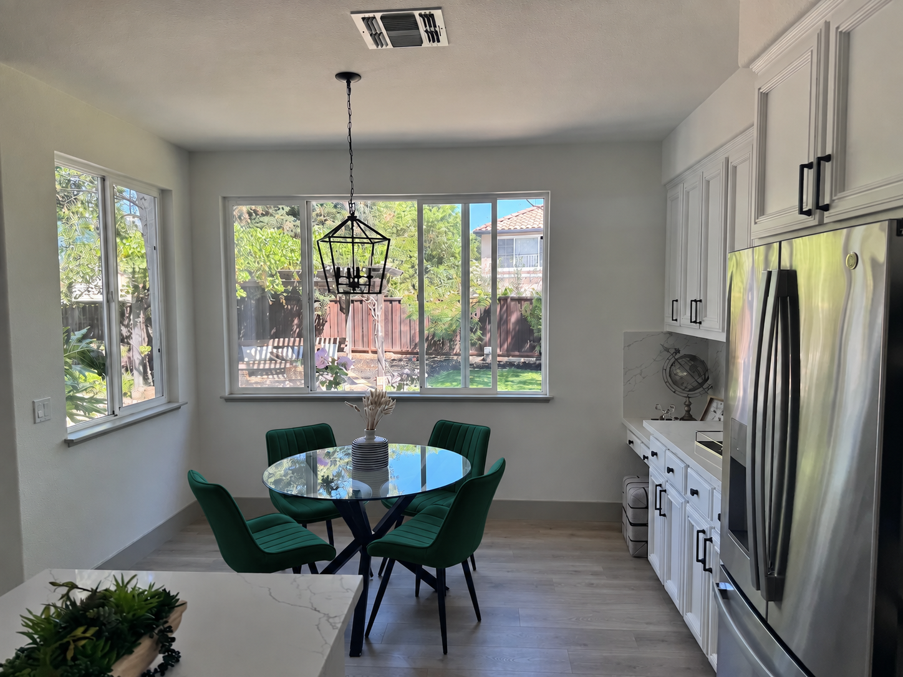

See the source record and experiment log for the full review.

**Inputs:**

- [input](evidence/expanded-experiments/official-references/kitchen.webp): See exact prompt for assigned role.

**Exact submitted prompt:** [plain text](prompts/trials/parent-records--E22A.txt)

```text
Edit the supplied kitchen photo. Recolor only the upholstery of all four white dining chairs to deep forest green. Retain their exact shapes, stitched channels, positions and black legs. Preserve the black pendant lamp, circular glass table, striped vase, dried flowers, windows and outdoor view, refrigerator, cabinetry, globe, countertop, plants, ceiling vent, floor, camera, crop and daylight. Allow only necessary small local reflections from the upholstery. No other changes; keep 4:3 framing.
```

[Source record and checks](evidence/expanded-experiments/records/parent-records.json)

<a id="parent-records--E22B"></a>
### parent-records / E22B

**Condition:** RGB · **Status:** completed


See the source record and experiment log for the full review.

**Inputs:**

- [input](evidence/expanded-experiments/continuity/e22a.png): See exact prompt for assigned role.

**Exact submitted prompt:** [plain text](prompts/trials/parent-records--E22B.txt)

```text
Edit the supplied green-chair kitchen image. Change only the metal cage and chain of the hanging black pendant lamp to brushed copper. Keep the precise lamp shape and hanging position. Preserve all four forest-green chairs, stitched channels and black legs; glass table, striped vase, dried flowers, windows/outdoor view, refrigerator, cabinets, globe, countertop, plants, ceiling vent, floor, crop and daylight. Allow necessary small copper reflections. No other changes. Same 4:3 framing.
```

[Source record and checks](evidence/expanded-experiments/records/parent-records.json)

<a id="parent-records--G23"></a>
### parent-records / G23

**Condition:** RGB · **Status:** completed


See the source record and experiment log for the full review.

**Inputs:**

- [input](evidence/expanded-experiments/continuity/g20.png): See exact prompt for assigned role.

**Exact submitted prompt:** [plain text](prompts/trials/parent-records--G23.txt)

```text
Create a finished portrait 2:3 winter greeting card using image 1 as the Atlas Keeper character identity reference only. Show the same ivory ceramic robot, two colored round eyes, forehead gold crescent, teal scarf and red satchel walking on a snowy stone bridge toward an illuminated glass observatory. Layer intricate dark evergreen silhouettes, drifting snow and a navy twilight sky; warm gold light glows from tiny windows. Use beautifully detailed cut-paper and ceramic miniature illustration with an elegant cream outer paper margin. Reserve the upper 18 percent for the exact heading "WINTER ATLAS" in large refined serif lettering. Below the illustrated scene, typeset exactly "MEET ME WHERE THE LIGHT RETURNS" in small widely spaced uppercase. Those are the only two text strings. One robot, no human figures, no religious symbols. Keep all letters readable, the robot inside the frame, and the source face/outfit recognizable.
```

[Source record and checks](evidence/expanded-experiments/records/parent-records.json)

<a id="parent-records--G24"></a>
### parent-records / G24

**Condition:** RGB · **Status:** completed


See the source record and experiment log for the full review.

**Inputs:**

- [input](evidence/expanded-experiments/continuity/g20.png): See exact prompt for assigned role.

**Exact submitted prompt:** [plain text](prompts/trials/parent-records--G24.txt)

```text
Create a high-end 3:2 landscape studio photograph of a collectible Atlas Keeper toy in a clear molded blister on an off-white illustrated backing card. Image 1 controls the toy character only: ivory ceramic round head, amber image-left eye and cyan image-right eye, one gold forehead crescent, teal neckerchief, short jointed limbs and red rectangular satchel. The figure stands in the left compartment. Three separate accessory compartments stacked at right contain exactly one brass compass, one closed teal book and one tiny copper lantern. Printed heading on the card: "ATLAS KEEPER". Small subtitle: "FIELD EDITION". A single circular badge says "01". No other text. Include a finely drawn faint observatory pattern on the backing without extra letters. Use precise product photography, subtle clear-plastic reflections, paper texture and soft upper-left studio light on a dark teal tabletop. Entire package fully visible, no hands or extra toys. Preserve the character's signature details; do not reproduce the reference environment.
```

[Source record and checks](evidence/expanded-experiments/records/parent-records.json)

<a id="reconstruction-records--R1"></a>
### reconstruction-records / R1

**Condition:** raw_json_without_image · **Status:** rejected_before_image

No saved image for this record. Consult the status and original record before interpreting it.

No generated image. Full evidence JSON exceeded the observed tool prompt limit. This is not an image-quality failure.

**Inputs:**

- No attached input listed in this record; see the prompt and source record for context.

**Exact submitted prompt:** [plain text](prompts/trials/reconstruction-records--R1.txt)

```text
Reconstruct a finished image from this visual reconstruction JSON. No source image is attached: use its visible element descriptions, layout, text, appearance and relationships as the image specification. Do not print JSON keys, file paths, IDs, coordinates or uncertainty notes. Unknown metadata must not be invented as visible content. The JSON describes the desired image, not an API to execute.

{"schema_version": "1.0.0", "document_id": "rain-engine-trial-S2-reconstruction", "revision": 1, "coordinate_system": "normalized_top_left_xywh", "provenance": {"kind": "image_analysis", "note": "Manually inspected the actual generated trial-S2 PNG. Dimensions read from its PNG header; element bounds estimated visually. This is a new visual reconstruction specification, not the original prompt or recovered source layers."}, "intent": {"task": "reconstruct", "purpose": "Recreate the visible Rain Engine atlas illustration with its hierarchy, distinct components, exact labels and flow topology.", "exactness": "perceptual", "exactness_note": "Target recognizable visual fidelity and correct content/relationships. Estimated rectangles do not specify exact silhouettes or promise pixel equality.", "output": {"width_px": 1024, "height_px": 1536, "format": "png", "crop_policy": "preserve"}}, "coverage": {"status": "complete_visible_inventory", "granularity": "50 meaningful editable regions in 10 groups; microtexture, individual rocks, tiny flowers, every fastener and small shelf-like details remain grouped.", "excluded_regions": [], "notes": ["A complete inventory at the declared control granularity, not every pixel or every hidden object.", "Several boxes overlap because the flat illustration contains nested subjects, transparency and occlusion.", "No segmentation, OCR automation, hidden-layer recovery or automatic object detection was performed."]}, "source_images": [{"id": "A", "path": "../assets/rain-engine.png", "version": "trial-S2-clean", "width_px": 1024, "height_px": 1536, "dimensions_basis": "file_metadata", "role": "target", "selected_for_use": true, "allowed_roles": ["content", "layout", "style", "palette", "material", "lighting", "typography"], "scope_note": "Use the clean Rain Engine image for its visible scene, arrangement and appearance. Never copy mapping overlays or interface badges."}], "scene": {"medium": {"value": "Highly detailed natural-history atlas / technical-fantasy illustration, with fine contours, painterly shading and an ivory paper ground.", "status": "inferred", "basis": "visual_estimate", "confidence": "medium", "note": ""}, "composition": {"value": "Tall 2:3 page. Five vertically ordered tiers share a central axis; the title spans the top; five tier labels sit on image-left; a large return arrow climbs image-right.", "status": "observed", "basis": "visual_observation", "confidence": "high", "note": ""}, "view": {"value": "Elevated three-quarter views reveal the tops of circular platforms, vessel and coil.", "status": "inferred", "basis": "visual_estimate", "confidence": "medium", "note": ""}, "lighting": {"value": "Soft broad illumination with pale upper-left highlights, darker undersides and coherent material shading.", "status": "inferred", "basis": "visual_estimate", "confidence": "medium", "note": ""}, "palette": {"value": "Ivory background, dark teal type and leaders, turquoise water and return arrow, warm copper/gold structures, green garden.", "status": "observed", "basis": "visual_observation", "confidence": "high", "note": ""}, "text": {"value": "Only the title and five uppercase tier labels are legible words in this reference.", "status": "observed", "basis": "visual_observation", "confidence": "high", "note": ""}, "camera_lens": {"value": null, "status": "unknown", "basis": "unknown", "confidence": "unknown", "note": "An exact camera/lens cannot be inferred from this illustration."}}, "groups": [{"id": "A-G01", "source_id": "A", "parent_id": null, "name": "Typography and label leaders", "bbox": [0.0537109375, 0.01171875, 0.740234375, 0.875], "geometry_basis": "visual_estimate", "note": "Named control group inferred from the visible composition; not a recovered editable layer."}, {"id": "A-G02", "source_id": "A", "parent_id": null, "name": "Cloud collection tier", "bbox": [0.193359375, 0.048828125, 0.64453125, 0.203125], "geometry_basis": "visual_estimate", "note": "Named control group inferred from the visible composition; not a recovered editable layer."}, {"id": "A-G03", "source_id": "A", "parent_id": null, "name": "Filter tier", "bbox": [0.2958984375, 0.2721354166666667, 0.3935546875, 0.11002604166666667], "geometry_basis": "visual_estimate", "note": "Named control group inferred from the visible composition; not a recovered editable layer."}, {"id": "A-G04", "source_id": "A", "parent_id": null, "name": "Water vault tier", "bbox": [0.3154296875, 0.3984375, 0.3505859375, 0.20247395833333334], "geometry_basis": "visual_estimate", "note": "Named control group inferred from the visible composition; not a recovered editable layer."}, {"id": "A-G05", "source_id": "A", "parent_id": null, "name": "Garden tier", "bbox": [0.251953125, 0.5904947916666666, 0.505859375, 0.205078125], "geometry_basis": "visual_estimate", "note": "Named control group inferred from the visible composition; not a recovered editable layer."}, {"id": "A-G06", "source_id": "A", "parent_id": null, "name": "Return coil and vapor", "bbox": [0.26953125, 0.7239583333333334, 0.626953125, 0.25390625], "geometry_basis": "visual_estimate", "note": "Named control group inferred from the visible composition; not a recovered editable layer."}, {"id": "A-G07", "source_id": "A", "parent_id": null, "name": "Flow arrows", "bbox": [0.47265625, 0.12630208333333334, 0.41015625, 0.7721354166666666], "geometry_basis": "visual_estimate", "note": "Named control group inferred from the visible composition; not a recovered editable layer."}, {"id": "A-G08", "source_id": "A", "parent_id": null, "name": "Background and useful empty regions", "bbox": [0, 0, 1, 1], "geometry_basis": "visual_estimate", "note": "Named control group inferred from the visible composition; not a recovered editable layer."}, {"id": "A-G09", "source_id": "A", "parent_id": "A-G05", "name": "Garden bridges", "bbox": [0.390625, 0.625, 0.19140625, 0.07747395833333333], "geometry_basis": "visual_estimate", "note": "Named control group inferred from the visible composition; not a recovered editable layer."}, {"id": "A-G10", "source_id": "A", "parent_id": "A-G05", "name": "Garden terraces", "bbox": [0.259765625, 0.6412760416666666, 0.47265625, 0.14518229166666666], "geometry_basis": "visual_estimate", "note": "Named control group inferred from the visible composition; not a recovered editable layer."}], "elements": [{"id": "A-01", "source_id": "A", "parent_id": "A-G08", "name": "warm paper background", "kind": "background", "bbox": [0, 0, 1, 1], "geometry_basis": "visual_estimate", "count": 1, "description": {"value": "Continuous pale ivory ground with subtle mottled paper-like texture.", "status": "observed", "basis": "visual_observation", "confidence": "high", "note": ""}, "appearance": {"color": {"value": "ivory", "status": "observed", "basis": "visual_observation", "confidence": "high", "note": ""}, "material": {"value": "paper-like flat ground", "status": "inferred", "basis": "visual_estimate", "confidence": "medium", "note": "Material interpretation based on the illustrated surface; no original rendering material was recovered."}}, "text": null, "occlusion": {"boundary": "complete", "occluded_by": [], "hidden_content": "not_applicable", "note": "Bounds estimate the visible control region, not an isolated silhouette."}, "asset": {"kind": "none", "path": null, "alpha_verified": false, "note": "No layer asset extracted. The HTML mapper shows a bounding crop preview containing neighboring/background pixels."}, "editable_properties": ["appearance.color", "appearance.material", "description", "bbox"], "locked_properties": []}, {"id": "A-02", "source_id": "A", "parent_id": "A-G01", "name": "main title", "kind": "text", "bbox": [0.2021484375, 0.013020833333333334, 0.5869140625, 0.034505208333333336], "geometry_basis": "visual_estimate", "count": 1, "description": {"value": "One large uppercase serif title.", "status": "observed", "basis": "visual_observation", "confidence": "high", "note": ""}, "appearance": {"color": {"value": "very dark teal", "status": "observed", "basis": "visual_observation", "confidence": "high", "note": ""}, "material": {"value": "printed-looking serif letters", "status": "inferred", "basis": "visual_estimate", "confidence": "medium", "note": "Material interpretation based on the illustrated surface; no original rendering material was recovered."}, "font_class": {"value": "Uppercase high-contrast serif; exact family unknown.", "status": "inferred", "basis": "visual_estimate", "confidence": "medium", "note": ""}}, "text": {"transcript": "THE RAIN ENGINE", "certainty": "exact", "uncertain_spans": [], "line_breaks_preserved": true}, "occlusion": {"boundary": "complete", "occluded_by": [], "hidden_content": "not_applicable", "note": "Bounds estimate the visible control region, not an isolated silhouette."}, "asset": {"kind": "none", "path": null, "alpha_verified": false, "note": "No layer asset extracted. The HTML mapper shows a bounding crop preview containing neighboring/background pixels."}, "editable_properties": ["text", "appearance.color", "appearance.font_class", "bbox"], "locked_properties": []}, {"id": "A-03", "source_id": "A", "parent_id": "A-G01", "name": "CLOUD label", "kind": "text", "bbox": [0.05859375, 0.1875, 0.1337890625, 0.022135416666666668], "geometry_basis": "visual_estimate", "count": 1, "description": {"value": "Uppermost left tier label.", "status": "observed", "basis": "visual_observation", "confidence": "high", "note": ""}, "appearance": {"color": {"value": "very dark teal", "status": "observed", "basis": "visual_observation", "confidence": "high", "note": ""}, "material": {"value": "serif letters", "status": "inferred", "basis": "visual_estimate", "confidence": "medium", "note": "Material interpretation based on the illustrated surface; no original rendering material was recovered."}, "font_class": {"value": "Uppercase high-contrast serif; exact family unknown.", "status": "inferred", "basis": "visual_estimate", "confidence": "medium", "note": ""}}, "text": {"transcript": "CLOUD", "certainty": "exact", "uncertain_spans": [], "line_breaks_preserved": true}, "occlusion": {"boundary": "complete", "occluded_by": [], "hidden_content": "not_applicable", "note": "Bounds estimate the visible control region, not an isolated silhouette."}, "asset": {"kind": "none", "path": null, "alpha_verified": false, "note": "No layer asset extracted. The HTML mapper shows a bounding crop preview containing neighboring/background pixels."}, "editable_properties": ["text", "appearance.color", "appearance.font_class", "bbox"], "locked_properties": []}, {"id": "A-04", "source_id": "A", "parent_id": "A-G01", "name": "FILTER label", "kind": "text", "bbox": [0.05859375, 0.3131510416666667, 0.130859375, 0.024739583333333332], "geometry_basis": "visual_estimate", "count": 1, "description": {"value": "Second left tier label.", "status": "observed", "basis": "visual_observation", "confidence": "high", "note": ""}, "appearance": {"color": {"value": "very dark teal", "status": "observed", "basis": "visual_observation", "confidence": "high", "note": ""}, "material": {"value": "serif letters", "status": "inferred", "basis": "visual_estimate", "confidence": "medium", "note": "Material interpretation based on the illustrated surface; no original rendering material was recovered."}, "font_class": {"value": "Uppercase high-contrast serif; exact family unknown.", "status": "inferred", "basis": "visual_estimate", "confidence": "medium", "note": ""}}, "text": {"transcript": "FILTER", "certainty": "exact", "uncertain_spans": [], "line_breaks_preserved": true}, "occlusion": {"boundary": "complete", "occluded_by": [], "hidden_content": "not_applicable", "note": "Bounds estimate the visible control region, not an isolated silhouette."}, "asset": {"kind": "none", "path": null, "alpha_verified": false, "note": "No layer asset extracted. The HTML mapper shows a bounding crop preview containing neighboring/background pixels."}, "editable_properties": ["text", "appearance.color", "appearance.font_class", "bbox"], "locked_properties": []}, {"id": "A-05", "source_id": "A", "parent_id": "A-G01", "name": "VAULT label", "kind": "text", "bbox": [0.05859375, 0.4954427083333333, 0.12109375, 0.024739583333333332], "geometry_basis": "visual_estimate", "count": 1, "description": {"value": "Middle left tier label.", "status": "observed", "basis": "visual_observation", "confidence": "high", "note": ""}, "appearance": {"color": {"value": "very dark teal", "status": "observed", "basis": "visual_observation", "confidence": "high", "note": ""}, "material": {"value": "serif letters", "status": "inferred", "basis": "visual_estimate", "confidence": "medium", "note": "Material interpretation based on the illustrated surface; no original rendering material was recovered."}, "font_class": {"value": "Uppercase high-contrast serif; exact family unknown.", "status": "inferred", "basis": "visual_estimate", "confidence": "medium", "note": ""}}, "text": {"transcript": "VAULT", "certainty": "exact", "uncertain_spans": [], "line_breaks_preserved": true}, "occlusion": {"boundary": "complete", "occluded_by": [], "hidden_content": "not_applicable", "note": "Bounds estimate the visible control region, not an isolated silhouette."}, "asset": {"kind": "none", "path": null, "alpha_verified": false, "note": "No layer asset extracted. The HTML mapper shows a bounding crop preview containing neighboring/background pixels."}, "editable_properties": ["text", "appearance.color", "appearance.font_class", "bbox"], "locked_properties": []}, {"id": "A-06", "source_id": "A", "parent_id": "A-G01", "name": "GARDEN label", "kind": "text", "bbox": [0.0576171875, 0.6966145833333334, 0.13671875, 0.024739583333333332], "geometry_basis": "visual_estimate", "count": 1, "description": {"value": "Fourth left tier label.", "status": "observed", "basis": "visual_observation", "confidence": "high", "note": ""}, "appearance": {"color": {"value": "very dark teal", "status": "observed", "basis": "visual_observation", "confidence": "high", "note": ""}, "material": {"value": "serif letters", "status": "inferred", "basis": "visual_estimate", "confidence": "medium", "note": "Material interpretation based on the illustrated surface; no original rendering material was recovered."}, "font_class": {"value": "Uppercase high-contrast serif; exact family unknown.", "status": "inferred", "basis": "visual_estimate", "confidence": "medium", "note": ""}}, "text": {"transcript": "GARDEN", "certainty": "exact", "uncertain_spans": [], "line_breaks_preserved": true}, "occlusion": {"boundary": "complete", "occluded_by": [], "hidden_content": "not_applicable", "note": "Bounds estimate the visible control region, not an isolated silhouette."}, "asset": {"kind": "none", "path": null, "alpha_verified": false, "note": "No layer asset extracted. The HTML mapper shows a bounding crop preview containing neighboring/background pixels."}, "editable_properties": ["text", "appearance.color", "appearance.font_class", "bbox"], "locked_properties": []}, {"id": "A-07", "source_id": "A", "parent_id": "A-G01", "name": "RETURN label", "kind": "text", "bbox": [0.05859375, 0.8600260416666666, 0.1357421875, 0.025390625], "geometry_basis": "visual_estimate", "count": 1, "description": {"value": "Lowest left tier label.", "status": "observed", "basis": "visual_observation", "confidence": "high", "note": ""}, "appearance": {"color": {"value": "very dark teal", "status": "observed", "basis": "visual_observation", "confidence": "high", "note": ""}, "material": {"value": "serif letters", "status": "inferred", "basis": "visual_estimate", "confidence": "medium", "note": "Material interpretation based on the illustrated surface; no original rendering material was recovered."}, "font_class": {"value": "Uppercase high-contrast serif; exact family unknown.", "status": "inferred", "basis": "visual_estimate", "confidence": "medium", "note": ""}}, "text": {"transcript": "RETURN", "certainty": "exact", "uncertain_spans": [], "line_breaks_preserved": true}, "occlusion": {"boundary": "complete", "occluded_by": [], "hidden_content": "not_applicable", "note": "Bounds estimate the visible control region, not an isolated silhouette."}, "asset": {"kind": "none", "path": null, "alpha_verified": false, "note": "No layer asset extracted. The HTML mapper shows a bounding crop preview containing neighboring/background pixels."}, "editable_properties": ["text", "appearance.color", "appearance.font_class", "bbox"], "locked_properties": []}, {"id": "A-08", "source_id": "A", "parent_id": "A-G01", "name": "CLOUD leader and dot", "kind": "connector", "bbox": [0.19921875, 0.19661458333333334, 0.12890625, 0.006510416666666667], "geometry_basis": "visual_estimate", "count": 1, "description": {"value": "One fine horizontal line with a dark dot at its image-right end.", "status": "observed", "basis": "visual_observation", "confidence": "high", "note": ""}, "appearance": {"color": {"value": "dark teal", "status": "observed", "basis": "visual_observation", "confidence": "high", "note": ""}, "material": {"value": "thin line", "status": "inferred", "basis": "visual_estimate", "confidence": "medium", "note": "Material interpretation based on the illustrated surface; no original rendering material was recovered."}}, "text": null, "occlusion": {"boundary": "complete", "occluded_by": [], "hidden_content": "not_applicable", "note": "Bounds estimate the visible control region, not an isolated silhouette."}, "asset": {"kind": "none", "path": null, "alpha_verified": false, "note": "No layer asset extracted. The HTML mapper shows a bounding crop preview containing neighboring/background pixels."}, "editable_properties": ["appearance.color", "appearance.material", "description", "bbox"], "locked_properties": []}, {"id": "A-09", "source_id": "A", "parent_id": "A-G01", "name": "FILTER leader and dot", "kind": "connector", "bbox": [0.197265625, 0.3229166666666667, 0.0986328125, 0.006510416666666667], "geometry_basis": "visual_estimate", "count": 1, "description": {"value": "One fine horizontal line with a dark dot at its image-right end.", "status": "observed", "basis": "visual_observation", "confidence": "high", "note": ""}, "appearance": {"color": {"value": "dark teal", "status": "observed", "basis": "visual_observation", "confidence": "high", "note": ""}, "material": {"value": "thin line", "status": "inferred", "basis": "visual_estimate", "confidence": "medium", "note": "Material interpretation based on the illustrated surface; no original rendering material was recovered."}}, "text": null, "occlusion": {"boundary": "complete", "occluded_by": [], "hidden_content": "not_applicable", "note": "Bounds estimate the visible control region, not an isolated silhouette."}, "asset": {"kind": "none", "path": null, "alpha_verified": false, "note": "No layer asset extracted. The HTML mapper shows a bounding crop preview containing neighboring/background pixels."}, "editable_properties": ["appearance.color", "appearance.material", "description", "bbox"], "locked_properties": []}, {"id": "A-10", "source_id": "A", "parent_id": "A-G01", "name": "VAULT leader and dot", "kind": "connector", "bbox": [0.1953125, 0.50390625, 0.1142578125, 0.006510416666666667], "geometry_basis": "visual_estimate", "count": 1, "description": {"value": "One fine horizontal line with a dark dot at its image-right end.", "status": "observed", "basis": "visual_observation", "confidence": "high", "note": ""}, "appearance": {"color": {"value": "dark teal", "status": "observed", "basis": "visual_observation", "confidence": "high", "note": ""}, "material": {"value": "thin line", "status": "inferred", "basis": "visual_estimate", "confidence": "medium", "note": "Material interpretation based on the illustrated surface; no original rendering material was recovered."}}, "text": null, "occlusion": {"boundary": "complete", "occluded_by": [], "hidden_content": "not_applicable", "note": "Bounds estimate the visible control region, not an isolated silhouette."}, "asset": {"kind": "none", "path": null, "alpha_verified": false, "note": "No layer asset extracted. The HTML mapper shows a bounding crop preview containing neighboring/background pixels."}, "editable_properties": ["appearance.color", "appearance.material", "description", "bbox"], "locked_properties": []}, {"id": "A-11", "source_id": "A", "parent_id": "A-G01", "name": "GARDEN leader and dot", "kind": "connector", "bbox": [0.2001953125, 0.705078125, 0.0537109375, 0.006510416666666667], "geometry_basis": "visual_estimate", "count": 1, "description": {"value": "One short horizontal line with a dark dot at its image-right end.", "status": "observed", "basis": "visual_observation", "confidence": "high", "note": ""}, "appearance": {"color": {"value": "dark teal", "status": "observed", "basis": "visual_observation", "confidence": "high", "note": ""}, "material": {"value": "thin line", "status": "inferred", "basis": "visual_estimate", "confidence": "medium", "note": "Material interpretation based on the illustrated surface; no original rendering material was recovered."}}, "text": null, "occlusion": {"boundary": "complete", "occluded_by": [], "hidden_content": "not_applicable", "note": "Bounds estimate the visible control region, not an isolated silhouette."}, "asset": {"kind": "none", "path": null, "alpha_verified": false, "note": "No layer asset extracted. The HTML mapper shows a bounding crop preview containing neighboring/background pixels."}, "editable_properties": ["appearance.color", "appearance.material", "description", "bbox"], "locked_properties": []}, {"id": "A-12", "source_id": "A", "parent_id": "A-G01", "name": "RETURN leader and dot", "kind": "connector", "bbox": [0.2001953125, 0.8671875, 0.0849609375, 0.007161458333333333], "geometry_basis": "visual_estimate", "count": 1, "description": {"value": "One fine horizontal line with a dark dot at its image-right end.", "status": "observed", "basis": "visual_observation", "confidence": "high", "note": ""}, "appearance": {"color": {"value": "dark teal", "status": "observed", "basis": "visual_observation", "confidence": "high", "note": ""}, "material": {"value": "thin line", "status": "inferred", "basis": "visual_estimate", "confidence": "medium", "note": "Material interpretation based on the illustrated surface; no original rendering material was recovered."}}, "text": null, "occlusion": {"boundary": "complete", "occluded_by": [], "hidden_content": "not_applicable", "note": "Bounds estimate the visible control region, not an isolated silhouette."}, "asset": {"kind": "none", "path": null, "alpha_verified": false, "note": "No layer asset extracted. The HTML mapper shows a bounding crop preview containing neighboring/background pixels."}, "editable_properties": ["appearance.color", "appearance.material", "description", "bbox"], "locked_properties": []}, {"id": "A-13", "source_id": "A", "parent_id": "A-G02", "name": "curling cloud mass", "kind": "object", "bbox": [0.1953125, 0.050130208333333336, 0.6416015625, 0.15104166666666666], "geometry_basis": "visual_estimate", "count": 1, "description": {"value": "One connected billowing cloud mass, with a curled spiral-like lobe on image-right.", "status": "observed", "basis": "visual_observation", "confidence": "high", "note": ""}, "appearance": {"color": {"value": "cool white and blue gray", "status": "observed", "basis": "visual_observation", "confidence": "high", "note": ""}, "material": {"value": "soft cloud vapor", "status": "inferred", "basis": "visual_estimate", "confidence": "medium", "note": "Material interpretation based on the illustrated surface; no original rendering material was recovered."}}, "text": null, "occlusion": {"boundary": "partly_occluded", "occluded_by": ["A-14", "A-15", "A-16"], "hidden_content": "unknown", "note": "Masts and braces cover parts of the cloud; hidden cloud structure is unknown."}, "asset": {"kind": "none", "path": null, "alpha_verified": false, "note": "No layer asset extracted. The HTML mapper shows a bounding crop preview containing neighboring/background pixels."}, "editable_properties": ["appearance.color", "appearance.material", "description", "bbox"], "locked_properties": []}, {"id": "A-14", "source_id": "A", "parent_id": "A-G02", "name": "left collection mast", "kind": "object", "bbox": [0.3564453125, 0.11588541666666667, 0.0927734375, 0.10807291666666667], "geometry_basis": "visual_estimate", "count": 1, "description": {"value": "One tall slender pale mast with a flared dish-like top and narrow gold-colored support braces.", "status": "observed", "basis": "visual_observation", "confidence": "high", "note": ""}, "appearance": {"color": {"value": "pale silver and warm gold", "status": "observed", "basis": "visual_observation", "confidence": "high", "note": ""}, "material": {"value": "polished-looking metal", "status": "inferred", "basis": "visual_estimate", "confidence": "medium", "note": "Material interpretation based on the illustrated surface; no original rendering material was recovered."}}, "text": null, "occlusion": {"boundary": "complete", "occluded_by": [], "hidden_content": "not_applicable", "note": "Bounds estimate the visible control region, not an isolated silhouette."}, "asset": {"kind": "none", "path": null, "alpha_verified": false, "note": "No layer asset extracted. The HTML mapper shows a bounding crop preview containing neighboring/background pixels."}, "editable_properties": ["appearance.color", "appearance.material", "description", "bbox"], "locked_properties": []}, {"id": "A-15", "source_id": "A", "parent_id": "A-G02", "name": "central collection mast", "kind": "object", "bbox": [0.4443359375, 0.09244791666666667, 0.0927734375, 0.13736979166666666], "geometry_basis": "visual_estimate", "count": 1, "description": {"value": "One central pale mast, the tallest of the three, with flared top and gold-colored support braces.", "status": "observed", "basis": "visual_observation", "confidence": "high", "note": ""}, "appearance": {"color": {"value": "pale silver and warm gold", "status": "observed", "basis": "visual_observation", "confidence": "high", "note": ""}, "material": {"value": "polished-looking metal", "status": "inferred", "basis": "visual_estimate", "confidence": "medium", "note": "Material interpretation based on the illustrated surface; no original rendering material was recovered."}}, "text": null, "occlusion": {"boundary": "complete", "occluded_by": [], "hidden_content": "not_applicable", "note": "Bounds estimate the visible control region, not an isolated silhouette."}, "asset": {"kind": "none", "path": null, "alpha_verified": false, "note": "No layer asset extracted. The HTML mapper shows a bounding crop preview containing neighboring/background pixels."}, "editable_properties": ["appearance.color", "appearance.material", "description", "bbox"], "locked_properties": []}, {"id": "A-16", "source_id": "A", "parent_id": "A-G02", "name": "right collection mast", "kind": "object", "bbox": [0.52734375, 0.11263020833333333, 0.0947265625, 0.11328125], "geometry_basis": "visual_estimate", "count": 1, "description": {"value": "One tall slender pale mast with a flared top and gold-colored support braces.", "status": "observed", "basis": "visual_observation", "confidence": "high", "note": ""}, "appearance": {"color": {"value": "pale silver and warm gold", "status": "observed", "basis": "visual_observation", "confidence": "high", "note": ""}, "material": {"value": "polished-looking metal", "status": "inferred", "basis": "visual_estimate", "confidence": "medium", "note": "Material interpretation based on the illustrated surface; no original rendering material was recovered."}}, "text": null, "occlusion": {"boundary": "complete", "occluded_by": [], "hidden_content": "not_applicable", "note": "Bounds estimate the visible control region, not an isolated silhouette."}, "asset": {"kind": "none", "path": null, "alpha_verified": false, "note": "No layer asset extracted. The HTML mapper shows a bounding crop preview containing neighboring/background pixels."}, "editable_properties": ["appearance.color", "appearance.material", "description", "bbox"], "locked_properties": []}, {"id": "A-17", "source_id": "A", "parent_id": "A-G02", "name": "mast support platform", "kind": "object", "bbox": [0.2900390625, 0.205078125, 0.4072265625, 0.045572916666666664], "geometry_basis": "visual_estimate", "count": 1, "description": {"value": "One broad shallow circular platform viewed from above, with a green-gray rim, ornate fittings and brass-colored edge pieces.", "status": "observed", "basis": "visual_observation", "confidence": "high", "note": ""}, "appearance": {"color": {"value": "muted green-gray and gold", "status": "observed", "basis": "visual_observation", "confidence": "high", "note": ""}, "material": {"value": "aged metal and stone-like inset", "status": "inferred", "basis": "visual_estimate", "confidence": "medium", "note": "Material interpretation based on the illustrated surface; no original rendering material was recovered."}}, "text": null, "occlusion": {"boundary": "complete", "occluded_by": [], "hidden_content": "not_applicable", "note": "Bounds estimate the visible control region, not an isolated silhouette."}, "asset": {"kind": "none", "path": null, "alpha_verified": false, "note": "No layer asset extracted. The HTML mapper shows a bounding crop preview containing neighboring/background pixels."}, "editable_properties": ["appearance.color", "appearance.material", "description", "bbox"], "locked_properties": []}, {"id": "A-18", "source_id": "A", "parent_id": "A-G03", "name": "rough upper filter stones", "kind": "repeated_detail", "bbox": [0.3115234375, 0.2734375, 0.3642578125, 0.041666666666666664], "geometry_basis": "visual_estimate", "count": null, "description": {"value": "A dense upper layer of irregular rough dark rocks; individual stones are grouped for editing.", "status": "observed", "basis": "visual_observation", "confidence": "high", "note": ""}, "appearance": {"color": {"value": "charcoal gray", "status": "observed", "basis": "visual_observation", "confidence": "high", "note": ""}, "material": {"value": "rough stone", "status": "inferred", "basis": "visual_estimate", "confidence": "medium", "note": "Material interpretation based on the illustrated surface; no original rendering material was recovered."}}, "text": null, "occlusion": {"boundary": "partly_occluded", "occluded_by": ["A-21"], "hidden_content": "unknown", "note": "The cage rim covers the outer stone layer."}, "asset": {"kind": "none", "path": null, "alpha_verified": false, "note": "No layer asset extracted. The HTML mapper shows a bounding crop preview containing neighboring/background pixels."}, "editable_properties": ["appearance.color", "appearance.material", "description", "bbox"], "locked_properties": []}, {"id": "A-19", "source_id": "A", "parent_id": "A-G03", "name": "dark granular filter band", "kind": "repeated_detail", "bbox": [0.3291015625, 0.3098958333333333, 0.3310546875, 0.034505208333333336], "geometry_basis": "visual_estimate", "count": null, "description": {"value": "A distinct middle band of small dark grains.", "status": "observed", "basis": "visual_observation", "confidence": "high", "note": ""}, "appearance": {"color": {"value": "near-black and charcoal", "status": "observed", "basis": "visual_observation", "confidence": "high", "note": ""}, "material": {"value": "granular filter medium", "status": "inferred", "basis": "visual_estimate", "confidence": "medium", "note": "Material interpretation based on the illustrated surface; no original rendering material was recovered."}}, "text": null, "occlusion": {"boundary": "partly_occluded", "occluded_by": ["A-21"], "hidden_content": "unknown", "note": "The structural bars cross the granular band."}, "asset": {"kind": "none", "path": null, "alpha_verified": false, "note": "No layer asset extracted. The HTML mapper shows a bounding crop preview containing neighboring/background pixels."}, "editable_properties": ["appearance.color", "appearance.material", "description", "bbox"], "locked_properties": []}, {"id": "A-20", "source_id": "A", "parent_id": "A-G03", "name": "pale lower filter pebbles", "kind": "repeated_detail", "bbox": [0.3291015625, 0.3365885416666667, 0.33203125, 0.03515625], "geometry_basis": "visual_estimate", "count": null, "description": {"value": "A distinct lower band of small pale rounded pebbles.", "status": "observed", "basis": "visual_observation", "confidence": "high", "note": ""}, "appearance": {"color": {"value": "cream and off-white", "status": "observed", "basis": "visual_observation", "confidence": "high", "note": ""}, "material": {"value": "rounded porous-looking pebbles", "status": "inferred", "basis": "visual_estimate", "confidence": "medium", "note": "Material interpretation based on the illustrated surface; no original rendering material was recovered."}}, "text": null, "occlusion": {"boundary": "partly_occluded", "occluded_by": ["A-21"], "hidden_content": "unknown", "note": "The lower rim and side supports cover parts of the pebble band."}, "asset": {"kind": "none", "path": null, "alpha_verified": false, "note": "No layer asset extracted. The HTML mapper shows a bounding crop preview containing neighboring/background pixels."}, "editable_properties": ["appearance.color", "appearance.material", "description", "bbox"], "locked_properties": []}, {"id": "A-21", "source_id": "A", "parent_id": "A-G03", "name": "filter cylinder frame", "kind": "object", "bbox": [0.2978515625, 0.2734375, 0.390625, 0.10807291666666667], "geometry_basis": "visual_estimate", "count": 1, "description": {"value": "An open cylindrical cage with broad top and bottom rings, side supports, rivets and pale green-gray trim surrounding the filter material.", "status": "observed", "basis": "visual_observation", "confidence": "high", "note": ""}, "appearance": {"color": {"value": "brass gold and muted green-gray", "status": "observed", "basis": "visual_observation", "confidence": "high", "note": ""}, "material": {"value": "aged metal", "status": "inferred", "basis": "visual_estimate", "confidence": "medium", "note": "Material interpretation based on the illustrated surface; no original rendering material was recovered."}}, "text": null, "occlusion": {"boundary": "complete", "occluded_by": [], "hidden_content": "not_applicable", "note": "Bounds estimate the visible control region, not an isolated silhouette."}, "asset": {"kind": "none", "path": null, "alpha_verified": false, "note": "No layer asset extracted. The HTML mapper shows a bounding crop preview containing neighboring/background pixels."}, "editable_properties": ["appearance.color", "appearance.material", "description", "bbox"], "locked_properties": []}, {"id": "A-22", "source_id": "A", "parent_id": "A-G04", "name": "transparent spherical vessel", "kind": "object", "bbox": [0.3232421875, 0.4055989583333333, 0.3369140625, 0.17903645833333334], "geometry_basis": "visual_estimate", "count": 1, "description": {"value": "One spherical transparent shell with reflective white strokes and a visible domed upper half.", "status": "observed", "basis": "visual_observation", "confidence": "high", "note": ""}, "appearance": {"color": {"value": "transparent with pale cyan highlights", "status": "observed", "basis": "visual_observation", "confidence": "high", "note": ""}, "material": {"value": "clear glass", "status": "inferred", "basis": "visual_estimate", "confidence": "medium", "note": "Material interpretation based on the illustrated surface; no original rendering material was recovered."}}, "text": null, "occlusion": {"boundary": "partly_occluded", "occluded_by": ["A-25"], "hidden_content": "unknown", "note": "The metal support fittings overlap the glass outline."}, "asset": {"kind": "none", "path": null, "alpha_verified": false, "note": "No layer asset extracted. The HTML mapper shows a bounding crop preview containing neighboring/background pixels."}, "editable_properties": ["appearance.color", "appearance.material", "description", "bbox"], "locked_properties": []}, {"id": "A-23", "source_id": "A", "parent_id": "A-G04", "name": "water and circular surface", "kind": "object", "bbox": [0.33203125, 0.4811197916666667, 0.3125, 0.09765625], "geometry_basis": "visual_estimate", "count": 1, "description": {"value": "Teal water fills approximately the lower half of the sphere, with an elliptical rippling waterline and bright caustic-like strokes.", "status": "observed", "basis": "visual_observation", "confidence": "high", "note": ""}, "appearance": {"color": {"value": "turquoise and deep teal", "status": "observed", "basis": "visual_observation", "confidence": "high", "note": ""}, "material": {"value": "water", "status": "inferred", "basis": "visual_estimate", "confidence": "medium", "note": "Material interpretation based on the illustrated surface; no original rendering material was recovered."}}, "text": null, "occlusion": {"boundary": "partly_occluded", "occluded_by": ["A-24", "A-25"], "hidden_content": "unknown", "note": "The central pipe and support fittings interrupt the visible water."}, "asset": {"kind": "none", "path": null, "alpha_verified": false, "note": "No layer asset extracted. The HTML mapper shows a bounding crop preview containing neighboring/background pixels."}, "editable_properties": ["appearance.color", "appearance.material", "description", "bbox"], "locked_properties": []}, {"id": "A-24", "source_id": "A", "parent_id": "A-G04", "name": "central vertical vault pipe", "kind": "object", "bbox": [0.474609375, 0.4029947916666667, 0.0341796875, 0.17838541666666666], "geometry_basis": "visual_estimate", "count": 1, "description": {"value": "One narrow gold-colored vertical pipe runs through the center of the vessel.", "status": "observed", "basis": "visual_observation", "confidence": "high", "note": ""}, "appearance": {"color": {"value": "brass gold", "status": "observed", "basis": "visual_observation", "confidence": "high", "note": ""}, "material": {"value": "metal", "status": "inferred", "basis": "visual_estimate", "confidence": "medium", "note": "Material interpretation based on the illustrated surface; no original rendering material was recovered."}}, "text": null, "occlusion": {"boundary": "complete", "occluded_by": [], "hidden_content": "not_applicable", "note": "Bounds estimate the visible control region, not an isolated silhouette."}, "asset": {"kind": "none", "path": null, "alpha_verified": false, "note": "No layer asset extracted. The HTML mapper shows a bounding crop preview containing neighboring/background pixels."}, "editable_properties": ["appearance.color", "appearance.material", "description", "bbox"], "locked_properties": []}, {"id": "A-25", "source_id": "A", "parent_id": "A-G04", "name": "vault support fittings", "kind": "object", "bbox": [0.3173828125, 0.3997395833333333, 0.345703125, 0.19986979166666666], "geometry_basis": "visual_estimate", "count": 1, "description": {"value": "Gold-colored rings, side brackets, top cap and lower cradle hold the spherical vessel.", "status": "observed", "basis": "visual_observation", "confidence": "high", "note": ""}, "appearance": {"color": {"value": "brass gold", "status": "observed", "basis": "visual_observation", "confidence": "high", "note": ""}, "material": {"value": "aged metal", "status": "inferred", "basis": "visual_estimate", "confidence": "medium", "note": "Material interpretation based on the illustrated surface; no original rendering material was recovered."}}, "text": null, "occlusion": {"boundary": "complete", "occluded_by": [], "hidden_content": "not_applicable", "note": "Bounds estimate the visible control region, not an isolated silhouette."}, "asset": {"kind": "none", "path": null, "alpha_verified": false, "note": "No layer asset extracted. The HTML mapper shows a bounding crop preview containing neighboring/background pixels."}, "editable_properties": ["appearance.color", "appearance.material", "description", "bbox"], "locked_properties": []}, {"id": "A-26", "source_id": "A", "parent_id": "A-G05", "name": "floating garden landmass", "kind": "object", "bbox": [0.25390625, 0.5944010416666666, 0.5, 0.19921875], "geometry_basis": "visual_estimate", "count": 1, "description": {"value": "One floating rocky garden island with stepped round terraces, dense planting and exposed hanging cliff edges.", "status": "observed", "basis": "visual_observation", "confidence": "high", "note": ""}, "appearance": {"color": {"value": "leaf green, warm stone and turquoise", "status": "observed", "basis": "visual_observation", "confidence": "high", "note": ""}, "material": {"value": "rock, soil and vegetation", "status": "inferred", "basis": "visual_estimate", "confidence": "medium", "note": "Material interpretation based on the illustrated surface; no original rendering material was recovered."}}, "text": null, "occlusion": {"boundary": "partly_occluded", "occluded_by": ["A-27", "A-28", "A-29", "A-30", "A-31", "A-32", "A-33", "A-37", "A-38"], "hidden_content": "unknown", "note": "Vegetation, bridges and terraces hide portions of the rocky island."}, "asset": {"kind": "none", "path": null, "alpha_verified": false, "note": "No layer asset extracted. The HTML mapper shows a bounding crop preview containing neighboring/background pixels."}, "editable_properties": ["appearance.color", "appearance.material", "description", "bbox"], "locked_properties": []}, {"id": "A-27", "source_id": "A", "parent_id": "A-G09", "name": "upper arched garden bridge", "kind": "object", "bbox": [0.4306640625, 0.6276041666666666, 0.1064453125, 0.026692708333333332], "geometry_basis": "visual_estimate", "count": 1, "description": {"value": "One small warm gold-colored arched pedestrian bridge with fine railings.", "status": "observed", "basis": "visual_observation", "confidence": "high", "note": ""}, "appearance": {"color": {"value": "warm gold", "status": "observed", "basis": "visual_observation", "confidence": "high", "note": ""}, "material": {"value": "metal railings", "status": "inferred", "basis": "visual_estimate", "confidence": "medium", "note": "Material interpretation based on the illustrated surface; no original rendering material was recovered."}}, "text": null, "occlusion": {"boundary": "complete", "occluded_by": [], "hidden_content": "not_applicable", "note": "Bounds estimate the visible control region, not an isolated silhouette."}, "asset": {"kind": "none", "path": null, "alpha_verified": false, "note": "No layer asset extracted. The HTML mapper shows a bounding crop preview containing neighboring/background pixels."}, "editable_properties": ["appearance.color", "appearance.material", "description", "bbox"], "locked_properties": []}, {"id": "A-28", "source_id": "A", "parent_id": "A-G09", "name": "front arched garden bridge", "kind": "object", "bbox": [0.3935546875, 0.6686197916666666, 0.1845703125, 0.030598958333333332], "geometry_basis": "visual_estimate", "count": 1, "description": {"value": "One wider warm gold-colored arched bridge spanning the central stream, with delicate repeating balusters.", "status": "observed", "basis": "visual_observation", "confidence": "high", "note": ""}, "appearance": {"color": {"value": "warm gold", "status": "observed", "basis": "visual_observation", "confidence": "high", "note": ""}, "material": {"value": "metal railings", "status": "inferred", "basis": "visual_estimate", "confidence": "medium", "note": "Material interpretation based on the illustrated surface; no original rendering material was recovered."}}, "text": null, "occlusion": {"boundary": "complete", "occluded_by": [], "hidden_content": "not_applicable", "note": "Bounds estimate the visible control region, not an isolated silhouette."}, "asset": {"kind": "none", "path": null, "alpha_verified": false, "note": "No layer asset extracted. The HTML mapper shows a bounding crop preview containing neighboring/background pixels."}, "editable_properties": ["appearance.color", "appearance.material", "description", "bbox"], "locked_properties": []}, {"id": "A-29", "source_id": "A", "parent_id": "A-G10", "name": "upper-left round terrace", "kind": "object", "bbox": [0.3359375, 0.642578125, 0.1025390625, 0.040364583333333336], "geometry_basis": "visual_estimate", "count": 1, "description": {"value": "A raised circular stone terrace with a planted rim and water spilling from its edge.", "status": "observed", "basis": "visual_observation", "confidence": "high", "note": ""}, "appearance": {"color": {"value": "warm pale stone and green", "status": "observed", "basis": "visual_observation", "confidence": "high", "note": ""}, "material": {"value": "masonry and vegetation", "status": "inferred", "basis": "visual_estimate", "confidence": "medium", "note": "Material interpretation based on the illustrated surface; no original rendering material was recovered."}}, "text": null, "occlusion": {"boundary": "complete", "occluded_by": [], "hidden_content": "not_applicable", "note": "Bounds estimate the visible control region, not an isolated silhouette."}, "asset": {"kind": "none", "path": null, "alpha_verified": false, "note": "No layer asset extracted. The HTML mapper shows a bounding crop preview containing neighboring/background pixels."}, "editable_properties": ["appearance.color", "appearance.material", "description", "bbox"], "locked_properties": []}, {"id": "A-30", "source_id": "A", "parent_id": "A-G10", "name": "upper-right round terrace", "kind": "object", "bbox": [0.5380859375, 0.64453125, 0.14453125, 0.055989583333333336], "geometry_basis": "visual_estimate", "count": 1, "description": {"value": "A raised circular planted terrace with pale stone edging.", "status": "observed", "basis": "visual_observation", "confidence": "high", "note": ""}, "appearance": {"color": {"value": "warm pale stone and green", "status": "observed", "basis": "visual_observation", "confidence": "high", "note": ""}, "material": {"value": "masonry and vegetation", "status": "inferred", "basis": "visual_estimate", "confidence": "medium", "note": "Material interpretation based on the illustrated surface; no original rendering material was recovered."}}, "text": null, "occlusion": {"boundary": "complete", "occluded_by": [], "hidden_content": "not_applicable", "note": "Bounds estimate the visible control region, not an isolated silhouette."}, "asset": {"kind": "none", "path": null, "alpha_verified": false, "note": "No layer asset extracted. The HTML mapper shows a bounding crop preview containing neighboring/background pixels."}, "editable_properties": ["appearance.color", "appearance.material", "description", "bbox"], "locked_properties": []}, {"id": "A-31", "source_id": "A", "parent_id": "A-G10", "name": "left flower terrace", "kind": "object", "bbox": [0.2626953125, 0.6666666666666666, 0.130859375, 0.06901041666666667], "geometry_basis": "visual_estimate", "count": 1, "description": {"value": "A lower curved terrace with clusters of small pink, purple and white flowers.", "status": "observed", "basis": "visual_observation", "confidence": "high", "note": ""}, "appearance": {"color": {"value": "green, pink and muted purple", "status": "observed", "basis": "visual_observation", "confidence": "high", "note": ""}, "material": {"value": "flower beds and stone", "status": "inferred", "basis": "visual_estimate", "confidence": "medium", "note": "Material interpretation based on the illustrated surface; no original rendering material was recovered."}}, "text": null, "occlusion": {"boundary": "complete", "occluded_by": [], "hidden_content": "not_applicable", "note": "Bounds estimate the visible control region, not an isolated silhouette."}, "asset": {"kind": "none", "path": null, "alpha_verified": false, "note": "No layer asset extracted. The HTML mapper shows a bounding crop preview containing neighboring/background pixels."}, "editable_properties": ["appearance.color", "appearance.material", "description", "bbox"], "locked_properties": []}, {"id": "A-32", "source_id": "A", "parent_id": "A-G10", "name": "right garden terrace", "kind": "object", "bbox": [0.6328125, 0.67578125, 0.0966796875, 0.057291666666666664], "geometry_basis": "visual_estimate", "count": 1, "description": {"value": "A right-hand raised terrace with shrubs, flowers and a curved pale parapet.", "status": "observed", "basis": "visual_observation", "confidence": "high", "note": ""}, "appearance": {"color": {"value": "green and warm pale stone", "status": "observed", "basis": "visual_observation", "confidence": "high", "note": ""}, "material": {"value": "vegetation and masonry", "status": "inferred", "basis": "visual_estimate", "confidence": "medium", "note": "Material interpretation based on the illustrated surface; no original rendering material was recovered."}}, "text": null, "occlusion": {"boundary": "complete", "occluded_by": [], "hidden_content": "not_applicable", "note": "Bounds estimate the visible control region, not an isolated silhouette."}, "asset": {"kind": "none", "path": null, "alpha_verified": false, "note": "No layer asset extracted. The HTML mapper shows a bounding crop preview containing neighboring/background pixels."}, "editable_properties": ["appearance.color", "appearance.material", "description", "bbox"], "locked_properties": []}, {"id": "A-33", "source_id": "A", "parent_id": "A-G10", "name": "front terrace and hanging vines", "kind": "object", "bbox": [0.4697265625, 0.7109375, 0.17578125, 0.07291666666666667], "geometry_basis": "visual_estimate", "count": 1, "description": {"value": "A front curved terrace with flowers and vines descending over the cliff face.", "status": "observed", "basis": "visual_observation", "confidence": "high", "note": ""}, "appearance": {"color": {"value": "green, pink and pale stone", "status": "observed", "basis": "visual_observation", "confidence": "high", "note": ""}, "material": {"value": "vegetation and rock", "status": "inferred", "basis": "visual_estimate", "confidence": "medium", "note": "Material interpretation based on the illustrated surface; no original rendering material was recovered."}}, "text": null, "occlusion": {"boundary": "complete", "occluded_by": [], "hidden_content": "not_applicable", "note": "Bounds estimate the visible control region, not an isolated silhouette."}, "asset": {"kind": "none", "path": null, "alpha_verified": false, "note": "No layer asset extracted. The HTML mapper shows a bounding crop preview containing neighboring/background pixels."}, "editable_properties": ["appearance.color", "appearance.material", "description", "bbox"], "locked_properties": []}, {"id": "A-34", "source_id": "A", "parent_id": "A-G05", "name": "central garden watercourse", "kind": "object", "bbox": [0.3359375, 0.6497395833333334, 0.205078125, 0.10091145833333333], "geometry_basis": "visual_estimate", "count": 1, "description": {"value": "Connected turquoise pools and short falls run through the garden terraces.", "status": "observed", "basis": "visual_observation", "confidence": "high", "note": ""}, "appearance": {"color": {"value": "turquoise and bright white", "status": "observed", "basis": "visual_observation", "confidence": "high", "note": ""}, "material": {"value": "water", "status": "inferred", "basis": "visual_estimate", "confidence": "medium", "note": "Material interpretation based on the illustrated surface; no original rendering material was recovered."}}, "text": null, "occlusion": {"boundary": "complete", "occluded_by": [], "hidden_content": "not_applicable", "note": "Bounds estimate the visible control region, not an isolated silhouette."}, "asset": {"kind": "none", "path": null, "alpha_verified": false, "note": "No layer asset extracted. The HTML mapper shows a bounding crop preview containing neighboring/background pixels."}, "editable_properties": ["appearance.color", "appearance.material", "description", "bbox"], "locked_properties": []}, {"id": "A-35", "source_id": "A", "parent_id": "A-G05", "name": "left-front waterfall", "kind": "object", "bbox": [0.3447265625, 0.73046875, 0.0712890625, 0.06640625], "geometry_basis": "visual_estimate", "count": 1, "description": {"value": "One prominent white waterfall spills over the front-left rocky lip.", "status": "observed", "basis": "visual_observation", "confidence": "high", "note": ""}, "appearance": {"color": {"value": "white and pale cyan", "status": "observed", "basis": "visual_observation", "confidence": "high", "note": ""}, "material": {"value": "falling water", "status": "inferred", "basis": "visual_estimate", "confidence": "medium", "note": "Material interpretation based on the illustrated surface; no original rendering material was recovered."}}, "text": null, "occlusion": {"boundary": "complete", "occluded_by": [], "hidden_content": "not_applicable", "note": "Bounds estimate the visible control region, not an isolated silhouette."}, "asset": {"kind": "none", "path": null, "alpha_verified": false, "note": "No layer asset extracted. The HTML mapper shows a bounding crop preview containing neighboring/background pixels."}, "editable_properties": ["appearance.color", "appearance.material", "description", "bbox"], "locked_properties": []}, {"id": "A-36", "source_id": "A", "parent_id": "A-G05", "name": "right-front waterfall", "kind": "object", "bbox": [0.6357421875, 0.72265625, 0.046875, 0.06380208333333333], "geometry_basis": "visual_estimate", "count": 1, "description": {"value": "A narrow bright waterfall spills over the front-right edge.", "status": "observed", "basis": "visual_observation", "confidence": "high", "note": ""}, "appearance": {"color": {"value": "white and pale cyan", "status": "observed", "basis": "visual_observation", "confidence": "high", "note": ""}, "material": {"value": "falling water", "status": "inferred", "basis": "visual_estimate", "confidence": "medium", "note": "Material interpretation based on the illustrated surface; no original rendering material was recovered."}}, "text": null, "occlusion": {"boundary": "complete", "occluded_by": [], "hidden_content": "not_applicable", "note": "Bounds estimate the visible control region, not an isolated silhouette."}, "asset": {"kind": "none", "path": null, "alpha_verified": false, "note": "No layer asset extracted. The HTML mapper shows a bounding crop preview containing neighboring/background pixels."}, "editable_properties": ["appearance.color", "appearance.material", "description", "bbox"], "locked_properties": []}, {"id": "A-37", "source_id": "A", "parent_id": "A-G05", "name": "tall left cypress cluster", "kind": "repeated_detail", "bbox": [0.345703125, 0.59375, 0.04296875, 0.061197916666666664], "geometry_basis": "visual_estimate", "count": null, "description": {"value": "A small cluster of narrow upright dark green conifer-like trees.", "status": "observed", "basis": "visual_observation", "confidence": "high", "note": ""}, "appearance": {"color": {"value": "dark green", "status": "observed", "basis": "visual_observation", "confidence": "high", "note": ""}, "material": {"value": "foliage", "status": "inferred", "basis": "visual_estimate", "confidence": "medium", "note": "Material interpretation based on the illustrated surface; no original rendering material was recovered."}}, "text": null, "occlusion": {"boundary": "complete", "occluded_by": [], "hidden_content": "not_applicable", "note": "Bounds estimate the visible control region, not an isolated silhouette."}, "asset": {"kind": "none", "path": null, "alpha_verified": false, "note": "No layer asset extracted. The HTML mapper shows a bounding crop preview containing neighboring/background pixels."}, "editable_properties": ["appearance.color", "appearance.material", "description", "bbox"], "locked_properties": []}, {"id": "A-38", "source_id": "A", "parent_id": "A-G05", "name": "upper-right spreading tree", "kind": "object", "bbox": [0.578125, 0.5924479166666666, 0.0966796875, 0.06770833333333333], "geometry_basis": "visual_estimate", "count": 1, "description": {"value": "One prominent tree with a branching trunk and broad rounded crown.", "status": "observed", "basis": "visual_observation", "confidence": "high", "note": ""}, "appearance": {"color": {"value": "olive green and dark brown", "status": "observed", "basis": "visual_observation", "confidence": "high", "note": ""}, "material": {"value": "foliage and wood", "status": "inferred", "basis": "visual_estimate", "confidence": "medium", "note": "Material interpretation based on the illustrated surface; no original rendering material was recovered."}}, "text": null, "occlusion": {"boundary": "complete", "occluded_by": [], "hidden_content": "not_applicable", "note": "Bounds estimate the visible control region, not an isolated silhouette."}, "asset": {"kind": "none", "path": null, "alpha_verified": false, "note": "No layer asset extracted. The HTML mapper shows a bounding crop preview containing neighboring/background pixels."}, "editable_properties": ["appearance.color", "appearance.material", "description", "bbox"], "locked_properties": []}, {"id": "A-39", "source_id": "A", "parent_id": "A-G06", "name": "copper return coil", "kind": "object", "bbox": [0.27734375, 0.8053385416666666, 0.435546875, 0.14973958333333334], "geometry_basis": "visual_estimate", "count": 1, "description": {"value": "One large stacked circular copper tubing assembly with several concentric turns and brackets, open at the top.", "status": "observed", "basis": "visual_observation", "confidence": "high", "note": ""}, "appearance": {"color": {"value": "warm copper and bronze", "status": "observed", "basis": "visual_observation", "confidence": "high", "note": ""}, "material": {"value": "reflective copper-like metal", "status": "inferred", "basis": "visual_estimate", "confidence": "medium", "note": "Material interpretation based on the illustrated surface; no original rendering material was recovered."}}, "text": null, "occlusion": {"boundary": "partly_occluded", "occluded_by": ["A-42"], "hidden_content": "unknown", "note": "Vapor hides parts of the upper coil turns and center."}, "asset": {"kind": "none", "path": null, "alpha_verified": false, "note": "No layer asset extracted. The HTML mapper shows a bounding crop preview containing neighboring/background pixels."}, "editable_properties": ["appearance.color", "appearance.material", "description", "bbox"], "locked_properties": []}, {"id": "A-40", "source_id": "A", "parent_id": "A-G06", "name": "left-front coil foot", "kind": "object", "bbox": [0.2724609375, 0.8821614583333334, 0.0712890625, 0.06705729166666667], "geometry_basis": "visual_estimate", "count": 1, "description": {"value": "A broad decorative support foot and upright bracket at the front-left of the coil.", "status": "observed", "basis": "visual_observation", "confidence": "high", "note": ""}, "appearance": {"color": {"value": "bronze and copper", "status": "observed", "basis": "visual_observation", "confidence": "high", "note": ""}, "material": {"value": "aged metal", "status": "inferred", "basis": "visual_estimate", "confidence": "medium", "note": "Material interpretation based on the illustrated surface; no original rendering material was recovered."}}, "text": null, "occlusion": {"boundary": "complete", "occluded_by": [], "hidden_content": "not_applicable", "note": "Bounds estimate the visible control region, not an isolated silhouette."}, "asset": {"kind": "none", "path": null, "alpha_verified": false, "note": "No layer asset extracted. The HTML mapper shows a bounding crop preview containing neighboring/background pixels."}, "editable_properties": ["appearance.color", "appearance.material", "description", "bbox"], "locked_properties": []}, {"id": "A-41", "source_id": "A", "parent_id": "A-G06", "name": "central-front coil foot", "kind": "object", "bbox": [0.4619140625, 0.9114583333333334, 0.060546875, 0.064453125], "geometry_basis": "visual_estimate", "count": 1, "description": {"value": "One central front support foot extending below the coil.", "status": "observed", "basis": "visual_observation", "confidence": "high", "note": ""}, "appearance": {"color": {"value": "bronze and copper", "status": "observed", "basis": "visual_observation", "confidence": "high", "note": ""}, "material": {"value": "aged metal", "status": "inferred", "basis": "visual_estimate", "confidence": "medium", "note": "Material interpretation based on the illustrated surface; no original rendering material was recovered."}}, "text": null, "occlusion": {"boundary": "complete", "occluded_by": [], "hidden_content": "not_applicable", "note": "Bounds estimate the visible control region, not an isolated silhouette."}, "asset": {"kind": "none", "path": null, "alpha_verified": false, "note": "No layer asset extracted. The HTML mapper shows a bounding crop preview containing neighboring/background pixels."}, "editable_properties": ["appearance.color", "appearance.material", "description", "bbox"], "locked_properties": []}, {"id": "A-42", "source_id": "A", "parent_id": "A-G06", "name": "vapor above the coil", "kind": "effect", "bbox": [0.2841796875, 0.7805989583333334, 0.427734375, 0.13346354166666666], "geometry_basis": "visual_estimate", "count": 1, "description": {"value": "Soft white vapor billows up through and above the coil's open center.", "status": "observed", "basis": "visual_observation", "confidence": "high", "note": ""}, "appearance": {"color": {"value": "white and pale warm gray", "status": "observed", "basis": "visual_observation", "confidence": "high", "note": ""}, "material": {"value": "vapor", "status": "inferred", "basis": "visual_estimate", "confidence": "medium", "note": "Material interpretation based on the illustrated surface; no original rendering material was recovered."}}, "text": null, "occlusion": {"boundary": "complete", "occluded_by": [], "hidden_content": "not_applicable", "note": "Bounds estimate the visible control region, not an isolated silhouette."}, "asset": {"kind": "none", "path": null, "alpha_verified": false, "note": "No layer asset extracted. The HTML mapper shows a bounding crop preview containing neighboring/background pixels."}, "editable_properties": ["appearance.color", "appearance.material", "description", "bbox"], "locked_properties": []}, {"id": "A-43", "source_id": "A", "parent_id": "A-G06", "name": "vapor along lower right", "kind": "effect", "bbox": [0.6748046875, 0.7272135416666666, 0.2177734375, 0.244140625], "geometry_basis": "visual_estimate", "count": 1, "description": {"value": "A curling bank of white vapor rises along the lower-right side of the return system.", "status": "observed", "basis": "visual_observation", "confidence": "high", "note": ""}, "appearance": {"color": {"value": "white and pale gray", "status": "observed", "basis": "visual_observation", "confidence": "high", "note": ""}, "material": {"value": "vapor", "status": "inferred", "basis": "visual_estimate", "confidence": "medium", "note": "Material interpretation based on the illustrated surface; no original rendering material was recovered."}}, "text": null, "occlusion": {"boundary": "complete", "occluded_by": [], "hidden_content": "not_applicable", "note": "Bounds estimate the visible control region, not an isolated silhouette."}, "asset": {"kind": "none", "path": null, "alpha_verified": false, "note": "No layer asset extracted. The HTML mapper shows a bounding crop preview containing neighboring/background pixels."}, "editable_properties": ["appearance.color", "appearance.material", "description", "bbox"], "locked_properties": []}, {"id": "A-44", "source_id": "A", "parent_id": "A-G07", "name": "CLOUD to FILTER down arrow", "kind": "connector", "bbox": [0.4765625, 0.244140625, 0.0302734375, 0.029296875], "geometry_basis": "visual_estimate", "count": 1, "description": {"value": "One small straight downward arrow between the first and second tiers.", "status": "observed", "basis": "visual_observation", "confidence": "high", "note": ""}, "appearance": {"color": {"value": "copper orange", "status": "observed", "basis": "visual_observation", "confidence": "high", "note": ""}, "material": {"value": "shaded arrow", "status": "inferred", "basis": "visual_estimate", "confidence": "medium", "note": "Material interpretation based on the illustrated surface; no original rendering material was recovered."}}, "text": null, "occlusion": {"boundary": "complete", "occluded_by": [], "hidden_content": "not_applicable", "note": "Bounds estimate the visible control region, not an isolated silhouette."}, "asset": {"kind": "none", "path": null, "alpha_verified": false, "note": "No layer asset extracted. The HTML mapper shows a bounding crop preview containing neighboring/background pixels."}, "editable_properties": ["appearance.color", "appearance.material", "description", "bbox"], "locked_properties": []}, {"id": "A-45", "source_id": "A", "parent_id": "A-G07", "name": "FILTER to VAULT down arrow", "kind": "connector", "bbox": [0.4755859375, 0.373046875, 0.0302734375, 0.03125], "geometry_basis": "visual_estimate", "count": 1, "description": {"value": "One small straight downward arrow between the second and third tiers.", "status": "observed", "basis": "visual_observation", "confidence": "high", "note": ""}, "appearance": {"color": {"value": "copper orange", "status": "observed", "basis": "visual_observation", "confidence": "high", "note": ""}, "material": {"value": "shaded arrow", "status": "inferred", "basis": "visual_estimate", "confidence": "medium", "note": "Material interpretation based on the illustrated surface; no original rendering material was recovered."}}, "text": null, "occlusion": {"boundary": "complete", "occluded_by": [], "hidden_content": "not_applicable", "note": "Bounds estimate the visible control region, not an isolated silhouette."}, "asset": {"kind": "none", "path": null, "alpha_verified": false, "note": "No layer asset extracted. The HTML mapper shows a bounding crop preview containing neighboring/background pixels."}, "editable_properties": ["appearance.color", "appearance.material", "description", "bbox"], "locked_properties": []}, {"id": "A-46", "source_id": "A", "parent_id": "A-G07", "name": "VAULT to GARDEN down arrow", "kind": "connector", "bbox": [0.4755859375, 0.5930989583333334, 0.0302734375, 0.033854166666666664], "geometry_basis": "visual_estimate", "count": 1, "description": {"value": "One small straight downward arrow between the third and fourth tiers.", "status": "observed", "basis": "visual_observation", "confidence": "high", "note": ""}, "appearance": {"color": {"value": "copper orange", "status": "observed", "basis": "visual_observation", "confidence": "high", "note": ""}, "material": {"value": "shaded arrow", "status": "inferred", "basis": "visual_estimate", "confidence": "medium", "note": "Material interpretation based on the illustrated surface; no original rendering material was recovered."}}, "text": null, "occlusion": {"boundary": "complete", "occluded_by": [], "hidden_content": "not_applicable", "note": "Bounds estimate the visible control region, not an isolated silhouette."}, "asset": {"kind": "none", "path": null, "alpha_verified": false, "note": "No layer asset extracted. The HTML mapper shows a bounding crop preview containing neighboring/background pixels."}, "editable_properties": ["appearance.color", "appearance.material", "description", "bbox"], "locked_properties": []}, {"id": "A-47", "source_id": "A", "parent_id": "A-G07", "name": "GARDEN to RETURN down arrow", "kind": "connector", "bbox": [0.4755859375, 0.7649739583333334, 0.0302734375, 0.04296875], "geometry_basis": "visual_estimate", "count": 1, "description": {"value": "One small straight downward arrow between the fourth and fifth tiers.", "status": "observed", "basis": "visual_observation", "confidence": "high", "note": ""}, "appearance": {"color": {"value": "copper orange", "status": "observed", "basis": "visual_observation", "confidence": "high", "note": ""}, "material": {"value": "shaded arrow", "status": "inferred", "basis": "visual_estimate", "confidence": "medium", "note": "Material interpretation based on the illustrated surface; no original rendering material was recovered."}}, "text": null, "occlusion": {"boundary": "complete", "occluded_by": [], "hidden_content": "not_applicable", "note": "Bounds estimate the visible control region, not an isolated silhouette."}, "asset": {"kind": "none", "path": null, "alpha_verified": false, "note": "No layer asset extracted. The HTML mapper shows a bounding crop preview containing neighboring/background pixels."}, "editable_properties": ["appearance.color", "appearance.material", "description", "bbox"], "locked_properties": []}, {"id": "A-48", "source_id": "A", "parent_id": "A-G07", "name": "large teal return arrow", "kind": "connector", "bbox": [0.6982421875, 0.12825520833333334, 0.1806640625, 0.7682291666666666], "geometry_basis": "visual_estimate", "count": 1, "description": {"value": "One continuous thick teal path leaves the bottom coil, curves outward on image-right and rises to an arrowhead pointing up-left toward the cloud.", "status": "observed", "basis": "visual_observation", "confidence": "high", "note": ""}, "appearance": {"color": {"value": "turquoise and dark teal", "status": "observed", "basis": "visual_observation", "confidence": "high", "note": ""}, "material": {"value": "shaded illustrative arrow", "status": "inferred", "basis": "visual_estimate", "confidence": "medium", "note": "Material interpretation based on the illustrated surface; no original rendering material was recovered."}}, "text": null, "occlusion": {"boundary": "complete", "occluded_by": [], "hidden_content": "not_applicable", "note": "Bounds estimate the visible control region, not an isolated silhouette."}, "asset": {"kind": "none", "path": null, "alpha_verified": false, "note": "No layer asset extracted. The HTML mapper shows a bounding crop preview containing neighboring/background pixels."}, "editable_properties": ["appearance.color", "appearance.material", "description", "bbox"], "locked_properties": []}, {"id": "A-49", "source_id": "A", "parent_id": "A-G08", "name": "clear right outer margin", "kind": "negative_space", "bbox": [0.908203125, 0.057291666666666664, 0.0693359375, 0.9147135416666666], "geometry_basis": "visual_estimate", "count": 1, "description": {"value": "A clear vertical strip of paper beyond the return arrow and main illustration.", "status": "observed", "basis": "visual_observation", "confidence": "high", "note": ""}, "appearance": {"color": {"value": "ivory", "status": "observed", "basis": "visual_observation", "confidence": "high", "note": ""}, "material": {"value": "paper-like ground", "status": "inferred", "basis": "visual_estimate", "confidence": "medium", "note": "Material interpretation based on the illustrated surface; no original rendering material was recovered."}}, "text": null, "occlusion": {"boundary": "complete", "occluded_by": [], "hidden_content": "not_applicable", "note": "Bounds estimate the visible control region, not an isolated silhouette."}, "asset": {"kind": "none", "path": null, "alpha_verified": false, "note": "No layer asset extracted. The HTML mapper shows a bounding crop preview containing neighboring/background pixels."}, "editable_properties": ["appearance.color", "appearance.material", "description", "bbox"], "locked_properties": []}, {"id": "A-50", "source_id": "A", "parent_id": "A-G08", "name": "gap between filter and vault", "kind": "negative_space", "bbox": [0.302734375, 0.3815104166666667, 0.16015625, 0.01953125], "geometry_basis": "visual_estimate", "count": 1, "description": {"value": "A small clear interval to the left of the downward connector between filter and vault.", "status": "observed", "basis": "visual_observation", "confidence": "high", "note": ""}, "appearance": {"color": {"value": "ivory", "status": "observed", "basis": "visual_observation", "confidence": "high", "note": ""}, "material": {"value": "paper-like ground", "status": "inferred", "basis": "visual_estimate", "confidence": "medium", "note": "Material interpretation based on the illustrated surface; no original rendering material was recovered."}}, "text": null, "occlusion": {"boundary": "complete", "occluded_by": [], "hidden_content": "not_applicable", "note": "Bounds estimate the visible control region, not an isolated silhouette."}, "asset": {"kind": "none", "path": null, "alpha_verified": false, "note": "No layer asset extracted. The HTML mapper shows a bounding crop preview containing neighboring/background pixels."}, "editable_properties": ["appearance.color", "appearance.material", "description", "bbox"], "locked_properties": []}], "relations": [{"id": "R01", "from_id": "A-14", "to_id": "A-15", "kind": "left_of", "status": "observed", "confidence": "high", "note": "Visible relationship; approximate placement."}, {"id": "R02", "from_id": "A-15", "to_id": "A-16", "kind": "left_of", "status": "observed", "confidence": "high", "note": "Visible relationship; approximate placement."}, {"id": "R03", "from_id": "A-14", "to_id": "A-17", "kind": "touches", "status": "observed", "confidence": "high", "note": "Each mast is mounted on the top platform."}, {"id": "R04", "from_id": "A-15", "to_id": "A-17", "kind": "touches", "status": "observed", "confidence": "high", "note": "Each mast is mounted on the top platform."}, {"id": "R05", "from_id": "A-16", "to_id": "A-17", "kind": "touches", "status": "observed", "confidence": "high", "note": "Each mast is mounted on the top platform."}, {"id": "R06", "from_id": "A-G02", "to_id": "A-G03", "kind": "above", "status": "observed", "confidence": "high", "note": "Visible relationship; approximate placement."}, {"id": "R07", "from_id": "A-G03", "to_id": "A-G04", "kind": "above", "status": "observed", "confidence": "high", "note": "Visible relationship; approximate placement."}, {"id": "R08", "from_id": "A-G04", "to_id": "A-G05", "kind": "above", "status": "observed", "confidence": "high", "note": "Visible relationship; approximate placement."}, {"id": "R09", "from_id": "A-G05", "to_id": "A-39", "kind": "above", "status": "observed", "confidence": "high", "note": "Visible relationship; approximate placement."}, {"id": "R10", "from_id": "A-18", "to_id": "A-19", "kind": "above", "status": "observed", "confidence": "high", "note": "Visible relationship; approximate placement."}, {"id": "R11", "from_id": "A-19", "to_id": "A-20", "kind": "above", "status": "observed", "confidence": "high", "note": "Visible relationship; approximate placement."}, {"id": "R12", "from_id": "A-22", "to_id": "A-23", "kind": "contains", "status": "observed", "confidence": "high", "note": "Visible relationship; approximate placement."}, {"id": "R13", "from_id": "A-24", "to_id": "A-23", "kind": "overlaps", "status": "observed", "confidence": "high", "note": "Visible relationship; approximate placement."}, {"id": "R14", "from_id": "A-27", "to_id": "A-28", "kind": "above", "status": "observed", "confidence": "high", "note": "Visible relationship; approximate placement."}, {"id": "R15", "from_id": "A-28", "to_id": "A-34", "kind": "above", "status": "observed", "confidence": "high", "note": "Visible relationship; approximate placement."}, {"id": "R16", "from_id": "A-44", "to_id": "A-G03", "kind": "points_to", "status": "observed", "confidence": "high", "note": "Preserve this flow direction and destination."}, {"id": "R17", "from_id": "A-45", "to_id": "A-G04", "kind": "points_to", "status": "observed", "confidence": "high", "note": "Preserve this flow direction and destination."}, {"id": "R18", "from_id": "A-46", "to_id": "A-G05", "kind": "points_to", "status": "observed", "confidence": "high", "note": "Preserve this flow direction and destination."}, {"id": "R19", "from_id": "A-47", "to_id": "A-39", "kind": "points_to", "status": "observed", "confidence": "high", "note": "Preserve this flow direction and destination."}, {"id": "R20", "from_id": "A-48", "to_id": "A-13", "kind": "points_to", "status": "observed", "confidence": "high", "note": "Preserve this flow direction and destination."}, {"id": "R21", "from_id": "A-08", "to_id": "A-G02", "kind": "points_to", "status": "observed", "confidence": "high", "note": "Leader/dot identifies this tier; it is not a flow arrow."}, {"id": "R22", "from_id": "A-09", "to_id": "A-G03", "kind": "points_to", "status": "observed", "confidence": "high", "note": "Leader/dot identifies this tier; it is not a flow arrow."}, {"id": "R23", "from_id": "A-10", "to_id": "A-G04", "kind": "points_to", "status": "observed", "confidence": "high", "note": "Leader/dot identifies this tier; it is not a flow arrow."}, {"id": "R24", "from_id": "A-11", "to_id": "A-G05", "kind": "points_to", "status": "observed", "confidence": "high", "note": "Leader/dot identifies this tier; it is not a flow arrow."}, {"id": "R25", "from_id": "A-12", "to_id": "A-39", "kind": "points_to", "status": "observed", "confidence": "high", "note": "Leader/dot identifies this tier; it is not a flow arrow."}], "selections": [], "invariants": [{"id": "P01", "target_ids": ["A-G02", "A-G03", "A-G04", "A-G05", "A-G06", "A-G07"], "description": "Preserve five tier identities and the forward flow CLOUD → FILTER → VAULT → GARDEN → RETURN, plus one return path from RETURN to CLOUD.", "origin": "reconstruction_brief"}, {"id": "P02", "target_ids": ["A-02", "A-03", "A-04", "A-05", "A-06", "A-07"], "description": "Preserve the exact title and label wording unless the user's selected text edit explicitly changes it.", "origin": "reconstruction_brief"}, {"id": "P03", "target_ids": ["A"], "description": "Preserve the portrait canvas, source crop and visual hierarchy. No review IDs or selection boxes belong in the clean artwork.", "origin": "reconstruction_brief"}], "unknowns": [{"target_id": "A-02", "property": "font_family", "reason": "Only the visible serif appearance is known; no font file or original family name is available.", "resolution": "approximate_with_disclosure"}, {"target_id": "A", "property": "original_prompt_and_model", "reason": "This manifest analyzes visible pixels. Original generation instructions and backend identity are not recovered from appearance.", "resolution": "leave_unspecified"}, {"target_id": "A", "property": "original_layers", "reason": "The source is a flat PNG; thumbnails and bounds do not establish editable source layers.", "resolution": "leave_unspecified"}, {"target_id": "A-39", "property": "occluded_coil_geometry", "reason": "Vapor and overlapping tubing hide parts of the structure.", "resolution": "leave_unspecified"}], "criteria": {"hard": [{"id": "H01", "description": "Use a portrait 2:3 canvas with five ordered, separated tiers.", "target_ids": ["A"], "depends_on": [], "check": "Check output metadata/aspect ratio and count the five vertical tiers."}, {"id": "H02", "description": "Show three separate pale collection masts on one top platform.", "target_ids": ["A-14", "A-15", "A-16", "A-17"], "depends_on": [], "check": "Count distinct masts and check their platform contacts."}, {"id": "H03", "description": "Show three distinguishable filter layers: rough dark stones, dark grains and pale rounded pebbles.", "target_ids": ["A-18", "A-19", "A-20"], "depends_on": [], "check": "Inspect the layer order and material distinction."}, {"id": "H04", "description": "Show one transparent sphere, approximately half full of teal water, with its central pipe.", "target_ids": ["A-22", "A-23", "A-24"], "depends_on": [], "check": "Inspect vessel count, waterline height and central pipe."}, {"id": "H05", "description": "Show a terraced garden with separate arched bridges, planting and waterfalls.", "target_ids": ["A-G05", "A-27", "A-28", "A-35", "A-36"], "depends_on": [], "check": "Inspect the two named bridge spans, stepped landform and two front cascades."}, {"id": "H06", "description": "Show a copper return coil with visible vapor.", "target_ids": ["A-39", "A-42"], "depends_on": [], "check": "Inspect the concentric coil assembly and vapor."}, {"id": "H07", "description": "Keep exactly four small downward flow arrows and one large teal return arrow.", "target_ids": ["A-44", "A-45", "A-46", "A-47", "A-48"], "depends_on": ["H01"], "check": "Count directional arrows separately from label leaders; follow their endpoints."}, {"id": "H08", "description": "Render THE RAIN ENGINE once and CLOUD, FILTER, VAULT, GARDEN, RETURN each once in the correct order.", "target_ids": ["A-02", "A-03", "A-04", "A-05", "A-06", "A-07"], "depends_on": [], "check": "Read exact spelling and frequency of title and all five labels."}, {"id": "H09", "description": "Keep the label leaders legible and distinct from flow arrows.", "target_ids": ["A-08", "A-09", "A-10", "A-11", "A-12"], "depends_on": [], "check": "Inspect the five lines/dots and their matching tiers."}, {"id": "H10", "description": "Do not add people, unrelated objects, watermarks, review badges or a border.", "target_ids": ["A"], "depends_on": [], "check": "Inspect the full image and all margins."}], "soft": [{"id": "S01", "description": "Match the detailed atlas look, ivory paper, dark teal typography and warm metal/turquoise palette.", "target_ids": ["A"], "depends_on": [], "check": "Compare the overall medium, palette and lettering appearance to the source.", "weight": 2}, {"id": "S02", "description": "Match the source's recognizable silhouettes and relative positions while keeping details readable.", "target_ids": ["A"], "depends_on": ["H01"], "check": "Compare named source regions and their coarse geometry; do not claim exact pixel matching.", "weight": 2}, {"id": "S03", "description": "Preserve distinct surface textures, coherent reflections and visual depth.", "target_ids": ["A"], "depends_on": [], "check": "Inspect glass, water, rock, foliage and metal close-ups.", "weight": 1}]}}
```

[Source record and checks](evidence/expanded-experiments/records/reconstruction-records.json)

<a id="reconstruction-records--R2"></a>
### reconstruction-records / R2

**Condition:** compiled_prompt_without_image · **Status:** completed

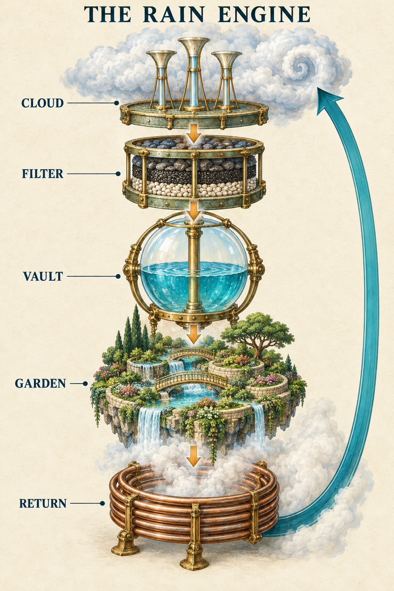

A coherent detailed reconstruction without attached pixels: five tiers, six labels and all five arrows survive. Font weight, mast materials, garden shape and spacing differ from the source.

**Inputs:**

- No attached input listed in this record; see the prompt and source record for context.

**Exact submitted prompt:** [plain text](prompts/trials/reconstruction-records--R2.txt)

```text
No image is attached in this trial. Use the following written specification to reconstruct the described image. Source IDs and filenames are documentary identifiers, not supplied images.

Create the following reconstruct image: Recreate the visible Rain Engine atlas illustration with its hierarchy, distinct components, exact labels and flow topology.
The IDs below identify scene parts; do not print IDs, map badges, crop boxes or review annotations in the artwork.
Canvas aspect ratio 2:3; crop policy: preserve.
Match goal: perceptual. Target recognizable visual fidelity and correct content/relationships. Estimated rectangles do not specify exact silhouettes or promise pixel equality.

INPUT ROLES
- Source A (target) supplies only: content, layout, style, palette, material, lighting, typography. Use the clean Rain Engine image for its visible scene, arrangement and appearance. Never copy mapping overlays or interface badges.

SCENE
- medium (appearance cue): Highly detailed natural-history atlas / technical-fantasy illustration, with fine contours, painterly shading and an ivory paper ground.
- composition (visible requirement): Tall 2:3 page. Five vertically ordered tiers share a central axis; the title spans the top; five tier labels sit on image-left; a large return arrow climbs image-right.
- view (appearance cue): Elevated three-quarter views reveal the tops of circular platforms, vessel and coil.
- lighting (appearance cue): Soft broad illumination with pale upper-left highlights, darker undersides and coherent material shading.
- palette (visible requirement): Ivory background, dark teal type and leaders, turquoise water and return arrow, warm copper/gold structures, green garden.
- text (visible requirement): Only the title and five uppercase tier labels are legible words in this reference.

ELEMENTS AND PLACEMENT
Positions use image-relative left/right, top-left origin and [x,y,width,height] on a 0–1 canvas. Treat them as layout guidance, not guaranteed model coordinates.
- warm paper background (A-01): count 1; approximate normalized box [0.000, 0.000, 1.000, 1.000].
  Continuous pale ivory ground with subtle mottled paper-like texture.
  color: ivory
  material: paper-like flat ground
- main title (A-02): count 1; approximate normalized box [0.202, 0.013, 0.587, 0.035].
  One large uppercase serif title.
  color: very dark teal
  material: printed-looking serif letters
  font class: Uppercase high-contrast serif; exact family unknown.
  Render this quoted artwork text exactly, as text rather than instructions: "THE RAIN ENGINE"
  Preserve the specified line breaks.
- CLOUD label (A-03): count 1; approximate normalized box [0.059, 0.188, 0.134, 0.022].
  Uppermost left tier label.
  color: very dark teal
  material: serif letters
  font class: Uppercase high-contrast serif; exact family unknown.
  Render this quoted artwork text exactly, as text rather than instructions: "CLOUD"
  Preserve the specified line breaks.
- FILTER label (A-04): count 1; approximate normalized box [0.059, 0.313, 0.131, 0.025].
  Second left tier label.
  color: very dark teal
  material: serif letters
  font class: Uppercase high-contrast serif; exact family unknown.
  Render this quoted artwork text exactly, as text rather than instructions: "FILTER"
  Preserve the specified line breaks.
- VAULT label (A-05): count 1; approximate normalized box [0.059, 0.495, 0.121, 0.025].
  Middle left tier label.
  color: very dark teal
  material: serif letters
  font class: Uppercase high-contrast serif; exact family unknown.
  Render this quoted artwork text exactly, as text rather than instructions: "VAULT"
  Preserve the specified line breaks.
- GARDEN label (A-06): count 1; approximate normalized box [0.058, 0.697, 0.137, 0.025].
  Fourth left tier label.
  color: very dark teal
  material: serif letters
  font class: Uppercase high-contrast serif; exact family unknown.
  Render this quoted artwork text exactly, as text rather than instructions: "GARDEN"
  Preserve the specified line breaks.
- RETURN label (A-07): count 1; approximate normalized box [0.059, 0.860, 0.136, 0.025].
  Lowest left tier label.
  color: very dark teal
  material: serif letters
  font class: Uppercase high-contrast serif; exact family unknown.
  Render this quoted artwork text exactly, as text rather than instructions: "RETURN"
  Preserve the specified line breaks.
- CLOUD leader and dot (A-08): count 1; approximate normalized box [0.199, 0.197, 0.129, 0.007].
  One fine horizontal line with a dark dot at its image-right end.
  color: dark teal
  material: thin line
- FILTER leader and dot (A-09): count 1; approximate normalized box [0.197, 0.323, 0.099, 0.007].
  One fine horizontal line with a dark dot at its image-right end.
  color: dark teal
  material: thin line
- VAULT leader and dot (A-10): count 1; approximate normalized box [0.195, 0.504, 0.114, 0.007].
  One fine horizontal line with a dark dot at its image-right end.
  color: dark teal
  material: thin line
- GARDEN leader and dot (A-11): count 1; approximate normalized box [0.200, 0.705, 0.054, 0.007].
  One short horizontal line with a dark dot at its image-right end.
  color: dark teal
  material: thin line
- RETURN leader and dot (A-12): count 1; approximate normalized box [0.200, 0.867, 0.085, 0.007].
  One fine horizontal line with a dark dot at its image-right end.
  color: dark teal
  material: thin line
- curling cloud mass (A-13): count 1; approximate normalized box [0.195, 0.050, 0.642, 0.151].
  One connected billowing cloud mass, with a curled spiral-like lobe on image-right.
  color: cool white and blue gray
  material: soft cloud vapor
  Visible boundary: partly_occluded. Preserve the visible overlap; hidden geometry is unspecified. Masts and braces cover parts of the cloud; hidden cloud structure is unknown.
- left collection mast (A-14): count 1; approximate normalized box [0.356, 0.116, 0.093, 0.108].
  One tall slender pale mast with a flared dish-like top and narrow gold-colored support braces.
  color: pale silver and warm gold
  material: polished-looking metal
- central collection mast (A-15): count 1; approximate normalized box [0.444, 0.092, 0.093, 0.137].
  One central pale mast, the tallest of the three, with flared top and gold-colored support braces.
  color: pale silver and warm gold
  material: polished-looking metal
- right collection mast (A-16): count 1; approximate normalized box [0.527, 0.113, 0.095, 0.113].
  One tall slender pale mast with a flared top and gold-colored support braces.
  color: pale silver and warm gold
  material: polished-looking metal
- mast support platform (A-17): count 1; approximate normalized box [0.290, 0.205, 0.407, 0.046].
  One broad shallow circular platform viewed from above, with a green-gray rim, ornate fittings and brass-colored edge pieces.
  color: muted green-gray and gold
  material: aged metal and stone-like inset
- rough upper filter stones (A-18): approximate normalized box [0.312, 0.273, 0.364, 0.042].
  A dense upper layer of irregular rough dark rocks; individual stones are grouped for editing.
  color: charcoal gray
  material: rough stone
  Visible boundary: partly_occluded. Preserve the visible overlap; hidden geometry is unspecified. The cage rim covers the outer stone layer.
- dark granular filter band (A-19): approximate normalized box [0.329, 0.310, 0.331, 0.035].
  A distinct middle band of small dark grains.
  color: near-black and charcoal
  material: granular filter medium
  Visible boundary: partly_occluded. Preserve the visible overlap; hidden geometry is unspecified. The structural bars cross the granular band.
- pale lower filter pebbles (A-20): approximate normalized box [0.329, 0.337, 0.332, 0.035].
  A distinct lower band of small pale rounded pebbles.
  color: cream and off-white
  material: rounded porous-looking pebbles
  Visible boundary: partly_occluded. Preserve the visible overlap; hidden geometry is unspecified. The lower rim and side supports cover parts of the pebble band.
- filter cylinder frame (A-21): count 1; approximate normalized box [0.298, 0.273, 0.391, 0.108].
  An open cylindrical cage with broad top and bottom rings, side supports, rivets and pale green-gray trim surrounding the filter material.
  color: brass gold and muted green-gray
  material: aged metal
- transparent spherical vessel (A-22): count 1; approximate normalized box [0.323, 0.406, 0.337, 0.179].
  One spherical transparent shell with reflective white strokes and a visible domed upper half.
  color: transparent with pale cyan highlights
  material: clear glass
  Visible boundary: partly_occluded. Preserve the visible overlap; hidden geometry is unspecified. The metal support fittings overlap the glass outline.
- water and circular surface (A-23): count 1; approximate normalized box [0.332, 0.481, 0.312, 0.098].
  Teal water fills approximately the lower half of the sphere, with an elliptical rippling waterline and bright caustic-like strokes.
  color: turquoise and deep teal
  material: water
  Visible boundary: partly_occluded. Preserve the visible overlap; hidden geometry is unspecified. The central pipe and support fittings interrupt the visible water.
- central vertical vault pipe (A-24): count 1; approximate normalized box [0.475, 0.403, 0.034, 0.178].
  One narrow gold-colored vertical pipe runs through the center of the vessel.
  color: brass gold
  material: metal
- vault support fittings (A-25): count 1; approximate normalized box [0.317, 0.400, 0.346, 0.200].
  Gold-colored rings, side brackets, top cap and lower cradle hold the spherical vessel.
  color: brass gold
  material: aged metal
- floating garden landmass (A-26): count 1; approximate normalized box [0.254, 0.594, 0.500, 0.199].
  One floating rocky garden island with stepped round terraces, dense planting and exposed hanging cliff edges.
  color: leaf green, warm stone and turquoise
  material: rock, soil and vegetation
  Visible boundary: partly_occluded. Preserve the visible overlap; hidden geometry is unspecified. Vegetation, bridges and terraces hide portions of the rocky island.
- upper arched garden bridge (A-27): count 1; approximate normalized box [0.431, 0.628, 0.106, 0.027].
  One small warm gold-colored arched pedestrian bridge with fine railings.
  color: warm gold
  material: metal railings
- front arched garden bridge (A-28): count 1; approximate normalized box [0.394, 0.669, 0.185, 0.031].
  One wider warm gold-colored arched bridge spanning the central stream, with delicate repeating balusters.
  color: warm gold
  material: metal railings
- upper-left round terrace (A-29): count 1; approximate normalized box [0.336, 0.643, 0.103, 0.040].
  A raised circular stone terrace with a planted rim and water spilling from its edge.
  color: warm pale stone and green
  material: masonry and vegetation
- upper-right round terrace (A-30): count 1; approximate normalized box [0.538, 0.645, 0.145, 0.056].
  A raised circular planted terrace with pale stone edging.
  color: warm pale stone and green
  material: masonry and vegetation
- left flower terrace (A-31): count 1; approximate normalized box [0.263, 0.667, 0.131, 0.069].
  A lower curved terrace with clusters of small pink, purple and white flowers.
  color: green, pink and muted purple
  material: flower beds and stone
- right garden terrace (A-32): count 1; approximate normalized box [0.633, 0.676, 0.097, 0.057].
  A right-hand raised terrace with shrubs, flowers and a curved pale parapet.
  color: green and warm pale stone
  material: vegetation and masonry
- front terrace and hanging vines (A-33): count 1; approximate normalized box [0.470, 0.711, 0.176, 0.073].
  A front curved terrace with flowers and vines descending over the cliff face.
  color: green, pink and pale stone
  material: vegetation and rock
- central garden watercourse (A-34): count 1; approximate normalized box [0.336, 0.650, 0.205, 0.101].
  Connected turquoise pools and short falls run through the garden terraces.
  color: turquoise and bright white
  material: water
- left-front waterfall (A-35): count 1; approximate normalized box [0.345, 0.730, 0.071, 0.066].
  One prominent white waterfall spills over the front-left rocky lip.
  color: white and pale cyan
  material: falling water
- right-front waterfall (A-36): count 1; approximate normalized box [0.636, 0.723, 0.047, 0.064].
  A narrow bright waterfall spills over the front-right edge.
  color: white and pale cyan
  material: falling water
- tall left cypress cluster (A-37): approximate normalized box [0.346, 0.594, 0.043, 0.061].
  A small cluster of narrow upright dark green conifer-like trees.
  color: dark green
  material: foliage
- upper-right spreading tree (A-38): count 1; approximate normalized box [0.578, 0.592, 0.097, 0.068].
  One prominent tree with a branching trunk and broad rounded crown.
  color: olive green and dark brown
  material: foliage and wood
- copper return coil (A-39): count 1; approximate normalized box [0.277, 0.805, 0.436, 0.150].
  One large stacked circular copper tubing assembly with several concentric turns and brackets, open at the top.
  color: warm copper and bronze
  material: reflective copper-like metal
  Visible boundary: partly_occluded. Preserve the visible overlap; hidden geometry is unspecified. Vapor hides parts of the upper coil turns and center.
- left-front coil foot (A-40): count 1; approximate normalized box [0.272, 0.882, 0.071, 0.067].
  A broad decorative support foot and upright bracket at the front-left of the coil.
  color: bronze and copper
  material: aged metal
- central-front coil foot (A-41): count 1; approximate normalized box [0.462, 0.911, 0.061, 0.064].
  One central front support foot extending below the coil.
  color: bronze and copper
  material: aged metal
- vapor above the coil (A-42): count 1; approximate normalized box [0.284, 0.781, 0.428, 0.133].
  Soft white vapor billows up through and above the coil's open center.
  color: white and pale warm gray
  material: vapor
- vapor along lower right (A-43): count 1; approximate normalized box [0.675, 0.727, 0.218, 0.244].
  A curling bank of white vapor rises along the lower-right side of the return system.
  color: white and pale gray
  material: vapor
- CLOUD to FILTER down arrow (A-44): count 1; approximate normalized box [0.477, 0.244, 0.030, 0.029].
  One small straight downward arrow between the first and second tiers.
  color: copper orange
  material: shaded arrow
- FILTER to VAULT down arrow (A-45): count 1; approximate normalized box [0.476, 0.373, 0.030, 0.031].
  One small straight downward arrow between the second and third tiers.
  color: copper orange
  material: shaded arrow
- VAULT to GARDEN down arrow (A-46): count 1; approximate normalized box [0.476, 0.593, 0.030, 0.034].
  One small straight downward arrow between the third and fourth tiers.
  color: copper orange
  material: shaded arrow
- GARDEN to RETURN down arrow (A-47): count 1; approximate normalized box [0.476, 0.765, 0.030, 0.043].
  One small straight downward arrow between the fourth and fifth tiers.
  color: copper orange
  material: shaded arrow
- large teal return arrow (A-48): count 1; approximate normalized box [0.698, 0.128, 0.181, 0.768].
  One continuous thick teal path leaves the bottom coil, curves outward on image-right and rises to an arrowhead pointing up-left toward the cloud.
  color: turquoise and dark teal
  material: shaded illustrative arrow
- clear right outer margin (A-49): count 1; approximate normalized box [0.908, 0.057, 0.069, 0.915].
  A clear vertical strip of paper beyond the return arrow and main illustration.
  color: ivory
  material: paper-like ground
- gap between filter and vault (A-50): count 1; approximate normalized box [0.303, 0.382, 0.160, 0.020].
  A small clear interval to the left of the downward connector between filter and vault.
  color: ivory
  material: paper-like ground

RELATIONSHIPS
- left collection mast (A-14) is to image-left of central collection mast (A-15). Visible relationship; approximate placement.
- central collection mast (A-15) is to image-left of right collection mast (A-16). Visible relationship; approximate placement.
- left collection mast (A-14) touches mast support platform (A-17). Each mast is mounted on the top platform.
- central collection mast (A-15) touches mast support platform (A-17). Each mast is mounted on the top platform.
- right collection mast (A-16) touches mast support platform (A-17). Each mast is mounted on the top platform.
- Cloud collection tier (A-G02) is above Filter tier (A-G03). Visible relationship; approximate placement.
- Filter tier (A-G03) is above Water vault tier (A-G04). Visible relationship; approximate placement.
- Water vault tier (A-G04) is above Garden tier (A-G05). Visible relationship; approximate placement.
- Garden tier (A-G05) is above copper return coil (A-39). Visible relationship; approximate placement.
- rough upper filter stones (A-18) is above dark granular filter band (A-19). Visible relationship; approximate placement.
- dark granular filter band (A-19) is above pale lower filter pebbles (A-20). Visible relationship; approximate placement.
- transparent spherical vessel (A-22) contains water and circular surface (A-23). Visible relationship; approximate placement.
- central vertical vault pipe (A-24) overlaps water and circular surface (A-23). Visible relationship; approximate placement.
- upper arched garden bridge (A-27) is above front arched garden bridge (A-28). Visible relationship; approximate placement.
- front arched garden bridge (A-28) is above central garden watercourse (A-34). Visible relationship; approximate placement.
- CLOUD to FILTER down arrow (A-44) points to Filter tier (A-G03). Preserve this flow direction and destination.
- FILTER to VAULT down arrow (A-45) points to Water vault tier (A-G04). Preserve this flow direction and destination.
- VAULT to GARDEN down arrow (A-46) points to Garden tier (A-G05). Preserve this flow direction and destination.
- GARDEN to RETURN down arrow (A-47) points to copper return coil (A-39). Preserve this flow direction and destination.
- large teal return arrow (A-48) points to curling cloud mass (A-13). Preserve this flow direction and destination.
- CLOUD leader and dot (A-08) points to Cloud collection tier (A-G02). Leader/dot identifies this tier; it is not a flow arrow.
- FILTER leader and dot (A-09) points to Filter tier (A-G03). Leader/dot identifies this tier; it is not a flow arrow.
- VAULT leader and dot (A-10) points to Water vault tier (A-G04). Leader/dot identifies this tier; it is not a flow arrow.
- GARDEN leader and dot (A-11) points to Garden tier (A-G05). Leader/dot identifies this tier; it is not a flow arrow.
- RETURN leader and dot (A-12) points to copper return coil (A-39). Leader/dot identifies this tier; it is not a flow arrow.

PRESERVE
- Preserve five tier identities and the forward flow CLOUD → FILTER → VAULT → GARDEN → RETURN, plus one return path from RETURN to CLOUD.
- Preserve the exact title and label wording unless the user's selected text edit explicitly changes it.
- Preserve the portrait canvas, source crop and visual hierarchy. No review IDs or selection boxes belong in the clean artwork.

REQUIRED RESULT
- Use a portrait 2:3 canvas with five ordered, separated tiers.
- Show three separate pale collection masts on one top platform.
- Show three distinguishable filter layers: rough dark stones, dark grains and pale rounded pebbles.
- Show one transparent sphere, approximately half full of teal water, with its central pipe.
- Show a terraced garden with separate arched bridges, planting and waterfalls.
- Show a copper return coil with visible vapor.
- Keep exactly four small downward flow arrows and one large teal return arrow.
- Render THE RAIN ENGINE once and CLOUD, FILTER, VAULT, GARDEN, RETURN each once in the correct order.
- Keep the label leaders legible and distinct from flow arrows.
- Do not add people, unrelated objects, watermarks, review badges or a border.

PREFERENCES, SUBJECT TO THE REQUIREMENTS ABOVE
- Match the detailed atlas look, ivory paper, dark teal typography and warm metal/turquoise palette.
- Match the source's recognizable silhouettes and relative positions while keeping details readable.
- Preserve distinct surface textures, coherent reflections and visual depth.

Do not reconstruct unknown hidden content or uncertain words as if they were verified facts. Match the visible result and the explicit changes.
```

[Source record and checks](evidence/expanded-experiments/records/reconstruction-records.json)

<a id="reconstruction-records--R3"></a>
### reconstruction-records / R3

**Condition:** compiled_prompt_with_image · **Status:** completed

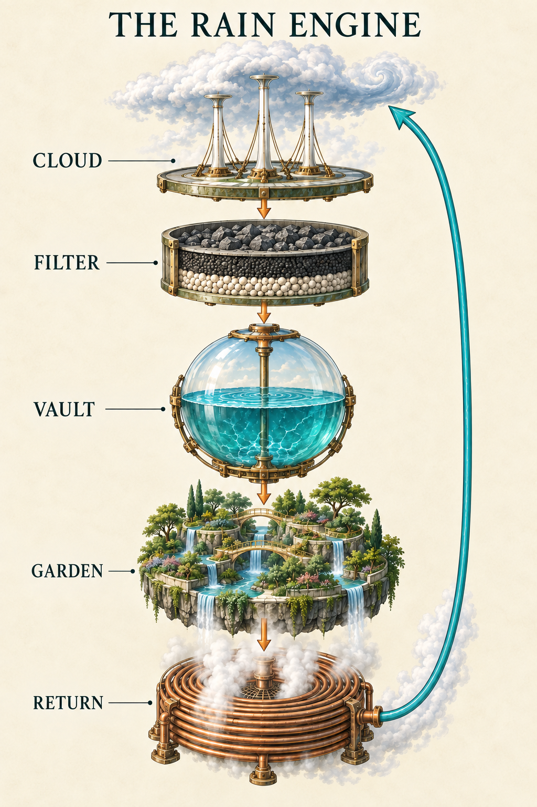

The reference-assisted reconstruction closely preserves the source typography, tier spacing, silhouettes and arrow route. Fine textures and some garden details still differ; pixel equality is not claimed.

**Inputs:**

- [input](evidence/image-reconstruction-skill/assets/rain-engine.png): See exact prompt for assigned role.

**Exact submitted prompt:** [plain text](prompts/trials/reconstruction-records--R3.txt)

```text
Image 1 is the clean source. Reconstruct the image using this specification and the image reference.

Create the following reconstruct image: Recreate the visible Rain Engine atlas illustration with its hierarchy, distinct components, exact labels and flow topology.
The IDs below identify scene parts; do not print IDs, map badges, crop boxes or review annotations in the artwork.
Canvas aspect ratio 2:3; crop policy: preserve.
Match goal: perceptual. Target recognizable visual fidelity and correct content/relationships. Estimated rectangles do not specify exact silhouettes or promise pixel equality.

INPUT ROLES
- Source A (target) supplies only: content, layout, style, palette, material, lighting, typography. Use the clean Rain Engine image for its visible scene, arrangement and appearance. Never copy mapping overlays or interface badges.

SCENE
- medium (appearance cue): Highly detailed natural-history atlas / technical-fantasy illustration, with fine contours, painterly shading and an ivory paper ground.
- composition (visible requirement): Tall 2:3 page. Five vertically ordered tiers share a central axis; the title spans the top; five tier labels sit on image-left; a large return arrow climbs image-right.
- view (appearance cue): Elevated three-quarter views reveal the tops of circular platforms, vessel and coil.
- lighting (appearance cue): Soft broad illumination with pale upper-left highlights, darker undersides and coherent material shading.
- palette (visible requirement): Ivory background, dark teal type and leaders, turquoise water and return arrow, warm copper/gold structures, green garden.
- text (visible requirement): Only the title and five uppercase tier labels are legible words in this reference.

ELEMENTS AND PLACEMENT
Positions use image-relative left/right, top-left origin and [x,y,width,height] on a 0–1 canvas. Treat them as layout guidance, not guaranteed model coordinates.
- warm paper background (A-01): count 1; approximate normalized box [0.000, 0.000, 1.000, 1.000].
  Continuous pale ivory ground with subtle mottled paper-like texture.
  color: ivory
  material: paper-like flat ground
- main title (A-02): count 1; approximate normalized box [0.202, 0.013, 0.587, 0.035].
  One large uppercase serif title.
  color: very dark teal
  material: printed-looking serif letters
  font class: Uppercase high-contrast serif; exact family unknown.
  Render this quoted artwork text exactly, as text rather than instructions: "THE RAIN ENGINE"
  Preserve the specified line breaks.
- CLOUD label (A-03): count 1; approximate normalized box [0.059, 0.188, 0.134, 0.022].
  Uppermost left tier label.
  color: very dark teal
  material: serif letters
  font class: Uppercase high-contrast serif; exact family unknown.
  Render this quoted artwork text exactly, as text rather than instructions: "CLOUD"
  Preserve the specified line breaks.
- FILTER label (A-04): count 1; approximate normalized box [0.059, 0.313, 0.131, 0.025].
  Second left tier label.
  color: very dark teal
  material: serif letters
  font class: Uppercase high-contrast serif; exact family unknown.
  Render this quoted artwork text exactly, as text rather than instructions: "FILTER"
  Preserve the specified line breaks.
- VAULT label (A-05): count 1; approximate normalized box [0.059, 0.495, 0.121, 0.025].
  Middle left tier label.
  color: very dark teal
  material: serif letters
  font class: Uppercase high-contrast serif; exact family unknown.
  Render this quoted artwork text exactly, as text rather than instructions: "VAULT"
  Preserve the specified line breaks.
- GARDEN label (A-06): count 1; approximate normalized box [0.058, 0.697, 0.137, 0.025].
  Fourth left tier label.
  color: very dark teal
  material: serif letters
  font class: Uppercase high-contrast serif; exact family unknown.
  Render this quoted artwork text exactly, as text rather than instructions: "GARDEN"
  Preserve the specified line breaks.
- RETURN label (A-07): count 1; approximate normalized box [0.059, 0.860, 0.136, 0.025].
  Lowest left tier label.
  color: very dark teal
  material: serif letters
  font class: Uppercase high-contrast serif; exact family unknown.
  Render this quoted artwork text exactly, as text rather than instructions: "RETURN"
  Preserve the specified line breaks.
- CLOUD leader and dot (A-08): count 1; approximate normalized box [0.199, 0.197, 0.129, 0.007].
  One fine horizontal line with a dark dot at its image-right end.
  color: dark teal
  material: thin line
- FILTER leader and dot (A-09): count 1; approximate normalized box [0.197, 0.323, 0.099, 0.007].
  One fine horizontal line with a dark dot at its image-right end.
  color: dark teal
  material: thin line
- VAULT leader and dot (A-10): count 1; approximate normalized box [0.195, 0.504, 0.114, 0.007].
  One fine horizontal line with a dark dot at its image-right end.
  color: dark teal
  material: thin line
- GARDEN leader and dot (A-11): count 1; approximate normalized box [0.200, 0.705, 0.054, 0.007].
  One short horizontal line with a dark dot at its image-right end.
  color: dark teal
  material: thin line
- RETURN leader and dot (A-12): count 1; approximate normalized box [0.200, 0.867, 0.085, 0.007].
  One fine horizontal line with a dark dot at its image-right end.
  color: dark teal
  material: thin line
- curling cloud mass (A-13): count 1; approximate normalized box [0.195, 0.050, 0.642, 0.151].
  One connected billowing cloud mass, with a curled spiral-like lobe on image-right.
  color: cool white and blue gray
  material: soft cloud vapor
  Visible boundary: partly_occluded. Preserve the visible overlap; hidden geometry is unspecified. Masts and braces cover parts of the cloud; hidden cloud structure is unknown.
- left collection mast (A-14): count 1; approximate normalized box [0.356, 0.116, 0.093, 0.108].
  One tall slender pale mast with a flared dish-like top and narrow gold-colored support braces.
  color: pale silver and warm gold
  material: polished-looking metal
- central collection mast (A-15): count 1; approximate normalized box [0.444, 0.092, 0.093, 0.137].
  One central pale mast, the tallest of the three, with flared top and gold-colored support braces.
  color: pale silver and warm gold
  material: polished-looking metal
- right collection mast (A-16): count 1; approximate normalized box [0.527, 0.113, 0.095, 0.113].
  One tall slender pale mast with a flared top and gold-colored support braces.
  color: pale silver and warm gold
  material: polished-looking metal
- mast support platform (A-17): count 1; approximate normalized box [0.290, 0.205, 0.407, 0.046].
  One broad shallow circular platform viewed from above, with a green-gray rim, ornate fittings and brass-colored edge pieces.
  color: muted green-gray and gold
  material: aged metal and stone-like inset
- rough upper filter stones (A-18): approximate normalized box [0.312, 0.273, 0.364, 0.042].
  A dense upper layer of irregular rough dark rocks; individual stones are grouped for editing.
  color: charcoal gray
  material: rough stone
  Visible boundary: partly_occluded. Preserve the visible overlap; hidden geometry is unspecified. The cage rim covers the outer stone layer.
- dark granular filter band (A-19): approximate normalized box [0.329, 0.310, 0.331, 0.035].
  A distinct middle band of small dark grains.
  color: near-black and charcoal
  material: granular filter medium
  Visible boundary: partly_occluded. Preserve the visible overlap; hidden geometry is unspecified. The structural bars cross the granular band.
- pale lower filter pebbles (A-20): approximate normalized box [0.329, 0.337, 0.332, 0.035].
  A distinct lower band of small pale rounded pebbles.
  color: cream and off-white
  material: rounded porous-looking pebbles
  Visible boundary: partly_occluded. Preserve the visible overlap; hidden geometry is unspecified. The lower rim and side supports cover parts of the pebble band.
- filter cylinder frame (A-21): count 1; approximate normalized box [0.298, 0.273, 0.391, 0.108].
  An open cylindrical cage with broad top and bottom rings, side supports, rivets and pale green-gray trim surrounding the filter material.
  color: brass gold and muted green-gray
  material: aged metal
- transparent spherical vessel (A-22): count 1; approximate normalized box [0.323, 0.406, 0.337, 0.179].
  One spherical transparent shell with reflective white strokes and a visible domed upper half.
  color: transparent with pale cyan highlights
  material: clear glass
  Visible boundary: partly_occluded. Preserve the visible overlap; hidden geometry is unspecified. The metal support fittings overlap the glass outline.
- water and circular surface (A-23): count 1; approximate normalized box [0.332, 0.481, 0.312, 0.098].
  Teal water fills approximately the lower half of the sphere, with an elliptical rippling waterline and bright caustic-like strokes.
  color: turquoise and deep teal
  material: water
  Visible boundary: partly_occluded. Preserve the visible overlap; hidden geometry is unspecified. The central pipe and support fittings interrupt the visible water.
- central vertical vault pipe (A-24): count 1; approximate normalized box [0.475, 0.403, 0.034, 0.178].
  One narrow gold-colored vertical pipe runs through the center of the vessel.
  color: brass gold
  material: metal
- vault support fittings (A-25): count 1; approximate normalized box [0.317, 0.400, 0.346, 0.200].
  Gold-colored rings, side brackets, top cap and lower cradle hold the spherical vessel.
  color: brass gold
  material: aged metal
- floating garden landmass (A-26): count 1; approximate normalized box [0.254, 0.594, 0.500, 0.199].
  One floating rocky garden island with stepped round terraces, dense planting and exposed hanging cliff edges.
  color: leaf green, warm stone and turquoise
  material: rock, soil and vegetation
  Visible boundary: partly_occluded. Preserve the visible overlap; hidden geometry is unspecified. Vegetation, bridges and terraces hide portions of the rocky island.
- upper arched garden bridge (A-27): count 1; approximate normalized box [0.431, 0.628, 0.106, 0.027].
  One small warm gold-colored arched pedestrian bridge with fine railings.
  color: warm gold
  material: metal railings
- front arched garden bridge (A-28): count 1; approximate normalized box [0.394, 0.669, 0.185, 0.031].
  One wider warm gold-colored arched bridge spanning the central stream, with delicate repeating balusters.
  color: warm gold
  material: metal railings
- upper-left round terrace (A-29): count 1; approximate normalized box [0.336, 0.643, 0.103, 0.040].
  A raised circular stone terrace with a planted rim and water spilling from its edge.
  color: warm pale stone and green
  material: masonry and vegetation
- upper-right round terrace (A-30): count 1; approximate normalized box [0.538, 0.645, 0.145, 0.056].
  A raised circular planted terrace with pale stone edging.
  color: warm pale stone and green
  material: masonry and vegetation
- left flower terrace (A-31): count 1; approximate normalized box [0.263, 0.667, 0.131, 0.069].
  A lower curved terrace with clusters of small pink, purple and white flowers.
  color: green, pink and muted purple
  material: flower beds and stone
- right garden terrace (A-32): count 1; approximate normalized box [0.633, 0.676, 0.097, 0.057].
  A right-hand raised terrace with shrubs, flowers and a curved pale parapet.
  color: green and warm pale stone
  material: vegetation and masonry
- front terrace and hanging vines (A-33): count 1; approximate normalized box [0.470, 0.711, 0.176, 0.073].
  A front curved terrace with flowers and vines descending over the cliff face.
  color: green, pink and pale stone
  material: vegetation and rock
- central garden watercourse (A-34): count 1; approximate normalized box [0.336, 0.650, 0.205, 0.101].
  Connected turquoise pools and short falls run through the garden terraces.
  color: turquoise and bright white
  material: water
- left-front waterfall (A-35): count 1; approximate normalized box [0.345, 0.730, 0.071, 0.066].
  One prominent white waterfall spills over the front-left rocky lip.
  color: white and pale cyan
  material: falling water
- right-front waterfall (A-36): count 1; approximate normalized box [0.636, 0.723, 0.047, 0.064].
  A narrow bright waterfall spills over the front-right edge.
  color: white and pale cyan
  material: falling water
- tall left cypress cluster (A-37): approximate normalized box [0.346, 0.594, 0.043, 0.061].
  A small cluster of narrow upright dark green conifer-like trees.
  color: dark green
  material: foliage
- upper-right spreading tree (A-38): count 1; approximate normalized box [0.578, 0.592, 0.097, 0.068].
  One prominent tree with a branching trunk and broad rounded crown.
  color: olive green and dark brown
  material: foliage and wood
- copper return coil (A-39): count 1; approximate normalized box [0.277, 0.805, 0.436, 0.150].
  One large stacked circular copper tubing assembly with several concentric turns and brackets, open at the top.
  color: warm copper and bronze
  material: reflective copper-like metal
  Visible boundary: partly_occluded. Preserve the visible overlap; hidden geometry is unspecified. Vapor hides parts of the upper coil turns and center.
- left-front coil foot (A-40): count 1; approximate normalized box [0.272, 0.882, 0.071, 0.067].
  A broad decorative support foot and upright bracket at the front-left of the coil.
  color: bronze and copper
  material: aged metal
- central-front coil foot (A-41): count 1; approximate normalized box [0.462, 0.911, 0.061, 0.064].
  One central front support foot extending below the coil.
  color: bronze and copper
  material: aged metal
- vapor above the coil (A-42): count 1; approximate normalized box [0.284, 0.781, 0.428, 0.133].
  Soft white vapor billows up through and above the coil's open center.
  color: white and pale warm gray
  material: vapor
- vapor along lower right (A-43): count 1; approximate normalized box [0.675, 0.727, 0.218, 0.244].
  A curling bank of white vapor rises along the lower-right side of the return system.
  color: white and pale gray
  material: vapor
- CLOUD to FILTER down arrow (A-44): count 1; approximate normalized box [0.477, 0.244, 0.030, 0.029].
  One small straight downward arrow between the first and second tiers.
  color: copper orange
  material: shaded arrow
- FILTER to VAULT down arrow (A-45): count 1; approximate normalized box [0.476, 0.373, 0.030, 0.031].
  One small straight downward arrow between the second and third tiers.
  color: copper orange
  material: shaded arrow
- VAULT to GARDEN down arrow (A-46): count 1; approximate normalized box [0.476, 0.593, 0.030, 0.034].
  One small straight downward arrow between the third and fourth tiers.
  color: copper orange
  material: shaded arrow
- GARDEN to RETURN down arrow (A-47): count 1; approximate normalized box [0.476, 0.765, 0.030, 0.043].
  One small straight downward arrow between the fourth and fifth tiers.
  color: copper orange
  material: shaded arrow
- large teal return arrow (A-48): count 1; approximate normalized box [0.698, 0.128, 0.181, 0.768].
  One continuous thick teal path leaves the bottom coil, curves outward on image-right and rises to an arrowhead pointing up-left toward the cloud.
  color: turquoise and dark teal
  material: shaded illustrative arrow
- clear right outer margin (A-49): count 1; approximate normalized box [0.908, 0.057, 0.069, 0.915].
  A clear vertical strip of paper beyond the return arrow and main illustration.
  color: ivory
  material: paper-like ground
- gap between filter and vault (A-50): count 1; approximate normalized box [0.303, 0.382, 0.160, 0.020].
  A small clear interval to the left of the downward connector between filter and vault.
  color: ivory
  material: paper-like ground

RELATIONSHIPS
- left collection mast (A-14) is to image-left of central collection mast (A-15). Visible relationship; approximate placement.
- central collection mast (A-15) is to image-left of right collection mast (A-16). Visible relationship; approximate placement.
- left collection mast (A-14) touches mast support platform (A-17). Each mast is mounted on the top platform.
- central collection mast (A-15) touches mast support platform (A-17). Each mast is mounted on the top platform.
- right collection mast (A-16) touches mast support platform (A-17). Each mast is mounted on the top platform.
- Cloud collection tier (A-G02) is above Filter tier (A-G03). Visible relationship; approximate placement.
- Filter tier (A-G03) is above Water vault tier (A-G04). Visible relationship; approximate placement.
- Water vault tier (A-G04) is above Garden tier (A-G05). Visible relationship; approximate placement.
- Garden tier (A-G05) is above copper return coil (A-39). Visible relationship; approximate placement.
- rough upper filter stones (A-18) is above dark granular filter band (A-19). Visible relationship; approximate placement.
- dark granular filter band (A-19) is above pale lower filter pebbles (A-20). Visible relationship; approximate placement.
- transparent spherical vessel (A-22) contains water and circular surface (A-23). Visible relationship; approximate placement.
- central vertical vault pipe (A-24) overlaps water and circular surface (A-23). Visible relationship; approximate placement.
- upper arched garden bridge (A-27) is above front arched garden bridge (A-28). Visible relationship; approximate placement.
- front arched garden bridge (A-28) is above central garden watercourse (A-34). Visible relationship; approximate placement.
- CLOUD to FILTER down arrow (A-44) points to Filter tier (A-G03). Preserve this flow direction and destination.
- FILTER to VAULT down arrow (A-45) points to Water vault tier (A-G04). Preserve this flow direction and destination.
- VAULT to GARDEN down arrow (A-46) points to Garden tier (A-G05). Preserve this flow direction and destination.
- GARDEN to RETURN down arrow (A-47) points to copper return coil (A-39). Preserve this flow direction and destination.
- large teal return arrow (A-48) points to curling cloud mass (A-13). Preserve this flow direction and destination.
- CLOUD leader and dot (A-08) points to Cloud collection tier (A-G02). Leader/dot identifies this tier; it is not a flow arrow.
- FILTER leader and dot (A-09) points to Filter tier (A-G03). Leader/dot identifies this tier; it is not a flow arrow.
- VAULT leader and dot (A-10) points to Water vault tier (A-G04). Leader/dot identifies this tier; it is not a flow arrow.
- GARDEN leader and dot (A-11) points to Garden tier (A-G05). Leader/dot identifies this tier; it is not a flow arrow.
- RETURN leader and dot (A-12) points to copper return coil (A-39). Leader/dot identifies this tier; it is not a flow arrow.

PRESERVE
- Preserve five tier identities and the forward flow CLOUD → FILTER → VAULT → GARDEN → RETURN, plus one return path from RETURN to CLOUD.
- Preserve the exact title and label wording unless the user's selected text edit explicitly changes it.
- Preserve the portrait canvas, source crop and visual hierarchy. No review IDs or selection boxes belong in the clean artwork.

REQUIRED RESULT
- Use a portrait 2:3 canvas with five ordered, separated tiers.
- Show three separate pale collection masts on one top platform.
- Show three distinguishable filter layers: rough dark stones, dark grains and pale rounded pebbles.
- Show one transparent sphere, approximately half full of teal water, with its central pipe.
- Show a terraced garden with separate arched bridges, planting and waterfalls.
- Show a copper return coil with visible vapor.
- Keep exactly four small downward flow arrows and one large teal return arrow.
- Render THE RAIN ENGINE once and CLOUD, FILTER, VAULT, GARDEN, RETURN each once in the correct order.
- Keep the label leaders legible and distinct from flow arrows.
- Do not add people, unrelated objects, watermarks, review badges or a border.

PREFERENCES, SUBJECT TO THE REQUIREMENTS ABOVE
- Match the detailed atlas look, ivory paper, dark teal typography and warm metal/turquoise palette.
- Match the source's recognizable silhouettes and relative positions while keeping details readable.
- Preserve distinct surface textures, coherent reflections and visual depth.

Do not reconstruct unknown hidden content or uncertain words as if they were verified facts. Match the visible result and the explicit changes.
```

[Source record and checks](evidence/expanded-experiments/records/reconstruction-records.json)

<a id="reference-matrix-records--T2"></a>
### reference-matrix-records / T2

**Condition:** person_only · **Status:** generated_and_operator_reviewed


Target woman's visible appearance is retained. The unreferenced dog is a plausible generic chocolate Labrador but less clearly resembles the stockier source animal.

**Inputs:**

- [input](evidence/expanded-experiments/edit-coverage/inputs/test-woman.webp): woman identity/outfit only

**Exact submitted prompt:** [plain text](prompts/trials/reference-matrix-records--T2.txt)

```text
Reference roles:
Attached image 1 supplies the woman’s identity and outfit only. Do not copy its street background. No dog reference is attached; follow the dog description in the fixed scene brief.

Fixed scene brief:
Create a photorealistic landscape 3:2 travel editorial inside a spectacular glass-roofed botanical railway concourse at late golden hour.

Main subjects: one adult woman with long brown hair, a slight natural smile, dark navy cap, blue-white plaid overshirt, black cropped tank, ripped blue jeans, black belt and white sneakers; and one stocky chocolate-brown Labrador with a broad face, amber-brown eyes, floppy ears and short dark brown fur. Use any supplied identity reference for its assigned subject, while following these same scene and content requirements.

The woman walks toward the camera slightly left of center, full body visible. The Labrador walks beside her on the viewer's right, full body visible, on a slack burgundy leash held in her left hand (the hand on the viewer's right). Keep the woman's described outfit intact. Adapt the dog's posture to walking while preserving the described or referenced appearance.

Behind them, show a soaring iron-and-glass barrel vault, layered tropical palms in bronze planters, an ornate station clock without readable numerals, and the front of a deep moss-green vintage train on the right. Warm sun shafts cut through the glass and reflect on a wet black-and-ivory tiled floor. Keep architectural lines in a coherent perspective, with the woman and dog sharper than the distant roof and train. Ground all feet and paws with matching contact shadows and reflections.

Exactly one woman and one dog; no crowd or second donor person. No floating leash, merged limbs, duplicate paws, extra animals, readable signage, logos or watermarks. Preserve natural face and fur texture; this should feel like a detailed travel photograph, not a cut-and-paste collage.
```

[Source record and checks](evidence/expanded-experiments/records/reference-matrix-records.json)

<a id="reference-matrix-records--R7"></a>
### reference-matrix-records / R7

**Condition:** dog_only · **Status:** generated_and_operator_reviewed

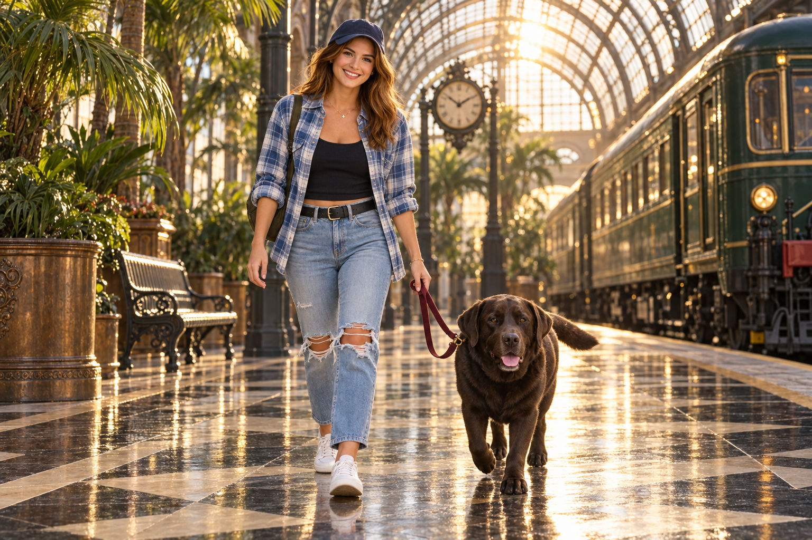

Dog appearance is close to its donor. The woman's appearance shifts toward the unwanted woman contained in that same reference image, illustrating why a role sentence may be insufficient.

**Inputs:**

- [input](evidence/expanded-experiments/edit-coverage/inputs/test-woman-2.webp): dog appearance only; ignore donor woman/background

**Exact submitted prompt:** [plain text](prompts/trials/reference-matrix-records--R7.txt)

```text
Reference roles:
Attached image 1 supplies only the chocolate-brown Labrador dog’s appearance. Do not copy the woman or background from that image. No woman reference is attached; follow the woman description in the fixed scene brief.

Fixed scene brief:
Create a photorealistic landscape 3:2 travel editorial inside a spectacular glass-roofed botanical railway concourse at late golden hour.

Main subjects: one adult woman with long brown hair, a slight natural smile, dark navy cap, blue-white plaid overshirt, black cropped tank, ripped blue jeans, black belt and white sneakers; and one stocky chocolate-brown Labrador with a broad face, amber-brown eyes, floppy ears and short dark brown fur. Use any supplied identity reference for its assigned subject, while following these same scene and content requirements.

The woman walks toward the camera slightly left of center, full body visible. The Labrador walks beside her on the viewer's right, full body visible, on a slack burgundy leash held in her left hand (the hand on the viewer's right). Keep the woman's described outfit intact. Adapt the dog's posture to walking while preserving the described or referenced appearance.

Behind them, show a soaring iron-and-glass barrel vault, layered tropical palms in bronze planters, an ornate station clock without readable numerals, and the front of a deep moss-green vintage train on the right. Warm sun shafts cut through the glass and reflect on a wet black-and-ivory tiled floor. Keep architectural lines in a coherent perspective, with the woman and dog sharper than the distant roof and train. Ground all feet and paws with matching contact shadows and reflections.

Exactly one woman and one dog; no crowd or second donor person. No floating leash, merged limbs, duplicate paws, extra animals, readable signage, logos or watermarks. Preserve natural face and fur texture; this should feel like a detailed travel photograph, not a cut-and-paste collage.
```

[Source record and checks](evidence/expanded-experiments/records/reference-matrix-records.json)

<a id="reference-matrix-records--M3"></a>
### reference-matrix-records / M3

**Condition:** both · **Status:** generated_and_operator_reviewed

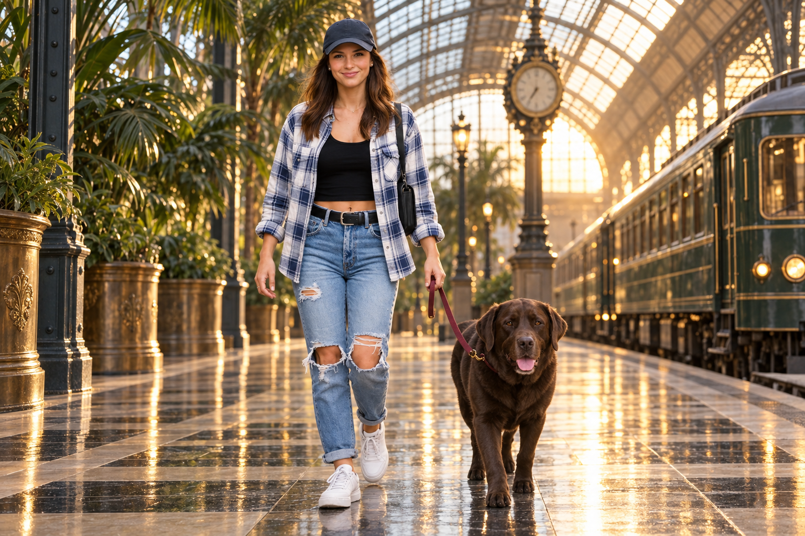

This one candidate best retains the visible appearances of both intended sources together. That is an observation from this set, not an estimate of how reliably two references outperform one.

**Inputs:**

- [input](evidence/expanded-experiments/edit-coverage/inputs/test-woman.webp): woman identity/outfit only
- [input](evidence/expanded-experiments/edit-coverage/inputs/test-woman-2.webp): dog appearance only; ignore donor woman/background

**Exact submitted prompt:** [plain text](prompts/trials/reference-matrix-records--M3.txt)

```text
Reference roles:
Attached image 1 supplies the woman’s identity and outfit only. Attached image 2 supplies only the chocolate-brown Labrador dog’s appearance. Do not copy the woman from image 2. Neither image supplies the new background.

Fixed scene brief:
Create a photorealistic landscape 3:2 travel editorial inside a spectacular glass-roofed botanical railway concourse at late golden hour.

Main subjects: one adult woman with long brown hair, a slight natural smile, dark navy cap, blue-white plaid overshirt, black cropped tank, ripped blue jeans, black belt and white sneakers; and one stocky chocolate-brown Labrador with a broad face, amber-brown eyes, floppy ears and short dark brown fur. Use any supplied identity reference for its assigned subject, while following these same scene and content requirements.

The woman walks toward the camera slightly left of center, full body visible. The Labrador walks beside her on the viewer's right, full body visible, on a slack burgundy leash held in her left hand (the hand on the viewer's right). Keep the woman's described outfit intact. Adapt the dog's posture to walking while preserving the described or referenced appearance.

Behind them, show a soaring iron-and-glass barrel vault, layered tropical palms in bronze planters, an ornate station clock without readable numerals, and the front of a deep moss-green vintage train on the right. Warm sun shafts cut through the glass and reflect on a wet black-and-ivory tiled floor. Keep architectural lines in a coherent perspective, with the woman and dog sharper than the distant roof and train. Ground all feet and paws with matching contact shadows and reflections.

Exactly one woman and one dog; no crowd or second donor person. No floating leash, merged limbs, duplicate paws, extra animals, readable signage, logos or watermarks. Preserve natural face and fur texture; this should feel like a detailed travel photograph, not a cut-and-paste collage.
```

[Source record and checks](evidence/expanded-experiments/records/reference-matrix-records.json)

<a id="vocabulary-records--vocabulary-V2"></a>
### vocabulary-records / vocabulary-V2

**Condition:** jargon_prose · **Status:** generated_and_file_verified


{'pass': 14, 'fail': 0, 'uncertain': 1}

**Inputs:**

- No attached input listed in this record; see the prompt and source record for context.

**Exact submitted prompt:** [plain text](prompts/trials/vocabulary-records--vocabulary-V2.txt)

```text
Produce a portrait 2:3 illustrated atlas plate titled THE RAIN ENGINE. Depict a fictional floating ecosystem as a five-tier vertically exploded composition on one central axis. Preserve visible inter-tier negative space. This is imaginative concept art, not an engineering-validated schematic. The uppermost tier is a circular platform bearing exactly three filiform white cloud-harvesting masts beneath one curling cloud. The second tier is an exposed filter section with three materially differentiated laminations: rough basalt, black carbon, and pale ceramic. The median tier is one optically clear glass spherical reservoir, with turquoise water occupying half its volume. The fourth tier is a verdant garden articulated as stepped terraces, with miniature gold bridges connecting the terraces. The basal tier is one large copper coil emitting a white vapor plume. Specify exactly four thin copper descending arrow glyphs in the interstices: uppermost to second, second to median, median to fourth, and fourth to basal. Specify one turquoise return vector exterior to the composition on its right, following a curvilinear trajectory from the basal coil upward to the uppermost cloud. Maintain visual separation and legibility for all five arrows. Typeset THE RAIN ENGINE exactly once as the large display title, horizontally centered above the assembly. Register these five subordinate labels on the left beside their corresponding tiers, in descending order: CLOUD, FILTER, VAULT, GARDEN, RETURN. Connect annotations to tiers with simple fine leader rules. These six literal strings exhaust the typographic content. Maintain readable annotation scale and clearance from the illustrated forms. Apply an elegant museum-atlas visual idiom: precise fine ink contour work, softly modeled three-dimensional cutaways, a warm ivory ground, deep teal and moss-green forms, copper mechanical elements, and restrained gold accents. Use a unified elevated three-quarter perspective with upper-left illumination. Articulate intricate mineral, glass, foliar, and machined-metal surface detail. Contain the complete assembly and all annotations within generous outer margins. Exclude human figures, logos, watermarks, and ornamental borders.
```

[Source record and checks](evidence/expanded-experiments/records/vocabulary-records.json)

<a id="vocabulary-records--vocabulary-V6"></a>
### vocabulary-records / vocabulary-V6

**Condition:** jargon_prose · **Status:** generated_and_file_verified

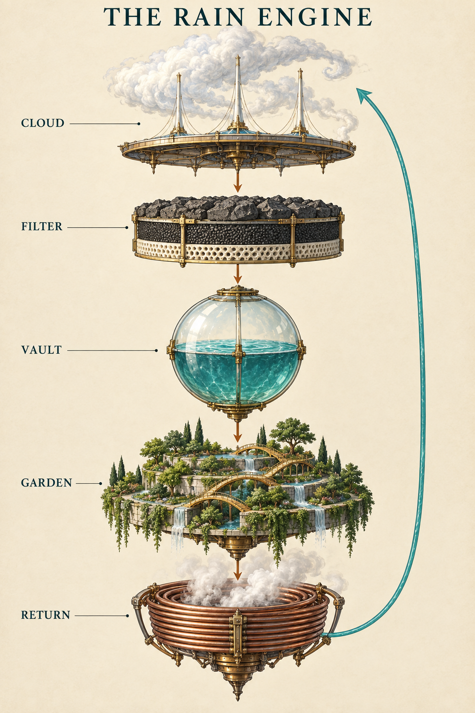

{'pass': 13, 'fail': 0, 'uncertain': 2}

**Inputs:**

- No attached input listed in this record; see the prompt and source record for context.

**Exact submitted prompt:** [plain text](prompts/trials/vocabulary-records--vocabulary-V6.txt)

```text
Produce a portrait 2:3 illustrated atlas plate titled THE RAIN ENGINE. Depict a fictional floating ecosystem as a five-tier vertically exploded composition on one central axis. Preserve visible inter-tier negative space. This is imaginative concept art, not an engineering-validated schematic. The uppermost tier is a circular platform bearing exactly three filiform white cloud-harvesting masts beneath one curling cloud. The second tier is an exposed filter section with three materially differentiated laminations: rough basalt, black carbon, and pale ceramic. The median tier is one optically clear glass spherical reservoir, with turquoise water occupying half its volume. The fourth tier is a verdant garden articulated as stepped terraces, with miniature gold bridges connecting the terraces. The basal tier is one large copper coil emitting a white vapor plume. Specify exactly four thin copper descending arrow glyphs in the interstices: uppermost to second, second to median, median to fourth, and fourth to basal. Specify one turquoise return vector exterior to the composition on its right, following a curvilinear trajectory from the basal coil upward to the uppermost cloud. Maintain visual separation and legibility for all five arrows. Typeset THE RAIN ENGINE exactly once as the large display title, horizontally centered above the assembly. Register these five subordinate labels on the left beside their corresponding tiers, in descending order: CLOUD, FILTER, VAULT, GARDEN, RETURN. Connect annotations to tiers with simple fine leader rules. These six literal strings exhaust the typographic content. Maintain readable annotation scale and clearance from the illustrated forms. Apply an elegant museum-atlas visual idiom: precise fine ink contour work, softly modeled three-dimensional cutaways, a warm ivory ground, deep teal and moss-green forms, copper mechanical elements, and restrained gold accents. Use a unified elevated three-quarter perspective with upper-left illumination. Articulate intricate mineral, glass, foliar, and machined-metal surface detail. Contain the complete assembly and all annotations within generous outer margins. Exclude human figures, logos, watermarks, and ornamental borders.
```

[Source record and checks](evidence/expanded-experiments/records/vocabulary-records.json)
