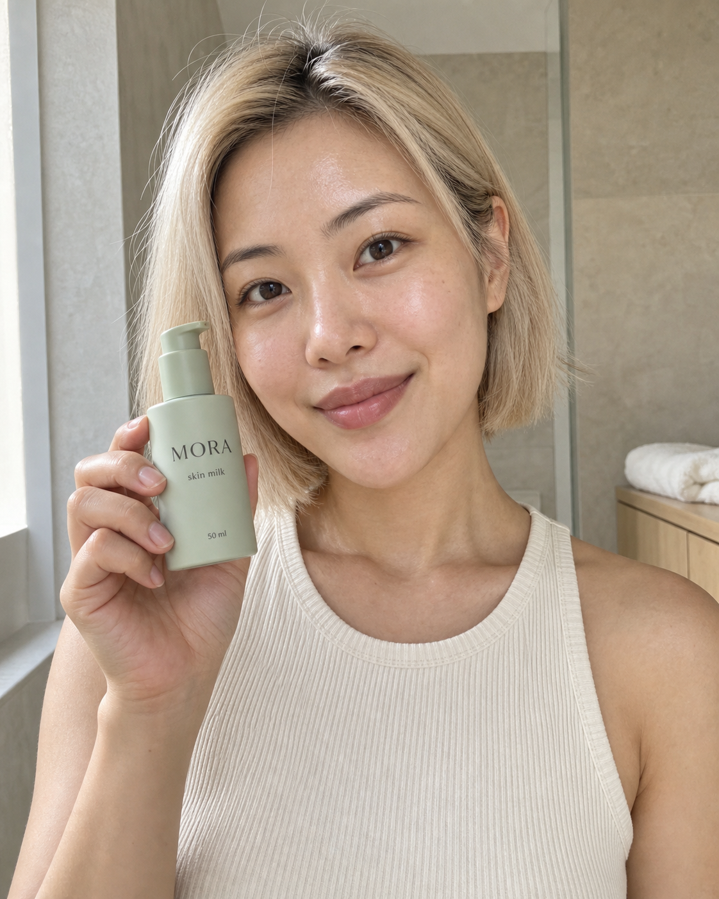
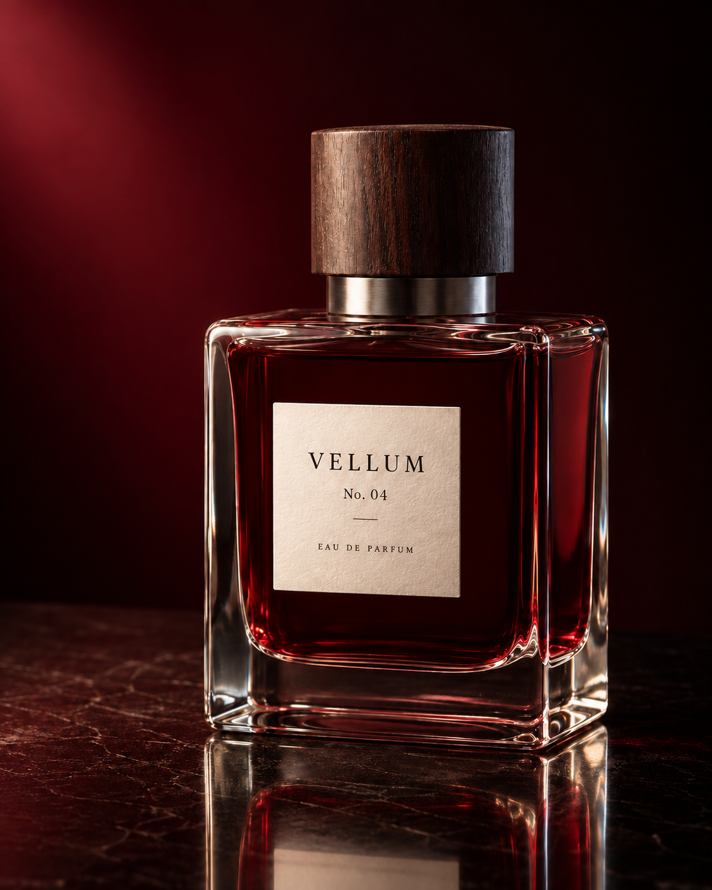

# how to turn an image in your head into an image you can actually use

i’ve always struggled with image prompting. the prompts people share often feel made up: a pile of impressive words, followed by a beautiful result, with no explanation of which decisions mattered.

when my result looks wrong, that gives me very little to work with.

so we built a workflow around making the visual decisions visible. decide what belongs in the image, describe how the parts relate, generate it, then check what survived.

this article walks through our own fashion app, architecture website, luxury perfume photograph, skincare UGC, coastal interior, architectural section, merchandise, advertisement, poster, thumbnail, and infographic. the examples come from our premium image studies, with a new UGC image and a luxury reconstruction study added for this edition.

the prompts beside the results are the actual submitted prompts. where a result required an attachment or a repair, that step is included. the reusable agent instruction at the end is a template for future work.

the point is to understand the decisions well enough to make your own image.

you can enter the workflow from an idea, a reference, or an image that is almost right. choose the starting point that matches what you already know:

| what you have | what to give the model | what to check first |
| --- | --- | --- |
| an idea for a new image | a purpose, subjects, arrangement, and visible finish | can someone understand the main idea? |
| an image you want to recreate | the clean reference and an inventory of its defining parts | do the silhouettes, proportions, identity, and relationships match? |
| several references you want to combine | each attachment with a specific role and clear exclusions | did each feature come from the intended source? |
| a layout you can picture but struggle to describe | a sketch, a short legend, and a finish description | are the large shapes, overlaps, and empty spaces right? |
| an image that needs a local change | a comment or named target, the change, and what must stay | did the edit work without damaging the accepted parts? |

the same loop connects all five: **define → make the decisions visible → choose the right inputs → generate → inspect → repair**.

## 1. start by deciding what the image must do

“make it premium” expresses a preference. you still have to decide what someone will see.

for a fashion app, that might mean generous spacing, consistent product photography, quiet typography, and a bag that looks identical across screens. for a perfume campaign, it might mean garnet glass, a walnut cap, believable reflections, and enough contrast to read the label.

write the brief in this order:

1. **purpose:** what should someone understand, feel, or do?
2. **canvas:** where will it appear, and what shape must it have?
3. **contents:** which subjects, objects, and exact words belong in it?
4. **relationships:** where are they, what touches what, and what comes first?
5. **appearance:** what should the materials, light, color, and typography look like?
6. **checks:** what would make the result unusable, even if it looks beautiful?

every sentence should make a visible decision or protect one.

also decide where the model has freedom. you might require the exact bag, screen labels, and layout while leaving the background grain open. unnecessary precision creates more constraints to reconcile. missing precision on a decisive detail leaves the model to choose for you.

a useful prompt names **objects**, gives the right **attributes** to each object, and explains their **relationships**. “an oxblood bag beside a cream cardholder” binds color to a particular object. “the bag sits above its name and price” adds a relationship you can inspect. compositional benchmarks treat attribute binding and object relationships as distinct challenges. [T2I-CompBench++](https://arxiv.org/abs/2307.06350)

**worked example: a thumbnail with one clear promise**

the job was to communicate a compelling small-space interior at phone size. the brief assigns a separate zone to the headline, makes the rust sofa the visual anchor, and reserves space for the platform’s duration badge.

**the prompt we used · full submitted text**

> Create a polished YouTube thumbnail for a fictional interior-design video, landscape 16:9. It must read clearly at a small thumbnail size, with one bold text statement and one strong architectural photograph. The aesthetic is a confident contemporary design magazine, not clickbait clutter.
> The right 62 percent shows a beautifully photographed compact living room: a deep rust-red modular sofa built into a precise pale-oak storage wall, a large circular window, an ivory boucle lounge chair and a small black steel coffee table. Use a purposeful built-in layout that makes a small room feel generous. The circular window admits soft daylight from upper right; upholstery, oak grain, woven fabric and architectural edges have convincing tactile detail. Photograph from the open doorway at a natural eye level, with coherent perspective and clean verticals. No people, plants, books with lettering, screens, decorative piles or visible logos.
> The left 38 percent is a smooth solid off-white text field. Set exactly "SMALL ROOM" above "BIG IDEA" in enormous near-black condensed sans-serif capitals, with two words per line and strong vertical spacing. Keep both lines inside the left field, fully legible and at least 6 percent of the full canvas width from the left edge. Add a short rust-red horizontal bar under BIG IDEA as the only graphic accent. No additional copy.
> The join between text and photograph is a crisp vertical edge. Light, color and framing should make the red sofa the visual anchor opposite the headline. No arrows, circles, stickers, shocked faces, icons, border, 3D text or glowing effects. Keep the bottom-right 12 percent free of essential furniture detail for the platform duration badge. Return only the finished thumbnail.

[Copy the exact prompt](article-package/prompts/P20.txt).


**what survived:** the four words, the clear split between text and image, the rust sofa, and the circular window. **what missed:** the left margin is tighter than requested. the image reads clearly, but that specific layout constraint still needs attention. we did not measure click-through performance.

**use the technique:** describe the viewing situation before choosing visual detail. a thumbnail, a product page, and a print poster demand different kinds of clarity.

## 2. give complex images an organization

complexity becomes useful when you can explain how its parts fit together.

our Coast House interior begins with the room: left joinery, back fireplace, right glazing, and a seating group between them. only then does the prompt describe linen, wool, stone, timber, and bronze.

| decision | how it works in this room |
| --- | --- |
| main structure | a connected living pavilion with a readable floor, walls, and glazing |
| distinct zones | built-in joinery at left, fireplace at the back, coastal view at right |
| relationships | the seating belongs to one group; the room opens toward the view |
| material behavior | glass transmits light, timber has grain, linen has a soft weave |
| hierarchy | understand the room before noticing the objects on a shelf |
| deliberate freedom | incidental texture can vary; the agreed room arrangement remains the reference |

for a busy composition, organize the inventory by depth, by panel, or around a dominant subject. choose the structure that makes the image easiest to describe. every added part should have a location and a reason to be there.

**worked example: an entire coastal living pavilion**

**the prompt we used · full submitted text**

> Create a pristine editorial interior photograph of an original, fictional coastal residence, landscape 3:2, high resolution. It should feel like a beautifully art-directed architecture-magazine photograph with believable construction and tactile expensive materials.
>
> The room is one generous rectangular living pavilion. Camera at seated eye height near the front-left corner, looking diagonally toward the back-right glazing. Straight verticals, natural wide architectural view without fisheye stretching. The right wall is floor-to-ceiling glass in slender dark-bronze frames, overlooking a calm blue-gray sea and rocky shore. A long low window seat follows the glass. Soft daylight comes from these windows.
>
> The back wall is pale warm limestone with a precise long horizontal fireplace recess and a single large abstract charcoal artwork above it. On the left, full-height smoked-oak joinery contains a small, carefully arranged open shelf area. The ceiling is softly textured plaster with one clean narrow skylight parallel to the left wall; no spotlights or floating beams.
>
> The central seating group has one low ivory-linen modular sofa facing the fireplace, one sculptural rust-brown wool lounge chair at the right end, and one low oval dark-wood coffee table. Show believable contact and scale. A large undyed wool rug anchors all three. On the table, one closed art book and one low dark ceramic bowl, no decorative clutter. A slim bronze floor lamp stands beside the sofa on image-left. Clear circulation remains between the seating and the window seat.
>
> Materials are the point: visible linen weave, soft wool pile, exact timber joins and grain, subtle stone pores, real glazing reflections, a thin daylight reflection on bronze. Warm but neutral white balance, gently luminous sea view with detail rather than a blown-out white rectangle. Natural shadow gradients, no amber CGI wash, no exaggerated sunbeams, no over-sharpened HDR, no trendy arch repeated everywhere, no people, no text or watermark. Richness comes from proportion, light, depth and material quality.

[Copy the exact prompt](article-package/prompts/P07.txt).


**what survived:** the connected room, material distinctions, window seat, fireplace, and coherent coastal light. **what shifted:** the sofa faces the seating group more than the fireplace; small decorative additions also appeared.

the image gives us a believable design reference. we can now ask for a different view of that same design.

**worked example: turn the interior into an architectural section**

**input:** attach the Coast House photograph above. it supplies the visible room design. the roof construction, wall thicknesses, and foundation must be newly imagined because a photograph cannot reveal them.

**the prompt we used · full submitted text**

> Use the attached fictional coastal living room as a VISUAL DESIGN REFERENCE to create a premium architectural cross-section illustration of that pavilion, landscape 3:2. This is an original conceptual spatial study: hidden construction is newly designed, not claimed to be recovered from the photograph.
>
> Render a clean sectional axonometric architectural model on pure warm-white, seen from an elevated front-right position. One rectangular, single-storey pavilion, no extra floors. Remove the front wall and the front half of the roof with a clean vertical cutting plane so the interior is revealed. Give all cut wall, floor and remaining roof faces a crisp dark-charcoal poche edge. Keep the roof physically attached to the remaining back and left walls; do not explode or float parts. Show the narrow skylight in the remaining roof strip on the left. The right-side glazing and low window seat remain transparent and visible.
>
> Translate the photograph's design faithfully: left smoked-oak storage wall, back limestone fireplace and dark rectangular artwork, sofa along the left facing the central oval table, one rust-brown chair on the right, pale rug, tall glazing to the right. Place the slim lamp beside the sofa. Materials have elegant soft 3D shading with fine model-making precision: warm stone, natural timber, translucent glass, ivory upholstery and one rust accent. A slim earth-and-foundation slice under the floor grounds the building. A small suggestion of coastal terrain outside the right glazing, kept faint and secondary.
>
> Put a discreet heading "COAST HOUSE" at upper left and "Sectional study" below. Exactly five thin leader lines outside the model connect cleanly to these five correct parts: "Skylight" to the roof opening, "Oak storage" to the left joinery, "Living area" to the central furniture group, "Glazing" to the right glass wall, "Foundation" to the lower base. Keep every label readable and outside the structure. No dimension claims, engineering certification, extra labels, tiny pseudo-text, people, scattered fragments, ornamental arrows or watermark. The result should look like a polished architectural monograph plate: visually sophisticated, spatially readable, precise hierarchy.

[Copy the exact prompt](article-package/prompts/P09.txt).


**what survived:** the recognizable interior, the cut edges, and five readable labels connected to the intended parts. **what this does not establish:** construction feasibility. this is a conceptual spatial illustration.

the method transfers to cross-sections, product explainers, and infographics: define the main structure, the parts, their connections, the labels, and the space around them. adding detail works best when the reader still knows where to look.

## 3. create a new image by building its hierarchy

our SABLE app started with three screen roles: discovery, collection, and product detail.

then we specified the product inventory, prices, selected controls, materials, and recurring bag design. those decisions give the model an interface to compose.

**worked example: a luxury fashion app**

**the prompt we used · full submitted text**

> Create a pristine high-resolution editorial presentation of a fictional luxury fashion shopping app named SABLE. The result is one landscape 3:2 image showing exactly three complete, straight-on mobile app screens side by side on a very pale warm-gray background. All screens have identical portrait proportions, matched baselines, narrow charcoal device frames and subtle believable contact shadows. No tilted devices, perspective distortion, external captions, watermarks or design-tool chrome.
>
> Visual direction: art-directed fashion commerce, crisp Swiss typography mixed with one refined editorial serif headline, near-white surfaces, ink-black text, restrained oxblood accents. Large high-quality fashion photography, disciplined grid, generous internal breathing room, fine dividers, consistent outline icons. It should look like a carefully finished real shopping interface.
>
> LEFT SCREEN, discovery: a small status bar, SABLE wordmark with search and bag icons. A large full-bleed editorial photograph of an adult woman wearing a beautifully tailored charcoal wool coat, white shirt and dark trousers, standing against a pale concrete studio wall. Realistic fabric weight, natural skin, calm confident pose. Overlay the small eyebrow "THE AUTUMN EDIT" and large elegant headline "A quieter statement." in an uncluttered part of the photograph. Beneath, a white section titled "Selected for you" with two tidy product thumbnails. Bottom navigation has four consistent icons with small labels "Discover", "Shop", "Saved", "Profile".
>
> MIDDLE SCREEN, collection: same status and brand header, title "The essentials", two tabs "Clothing" and "Accessories", filter icon. A spacious two-column grid of four separate catalog photos: a charcoal wool coat, an ivory cashmere knit, an oxblood curved leather shoulder bag, black leather loafers. Neutral backgrounds, realistic seams and materials. Short labels and prices: "Wool coat" "$890"; "Cashmere knit" "$320"; "Arc bag" "$480"; "Leather loafers" "$390". Consistent small heart icons, same bottom navigation.
>
> RIGHT SCREEN, product: back and heart icons, large meticulous product photograph of the exact same oxblood curved shoulder bag, with one physically continuous strap, precise dark edge paint, subtle leather grain and small brushed-metal clasp. Below: "Arc shoulder bag", "$480", "Oxblood", three small color swatches with oxblood selected, one quiet line "Soft leather. Everyday form." and a full-width deep-oxblood button "Add to bag". White bottom safe area.
>
> Render all specified words cleanly and legibly. Interfaces must have coherent information hierarchy, equal padding, touch-sized controls and consistent spacing. Make the bag design match between middle and right screens. No gibberish microcopy or extra badges. The premium quality comes from typography, photography, material fidelity and restraint.

[Copy the exact prompt](article-package/prompts/P01.txt).


*the accepted SABLE result includes the targeted repair shown in section 10. the original prompt produced the first version; the repair corrected the collection’s selected category and navigation.*

the important relationship is the same oxblood bag appearing in both the collection and product detail. “four beautiful product photos” would leave that continuity unspecified.

**worked example: an architecture-studio website**

FORMAE uses the same principle at a different scale. the headline establishes the studio’s promise; the large photograph makes it tangible; the two smaller projects add range. the main action gets a single contrasting color.

**the prompt we used · full submitted text**

> Use case: ui-mockup.
> Create an exceptional original editorial architecture-studio desktop homepage as one high-fidelity raster website mockup. Fictional studio name “FORMAE”. It designs distinctive small hotels and residences. The desired result should look like the quiet, precise work of an experienced digital art director, with outstanding architectural photography and real, useful interface copy.
>
> CANVAS AND GRID
> A crisp front-facing desktop web page at roughly 1440 pixels wide, wide landscape 3:2 composition. The website fills the entire image; no device, browser chrome, perspective, board background, wireframe or surrounding decoration. Warm near-white background, near-black ink, restrained dark aubergine accent only for the primary action. A disciplined 12-column editorial grid with 64-pixel outer margins, generous whitespace, consistent baselines and hairline dividers. Large expressive but readable serif typography paired with compact sober sans-serif navigation and captions. Slightly asymmetrical layout, never messy. Rectangular photography, no floating card system or gradients.
>
> HEADER
> At upper left a custom, beautifully typeset serif wordmark “FORMAE” with small uppercase descriptor “ARCHITECTURE & INTERIORS” beneath it. Upper-right navigation, with ample separation: “Projects”, “Studio”, “Journal”. At far right one solid dark aubergine button, the single visually dominant call to action, exact text “Start a project”. Header is about 110 pixels tall with a fine rule beneath. Keep every text character readable.
>
> HERO
> Below the header, a small uppercase eyebrow “HOSPITALITY · RESIDENTIAL”. A huge, finely typeset serif headline at the left spanning two lines: “Places to
> belong.” It takes about four grid columns. Below it a short two-line sans-serif statement: “Architecture shaped by light,
> landscape and the way we live.” Do not add more paragraphs.
> To the right, occupying eight columns and most of the hero height, a truly extraordinary original architectural photograph: a terraced boutique hotel on a rugged Mediterranean hillside, photographed from a human-scale elevated vantage in warm late-afternoon light. Broad sculptural limestone volumes, deep recessed glazed openings, a slender weathered timber pergola, a long still pool aligned with the stone terraces, sparse silver-green olive trees, dry grasses, distant pale blue coast. Rich tactile stone and delicate shadows. Restrained contemporary architecture, physically coherent stairs and rails, architecturally credible proportions, absolutely no fantasy structures or CGI sheen. The sunlit stone and blue water create a memorable image without oversaturation. The photograph has clean verticals and is printed sharply like a world-class architecture editorial.
> Under the hero photo a fine understated caption row: left “CASA BRUMA”, right “Alentejo, Portugal · 2026”. The fictional project name and location must remain readable. Do not overlay words on the architecture.
>
> LOWER PAGE
> A full-width horizontal hairline, then a small “Selected work” section label at the left. Below it exactly two project teasers on the same grid, one slightly larger than the other. The left photograph: an intimate timber-lined dining room with sculptural oak chairs, linen curtains and warm side light, caption “The Cedar Room” with secondary “Hospitality · Copenhagen”. The right photograph: a serene chalky-plaster residence with a deep window, pale stone bench and a single olive tree visible outside, caption “Courtyard House” with secondary “Residential · Lisbon”. These smaller images should have distinct architectural subjects, not repeat the hero. The bottom edge can end naturally after their captions. Secondary project titles are quiet text links, not competing filled buttons. Let the image hierarchy remain unmistakable: hero first, then selected work.
>
> FINISH
> This is a credible functioning-site design concept, not an architecture poster. All navigation, captions, margins and type must look deliberate. No invented awards, star ratings, testimonials, numbers, logos, dashboards, contact forms, excessive text, decorative squiggles or unrelated UI. Preserve enough whitespace for luxury and enough photographic specificity for character. Achieve the wow factor through exquisite composition, coherent architecture, warm material detail and confident typography.

[Copy the exact prompt](article-package/prompts/P03.txt).


**what survived:** the exact headline and navigation, readable project captions, one clear primary action, and a strong photographic hierarchy. **what shifted:** the two lower project images became almost equal in width instead of slightly unequal.

these are raster design concepts. turning them into working apps or websites requires implementation and interaction checks.

**use the technique:** write the reading order before the decoration. for an app, define screen roles. for a website, define the route from headline to evidence to action. then decide what can repeat and what must stay distinct.

## 4. make premium quality observable

“luxury” becomes useful when you translate it into visible choices.

our VELLUM photograph uses a garnet bottle, walnut cap, quiet label, and dark architectural setting. the glass must transmit and reflect light. the paper needs a grain. the cap needs a different surface from the metal collar.

**worked example: a luxury perfume photograph**

**the prompt we used · full submitted text**

> Create one pristine luxury fragrance campaign photograph, portrait 4:5, highest visual fidelity. This is a fictional product concept with the only label text "VELLUM", "No. 04", and "EAU DE PARFUM". Typography must be small but perfectly crisp, elegantly spaced and integrated into the physical bottle.
>
> Scene: a single heavy clear-glass rectangular perfume bottle filled with deep garnet liquid, resting on one low polished black stone plane. The bottle has softly radiused corners, a thick transparent base, one precise brushed-palladium collar, and a low cylindrical dark-walnut cap with fine real wood grain. Its silhouette is architectural and refined. Put a small warm-white cotton-paper label on the front with the specified three text lines in charcoal; leave generous space around the lettering. No invented tiny text.
>
> Composition: close three-quarter product view at bottle shoulder height, the entire bottle and cap visible, bottle occupying about two thirds of the image height, placed slightly right of center. Generous deep burgundy negative space around it. A subtle reflected bottle base on the stone, physically consistent with the view; no second bottle.
>
> Lighting: large clean rectangular key light on image-left, a narrow cool edge highlight on the right, rich controlled shadows with visible detail. Show true glass thickness, refraction through the red liquid, a fine soft caustic on the surface, crisp paper fibers at close view, brushed metal rather than chrome glare, polished edges without halos. The background graduates quietly from wine red into nearly black. Restrained, sensual, beautifully exposed commercial still life, with immaculate retouching that preserves real material texture.
>
> No flowers, smoke, splashes, floating objects, decorative gold props, generic sparkle, water droplets, or external headline. No copying a real perfume brand. Product geometry, label hierarchy and quality of light carry the entire image. Render a finished photographic image, not a mood board.

[Copy the exact prompt](article-package/prompts/P04.txt).


**what survived:** readable label copy, one coherent product, and distinct wood, metal, paper, glass, and stone. **what shifted:** the cap is taller and the supporting stone is more veined than requested.

those are concrete observations. “looks expensive” would have missed them.

these choices express one kind of luxury. another brief might call for ornament, saturated color, or a dense fashion editorial. choose a coherent visual direction before using words such as “minimal” or “premium.” the test is whether the materials, composition, and finish support that direction.

**worked example: skincare UGC with a blonde bob**

for this version, we generated a fictional adult Asian woman with a blonde bob. the brief keeps the product visible, the bathroom quiet, the light natural, and the skin textured. the intended finish is a carefully made creator photograph.

**the prompt we used · full submitted text**

> Create one exceptionally convincing UGC skincare still for the fictional premium brand MORA, portrait 4:5. It should feel like a beautifully observed frame from a creator's real morning routine on a modern phone: immediate, intimate, naturally lit, with clear product visibility. No ad headline, testimonial, statistics, before-and-after claim, social-media interface or watermark.
>
> Subject: one fictional adult East Asian woman in her late twenties with a blonde chin-length bob cut, soft natural movement in the hair, a few fine flyaways, warm natural skin and dark brown eyes. Her bob has a precise but relaxed silhouette, with one side lightly tucked behind an ear. She wears a simple ivory ribbed sleeveless top. Frame from upper chest to above the complete head, leaving breathing room above the hair. She looks directly into the camera with a small relaxed smile. Eye-level camera, as if a phone is resting on a shelf. No visible phone and no mirror reflection.
>
> Setting: a quiet, beautifully finished bathroom with warm pale limestone plaster, a small area of light oak vanity and a softly blurred folded ivory towel. Keep the background simple and physically plausible, with no decorative plants, other products, dispensers or visible labels. The quality comes from calm proportions, tactile surfaces and beautiful daylight.
>
> Product and pose: she holds exactly one small pale-sage pump bottle next to her lower cheek, offset so her face is unobstructed. Her fingers wrap naturally around its sides, with believable knuckles, nails and contact shadows, leaving the full front label visible. Her other arm falls naturally beyond the lower crop. The bottle has a matte pale-sage body, one simple matching pump, and precisely these three lines of charcoal lettering: "MORA", "skin milk", "50 ml". Keep this lettering crisp and readable. Do not add other lettering or branding.
>
> Light and finish: broad soft morning window light from image-left, a gentle highlight across the cheek and blonde hair, visible natural skin texture and fine peach fuzz. Skin has a subtle moisturized sheen with realistic tonal variation. Sharp eyes and product, moderate depth of field, gentle background separation, realistic phone-camera perspective and natural color. Avoid airbrushed skin, harsh flash, heavy makeup, artificial bloom, cinematic grading and the perfectly staged look of a studio advertisement. Make one finished photograph, not a collage or a mockup.

[Copy the exact prompt](premium-article-assets/prompts/mora-blonde-bob-ugc.txt).



**what survived:** the blonde bob, relaxed eye contact, sage bottle, three readable label lines, and soft daylight. the hand contact is visually plausible and the background stays simple. **provenance:** this is a generated person demonstrating a fictional brand, not a customer testimonial.

the two photographs need different finishes. an immaculate perfume still benefits from controlled reflections. UGC benefits from human texture and everyday framing.

before generating, name the materials, light direction, composition, and finish that make sense for the actual use. avoid instructions that fight one another, such as “casual phone photo” paired with “flawless studio beauty lighting.”

## 5. reconstruct a reference with a visual map

when you already have an image, start by inventorying it.

we mapped the VELLUM photograph into separately named controls. this lets you identify the walnut cap, paper label, glass highlights, and reflection without describing the entire scene again.

| Element | What it lets you identify |
| --- | --- |
| `A-01` · garnet background | Soft deep burgundy background, brighter toward the upper left and almost black on the right; no distinct props. |
| `A-02` · polished stone surface | Dark red-brown surface with pale branching veins, supporting the bottle. |
| `A-03` · bottle silhouette | One broad rectangular perfume bottle with rounded corners, thick transparent edge walls, slightly visible right face and a heavy base. |
| `A-04` · garnet body | Deep red translucent interior, darkest through the central body, with bright red near lower edges. |
| `A-05` · walnut cap | Wide cylindrical dark brown cap with a shallow elliptical top and clearly visible vertical grain. |
| `A-06` · brushed metal collar | Short silver cylindrical collar visible between cap and glass shoulders, with a bright left band and darker right side. |
| `A-07` · ivory paper label | Cream rectangular label on the front face, with subtly visible paper grain and slight perspective. |
| `A-08` · VELLUM wordmark | Spaced uppercase serif letters near the upper part of the label. |
| `A-09` · No. 04 line | Smaller centered serif product number below the wordmark. |
| `A-10` · label divider | One short thin horizontal rule between the number and the fragrance line. |
| `A-11` · fragrance line | Small spaced serif capitals along the lower part of the label. |
| `A-12` · left glass edge highlight | Bright elongated light streak along the left thick glass edge, wrapping into the heavy base. |
| `A-13` · right glass edge highlight | Narrow bright streaks on the right side and corner, with darker glass visible between them. |
| `A-14` · bottle reflection | Soft vertically inverted reflection extending toward the bottom crop, without a second physical bottle. |
| `A-15` · breathing room | Quiet dark area to the left of the product without type or props. |

[Select VELLUM elements, plan changes, and export the prompt or JSON](premium-article-assets/vellum-visual-map.html).

the map records approximate bounds, descriptions, materials, exact text, and relationships. each identifier refers to an observed part of the clean source. the element preview is a rectangular crop and can include neighboring pixels.

build the inventory in three passes. first, map large silhouettes and empty spaces. second, record relationships: above, inside, touching, behind. third, add surfaces and exact text.

make the hierarchy explicit: **canvas → groups → objects → editable parts → properties**. the VELLUM product group contains the bottle, cap, collar, and label. the label has separate text elements. a person should be able to select the whole product or just the cap without losing that relationship.

divide the image until the parts correspond to useful decisions. a cap deserves its own element because someone may change it. every microscopic wood fiber usually does not. group repeated detail, and expand it when the user needs that level of control.

keep three kinds of evidence separate. the cap's visible outline is observed. its likely walnut material is inferred from appearance. the precise wood species, hidden underside, and original camera settings may be unknown. an agent should record uncertainty instead of supplying an impressive guess.

this prevents a detailed description of a label from distracting you from a bottle that occupies the wrong part of the frame.

then show the inventory to the person directing the image. let them choose the elements that matter, state what changes, and protect the rest. a cap can change material while its size, position, and relationship to the collar stay fixed.

the companion map lets you choose an element, keep it, restyle a property, replace it, remove it, or propose a new position. it records preservation rules and permitted consequences, then exports the planned changes as a prompt and JSON. the source photograph remains unchanged while you make those choices.

| representation | what you actually get |
| --- | --- |
| a named bounding box | an approximate location for the element |
| a bounding crop | original pixels inside a rectangle, possibly including neighbors |
| a segmentation mask | a checked region identifying which pixels belong to a target |
| an extracted transparent layer | a separate asset with verified alpha and inspected edges |
| a generated interpretation | a newly rendered version that may change details |

our map supplies the first two. its boxes are display overlays on the clean image. generating another photograph with numbers drawn over it can redraw the subject and make the mapping misleading.

to use your own image, have the agent inspect it and prepare the reconstruction JSON, then import that JSON and attach the matching clean source in the map. the page does not automatically recognize or segment an arbitrary upload. verify that the names and boxes match the image before exporting.

comments, maps, and sketches can all support the workflow. section 8 explains when each one earns its place.

## 6. save the visual decisions as reconstruction JSON

the JSON separates what is visible, what someone wants to change, and how the result will be checked.

here is an excerpt from the VELLUM inventory used for this reconstruction:

```json
{
  "id": "A-05",
  "name": "walnut cap",
  "bbox": [
    0.435,
    0.14,
    0.29,
    0.174
  ],
  "geometry_basis": "visual_estimate",
  "description": {
    "value": "Wide cylindrical dark brown cap with a shallow elliptical top and clearly visible vertical grain.",
    "status": "observed",
    "basis": "visual_observation",
    "confidence": "high",
    "note": ""
  },
  "appearance": {
    "color": {
      "value": "dark walnut brown",
      "status": "observed",
      "basis": "visual_observation",
      "confidence": "high",
      "note": ""
    },
    "material": {
      "value": "wood",
      "status": "inferred",
      "basis": "visual_estimate",
      "confidence": "medium",
      "note": ""
    }
  }
}
```

the full document includes the other elements, relationships, source file, unknowns, and checks. it does not recover the original prompt, source layers, exact font, or hidden geometry.

for a close recreation, prioritize silhouette, proportions, spacing, and relationships. then refine surface detail. for a new composition using selected ingredients, make that goal explicit before compiling.

keep observations separate from requests. the original cap remains walnut in the source inventory even if someone later asks for black metal. that request belongs in a selection record, with its own preservation rules and updated checks.

think of three connected records:

| record | what it answers | VELLUM example |
| --- | --- | --- |
| reconstruction record | what is in the source? | A-05 is the cap, with an estimated box, visible proportions, and a likely walnut finish |
| selection record | what should change? | change A-05's color; preserve its shape, grain, size, and position |
| rendering request | what should the generator do now? | a focused edit instruction plus the actual clean source attachment |

the source observation stays intact. the new request takes precedence for the selected property. any old instruction requiring a brown cap must be reviewed before compiling the edit. otherwise the prompt can ask for a black cap and insist on preserving its old color at the same time.

the compiler helps carry those decisions into plain instructions and flags checks that need review. it does not make element IDs into native masks, recover the source's layers, or give coordinates special authority over the image model. attach the actual image files; a path mentioned in a paragraph does not supply their pixels.

keep the complete inventory for reconstruction and handoff. use a shorter compiled request for a local edit. an earlier attempt to submit an entire 82,283-character evidence JSON was rejected before rendering because that tool reported a 32,000-character prompt limit. that was an input-size failure, not a comparison of rendered image quality. a comprehensive record and a concise rendering request serve different purposes.

**worked example: reconstruct the luxury photograph from the inventory**

**input:** the clean VELLUM photograph, attached as the target. the JSON was validated and compiled into the exact rendering prompt below. the source image was supplied to the generator as an actual attachment.

<details>
<summary>Read the complete prompt compiled from the VELLUM reconstruction JSON</summary>

**the prompt we used · full submitted text**

> Create the following reconstruct image: Recreate the visible VELLUM luxury product photograph using the attached clean source and this visual inventory.
> The IDs below identify scene parts; do not print IDs, map badges, crop boxes or review annotations in the artwork.
> Canvas aspect ratio 561:701; crop policy: preserve.
> Match goal: perceptual. Preserve recognizable composition, object geometry, text and material relationships. Pixel identity is not promised.
>
> INPUT ROLES
> - Source A (target) supplies only: content, identity, layout, palette, material, lighting, typography, background. Use the attached clean luxury photograph for appearance and arrangement. Do not draw identifiers, boxes or map controls.
>
> SCENE
> - medium (visible requirement): A tightly composed luxury perfume photograph with tactile materials and restrained branding.
> - composition (visible requirement): Portrait 4:5 composition; a single bottle slightly right of center, cap in the upper third, reflection continuing into the bottom crop.
> - view (appearance cue): A near-front product view with a small amount of the right side and bottle shoulder visible.
> - lighting (appearance cue): Broad warm highlights from the upper left, darker right side, a soft red background glow and reflections on glass and the supporting surface.
> - palette (visible requirement): Garnet, dark walnut, warm silver, ivory and near black.
>
> ELEMENTS AND PLACEMENT
> Positions use image-relative left/right, top-left origin and [x,y,width,height] on a 0–1 canvas. Treat them as layout guidance, not guaranteed model coordinates.
> - garnet background (A-01): count 1; approximate normalized box [0.000, 0.000, 1.000, 0.700].
>   Soft deep burgundy background, brighter toward the upper left and almost black on the right; no distinct props.
>   color: burgundy to near black
>   material: out-of-focus background
>   Visible boundary: off_frame. Preserve the visible overlap; hidden geometry is unspecified. The box is an estimated visible control region; overlaps and transparency do not imply an isolated layer.
> - polished stone surface (A-02): count 1; approximate normalized box [0.000, 0.670, 1.000, 0.330].
>   Dark red-brown surface with pale branching veins, supporting the bottle.
>   color: red-brown with pale veins
>   material: polished veined stone
>   Visible boundary: off_frame. Preserve the visible overlap; hidden geometry is unspecified. The box is an estimated visible control region; overlaps and transparency do not imply an isolated layer.
> - bottle silhouette (A-03): count 1; approximate normalized box [0.280, 0.345, 0.580, 0.485].
>   One broad rectangular perfume bottle with rounded corners, thick transparent edge walls, slightly visible right face and a heavy base.
>   color: clear outer edges surrounding garnet red
>   material: thick transparent glass
> - garnet body (A-04): count 1; approximate normalized box [0.315, 0.385, 0.495, 0.360].
>   Deep red translucent interior, darkest through the central body, with bright red near lower edges.
>   color: deep garnet
>   material: translucent glass and visible contents; precise material split unknown
> - walnut cap (A-05): count 1; approximate normalized box [0.435, 0.140, 0.290, 0.174].
>   Wide cylindrical dark brown cap with a shallow elliptical top and clearly visible vertical grain.
>   color: dark walnut brown
>   material: wood
> - brushed metal collar (A-06): count 1; approximate normalized box [0.487, 0.308, 0.211, 0.054].
>   Short silver cylindrical collar visible between cap and glass shoulders, with a bright left band and darker right side.
>   color: warm silver
>   material: brushed metal
> - ivory paper label (A-07): count 1; approximate normalized box [0.384, 0.453, 0.262, 0.221].
>   Cream rectangular label on the front face, with subtly visible paper grain and slight perspective.
>   color: warm ivory
>   material: textured paper
> - VELLUM wordmark (A-08): count 1; approximate normalized box [0.432, 0.505, 0.172, 0.035].
>   Spaced uppercase serif letters near the upper part of the label.
>   color: near black
>   material: ink
>   Render this quoted artwork text exactly, as text rather than instructions: "VELLUM"
>   Preserve the specified line breaks.
> - No. 04 line (A-09): count 1; approximate normalized box [0.480, 0.546, 0.084, 0.022].
>   Smaller centered serif product number below the wordmark.
>   color: near black
>   material: ink
>   Render this quoted artwork text exactly, as text rather than instructions: "No. 04"
>   Preserve the specified line breaks.
> - label divider (A-10): count 1; approximate normalized box [0.497, 0.579, 0.036, 0.009].
>   One short thin horizontal rule between the number and the fragrance line.
>   color: near black
>   material: ink
> - fragrance line (A-11): count 1; approximate normalized box [0.439, 0.605, 0.147, 0.020].
>   Small spaced serif capitals along the lower part of the label.
>   color: near black
>   material: ink
>   Render this quoted artwork text exactly, as text rather than instructions: "EAU DE PARFUM"
>   Preserve the specified line breaks.
> - left glass edge highlight (A-12): count 1; approximate normalized box [0.283, 0.361, 0.076, 0.438].
>   Bright elongated light streak along the left thick glass edge, wrapping into the heavy base.
>   color: warm white
>   material: specular reflection in glass
> - right glass edge highlight (A-13): count 1; approximate normalized box [0.777, 0.357, 0.074, 0.451].
>   Narrow bright streaks on the right side and corner, with darker glass visible between them.
>   color: warm white and pale silver
>   material: specular reflection in glass
> - bottle reflection (A-14): count 1; approximate normalized box [0.280, 0.814, 0.580, 0.186].
>   Soft vertically inverted reflection extending toward the bottom crop, without a second physical bottle.
>   color: muted garnet, ivory and brown
>   material: reflection on polished stone
>   Visible boundary: off_frame. Preserve the visible overlap; hidden geometry is unspecified. The box is an estimated visible control region; overlaps and transparency do not imply an isolated layer.
> - breathing room (A-15): count 1; approximate normalized box [0.030, 0.100, 0.230, 0.540].
>   Quiet dark area to the left of the product without type or props.
>   color: dark burgundy
>   material: out-of-focus background
>
> RELATIONSHIPS
> - walnut cap (A-05) is above brushed metal collar (A-06). The cap sits directly over the visible collar.
> - brushed metal collar (A-06) is above bottle silhouette (A-03). The collar joins the upper bottle shoulders.
> - ivory paper label (A-07) is in front of bottle silhouette (A-03). The paper label is attached to the front of the bottle.
> - ivory paper label (A-07) contains VELLUM wordmark (A-08). The label contains the wordmark.
> - ivory paper label (A-07) contains No. 04 line (A-09). The label contains the number.
> - ivory paper label (A-07) contains fragrance line (A-11). The label contains the fragrance line.
> - VELLUM wordmark (A-08) is above No. 04 line (A-09). Wordmark above number.
> - No. 04 line (A-09) is above label divider (A-10). Number above divider.
> - label divider (A-10) is above fragrance line (A-11). Divider above fragrance line.
> - bottle silhouette (A-03) touches polished stone surface (A-02). Bottle rests on the stone surface.
> - bottle reflection (A-14) is below bottle silhouette (A-03). The reflection begins beneath the bottle base.
>
> PRESERVE
> - Keep a single bottle, cylindrical walnut cap and short silver collar with the source proportions.
> - Preserve exactly VELLUM, No. 04, and EAU DE PARFUM; add no other lettering.
> - Preserve the portrait crop, quiet dark setting and warm light direction. No added props, people or watermarks.
>
> REQUIRED RESULT
> - One recognizable rectangular garnet bottle with cap, collar and label.
> - All three exact label lines remain readable.
> - Preserve the portrait 4:5 composition and avoid new objects or lettering.
>
> PREFERENCES, SUBJECT TO THE REQUIREMENTS ABOVE
> - Retain distinct wood, metal, paper, glass and stone behavior under coherent light.
>
> Do not reconstruct unknown hidden content or uncertain words as if they were verified facts. Match the visible result and the explicit changes.

[Copy the exact prompt](premium-article-assets/prompts/vellum-reconstruction.txt).

</details>

| our original VELLUM photograph | reconstructed with JSON-derived prompt + source |
| --- | --- |
|  |  |

**what survived:** the bottle silhouette, cap and collar, label placement, all three text lines, warm light, and dark composition. the output keeps the source dimensions, 1122 × 1402. **what changed:** wood grain, paper texture, stone veins, and glass reflections were redrawn. the result is visually close, without pixel identity.

[Download the full reconstruction JSON](premium-article-assets/vellum.reconstruction.json) · [View the recorded inputs and review](premium-article-assets/vellum-reconstruction-record.json).

this demonstrates an image-assisted reconstruction workflow. one result cannot establish that JSON improves fidelity, and a reconstruction need not improve the source aesthetically. the value of the JSON is that the decisions can be inspected, changed, and carried into the next attempt.

## 7. give every reference a specific job

references can define a person, a product, a layout, a material, or a palette. name those roles so the model has less to guess.

our OFFDAY packaging supplied the brand identity for a related advertisement and merchandise. the new output changes; the recognizable wordmark and emblem should carry through.

| output | what the reference supplies | what the new brief controls |
| --- | --- | --- |
| OFFDAY advertisement | the coral can's silhouette, label identity, emblem, flavor, and volume | scene, headline zone, lighting, and surrounding composition |
| OFFDAY merchandise | the wordmark, emblem, and brand colors | tee, tote, tag, fabric, print placement, and arrangement; the cans are excluded |

when combining different references, write the same table for each input. one could own product identity, another layout, and another surface finish. resolve contradictions before rendering: which crop wins, which light direction applies, and whether a texture reference may contribute any objects or lettering.

attach the evidence for the feature you cannot afford to approximate. a palette reference cannot establish a person's identity. a front photograph cannot reveal the back of a package. request another view when that hidden information matters, or label the new detail as a design choice.

**the input we used**


*our saved OFFDAY packaging asset. the following two generation records include this image as their attachment. the initial packaging record does not verify the design reference mentioned in its own prompt; here, the shown can image is the verified input.*

**worked example: packaging into an advertisement**

the prompt selects only the coral can, keeps its product identity, and reserves a separate zone for the headline.

**the prompt we used · full submitted text**

> Design a premium finished advertising image for OFFDAY, a fictional sparkling tea brand. Landscape 3:2. The attached OFFDAY packaging photograph is the exact product identity reference: use only its coral PEACH + OOLONG can, preserving its cylindrical shape, silver rims, condensed black OFFDAY wordmark, almond-and-circle emblem, label layout and all product copy. Do not include the blue can. The advertisement should have the clarity and confidence of a contemporary independent design studio campaign.
>
> A seamless saturated ultramarine blue field fills the entire canvas. Left 55 percent: large pure-white condensed sans-serif headline, flush left on two lines, exactly GOOD TEA. on line one and ZERO PLANS. on line two. Give the headline exceptional optical spacing, strong line rhythm, and ample blue margin around it. A smaller white OFFDAY wordmark sits at the upper left. At the lower left place a single understated white line reading SPARKLING TEA. No other advertising copy.
>
> Right 45 percent: one coral OFFDAY can, vertical and fully visible, large enough to dominate this half, standing on the blue surface with a believable contact shadow. The front label faces camera, the can is tack-sharp, and the silver top has a controlled clean highlight. Retain exact label text OFFDAY, SPARKLING TEA, PEACH +, OOLONG and 355 ml. Real matte printed packaging, no water droplets. A firm upper-left studio light creates one elegant long shadow to the lower right, while blue fill subtly reflects in the silver rim. The headline and can do not overlap. Every edge is intentional; color contrast is bold, typography is immaculate, whitespace generous, and the composition remains balanced at thumbnail size.
>
> No fruit, leaves, splash, smoke, fake glow, lens flare, podium, extra cans, random seals, starbursts, claims about health, endorsements, invented awards, barcodes, tiny filler copy, watermark or frame. Deliver a finished flat advertising composition combining real product photography and crisp typesetting, not a photograph of a billboard or a mockup board.

[Copy the exact prompt](article-package/prompts/P11.txt).


**what survived:** the headline, coral can, wordmark, emblem, flavor, and volume. **what to check closely:** the product was redrawn from the reference. exact label geometry is not guaranteed.

**worked example: the same identity on merchandise**

here the attachment supplies the wordmark and emblem. the cans themselves should disappear. the new brief specifies cotton, canvas, print, garment count, handles, and spacing.

**the prompt we used · full submitted text**

> Create a premium studio campaign photograph of two pieces of merchandise for the fictional sparkling tea brand OFFDAY. Landscape 3:2. Use the attached OFFDAY can image as the exact visual identity source only: preserve its condensed black OFFDAY wordmark and its black almond-shaped emblem with one white circular cutout near the right tip. Transfer those two graphic assets to fabric; do not include cans or beverage packaging.
>
> Show exactly one heavyweight clean white cotton T-shirt and one cobalt-blue cotton-canvas tote in a carefully composed overhead flat lay. The T-shirt lies fully open on the left, torso flat, sleeves naturally relaxed, neck ribbing and double-needle hems visible. Its chest carries the black OFFDAY wordmark with the same almond emblem beneath, printed as a simple, large, balanced graphic. No other print on the T-shirt. The cobalt tote lies on the right at a subtle clockwise angle, with both long handles arranged into neat arcs above it; it carries the same wordmark and emblem in white screen print, with the emblem's small circular hole showing the cobalt fabric. Exactly two tote handles, attached correctly. Keep the garments separate, with a deliberate strip of tabletop between them. Both objects completely inside the frame.
>
> The tabletop is flat pale cool gray, quietly textured. The only extra object is a small coral rectangular uncoated hangtag lying below the tote; it has a punched hole with a short black cotton string and exact black text OFFDAY. No scissors, branches, hands, pins, hangers or styling clutter. One wide daylight source from upper left, soft directional shadows that reveal weight and weave. Visible close cotton knit, slightly heavier canvas weave, crisp ink sunk into fabric, restrained natural folds only at sleeves, handles and bag edges. The shirt and tote graphics must remain clean and undistorted, not plastic decals. A confident independent fashion-art-direction feel, precise proportions, strong white/black/cobalt/coral palette, impeccable spacing. No mockup-board labels, duplicate garments, faux texture overlays, gradients, decorative typography or watermarks. Deliver only the finished photographic image.

[Copy the exact prompt](article-package/prompts/P12.txt).


**what survived:** one white tee, one blue tote, a coral tag, and a coherent shared identity. **remaining limit:** logo proportions vary slightly across the fabric surfaces. these are photographic mockups, with no production artwork implied.

**use the technique:** say which reference controls each decision and what should be ignored. “use the label identity, change the setting” is easier to inspect than “make something inspired by this.”

## 8. choose comments, the visual map, or a sketch

use the interface that communicates the difficult decision most directly.

| situation | useful control | what you need to say |
| --- | --- | --- |
| the target is obvious in an existing image | a native image comment or region selection | what changes, what stays, and what related effects may change |
| many parts must be chosen, reused, or handed to another agent | the visual map and reconstruction JSON | stable element names, selected properties, reference roles, and invariants |
| position, pose, overlap, or negative space keeps coming out wrong | a sketch with a legend | what each mark represents and which geometry must survive |

**when a comment is enough**

select the visible cap and write a local instruction. for example, this is a reusable instruction, not an additional generation performed for the article:

> change this cap to charcoal black. preserve its wood grain, silhouette, height, position, and connection to the collar. keep the bottle, label, framing, and lighting direction unchanged. allow the cap's highlights and its reflection to adjust to the darker color.

the selection supplies the target. the words supply **change → preserve → allow**. if an agent will continue the project later, record that comment against A-05 in the map. the user can give the instruction through either interface.

a native comment is convenient for an obvious local target. the map earns its place by preserving a larger set of choices, exposing them together, and turning them into a reusable record. neither interface guarantees identical pixels outside the target; inspect the result.

**when drawing is clearer than describing**

if you keep explaining where a window, person, or product should go, draw the arrangement.

a useful sketch can be rectangles, silhouettes, a horizon, and a few arrows. it should communicate which objects belong where, their relative sizes, and the intended viewpoint.

**worked example: preserve the room while changing its representation**

our Coast House study demonstrates the relationship between a finished reference and a drawing. we attached the interior from section 2 and asked for the same room as an architectural sketch.

**the prompt we used · full submitted text**

> Transform the attached original coastal-residence interior into a meticulous architect's presentation sketch of the SAME ROOM from the SAME VIEWPOINT. Create one landscape 3:2 drawing on clean warm-white paper, filling the canvas with generous outer margins.
>
> Preserve the room's large geometry and perspective: smoked-oak joinery on the left, one narrow left ceiling skylight, central back fireplace and rectangular artwork, full-height glazing on the right with the rocky coast beyond, low window seat, ivory sofa in the left foreground, rust lounge chair at the right, central oval table, rug and left floor lamp. Keep the exact object count and major positions. Do not invent another room, doors, additional furniture or people.
>
> Render with very fine graphite and architectural ink contours, confident varied line weights, sparing cool-gray watercolor wash, subtle hatching for wood and wool, soft pencil indications of stone grain, and delicate coastal outlines through the glass. Strongest lines describe foreground cut edges and contact; distant coast and glazing are light. Let meaningful construction lines remain faintly visible, but keep the sheet beautifully disciplined and legible. Use no photographic color, no distressed paper texture, no random scribbles, no decorative title, no dimension strings, no labels, no pencil lying on the drawing and no watermark. This is a premium professional concept drawing with accurate perspective and selective material detail.

[Copy the exact prompt](article-package/prompts/P08.txt).


**what survived:** the viewpoint, joinery, fireplace, artwork, sofa, chair, table, window seat, and coast. **what shifted:** the shading is denser than the requested selective wash.

this is an image-to-sketch test. it does not prove that reversing the inputs would reproduce the original photograph.

when starting with your own sketch, make these decisions in order:

1. match the drawing's canvas to the intended output shape. block in the large silhouettes and useful empty spaces.
2. mark the viewpoint, horizon or floor, overlaps, and any pose that matters. a foreground line and an object outline should be distinguishable.
3. add a short legend: which rectangle is the window, which shape is the sofa, and which arrow explains a relationship.
4. say which marks are annotations. construction lines, labels, arrows, and guide colors should disappear unless they belong in the finished artwork.
5. assign the sketch the layout role. describe materials, light, texture, and finish separately, and state whether the model may add objects.
6. inspect structure first. if the window is on the wrong wall, fix the drawing or spatial instruction before asking for more realism.

for a character's action, draw the pose or specify visible cues: the direction of the torso, the planted foot, the gaze, and the hand's contact with an object. a story verb alone can leave the decisive physical evidence unspecified.

OpenAI’s documented `@Sketch` workflow uses drawing with a written request. use it where your interface offers it; otherwise upload a simple drawing or a photograph of paper. our earlier drawing-input experiments used uploaded images. we did not separately test the native drawing toolbar or authenticated image-comment workflow. [OpenAI announcement](https://openai.com/index/introducing-chatgpt-images-2-5/)

spatial conditioning has a research basis: ControlNet experiments use inputs such as edges, depth, and pose to guide generation. that supports the general usefulness of spatial evidence, but it does not establish how OpenAI implements Sketch. [ControlNet paper](https://arxiv.org/abs/2302.05543)

**use the technique:** give spatial information visually when words keep missing the placement. keep the sketch simple enough for the intended structure to remain obvious.

## 9. use words you can explain

simple language can still describe a sophisticated result.

our SOFT STRUCTURE poster asks for a continuous aluminum sheet, a clear gap below the title, one grounded shadow, and three exact footer lines. each instruction has something visible to check.

**worked example: an exhibition poster**

**the prompt we used · full submitted text**

> Design a finished portrait 2:3 poster for a fictional contemporary sculpture exhibition. The art direction is precise, visually daring and restrained: pale lavender paper, near-black typography, and a single extraordinary silver sculpture. Return the flat poster itself, no wall or room mockup.
> Across the upper quarter, set the exact title "SOFT STRUCTURE" on two lines in very large, confident, condensed sans-serif capitals. Left aligned to a consistent 7 percent page margin. The two lines have tight controlled leading, normal crisp letters and excellent kerning. All letters are fully visible.
> Below the title, one large studio photograph shows a single thin sheet of brushed aluminum bent into an elegant open looping ribbon, balancing on one folded end. Make the object physically coherent: one continuous sheet, polished cut edges, fine linear brushing, subtle dents from bending, crisp silver highlights and soft gray reflections. It occupies the middle half of the poster, slightly right of center, and casts one soft grounded shadow on the same pale lavender field. This is a tactile real object, not liquid chrome, a glowing CGI knot or tangled metal. Leave a clear gap between the sculpture and headline.
> At the bottom, align a compact information block on the same left margin with exactly these three lines:
> "SCULPTURE / MATERIAL / SPACE"
> "04—28 OCT 2026"
> "WEST HALL"
> Use small but clearly legible near-black sans-serif text, generous line spacing, and a fine short horizontal rule above this block. No other text, logos, gradients, decorative symbols, 3D lettering or ornamental borders. The hierarchy must read instantly: exhibition name, sculpture, practical details.

[Copy the exact prompt](article-package/prompts/P17.txt).


**what survived:** the exact title and footer, a convincing continuous ribbon, brushed-metal detail, and a clear hierarchy. the background has subtle lighting variation. the sculpture’s physical feasibility was not simulated.

the useful distinction is between informative and uninformative detail. “brushed aluminum” describes a surface. “one continuous sheet” constrains construction. repeating “masterpiece” gives you little to diagnose.

we tested this in the earlier experimental set. those results remain useful even though this article now uses the premium assets to demonstrate the workflow.

| comparison | what we held close | what we observed | actionable conclusion |
| --- | --- | --- | --- |
| plain prose versus labeled sections | the same visual sentences; two runs each, at 309 and 324 words respectively | all four kept the main objects, required text, and flow. the labeled versions better respected one leader-line placement check | headings can help organize a dense brief; four samples do not establish a general quality advantage |
| plain versus technical vocabulary | equivalent intended visual facts; two jargon-heavy runs at 315 words | no clear advantage from technical wording; some judgments remained uncertain | use a technical term when it carries a meaning you need |
| a compiled description versus that description with a source image | the reconstruction goal; one completed result per route | the source-assisted route was closer in appearance | a reference supplies additional evidence. this comparison cannot isolate a benefit from JSON formatting |

[Read the earlier experiment methods and records](expanded-experiments/README.md) · [Inspect the archived comparisons](image-prompting-guide-v2.html).

the repeated language tests were small, and some reviewer judgments differed. an underspecified request for “generous margins” remained uncertain; we did not invent a numerical threshold after seeing the outputs. this premium collection also cannot isolate the effect of prompt length because its subjects and requirements differ.

start plainly. add a technical term when it identifies something you actually need, such as an axonometric view. add section labels when they help you organize a complicated brief.

research offers useful ways to evaluate the result: GenEval checks objects, counts, position, and color; Davidsonian Scene Graphs organize questions around individual facts and their dependencies. neither establishes a universal prompt formula. [GenEval](https://arxiv.org/abs/2310.11513), [DSG](https://arxiv.org/abs/2310.18235)

a study about improving training captions also does not prove that longer user prompts always produce better images. [OpenAI’s DALL·E 3 paper](https://cdn.openai.com/papers/dall-e-3.pdf)

Promptist optimizes prompts for a particular text-to-image setting. the practical lesson is to test wording against the actual model and task, rather than assuming a phrase found online will transfer unchanged. that is an inference from the study, not a benchmark result for this collection. [Promptist](https://arxiv.org/abs/2212.09611)

## 10. make the next edit small enough to judge

the first SABLE image looked polished, but the mixed collection needed an “All” category. its navigation also needed to show “Shop” as active.

those were two clear, compatible corrections to the same screen. the repair named both and protected the photography, product detail, typography, and other screens.

**the repair prompt · full submitted text**

> Edit this SABLE app presentation with only two functional UI corrections on the MIDDLE screen. Preserve the three-device composition, all photography, product designs, prices, type style, screen sizes, colors, and every other element.
> 1. In the category row under "The essentials", show three labels "All", "Clothing", "Accessories" with "All" selected by the thin oxblood underline. Keep the filter icon at the right. This grid includes both clothes and accessories, so All must be the active category.
> 2. In that middle screen's bottom navigation, make "Shop" the active oxblood icon and label. Make "Discover" the same unselected charcoal outline treatment as the other inactive icons. The LEFT screen must continue to have Discover active.
> Do not change anything on the left or right screen. No new text, no other design changes.

[Copy the exact prompt](article-package/prompts/P01-repair.txt).

| first SABLE result | after the targeted repair |
| --- | --- |
|  |  |

**what improved:** the middle screen now selects “All” and activates “Shop”; the discovery screen keeps “Discover” active. the product inventory and overall design remain recognizable. fine pixels may still be redrawn.

this is a useful targeted repair, not proof that every edit should change exactly one attribute.

use one change when you need to diagnose its effect. combine clear compatible changes when the result will be easy to check. sequence dependent changes when the second needs the first output. every extra generation is another opportunity for drift.

our earlier room-edit comparison used the same starting photograph and final goal: green chair upholstery and a copper pendant. one route requested both in a single call; the other used two successive calls. both achieved the broad changes. both also altered the ceiling mounting canopy beyond the named cage and chain, and both redrew fine details. the extra call did not establish a preservation advantage in that pair.

“one change at a time” is strongest as a rule for understanding cause and effect. changing the reference, wording, crop, and lighting together makes it hard to learn which decision helped. in production, a moved object may need its shadow moved in the same edit.

write each edit as **change / preserve / allow**. if you change a material, allow its highlights and reflections to change physically. if you change only a selected tab, the product photograph should remain protected.

after a bad edit, return to the best accepted source. avoid carrying accidental damage into the next generation.

## 11. check the thing that can actually fail

beautiful images can contain quiet errors.

our infographic has the right numbers, clean typography, and a clear hierarchy. its bar lengths still need a measurement check.

**worked example: a designed infographic**

**the prompt we used · full submitted text**

> Create a finished editorial infographic, portrait 4:5, for a fictional design studio's sample 40-hour week. The result should look like a beautifully typeset magazine page: white paper, near-black type, one strong cobalt-blue ink, precise alignment and plenty of space. This is illustrative data, not research.
> Top left, within an 8 percent safe margin, set the exact headline "A WEEK, BY DESIGN" in large bold sans-serif, on two lines if necessary. Below it place exactly "40 hours. Four priorities." in smaller regular sans-serif.
> The main graphic is four horizontal bars, with four generously spaced rows. Every bar starts on the same vertical baseline and uses the same linear scale: the full available plotting width represents 20 hours. Keep bars flat, rectangular and equal in thickness; no perspective, rounded capsules, icons or decorative illustrations. Use cobalt blue for every bar.
> Row 1 label "FOCUS", bar 18 hours, endpoint value "18 h".
> Row 2 label "MEETINGS", bar 10 hours, endpoint value "10 h".
> Row 3 label "ADMIN", bar 8 hours, endpoint value "8 h".
> Row 4 label "LEARNING", bar 4 hours, endpoint value "4 h".
> Bar lengths must therefore be 90%, 50%, 40% and 20% of the same plotting width. Place labels above their bars at the shared left baseline, and numeric values just to the right of each bar, with clear spacing. Add only two subtle gray vertical guide lines across the plotting region: the common start and the full 20-hour endpoint. Label these once below the plot as "0" and "20 h".
> At the bottom left, put the exact small footer "ILLUSTRATIVE DATA". No other text. The four values sum to 40. Use consistent numeral style, clean kerning, generous row spacing and a balanced layout. No gradients, shadows, fake dashboard controls, legend, extra axes, 3D bars or ornaments.

[Copy the exact prompt](article-package/prompts/P19.txt).


**what passed:** the labels and values are correct; 18 + 10 + 8 + 4 adds up to 40. **what missed:** on the requested 0–20 scale, the bars should occupy 90%, 50%, 40%, and 20% of the plotting width. the saved pixel measurements were approximately 87.1%, 49.8%, 39.2%, and 20.9%.

[Inspect the saved bar measurements](article-package/evidence/premium-examples/graphics/bar-measurements.json).

the proposed production step is to render the chart from its data in a charting tool, using this image for visual direction. that correction has not been generated here.

choose the check that matches the image: read every required word; count objects; follow annotation lines; compare repeated products; inspect protected regions; verify actual transparency; measure charts. for a headshot, compare identity. for a cross-section, distinguish plausible illustration from verified construction.

then classify the result as pass, fail, or uncertain. a high aesthetic score cannot make a missing product or wrong label acceptable.

when the result fails, match the repair to the failure:

| visible failure | useful next step |
| --- | --- |
| missing or duplicated objects | name each role and state the required count |
| the right color on the wrong object | bind the property to a named object or a clear selection |
| wrong placement, overlap, or pose | supply a clearer spatial relationship, sketch, or region control |
| drifting product or person identity | use the relevant clean reference and identify what it must supply |
| incorrect or crowded lettering | give exact strings, remove competing copy, reserve space, or typeset separately |
| an edit damages accepted details | restart from the best accepted source, narrow the target, and inspect protected regions |
| a convincing but incorrect diagram | verify the underlying facts and draw exact relationships with a suitable tool |
| false transparency or unusable dimensions | inspect the actual file and use the supported export or processing tool |
| correct content with a weak visual result | reconsider hierarchy, scale, depth, material contrast, and where detail belongs |

inspect existence before dependent properties. if the tote is missing, its print cannot pass. if a label is unreadable, do not infer that the spelling is right from the prompt.

after the same failure repeats, change the control method. repeated requests for transparency once produced a painted checkerboard in our earlier trials. stronger wording could not substitute for checking the alpha channel. use a tool that can make and verify the required file property.

## 12. use agents to explore controlled alternatives

sub-agents can prepare reference combinations, write candidate briefs, or review results independently.

give each branch the same intended output and checklist. vary one meaningful input, such as the reference set, composition, or amount of lighting detail. fix the budget before generation. a larger search budget can improve the chance of finding an attractive candidate without proving the underlying prompt is better.

for a future VELLUM reference experiment, use three clearly assigned branches:

| branch | actual inputs | question it explores |
| --- | --- | --- |
| A | the full clean photograph and a common brief | does the complete scene provide enough product identity and layout? |
| B | a focused product crop and the same brief | does isolating the product reduce unwanted background influence? |
| C | that product crop plus a separately assigned layout sketch | can product identity and composition be controlled through different inputs? |

this is a proposed comparison. the reconstruction shown in section 6 used the full source with the compiled inventory; these additional branches have not been rendered for this edition. supplying a crop or sketch changes the visual evidence, so report that change explicitly.

the coordinator owns the clean baseline, required label text, output shape, and shared checks. each generator owns its candidate files and records its exact prompt, ordered attachments, output, and exposed settings. if the image tool cannot run concurrently, agents can still prepare briefs independently while generation runs in sequence.

give a reviewer neutral filenames and the actual images, source, and common checks. avoid labels such as “advanced prompt” that tell the reviewer which should win. save the losing outputs and disagreements. a generator's confidence is not an inspection of the pixels.

compare initial results and repair costs separately. giving one branch extra repairs changes its budget. keep a prior best image, and accept a new candidate only after checking both the intended improvement and any new damage.

we used multiple agents during the wider project. that divided generation and review work; it did not establish that adding agents automatically raises image quality.

set a small candidate budget and inspect before expanding it. more branches create more material to judge. the value comes from useful variation and consistent review.

there is prior research on agents coordinating generation and refinement, including M3. using agents here is a practical way to organize search and review; this project does not establish that the idea is new or that more agents outperform one at an equal budget. [M3 paper](https://arxiv.org/abs/2602.06166)

## 13. separate model capabilities from prompting claims

OpenAI’s GPT Image 2.5 material describes stronger editing and detail handling, Flare and Sunburst variants, and drawing and image-comment workflows. those are the vendor’s descriptions and documented product features. [OpenAI announcement](https://openai.com/index/introducing-chatgpt-images-2-5/), [prompting guide](https://developers.openai.com/api/docs/guides/image-prompting?model=gpt-image-2.5)

our built-in generation tool did not expose the executing model, variant, seed, or quality setting. these studies therefore cannot measure GPT Image 2.5 against an earlier version.

you can still inspect the actual prompts, references, results, and repairs. that makes the workflow reusable without attaching an unsupported performance claim to it.

as a model gets better at handling detail, the opportunity is to describe more meaningful relationships. the responsibility remains to check whether it followed them.

## 14. give your agent the whole loop

this is the reusable instruction for future work. the image prompts above are the execution records; this instruction tells your agent how to build and review the next one.

> identify whether i want a new image, a reconstruction, a remix, or a local edit. establish the purpose, canvas, subjects, relationships, exact text, appearance, and nonnegotiable checks. resolve contradictions that would change the result. leave incidental choices open when they do not matter.
>
> inspect every actual reference. when reconstruction, many choices, or a handoff make a map useful, create a named inventory and reconstruction JSON. group the scene into objects and editable parts. record estimated bounds, observed details, inferred materials, unknowns, exact text, and relationships. show the elements so i can select them.
>
> keep source observations separate from requested changes. record target, change, preserve, and allow. assign each attachment a role, identify excluded content, and resolve conflicts. use a native comment for an obvious local target, a map for reusable decisions, and a sketch for geometry. distinguish sketch annotations from finished artwork.
>
> compile a clear rendering request. translate quality into visible choices about composition, materials, light, typography, and finish. inspect the request for contradictions, attach the actual selected files, and use only settings the tool supports. when parallel exploration is authorized and useful, give each branch declared inputs, common checks, and a bounded budget.
>
> generate a candidate and save the exact submitted prompt, actual inputs and their order, output, and exposed model settings. preserve the clean source and the ancestry of edits. record unavailable information as not exposed.
>
> inspect every hard requirement and protected region. check required objects before dependent attributes. read the text, follow relationships, compare identity, and verify dimensions or transparency where relevant. report pass, fail, uncertain, or not evaluated with visible evidence. judge aesthetic preferences separately.
>
> repair the most important diagnosed failure from the best accepted clean source. isolate uncertain changes; combine compatible clear ones when they are easy to judge. permit physically necessary consequences. reject regressions and change the control method after repeated failure.
>
> stop when the requirements pass, the agreed budget ends, or a different tool is needed. return the image, exact prompt, actual inputs, reusable map or JSON, and remaining limitations. distinguish tested results from proposed prompts. do not promise arbitrary images, identical pixels, or a model identity the tool did not expose.

[Download the reconstruction skill](image-reconstruction-premium-skill.zip) ([read SKILL.md](standalone-skill/image-reconstruction/SKILL.md)). it includes the visual mapping workflow, reconstruction JSON schema, prompt compiler, and tested VELLUM example.

the full prompt library will be collected in a separate 50-page guide.

for your first attempt, choose one output you need. pick a reference if it supplies useful information. write five requirements you can inspect. generate a candidate, check those requirements, and repair the largest failure before polishing small details.

save the accepted image with its actual prompt and remaining limitations. when a result improves, record the visible reason: the label became readable, the product matched its reference, or the composition finally supported the message.

you do not have to memorize someone else’s paragraph. you need to know what you want to see, how you will recognize it, and what to change when the image misses.
