# How to prompt an image you can actually picture

*A practical field guide to ambitious images, reference reconstruction, visual mapping, Sketch, image comments and working with agents. Expanded experiments, 10 September 2026.*


*An original scene from the expanded tests. One character, a curved route through the picture, a large destination, repeated materials and a few recognizable identity features carry a great deal of visual complexity.*

Image prompting can feel strangely arbitrary. Someone shares a paragraph full of camera names and art jargon. The result looks incredible. You copy the paragraph, change a few nouns, and get something completely different from what you had in mind.

I wanted a method I could understand, repeat and give to an agent. So this guide starts with a different question: **which decisions about the image have actually been communicated?**

A floating library can be described in ordinary language. So can an intricate cutaway, a fashion campaign, a four-panel story or a product inside a miniature glass conservatory. The difficulty is keeping the important decisions consistent while the model invents the rest.

This edition includes an adaptation for **each of the 24 illustrated stages** in the [official prompting guide](https://developers.openai.com/api/docs/guides/image-prompting?model=gpt-image-2.5), controlled comparisons, failed attempts, a working visual map and a portable reconstruction skill. The official examples are already good; changing their subject and adding detail cannot establish that our method beats them. The matched experiments ask narrower questions we can actually assess.

Our new images were generated directly in this chat. The tool does not expose the exact executing model, variant, seed or quality setting. Treat these as observations about this workflow, not a verified GPT Image 2 versus 2.5 benchmark. The separately labeled product changes come from current OpenAI documentation.

## The method you can use immediately

Start with the simplest interface that communicates your intent. Write when words are enough. Point or comment when the target is already visible. Draw when arrangement is difficult to describe. Make a map when you need to understand, select or reuse many parts.

| Your starting point | Supply this | First thing to check |
|---|---|---|
| An idea | Purpose, subject, action, arrangement and appearance | Does the main visual story read? |
| An image to recreate | Clean reference plus a mapped inventory | Are its defining shapes, identities and relationships retained? |
| Several references | A specific role for each selected source | Did each feature come from the intended source? |
| A layout in your head | Sketch plus a legend and finish description | Are the large shapes, overlaps and routes right? |
| An image that is nearly right | A comment or selected element plus a small edit instruction | Did the change happen without damaging protected details? |

Then follow this loop:

1. **Define the result.** Say what the image is for and what would make it wrong.
2. **Make the decisions visible.** Name objects, counts, actions, positions, text and relationships. Leave intentional freedom elsewhere.
3. **Choose the evidence.** Attach the relevant reference or sketch and assign its job.
4. **Generate a candidate.** Save the exact prompt, inputs and original output.
5. **Inspect against the brief.** Separate pass, fail and uncertain. Check required facts before judging beauty.
6. **Repair the most consequential mismatch.** Use the best accepted image as the source. Keep a repair only if the overall result improves.

You can carry this method to almost any subject. It cannot guarantee every possible image. Exact type, measured geometry, faithful identity and real-world facts need their own verification. A universal workflow is useful; a universal string that guarantees arbitrary pixels is not something these experiments establish.

## Why complex images do not require mysterious language

A text prompt leaves some visual decisions open. A reference supplies other kinds of information: a particular face, silhouette, garment seam or arrangement. A sketch communicates spatial decisions efficiently. Output settings determine properties such as dimensions and, where supported, transparency.

Think of these as different ways of reducing ambiguity. This is an explanation of the interaction, not a claim about the model's internal rendering process.

“A beautiful futuristic city” leaves almost everything open. “A courier crosses a stone bridge above a canal market; distant towers and two high bridges sit behind her” establishes objects, depth and relationships. Adding “red jacket, ivory helmet, cobalt towers, amber shop windows” assigns colors to specific things. The second description is easier to check because you can point to each decision.

The useful unit is **an object, its properties, and its relationship to something else**. Research evaluations distinguish counting, attribute binding and spatial relations because an image can get one right and another wrong. Our planning worksheet borrows that distinction; it does not reproduce a published control algorithm. [T2I-CompBench](https://arxiv.org/abs/2307.06350v1)

Ask of every sentence: **what visible difference should this make?**

| Vague direction | A particular visible interpretation |
|---|---|
| Make it premium | One dominant object, broad margins, a restrained palette, precise material highlights. |
| Make it cinematic | A low viewpoint, a clear foreground silhouette, a distant destination and directional light through haze. |
| Make it handmade | Slightly irregular paper edges, layered cut shapes and visible fibers. |
| Make it intricate | Give the dome repeated ribs, the library curved shelves, and the bridges tiny railings; keep them subordinate to the character. |
| Make it nostalgic | Choose a period, verify its objects and materials, then choose a specific photographic or print treatment. |

These are choices, not definitions. Ornate design can also feel premium. A cinematic image can be bright and flat. If the broad word gets the result you want, keep it. Expand it when its ambiguity is causing a mismatch.

Useful detail is also different from sheer quantity. Three hundred words of organized visual decisions can describe an elaborate image. Three hundred adjectives may never specify where the subject stands.

## Build an ambitious original image from scratch

First decide what the viewer should understand or feel. Then choose a scene that can express it. “A system that turns rain into a living world” could become a diagram, a landscape or an object. For our experiment, it became an imaginary atlas plate called **The Rain Engine**.

We chose five visually distinct tiers: cloud collectors, a filter, a glass reservoir, a garden and a copper return coil. Four arrows connect the tiers downward; one arrow returns upward. That gives the picture an organizing structure before any texture is added.


*This is fictional concept art. It illustrates a visual sequence, not a validated machine or ecological process.*

Here is how the brief became manageable:

| Decision | Rain Engine choice | Why it matters |
|---|---|---|
| Purpose | Illustrated atlas poster | Requires readable hierarchy and labels. |
| Canvas | Portrait 2:3 | Gives five tiers room to stack. |
| Main structure | Five separated tiers on one axis | Prevents a heap of disconnected machinery. |
| Distinctive parts | Three masts, three filter layers, half-full sphere, terraced garden, one coil | Makes each stage identifiable. |
| Relationships | Four down arrows and one outside return arrow | Gives the reader a route through the image. |
| Appearance | Ivory paper, teal water, copper machinery, green planting | Assigns material and color roles. |
| View and light | Consistent elevated view, upper-left illumination | Helps separate surfaces and volumes. |
| Exact text | One title and five specified labels | Defines an objective check. |
| Freedom | Fine leaves, stone shapes and small hardware | Lets the generator contribute richness. |

The prompt is the brief expressed clearly. Headings are useful for editing it, but do not have to appear in the image:

```text
Create a portrait 2:3 illustrated atlas poster called THE RAIN ENGINE.
It shows a fictional floating ecosystem as five separated tiers,
stacked vertically on one central axis. Leave visible air gaps.
This is imaginative concept art, not a validated engineering schematic.

From top to bottom:
1. A circular platform with exactly three slender white cloud-harvesting
   masts under one curling cloud.
2. An exposed filter with rough basalt, black carbon and pale ceramic
   as three clearly different layers.
3. One clear glass spherical reservoir, half filled with turquoise water.
4. A lush garden on stepped terraces with tiny gold bridges.
5. One large copper coil releasing white vapor.

Show four thin copper downward arrows, one between each adjacent tier.
Show one turquoise return arrow outside the stack on the right,
curving from the bottom coil to the top cloud.

Print THE RAIN ENGINE once above the stack. Place CLOUD, FILTER,
VAULT, GARDEN and RETURN on the left beside their respective tiers.
These six strings are the only text. Use thin leader lines and keep
the labels clear of the illustration.

Use fine ink contours, softly shaded three-dimensional cutaways,
warm ivory paper, deep teal, moss green, copper and restrained gold.
Keep one elevated three-quarter view and upper-left light.
Give the minerals, glass, leaves and metal intricate surface detail.
Keep the whole stack and all lettering inside the frame.
No people, logos, watermarks or decorative border.
```

*This is a shortened teaching version. The experiment archive contains the exact submitted prompts, including the matched wording used in the comparisons.*

The “awe” comes from several compatible decisions working together: a clear large silhouette, changes of scale, depth, repeated structures, contrasting materials and small details that belong to the scene. “Intricate” becomes useful when you specify **where** the intricacy lives and **what should remain easy to read**.

For a crowded scene, organize by depth: foreground action, middle-ground setting, distant context. For a comic, organize by panel and state. For a complex product image, organize around the product and keep supporting objects away from its label. Those structures reduce the number of relationships you have to explain independently.

Do not start every task with a maximal brief. If the core scene is undecided, first explore two or three different concepts. Once you choose one, spend detail on the features that determine success.

## Reconstruct a reference through visual mapping

A reference should become something you can discuss and modify. “Make it like this” is useful for broad exploration; it is less useful when you want the jacket but not the person, the composition but not the typography, or the lighting without the original setting.

**Visual mapping means dividing the visible image into named, addressable parts and showing those parts back to the person making the decisions.**

Start with the whole image, then work down the hierarchy:

1. **Canvas and large regions.** Aspect ratio, crop, foreground, background, text zones and empty space.
2. **Objects.** People, products, buildings, plants, furniture and other meaningful subjects.
3. **Parts.** A jacket, a hand, a cap, a product label, a window or a bridge railing when it matters independently.
4. **Appearance.** Visible color, material cues, texture, edge treatment and illumination.
5. **Relationships.** Support, contact, overlap, direction, relative size and connections.
6. **Uncertainty.** Hidden geometry, ambiguous text, unclear materials and regions too small to inspect.

Map every meaningful editable element at the chosen level of detail. You do not need a separate ID for every leaf or pixel. Group repeated leaves into foliage unless the user needs to edit a particular leaf. Give the user the ability to expand a group when necessary. A hierarchical inventory can be thorough without becoming unusable.

In our real example, **50 elements** sit inside groups for typography, cloud collection, filtration, water, garden, coil, arrows and background. The two garden bridges are separate from their enclosing garden. Each label is separate from its leader line. The water is separate from the glass vessel.

[Open the interactive visual map](visual-map.html). Search for “return arrow,” select **A-48**, choose its color, describe a change, and apply it to the plan. The prepared prompt updates immediately. The original image remains visible and unchanged.


*The Rain Engine, whose 50 elements can be selected in the interactive map*

Each part needs a stable ID, a plain name, a location, a description and a record of what may change. Use image-relative left and right. For approximate boxes, use `[x, y, width, height]` on a 0–1 canvas with the origin at the top-left.

Be precise about what a preview represents:

| What you have | What it actually provides |
|---|---|
| Bounding box | An approximate location and extent. |
| Rectangular crop | A close view that may include background and neighboring objects. |
| Segmentation mask | A pixel region, if a suitable tool actually produced it. |
| Transparent extracted layer | An isolated asset whose alpha channel has been checked. |
| Generated reconstruction | A new interpretation of visible content; it is not recovered source geometry. |

Our map uses unchanged source pixels with HTML overlays and crop previews. It does not claim to extract 50 transparent layers. It can import a prepared reconstruction JSON and a matching local image; it does not analyze an arbitrary upload automatically. The skill tells an image-capable agent how to create that inventory first.

We also tested asking the image model to draw a numbered map over a complex campsite scene. It produced all 24 labels, but the “dust” pointer landed too close to the runner's leg, and the scene was redrawn. That is useful as a rough review image, but an overlay tied to the unchanged source gives a more dependable selection surface.

When reading a reference, keep observation separate from interpretation. “The face has a soft shadow on image-right” is visible. “A large light probably sits upper-left” is an inference. “This was shot with a particular lens at a particular aperture” is usually not recoverable from pixels alone. Record unknown details instead of decorating the JSON with invented precision.

This also means you cannot reliably recover the original prompt. Many prompts could have produced a similar image. The deliverable is a usable reconstruction specification, not a claim to uncover hidden history.

## Make the reconstruction JSON useful to an agent

The JSON stores the scene as editable knowledge. It keeps the image inventory, evidence, source roles, relationships, selections and result checks together. A compiler turns the relevant parts into a rendering prompt or a short edit instruction.

There are three different things in this workflow:

**The reconstruction record** describes what is visible and what is uncertain. **The selection record** describes the requested differences. **The rendering request** contains only what the image tool needs for this run, alongside actual attachments and supported output settings.

That separation matters. When a teal arrow becomes magenta, the old observation should remain in the evidence record, but “make the arrow teal” must not survive as an instruction for the new image. The compiler flags affected old checks and global descriptions for review. It does not pretend to understand every possible conflict in arbitrary prose.

The portable package includes:

- [The agent skill](image-reconstruction-skill/SKILL.md), including reference extraction, native comments, mapping, edits and bounded agent branches.
- [The complete real reconstruction JSON](image-reconstruction-skill/examples/rain-engine.reconstruction.json), with 50 named elements and uncertainty records.
- [A selected-edit JSON](image-reconstruction-skill/examples/rain-engine.selected-edit.json), changing the return arrow to magenta while preserving the other elements.
- [The schema](image-reconstruction-skill/references/reconstruction.schema.json), plus a validator, compiler and examples in the package.

The exported selection for the arrow follows this pattern. This excerpt is illustrative; use the complete file with the included validator:

```json
{
  "target_id": "A-48",
  "action": "restyle",
  "properties": ["appearance.color"],
  "instruction": "Change only the return arrow to deep magenta.",
  "preserve": ["shape", "route", "width", "position", "surface highlights"],
  "allow": []
}
```

The ID is an address in the workflow. It does not secretly activate a segmentation mask inside the image model. The compiled instruction still describes the target and its position, and an edit includes the clean source image.

### What the reconstruction experiment actually showed

We tried the same mapped image through three routes:

| Route | Observed result | Practical implication |
|---|---|---|
| Entire evidence JSON, no source image | Rejected before generation: 82,283 characters exceeded this tool's reported 32,000-character limit. | Keep the full record for the agent; compile a request that fits the tool. |
| Compiled description, no source image | Five tiers, six strings and all five arrows survived; typography, spacing, mast appearance and garden details changed. | A text reconstruction can recover the visual idea without recovering the exact image. |
| Same compiled description plus clean reference | Typography, silhouettes, tier spacing and arrow route looked much closer to the source. | Attach visual evidence when resemblance matters. More words are not a replacement for available pixels. |


*Clean source*


*Compiled description, no image reference*


*Same compiled description plus clean reference*

This is one sample per successful route. The visual-reference route supplies additional information, so this is not proof that a particular prompt format causes higher quality. We also did not establish an exact coordinate-error score from approximate hand-estimated boxes.

The complete record is intentionally comprehensive. A small edit should use its compact export. In our live map test, the copied instruction changed the return arrow to magenta while keeping the water turquoise, all six strings, five tiers and four copper arrows. Fine texture was regenerated, so “preserved” here means visible structure and content, not identical pixels.


*Source: turquoise return arrow*


*Actual map export: magenta arrow*

## Use ChatGPT comments, the map or Sketch according to the job

ChatGPT's native comments on images can identify a specific target directly. For one or two obvious edits, that is often the most convenient starting point. OpenAI documents direct image comments and the `@Sketch` entry point; we did not run an authenticated native comment or Sketch-toolbar experiment in this study. [OpenAI's announcement](https://openai.com/index/introducing-chatgpt-images-2-5/)

For a comment on the Rain Engine arrow, the instruction can be simple:

```text
Change this return arrow to deep magenta.
Keep its route, width, arrowhead and highlights.
Keep the water turquoise, the four downward arrows copper,
and all labels and other objects unchanged.
```

Use the available image comment or region-selection control to point at the arrow, then attach that instruction. Afterward, inspect both the target and the protected details. A comment locates your request; it is not a promise that changes will stay within an exact pixel boundary.

The map earns its extra steps when you need a complete inventory, selections across many revisions, explicit reference roles, or a handoff to another agent. It should not make a simple edit harder. Native comments and a reusable JSON can complement each other: a comment can become a recorded change to a named element.

### Put geometry into a sketch

Sketch is useful when the difficult decision is **where things go**. Type `@Sketch` in ChatGPT, draw the arrangement, and describe the intended finish. If that entry point is unavailable, upload a drawing from another tool or a photograph of paper. The image-input principle is the same; the interface test is different.

A useful drawing can be crude. It should convey the canvas, large silhouettes, horizon or floor, overlaps, pose and important empty regions. Use labels only to disambiguate shapes. Say whether the labels, arrows and colors are annotations or belong in the final artwork.

Our richer sketch example used the official simple valley drawing and asked for an alpine botanical station. The river was the route through the image; the slopes framed it; a large tree anchored the right bank. Three glasshouses and one footbridge were deliberate additions to the brief, not things we pretended to recover from the drawing.


*Published input sketch · OpenAI*


*Our station adaptation · deliberate glasshouses and footbridge*

The result retained the broad river-and-valley arrangement and produced a detailed environment. The tree canopy and mountains grew beyond the original outlines. That is approximate structural guidance, not tracing.

Use a short legend like this:

```text
The sketch controls the river route, left and right slopes,
the foreground tree position and the broad viewpoint.
Its pen lines and flat colors are annotations, not the final style.

Render a realistic alpine botanical station with three glasshouses
on the left terraces and one newly added footbridge across the river.
Keep the river open and readable from the distance to the foreground.
```

If the river goes to the wrong side, fix the drawing or the spatial instruction. Adding “more realistic” will not explain the topology. If a figure must enter a door rather than leave it, draw the pose and trajectory or specify which foot has crossed the threshold and where the torso faces.

Research such as ControlNet demonstrates trained spatial conditioning in other systems. It supports taking visual structure seriously; it does not tell us that OpenAI Sketch uses that architecture or offers identical controls. [ControlNet](https://arxiv.org/abs/2302.05543)

## Combine references by assigning ownership of each decision

Avoid attaching a pile of images with “combine these.” Decide what each contributes. A useful reference table answers: **which image controls this property, and which content should be ignored?**

| Input | Allowed contribution | Content to exclude |
|---|---|---|
| A: a person | Visible likeness, hair and chosen outfit details | Original background and unwanted accessories. |
| B: a dog photograph | Dog appearance, coat, face, ears and proportions | The other person and their clothing. |
| C: a layout sketch | Placement, scale and overlap | Sketch line style and annotation labels. |
| D: a visual treatment | Palette, materials or lighting | Its subjects, lettering and composition unless selected. |

Resolve conflicts before generating. If the layout reference has a portrait crop and the brief needs a wide group scene, choose the final framing. If one light reference is midday and another is candlelit, choose which controls illumination. If a garment crop hides its back, do not assert that the hidden construction has been recovered.

The instruction should bind properties to their source:

```text
Image 1 controls the woman's visible likeness and specified outfit.
Image 2 controls only the chocolate Labrador's appearance.
Do not import the second image's person or background.

Place the woman left of center and the dog on image-right,
walking toward the camera through a botanical railway station.
A slack burgundy leash connects the collar to her left hand,
which is on the viewer's right. Match their light, contact shadows
and reflections to the new scene.
```

Words define the desired relationships. References supply the particular appearances. Both are necessary when you want specific subjects in a new composition.

### The reference-combination test

We kept the new station description identical and changed the available evidence: person only, dog only, or both. Attachment declarations changed to match the actual inputs. A different agent reviewed neutral filenames before seeing the condition key.


*Reference A · woman and outfit*

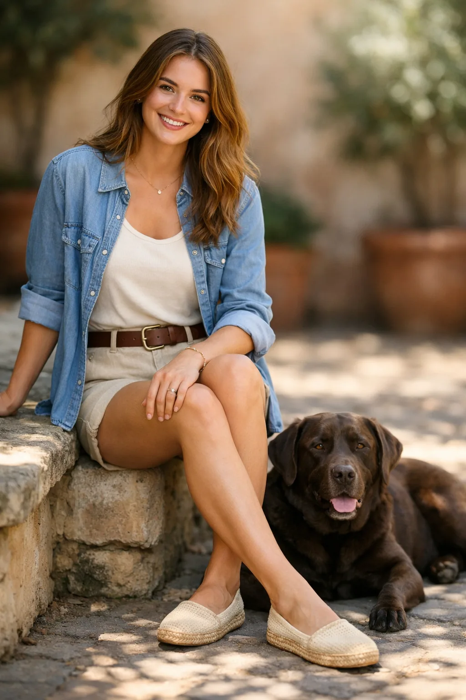

*Reference B · borrow the dog only*

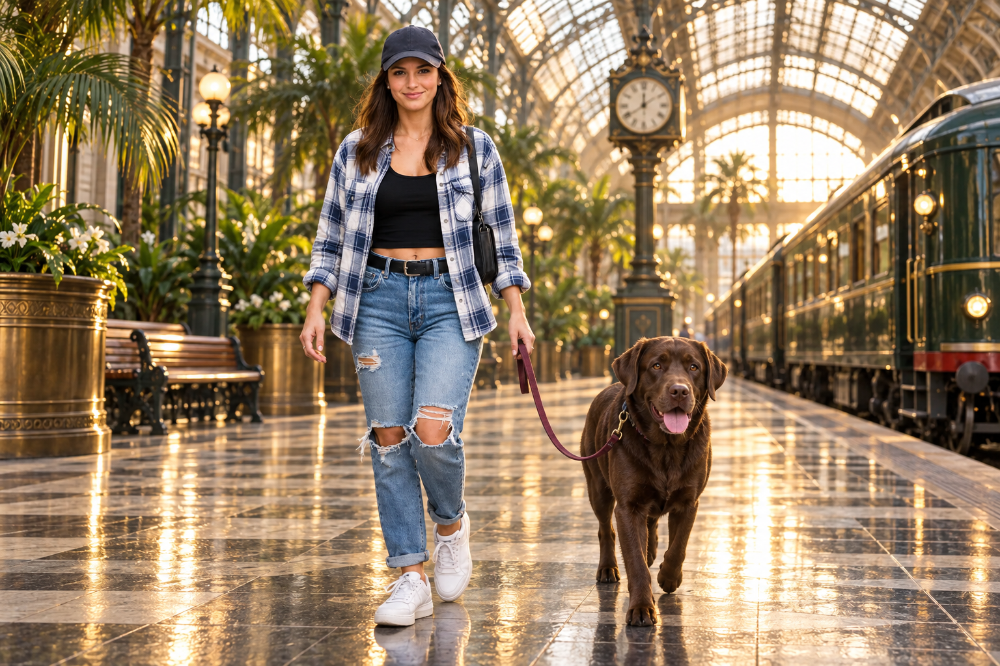

*Person reference only · T2*


*Dog reference only · R7*


*Both references with assigned roles · M3*

The person-only result resembled the intended woman, but its dog was leaner and more generic than the stocky source dog. The dog-only result carried the dog well, while the woman's appearance was less convincingly tied to the intended person and closer to the donor photograph. With both sources, both subjects looked closer to their respective references. These are visual judgments from one candidate per condition; the two source people also share broad traits, which makes strong identity claims inappropriate.

All three scenes were visually rich. All three still included clock markings despite a request for an unlettered clock. More reference information helped the likeness task without making unrelated instructions infallible.

The actionable rule is to **attach evidence for the property you cannot afford to approximate**. A breed description can produce a plausible Labrador. A particular dog's appearance benefits from the dog's actual reference. A style image alone cannot supply a missing person's likeness.

## Use sub-agents to test hypotheses, then compare fairly

Sub-agents are useful for exploring alternatives and checking each other's work. They do not create a new visual control mechanism by themselves. Several agents can still send confused prompts to the same image model.

For a real task, give each branch a different reason to exist:

| Branch | Question it tests | Inputs |
|---|---|---|
| A | Is the clean full reference sufficient? | Full reference with explicit roles. |
| B | Does a focused crop reduce unwanted transfer? | Selected crop plus enough surrounding context to identify it. |
| C | Does separating appearance from layout help? | Identity reference plus a distinct layout sketch. |

Give them the same purpose, hard requirements, output format and candidate budget. Record exact attachments and prompts. Ask a reviewer to inspect the resulting images without knowing which branch proposed them when practical. Keep losing candidates and disagreement notes.

In this project, separate agents generated the vocabulary and reference experiments while another built the reconstruction tools. The parent independently inspected the matched language and reference sets. That demonstrates an operational division of work. We did **not** compare many agents against one agent given the same total image budget, so we cannot claim that delegation itself improved image quality.

This is not an unexplored research area. M3 studies a planner, checker, refiner, editor and verifier loop; its implementation uses Qwen-family reasoning and editing models. The useful idea to borrow is comparing a proposed repair with the previous best candidate, with a finite retry budget. The paper's reported gains are not measurements of our workflow or GPT Image 2.5. [M3](https://arxiv.org/html/2602.06166v1)

For reference-heavy work, WeAgent-MMGenEdit studies retrieval, explicit visual checking and structured integration of evidence before final generation. Its rendered visual carriers go beyond a prose prompt and its reported setup differs from ours. This is relevant prior art for organizing references, not proof that our prototype is novel or superior. [WeAgent-MMGenEdit](https://arxiv.org/html/2609.05171v1)

Start with three reasoned branches, not every possible combination. Five references already have 31 nonempty subsets. Add prompt variants and the search grows quickly. Stop when a candidate passes the brief and the remaining differences are preferences the user has not asked you to optimize.

## What the experiments changed about the advice

The goal was to find useful decisions, not to declare every elaborate prompt a winner. Separate formatting, vocabulary, visual information and iteration: changing all four together hides what helped.

### Ordinary words versus headings versus jargon

For The Rain Engine, two plain-prose runs and two runs with labeled sections carried the same visual sentences. The plain version was 309 words; labels made the structured version 324. Two further runs used jargon-heavy equivalent wording in the same prose format, at 315 words.

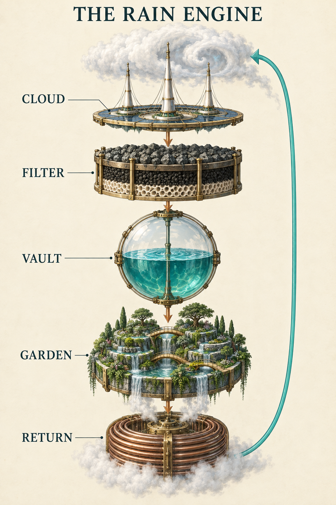

*Plain prose · replicate1 (N4)*

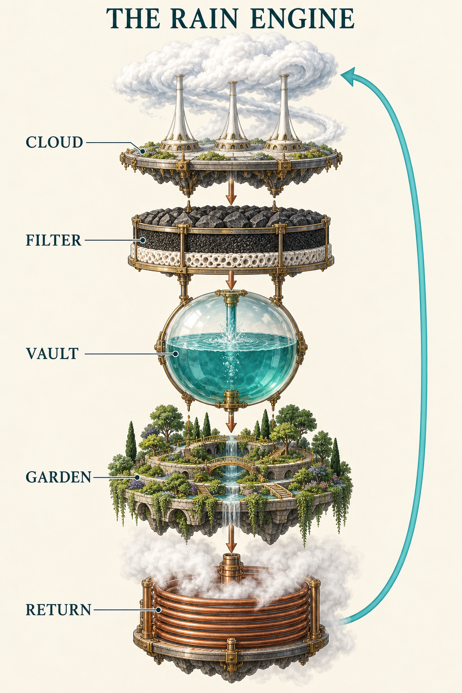

*Plain prose · replicate2 (A8)*


*Labeled sections · replicate1 (V6)*


*Labeled sections · replicate2 (S2)*

All four initial runs retained the five tiers, exact title and labels, and the five-arrow flow. Under the literal checklist, both plain-prose images let a leader line enter an illustrated form; both labeled versions kept the leaders outside. That is a small layout difference in four samples, not proof that headings generally improve image quality. “Generous margins” was underspecified in the checklist, so it remained uncertain rather than receiving a threshold invented after the images arrived.

Both jargon runs also produced rich, recognizable plates with the required objects, arrows and copy. They did not show a clear quality advantage over ordinary language. One had a less clearly consistent elevated viewpoint. Two samples are not enough to estimate reliable differences.

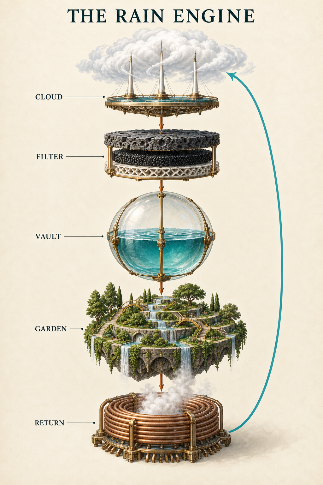

*Jargon prose · replicate1 (vocabulary V2)*


*Jargon prose · replicate2 (vocabulary V6)*

**Use simple, precise language by default.** Add technical vocabulary when it expresses a real requirement more accurately—for example, an orthographic view or a specific printing process—and explain its visible consequence when ambiguity matters. You do not need to imitate a complicated prompt to earn a complicated image.

This experiment does not show that shorter is always better. Removing unnecessary jargon preserved the information; removing the five-tier structure would change the task. “Simple language” and “less information” are different variables.

### One change at a time versus two compatible changes

We started from one kitchen photograph. Both routes had the same final goal: turn all four chair upholsteries forest green and the pendant cage and chain brushed copper.

The bundled route requested both changes in one call. The sequential route changed the chairs first and then the pendant, using its own previous output. Both final images achieved the requested material changes and retained the major room arrangement. Both also recolored the ceiling mounting canopy, although the request named only the cage and chain. Fine foliage and surface detail drifted; neither route preserved exact source pixels.


*Common source*

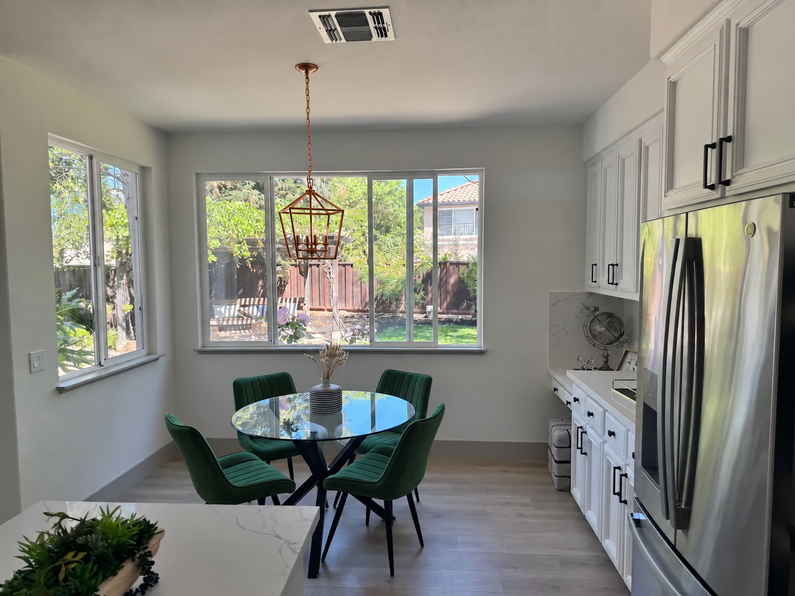

*Both edits in one call*

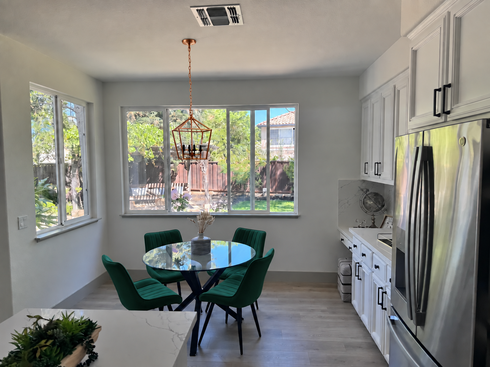

*Same goal after two sequential calls*

In this pair, the bundled route reached the visible goal in one call instead of two. There was no reason to claim that one-at-a-time was better.

Use a single focused change when a failure is hard to diagnose, when one decision depends on seeing another, or when a protected detail is fragile. Bundle compatible, well-defined changes when they can be assessed independently. Treat coupled changes as a coherent operation: moving an object may require moving its shadow; changing daylight to a storm requires changing reflections and atmosphere.

“Change one thing” is most useful as an experimental rule: if you change the prompt, references, aspect ratio and style simultaneously, you cannot tell which caused the difference. It is not a command to make every production edit one noun at a time.

### Repairs can solve the target and still damage the image

Our four-panel cat story initially failed its final action: the returning person looked as if they were leaving. A focused repair made the person clearly enter. The narrative improved, but upholstery texture changed in other panels. The repaired image is a better story and an imperfect preservation edit.


*First result: final action ambiguous*

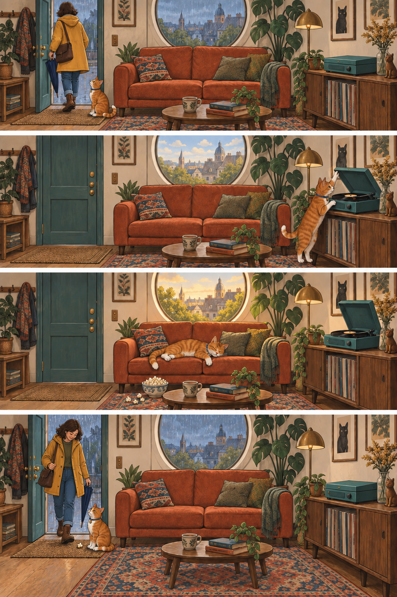

*Repair: person entering; upholstery drifts*

The product campaign showed a related tradeoff. The storm edit retained the bottle, its words and major arrangement, while introducing new warm light points in the background. A beautiful result can still violate a restriction. If those lights are unacceptable, the next instruction should identify them specifically and preserve the successful storm treatment.

Do not accept an edit simply because the requested change appears. Compare the whole candidate to the previous best image. If the repair creates a worse problem, return to the previous source and try a more precise request or a different tool.

### Stronger wording does not always repair an output property

The shampoo cutout looked like an extraction, but the saved PNG was RGB with an opaque checkerboard. A second attempt explicitly requesting RGBA and transparent exterior pixels still returned an opaque grid. Neither file is a usable transparent cutout.

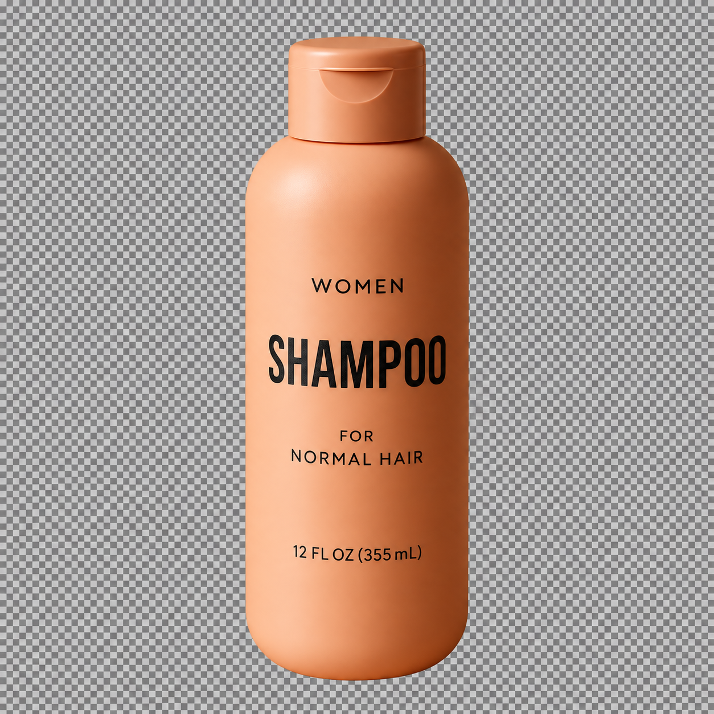

*Failed cutout · opaque painted grid*


*Stronger wording · still opaque*

The correct response is to stop polishing the adjective “transparent.” Use a path with an explicit background/alpha setting or a suitable segmentation workflow, then inspect the saved file's alpha channel. That alternative was not executed for this bottle in these tests. Separately, the logo generation did contain genuine transparent pixels, showing why each result needs checking.

The lesson extends beyond alpha. A picture of a chart is not an editable chart. Our slide rendered the supplied values correctly while bar proportions were approximate. A realistic botanical diagram can point a label at the wrong anatomical feature: our leaf plate's “Stoma” leader targeted a guard cell rather than the pore. These are content or output-property failures that beauty does not resolve.

## Diagnose the mismatch before rewriting the prompt

| What went wrong | What to inspect | Most useful next action |
|---|---|---|
| An object is missing or duplicated | Count across the whole image, including background | State the exact count and roles; remove unnecessary competing objects. |
| A property moved to the wrong object | Trace each color, garment or material to its subject | Bind the attribute to a named object or reference ID. |
| Layout is wrong | Large boxes, overlap, viewpoint and paths | Supply a sketch or clarify the spatial relation. |
| A face, product or outfit drifts | Distinctive visible features versus its source | Attach the right clean reference or a useful crop; restrict its role. |
| Text is wrong | Exact transcription, line breaks, duplicates and scale | Quote the text and reserve space; typeset separately if exactness is essential. |
| The action reads backward | Pose, gaze, contact, direction and sequence | Specify the decisive physical cues or supply a pose sketch. |
| A local edit changes other regions | Compare protected details with the accepted source | Narrow the request, restore the best source, or use stronger spatial control. |
| A diagram is plausible but false | Every label, relationship and fact | Verify against a real source; use deterministic diagrams for exact relations. |
| The file is unusable | Dimensions, alpha, format and editability | Check metadata and use the required output mechanism. |
| The picture is correct but dull | Hierarchy, depth, scale, material contrast and detail placement | Change a specific artistic decision while retaining the successful content. |

A repair instruction has four parts:

```text
TARGET: the identified object or region.
CHANGE: the visible difference you want.
PRESERVE: the successful details that must remain.
ALLOW: the physically necessary consequences of the change.
```

That works in a native image comment, a normal chat edit or a JSON-driven agent workflow. Do not automatically paste all four headings when one clear sentence suffices.

Set a finite repair budget. Two unsuccessful attempts at the same failure are often enough to reconsider the control method. That is a practical starting rule, not an experimentally optimal constant. Change the evidence, use a sketch, supply a mask where supported, typeset separately or keep a documented limitation. Do not build an endless loop that keeps grading its own output as better.

## What changes with GPT Image 2.5

OpenAI positions 2.5 around better reference likeness, targeted editing, retention across turns and richer visual detail. Its API offers Flare for faster work and Sunburst for demanding quality. These are vendor descriptions, not gains measured by our tests. The launch announcement and guide differ slightly in how they characterize Flare versus Image 2; neither should become a universal superiority claim. [Announcement](https://openai.com/index/introducing-chatgpt-images-2-5/)

The API documentation lists additional `xhigh` and `max` quality levels for the 2.5 models. Use supported request settings for output properties rather than assuming a sentence inside the prompt configures them. Current documentation still identifies precision limits in text, consistency and placement. [Image generation documentation](https://developers.openai.com/api/docs/guides/image-generation)

For the reader, the practical change is more room to attempt demanding reference and edit workflows, plus convenient interfaces such as comments and Sketch. The fundamental task remains the same: communicate the intended decisions and inspect the result.

Do not treat old diffusion-model prompt suffixes as established 2.5 techniques. Promptist studied a trained adapter for other generators, and the more recent APE project also evaluates learned prompt enhancement and routing. Their methods are evidence that adaptation can depend on the generator and task; they are not a universal list of useful adjectives. [Promptist](https://arxiv.org/abs/2212.09611), [APE](https://research.nvidia.com/labs/sil/projects/ape/)

## Explore every official example through the method

The catalog below connects every illustrated stage to a completed, richer adaptation. It includes editorial photography, process illustration, typography, logos, historical scenes, comics, UI concepts, science, data graphics, translation, style transfer, wardrobe, reference composition, extraction, sketches, removal, insertion, campaigns, recurring characters, interior edits, cards and merchandise.

Each card separates the decisions we made, what happened and what to do next. The source comparison is a visual teaching reference. Different subjects, purposes and unknown generation settings prevent a fair claim of “better by X percent.” Expand the exact prompt when you want to reproduce a case; first read the decision it demonstrates.

### G01 · The net maker

[Official example: Control style and lighting](https://developers.openai.com/api/docs/guides/image-prompting?model=gpt-image-2.5#control-style-and-lighting)

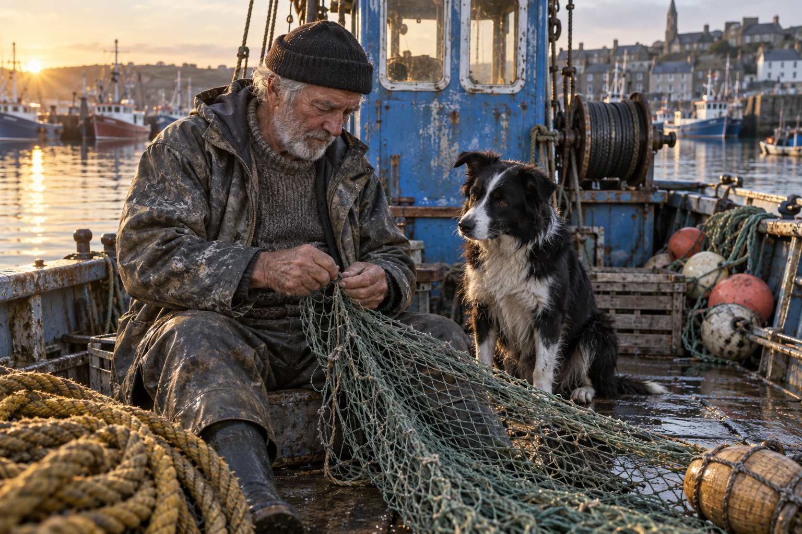

**Decisions.** Give each depth layer a job: net and ochre rope in front, working hands and dog as the subjects, blue wheelhouse behind them, harbor in the distance. Specify where hands touch the net and where warm sunlight meets cool fill.

**Observed.** The wide scene has coherent hand-to-net contact, a fully framed dog, distinct rope, skin, wood and fur textures, and readable depth. No planned visible constraint failed. The wider framing gives the face less prominence.

**Use it.** Keep this result for an environmental story. For a portrait, make the face larger before adding further background detail.

Intent changed: we chose a wider environmental composition. Greater scene breadth does not establish a better prompt or a better model.

### G02 · The Rain Engine

[Official example: Explain a process visually](https://developers.openai.com/api/docs/guides/image-prompting?model=gpt-image-2.5#explain-a-process-visually)


**Decisions.** Define five named tiers before writing style instructions. Give every tier its own material and contents, then list exactly four downward links and one return link. Put exact labels in a separate text inventory. This fictional mechanism is concept art.

**Observed.** Language trial S2 renders the five tiers, three masts, three filter materials, half-full tank, stepped garden, copper coil and five arrows coherently. All six strings are correct. The title is close to the edge, so generous margins remain uncertain.

**Use it.** For an actual explanatory graphic, verify the mechanism independently. If spacing needs repair, replace generous margins with a stated safe area.

Intent changed to an invented ecosystem with less explanatory copy. The official example is already information-rich; this adaptation tests a different visual brief.

### G03 · Afterlight

[Official example: Render exact text](https://developers.openai.com/api/docs/guides/image-prompting?model=gpt-image-2.5#render-exact-text)


**Decisions.** Separate an exact headline and two footer lines from the sculpture zone. Build drama with a giant orange disc, folded cobalt metal, amber glass and exactly three small visitors. Count and place people instead of asking vaguely for scale.

**Observed.** The three text lines and visitor count are correct. Metal and glass contrast clearly, but the sculpture apex enters the headline baseline zone, violating the requested clean separation.

**Use it.** Lower only the arch apex while retaining the headline, footer, disc and three visitors. No correction was run for this case.

Intent changed to a festival art poster with new copy and architecture. A more dramatic genre is not evidence of prompting superiority.

### G04 · Tideline identity

[Official example: Design a reusable logo](https://developers.openai.com/api/docs/guides/image-prompting?model=gpt-image-2.5#design-a-reusable-logo)

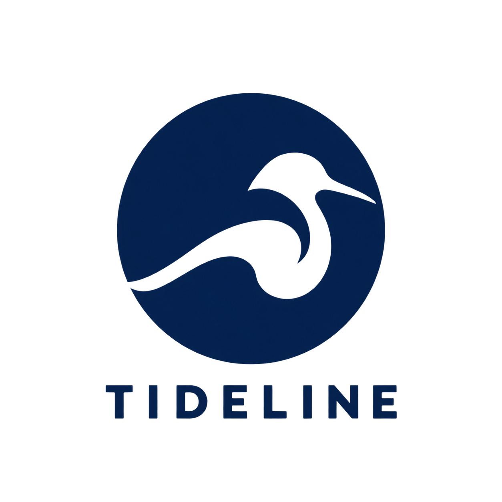

**Decisions.** Constrain the logo to one navy symbol and one wordmark. Describe the shared bird-and-wave silhouette, the negative space and a measurable width hierarchy. Ask for actual transparency as an output property, then inspect the file.

**Observed.** The bird/wave concept and TIDELINE spelling work, and the PNG has real alpha. The wordmark is 727 pixels wide against a 670-pixel symbol at alpha greater than 128: about 8.5% wider, despite the request for a narrower wordmark.

**Use it.** Scale only the wordmark to 80–85% of the symbol width and recenter it. Rebuild the approved identity as editable vectors for production.

Intent changed to a new coastal brand and simpler shape language. This is an identity exploration, not a matched logo-quality comparison.

### G05 · A field becomes a city

[Official example: Use historical and real-world context](https://developers.openai.com/api/docs/guides/image-prompting?model=gpt-image-2.5#use-historical-and-real-world-context)

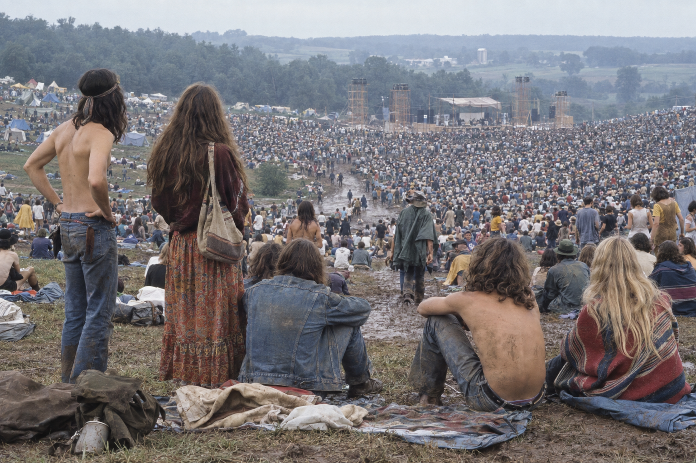

**Decisions.** Separate sourced anchors from imagined staging. Use the verified sloping field and stage-at-bottom relationship, then plan five foreground attendees, a muddy route and a crowd that diminishes into the distance.

**Observed.** The planned scene and five foreground figures are present. The topography is consistent with the museum source, but the exact viewpoint, people, clothing combinations and moment are invented; this is an AI recreation.

**Use it.** For documentary reconstruction, select an archival photograph and map its actual structures and viewpoint. Do not treat visual plausibility as historical verification.

Intent changed to an elevated wide view with an explicit foreground group. More spatial scale is a compositional choice, not proof of greater historical accuracy.

### G06 · The record collector

[Official example: Turn a story into a comic strip](https://developers.openai.com/api/docs/guides/image-prompting?model=gpt-image-2.5#turn-a-story-into-a-comic-strip)


**Decisions.** Write a state table for each panel: where the cat is, whether the player is open, whether the person is present and what clue remains. Keep room landmarks fixed. Review the visible pose that communicates each action.

**Observed.** The first output keeps the room, cat and player-state sequence but the last panel reads as another departure. One repair makes the person enter and look at the cat. The repair also changes upholstery texture in otherwise unchanged panels.

**Use it.** Use the repaired page for the readable story, with its preservation limitation disclosed. If exact texture matters, constrain the edit region and compare untouched areas.

Intent changed in story, props and visual treatment. The repair demonstrates a specific fix with collateral texture drift, not universal superiority of sequential edits.

### G07 · Fieldwork market

[Official example: Create an interface preview](https://developers.openai.com/api/docs/guides/image-prompting?model=gpt-image-2.5#create-an-interface-preview)

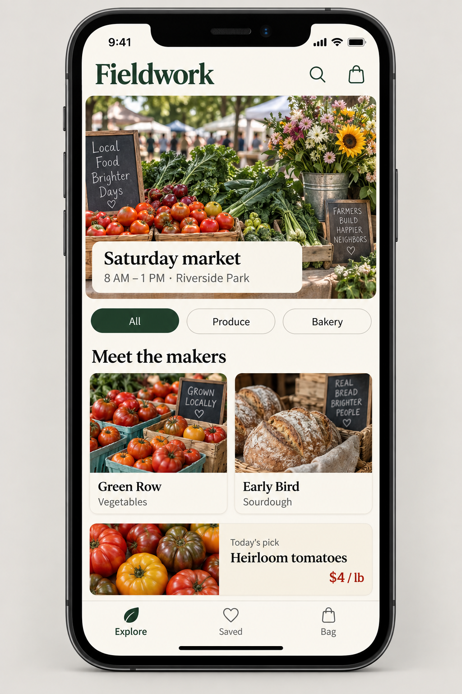

**Decisions.** Map screen regions and give every visible interface string explicitly. Distinguish the title, category chips, vendor cards, featured product and navigation. Treat photographs as text-bearing regions too.

**Observed.** The requested interface labels, vendor names and price are readable and correct. The model adds unrequested slogans on signs inside the vendor photographs. The file is a polished visual preview; no interface behavior is implemented.

**Use it.** Remove or blank the in-photo signs while retaining the interface copy. Build actual controls and test interactions separately.

Broad app category retained, with new information architecture, content and imagery. The different brief does not support a causal claim of better UI prompting.

### G08 · Inside a leaf

[Official example: Create scientific and educational visuals](https://developers.openai.com/api/docs/guides/image-prompting?model=gpt-image-2.5#create-scientific-and-educational-visuals)


**Decisions.** Start with verified anatomy, organize the layer order, and map every label to a particular structure. Reserve space for leader lines and specify gas directions. Review the endpoints after the image looks finished.

**Observed.** The cutaway is visually clear and most layer relationships are correct. The Stoma leader ends on a guard cell rather than the pore. Gas arrows point in the intended directions but do not clearly pass through the pore; another unlabeled arrow is ambiguous.

**Use it.** Correct the Stoma endpoint and gas-arrow route before teaching from this image. Have a subject expert inspect the finished annotation layer.

Intent changed to leaf anatomy. The new subject and representation prevent a fair improvement claim against the published example.

### G09 · Civic Move — quarter in view

[Official example: Build slides, diagrams, and charts](https://developers.openai.com/api/docs/guides/image-prompting?model=gpt-image-2.5#build-slides-diagrams-and-charts)

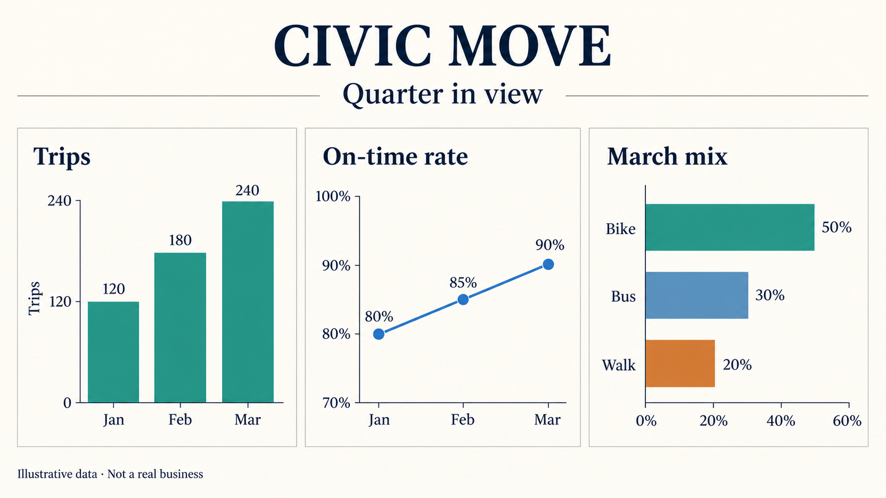

**Decisions.** Supply one small fixed dataset, assign each variable a chart type, define axes and units, and list all printed values. Mark the data as illustrative. Verify text separately from bar lengths and export dimensions.

**Observed.** All values and labels are coherent: trips 120/180/240, on-time 80/85/90%, and mix 50/30/20. Exact geometry is approximate: bar lengths have small ratio deviations and the 1672×941 canvas differs from exact 16:9 by about 0.053%.

**Use it.** Use the approved layout as direction and render final charts from the same data in a deterministic plotting or slide tool when numerical geometry matters.

Intent changed to a three-chart operational slide with synthetic data. This is a design demonstration, not a benchmark against a different dataset.

### G10 · The Rain Engine in Spanish

[Official example: Translate while preserving layout](https://developers.openai.com/api/docs/guides/image-prompting?model=gpt-image-2.5#translate-while-preserving-layout)


**Decisions.** Use the existing poster as the layout target. Provide a complete six-entry glossary with accents, retain the original text zones, and permit only the type-size and leader-line adjustments required by longer replacements.

**Observed.** All six Spanish replacements, including DEPÓSITO and JARDÍN, are correct. The stack and arrow topology stay consistent. Reservoir caustics and some foliage are redrawn, so exact illustration preservation fails.

**Use it.** For an unchanged print master, replace text in an editable layout layer. If another generation is acceptable, select text regions and inspect untouched illustration afterward.

Intent changed to our fantasy atlas. It has fewer labels and a different layout; the successful translation does not prove a superior localization method.

### G11 · Night Courier

[Official example: Transfer a visual style](https://developers.openai.com/api/docs/guides/image-prompting?model=gpt-image-2.5#transfer-a-visual-style)


**Decisions.** Assign the reference to style only: palette, square clusters and stepped edges. Exclude its objects and interface. Map a foreground rider, middle canal market and distant towers, with an explicit bridge count and title zone.

**Observed.** The result has crisp pixel treatment, strong three-layer depth, one rider and two motorcycle wheels. NIGHT COURIER is correct. It has three distant arched bridges rather than the requested two; some far-side hand and boot contacts are occluded.

**Use it.** Give the bridges stable IDs on a visual map, select the surplus bridge and remove it. In a new brief, name the two desired bridge locations.

Intent expanded to a complete city poster. The rich environment is added content, not proof that the method renders the same brief better.

### G12 · A wardrobe assembled from four references

[Official example: Preserve identity and change clothing](https://developers.openai.com/api/docs/guides/image-prompting?model=gpt-image-2.5#preserve-identity-and-change-clothing)


**Decisions.** Give each input one role: person and museum, blazer, tank, boots. Enumerate garment details and preserved pose anchors. Allow natural folds and occlusion while keeping face, body, black jeans and room stable.

**Observed.** The beige blazer, white tank and gray boots appear on the referenced person with the folded arms and crossed ankles retained. Visible likeness and museum arrangement remain close. One boot buckle is hidden, so exact hardware preservation is uncertain.

**Use it.** If hardware is essential, request a useful detail view or adjust the named buckle. Do not pass a hidden component as verified.

The broad task and source garments are retained, with a new detailed constraint set. This was not a controlled same-prompt rerun or a likeness benchmark.

### G13 · Botanical railway editorial

[Official example: Combine references](https://developers.openai.com/api/docs/guides/image-prompting?model=gpt-image-2.5#combine-references)

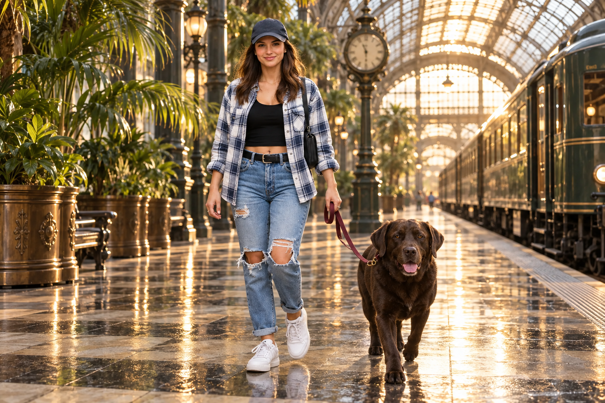

**Decisions.** Assign the first reference to the woman and outfit, the second to the dog only, and create a new environment. Specify walking positions, leash-to-hand contact, full-body framing, depth, light and grounded reflections.

**Observed.** The woman, dog, leash and elaborate concourse integrate coherently. Two small background people violate the exactly-one-person rule. The clock has numeral-like marks despite the no-readable-numerals instruction.

**Use it.** Map and remove the distant people, and replace the clock markings with plain ticks, while preserving the foreground pair and leash.

Intent changed to a new railway environment and walking arrangement. The added spectacle cannot establish method superiority.

### G14 · A cutout that only looks transparent

[Official example: Create a transparent product cutout](https://developers.openai.com/api/docs/guides/image-prompting?model=gpt-image-2.5#create-a-transparent-product-cutout)


**Decisions.** Name the bottle as the extraction target, preserve its silhouette and printed label, and define transparency as alpha values rather than a pictured background. Inspect the saved file instead of trusting a checkerboard preview.

**Observed.** The first output is an RGB PNG with a painted checkerboard and no real alpha. A second attempt from the clean source, with stronger RGBA wording, fails in the same way. Both keep the bottle recognizable; neither is a usable transparent cutout.

**Use it.** Use a path with actual alpha or background-removal controls, then inspect its file pixels. Stop treating repeated wording as proof of a format fix.

The extraction goal remains similar, but settings and backend are unexposed. These failures do not show that named GPT Image 2.5 models lack transparency support.

### G15 · An alpine botanical station from a sketch

[Official example: Turn a drawing into a realistic image](https://developers.openai.com/api/docs/guides/image-prompting?model=gpt-image-2.5#turn-a-drawing-into-a-realistic-image)


**Decisions.** Treat drawn lines as geometry, not texture. List the mountain slopes, river path and tree anchor. Separately mark three glasshouses, one bridge and one path as intentional additions instead of recovered information.

**Observed.** The main valley, river and tree relationships transfer into a detailed landscape. The three glasshouses, bridge and path are present. Exact drawn contours and relative geometry remain approximate.

**Use it.** If layout accuracy matters, approve a clearer region map for the tree and river before pursuing more realism.

Intent expanded with a new research station and landscape format. This tests an uploaded drawing, not the native ChatGPT Sketch interface.

### G16 · Remove the cap, keep the flower

[Official example: Remove an object](https://developers.openai.com/api/docs/guides/image-prompting?model=gpt-image-2.5#remove-an-object)

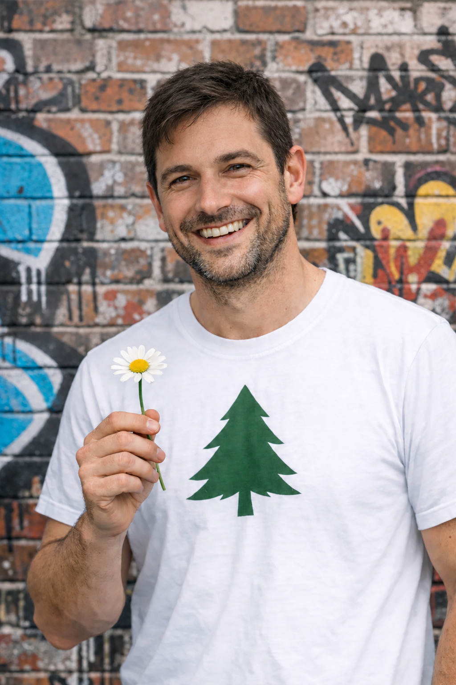

**Decisions.** Identify one deletion target including its crown and brim. List the flower, fingers, face, shirt graphic and wall as protected elements. Mark the newly exposed scalp as unknown and request a plausible completion only there.

**Observed.** The cap is removed while the flower, pose, portrait and main background remain visually consistent. Newly visible hair is plausible but cannot be verified against content hidden in the source.

**Use it.** No additional edit is needed for this brief. Keep the uncertainty note if presenting this as reconstruction.

The deletion target changed. This is a separate local-edit demonstration rather than a quality comparison for the same removal.

### G17 · Carry the wardrobe into an action scene

[Official example: Insert a person into a scene](https://developers.openai.com/api/docs/guides/image-prompting?model=gpt-image-2.5#insert-a-person-into-a-scene)


**Decisions.** Use the wardrobe output only for person and clothing, and the action image for scene, pose, scale and light. State that the existing runner is replaced, so the required person count remains one. Lock distinct campsite anchors.

**Observed.** The woman and outfit integrate into the running action while bear, tent, case, chair, trees and mountain stay in the expected arrangement. Dust is heavier than requested, and fine textures redraw, but the main substitution succeeds.

**Use it.** If garment cleanliness matters, reduce dust only in the named clothing regions. Do not regenerate a successful scene merely to make it different.

The published scene is an input to our replacement edit. It cannot also function as an independent matched baseline.

### G18 · A conservatory product campaign

[Official example: Create the starting image](https://developers.openai.com/api/docs/guides/image-prompting?model=gpt-image-2.5#create-the-starting-image)

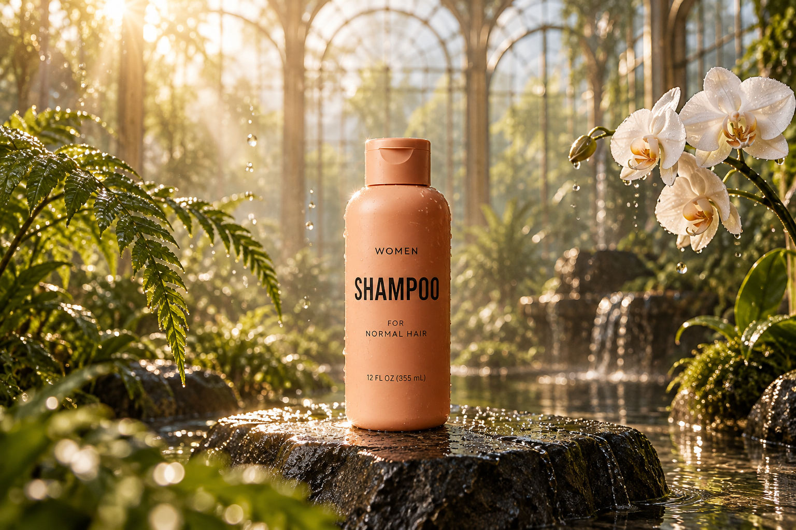

**Decisions.** Use the product reference for bottle shape, color and label spelling. Build the setting around a wet basalt pedestal, left ferns, right orchid and background glass arches. Keep the label clear and reserve a copy-free top quarter.

**Observed.** The bottle, plants, reflections and warm atmospheric light form a coherent campaign. Label words survive, but typeface and fine bottle geometry are redrawn. The exact three-arch count is uncertain because glass ribs overlap and blur.

**Use it.** If three arches are essential, give each arch a distinct mapped location. For brand production, compare actual letterforms and packaging geometry with the source.

Intent changed to a miniature conservatory campaign. The comparison demonstrates a different setting and framing, not greater effectiveness for the same advertisement.

### G19 · The same campaign in a rainstorm

[Official example: Change one condition](https://developers.openai.com/api/docs/guides/image-prompting?model=gpt-image-2.5#change-one-condition)


**Decisions.** Edit the accepted campaign with one environmental change. Keep bottle, label, crop, pedestal and plants fixed, while explicitly allowing the light, reflections and atmosphere to respond physically to rain and blue hour.

**Observed.** The rainstorm and cool light read clearly, with bottle and major composition retained. New warm light points appear behind the bottle despite the no-extra-props intent. The inherited arch-count uncertainty remains.

**Use it.** Decide whether those lights are acceptable; otherwise map and remove only the added light sources, preserving the storm and bottle.

This uses our campaign and a different weather target. Within our pair, the requested condition changes successfully with a collateral addition.

### G20 · Meet the Atlas Keeper

[Official example: Establish the character](https://developers.openai.com/api/docs/guides/image-prompting?model=gpt-image-2.5#establish-the-character)


**Decisions.** Make character identity inspectable: round ivory head, two eye colors tied to image sides, one gold crescent, teal scarf and red satchel. Place that small character in a much larger floating library to create scale.

**Observed.** All listed signature traits are visible, with one robot, coherent compass contact and a deep floating-library environment. No planned visible criterion fails. This is the starting identity image for later scenes and merchandise.

**Use it.** Use this accepted output as the identity reference and list which traits must persist in each new view.

Intent changed to an original ceramic robot and new world. The richer environment is a creative choice, not a controlled model comparison.

### G21 · The Keeper enters the observatory

[Official example: Continue the story](https://developers.openai.com/api/docs/guides/image-prompting?model=gpt-image-2.5#continue-the-story)


**Decisions.** Carry only the Keeper identity into a new room. Retain colored eyes, crescent, scarf and satchel, then change pose, location and lighting. Specify both hand contact with the compass and the armillary sphere at image-left.

**Observed.** The character anchors and new observatory work. The armillary sits on a pedestal even though the prompt requested suspension. The initial checklist omitted that relationship, so its passing checks did not cover the full brief.

**Use it.** Add suspended versus supported to the checklist, then repair only the sphere support if suspension matters to the scene.

Intent changed in character, setting and action. Our own continuity pair shows retained signature traits, not universal identity reliability.

### G22 · Green upholstery and a copper pendant

[Official example: Change furniture in a room](https://developers.openai.com/api/docs/guides/image-prompting?model=gpt-image-2.5#change-furniture-in-a-room)


**Decisions.** Assign two independent edits to named objects: four chair seats become green while black legs stay black; pendant cage and chain become copper while geometry stays fixed. Compare one combined request with the same changes in two stages.

**Observed.** The combined result and the final sequential result both achieve the materials and preserve the broad room. Both regenerate fine detail. The combined route uses one call; the sequential route uses two and redraws surfaces again.

**Use it.** Use a combined request when changes are independent and easy to verify. Split changes when dependencies or diagnosis make intermediate review valuable.

The requested room changes differ from the published example. A separate local comparison tests bundled versus sequential execution on our own two-change goal.

### G23 · Winter Atlas

[Official example: Design a holiday card](https://developers.openai.com/api/docs/guides/image-prompting?model=gpt-image-2.5#design-a-holiday-card)


**Decisions.** Reuse the Keeper identity but create a new snow scene. Reserve a measured title region, provide exact heading and footer, and define snowy bridge, observatory, evergreens and cream outer margins as separate layers.

**Observed.** WINTER ATLAS and the full footer are correct; signature character traits and layered scenery persist. The robot faces the viewer instead of clearly walking toward the observatory, so the intended action does not read.

**Use it.** Specify a visible stride and body orientation toward the observatory, with the face turned enough to retain identifying eye details.

Intent changed to a recurring original character and new greeting. This tests reuse with typography, not a matched greeting-card improvement.

### G24 · Atlas Keeper — Field Edition

[Official example: Design collectible merchandise](https://developers.openai.com/api/docs/guides/image-prompting?model=gpt-image-2.5#design-collectible-merchandise)


**Decisions.** Use the identity image for the toy alone. Map the figure to the left compartment and exactly three accessories to separate right compartments. List the three allowed text strings and define plastic, paper and studio light.

**Observed.** The character traits, three accessory compartments, compass, book, lantern and main copy are all present. Tiny compass markings may contain extra letters, so the strict no-other-text requirement remains uncertain.

**Use it.** For exact packaging copy, inspect tiny instrument faces as well as the card. Replace ambiguous compass lettering with unlettered ticks if needed.

Intent changed to our character, accessory inventory and package design. It demonstrates format transfer, not superiority over a different collectible.

[Full submitted prompts and inputs](expanded-experiments/guide-cases.md).

## Give this workflow to your agent

You can use the instruction below with an image-capable agent. The portable skill adds the full JSON contract, compiler and working examples.

```text
Help me create the image I intend. Treat my brief as the goal,
not as a prompt to decorate with impressive-sounding language.

1. Determine whether I am creating, reconstructing, remixing or editing.
   Establish purpose, final canvas and the few requirements that decide
   success. Resolve material conflicts; use reasonable defaults elsewhere.

2. Inspect every supplied image. For complex references, create a visual
   inventory with stable source/element IDs, hierarchy, named crop previews,
   approximate boxes, relationships, exact visible text and uncertainty.
   Distinguish crops from masks and extracted layers. Show me the map so
   I can keep, change, remove or borrow parts. Native image comments are
   also a valid way to select a local target.

3. Create or update reconstruction JSON using the provided schema.
   Preserve source observations separately from requested changes.
   Record which source controls identity, layout, style, material or light.
   Flag contradictions and obsolete checks after each selected change.

4. Compile only relevant visual decisions into plain language. For an edit,
   identify target, change, preserve and allowed consequences. Attach the
   actual clean source files. Do not invent controls the image tool lacks.

5. If alternatives would resolve a real uncertainty, give a bounded number
   of agents distinct reference/prompt hypotheses and equal candidate
   budgets. Use the same brief and checklist. Do not multiply agents merely
   to produce more opinions.

6. Generate here using the available image tool. Save exact prompts,
   attachments, outputs, ancestry and exposed settings; mark unknown
   settings unknown. Preserve original candidate files.

7. Inspect generated pixels and required file properties. Report each
   requirement as pass, fail or uncertain with visible evidence. Check
   object existence before attributes. Separate correctness from taste.

8. Repair the most consequential failure from the best accepted source.
   Compare the candidate with that source, including protected details.
   Reject regressions. After repeated failure, change the control method.
   Deliver the image, reusable specification and unresolved limitations.

Do not claim pixel identity, factual accuracy, layer extraction, native
feature testing or a particular model version without evidence.
```

The durable asset is the record of your decisions: what each source contributed, which parts mattered, what changed, and how you checked the result. The next image starts with that knowledge instead of another mysterious paragraph.

## Evidence and reproducibility

Read the [experiment archive](expanded-experiments/README.md), [research notes](research-notes-v2.md), [24-case catalog](expanded-experiments/guide-cases.md) and [machine-readable experiment manifest](expanded-experiments/manifest.json). Original prompts, sources, output hashes, checks and failed branches are retained. The [first edition](image-prompting-guide.html) remains available with its smaller controlled examples.

This is an exploratory set, reviewed by agents, with a few repeated matched conditions. It is not a blinded human preference study, an equal-budget agent-count benchmark, or a verified model-version comparison. A beautiful candidate demonstrates possibility; repeatable reliability would require more repetitions and independent assessment across diverse tasks.
